[미국 국립 수퍼컴퓨팅 응용 연구소(NCSA)](https://ko.wikipedia.org/wiki/NCSA)는 1993년 X11버전의 모자익 브라우저를 출시하자마자 윈도와 매킨토시 버전의 모자익 브라우저 개발을 시작한다. [알렉스 토틱(Aleks Totic](https://en.wikipedia.org/wiki/Aleksandar_Totic))은 맥 버전을 담당했고, 크리스 윌슨(Chris Wilson)과 [존 미텔하우저(Jon Mittelhauser)](https://en.wikipedia.org/wiki/Jon_Mittelhauser)가 윈도 버전을 개발했다.

짧은 시간에 윈도, 맥, 유닉스용 웹브라우저를 릴리스한 후, 모자익 브라우저는 많은 사용자에게 인기를 끌게 되었다. 또한 이를 개발한 NCSA는 대외적으로 많은 관심을 받게 된다.

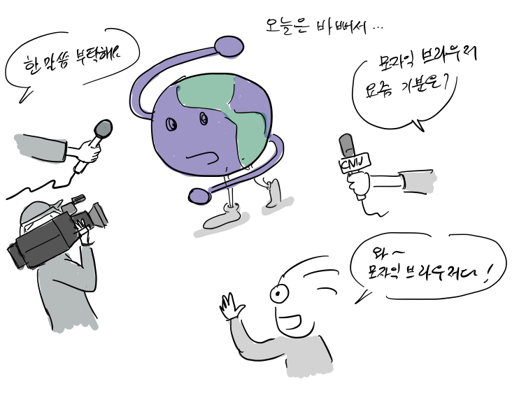

“안녕하세요. InfoWorld 기자입니다. 저희가 모자익 브라우자 개발팀에 InfoWorld Industry Achievement award for 1993 상을 주고 싶은데, 핵심 기여자 5명의 명단을 받을 수 있을까요?”

“모자익 브라우저는 팀이 만든 소프트웨어입니다. 40여명 정도의 기여자 명단을 드릴 수 있습니다.”

“40여명이나 된다고요?”

이렇듯 NCSA는 개발에 대한 공로를 실제 개발한 개발자에게 주지 않았고, 갑작스럽게 많은 인력을 모자익 브라우저 개발에 투입하기 시작한다.

초기에는 소수의 인원만으로 모자익 브라우저를 개발했지만,

이들은 갑자기 새로 들어온 사람들에게 지시를 받으며 개발을 해야 하는 상황에 놓이게 된다.

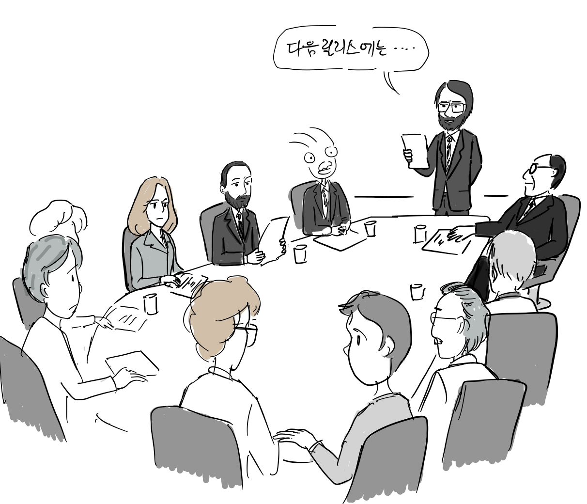

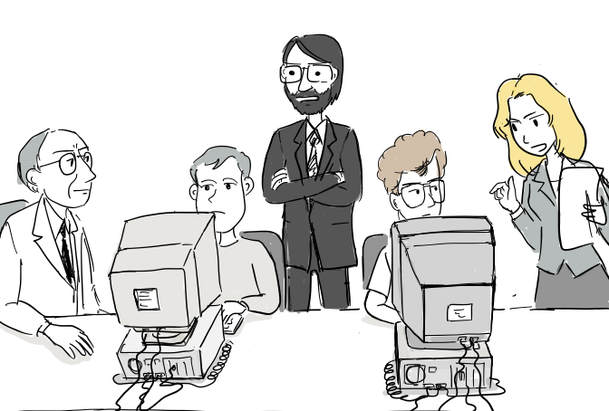

결정적으로 [뉴욕 타임즈 기사에는 핵심 개발자 사진은 빠지고, NCSA의 관리자 인터뷰와 사진만 나왔고](https://timesmachine.nytimes.com/timesmachine/1993/12/08/679693.html?pageNumber=73), 모자익 브라우저 개발을 시작하고 개발을 주도한, 마크 앤드리슨은 크게 실망한다.

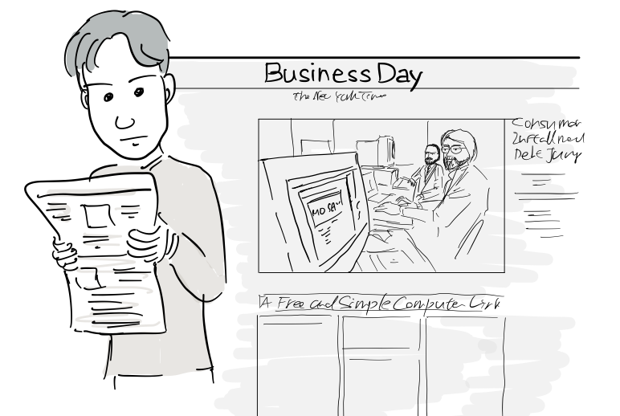

초기 개발에 참여한 인력들이 하나 둘씩 팀을 이탈하게 되었고,

“시애틀에 있는 회사에서 오퍼를 받았거든”

“행운을 빌어”

마크 앤드리슨도 1994년 일리노이 대학교에서 컴퓨터과학 석사 학위를 받은 후, NCSA의 잡오퍼를 거절하고 실리콘 밸리로 향한다.

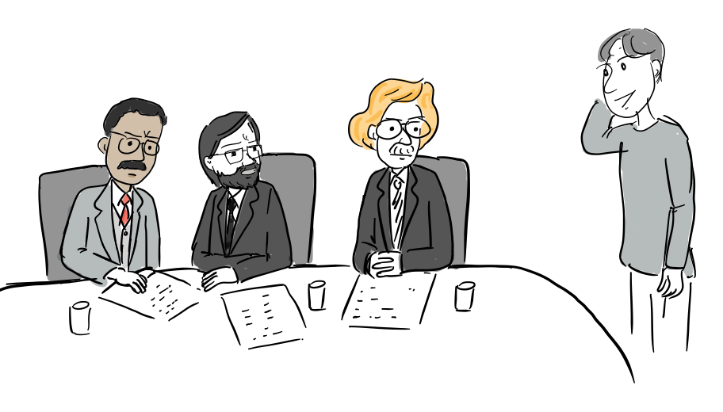

“계속 같이 일합시다.”

“저는 실리콘 밸리에서 새로운 기회를 찾고 싶습니다.”

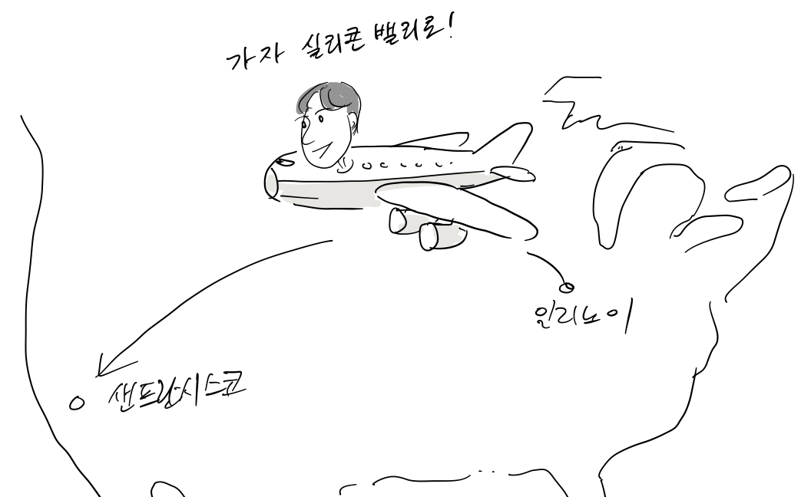

마크 안드레슨은 실리콘 밸리에서 [실리콘 그래픽스(Silicon Graphics)](https://ko.wikipedia.org/wiki/%EC%8B%A4%EB%A6%AC%EC%BD%98_%EA%B7%B8%EB%9E%98%ED%94%BD%EC%8A%A4)라는 회사를 설립하여 큰 돈을 벌어들인 벤처 사업가였던 [짐 클락(Jim Clark)](https://en.wikipedia.org/wiki/James_H._Clark)을 만나게 된다.

실리콘 그래픽스(SGI)는 당시 3D 그래픽스 전용 워크스테이션을 만드는 회사였다. 지금과 같이 GPU가 없었던 당시에는 3D 그래픽스를 구현하려면 SGI가 만든 워크스테이션이 필요했다.

실제로 영화 쥬라기 공원, 매트릭스, 글레데이터, 스타워즈 에피소드1을 제작하는데 SGI의 워크스테이션이 사용되었다\[2\].

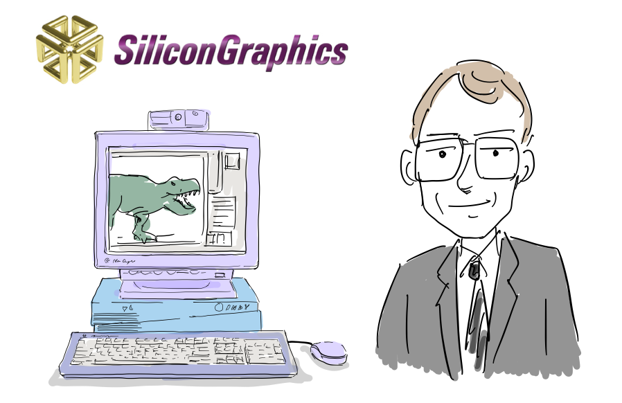

짐 클락은 당시 실리콘 그래픽스 창업자였지만 CEO와 견해 차이로 새로운 회사를 설립할 준비를 하고 있었고, 우연한 기회로 모자익 브라우저를 사용하게 된다.

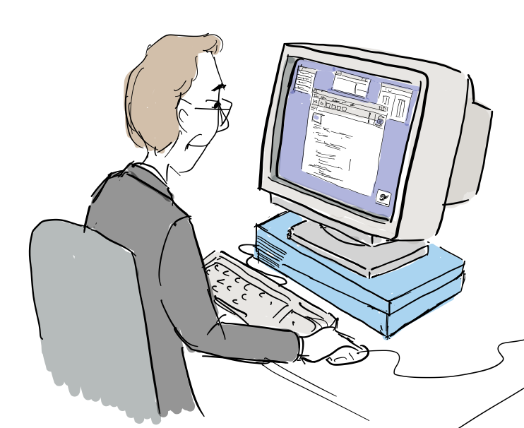

“모자익 브라우저를 만든 사람을 만나봐야겠다.”

“아침 7시에 팔로알토에 있는 카페에서 만나자고? 아침 7시에 일어난적이 없는데…”

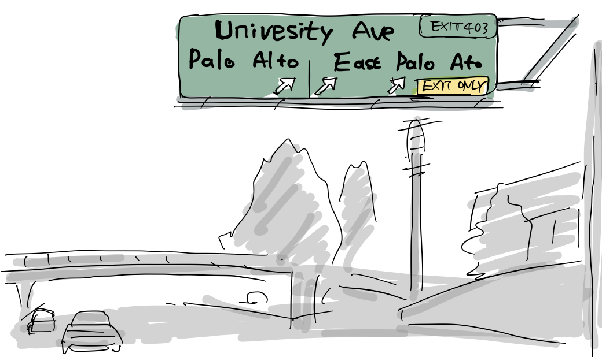

“마크, 나에게 몇 가지 사업 아이디어가 있는데, 모자익 브라우저를 개발한 당신과 같은 슈퍼 개발자가 필요합니다. 나와 함께 일해볼 생각이 있나요?”

짐과 마크는 몇 달간 미팅을 반복하면서 여러 아이디어를 구체화했지만, 사업화에 이를 만큼 좋은 아이디어를 찾지 못했다.

결국, 마크는 짐에게 Mosaic Killer를 개발할 것을 제안한다.

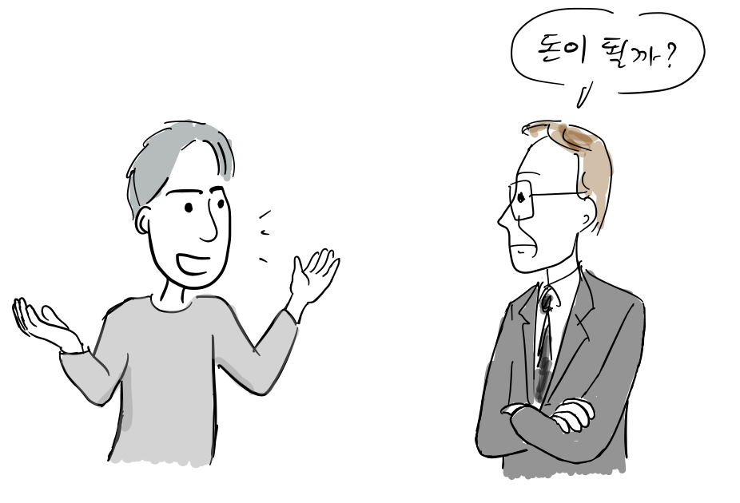

“같이 모자익 브라우저를 개발한 제 친구들이 이번에 졸업을 해요. 그들과 함께 모자익 킬러(Mosaic killer)를 만들어보면 어떨까요?”

“음.. 그게 돈이 될까? 하여간 만들어봅시다.”

그럼, 같이 일리노이가서 그 친구들을 만나러 가요.

1994년 3월 결국, 둘은 일리노이까지 가서 마크의 친구들을 만나고 모자익 브라우저를 함께 만든 [에릭 비나(Eric Bina)](https://en.wikipedia.org/wiki/Eric_Bina)와 [로 몬틸리(Lou Montilli)](https://en.wikipedia.org/wiki/Lou_Montulli) 비롯한 마크의 친구들을 새로운 회사에 합류시킨다.

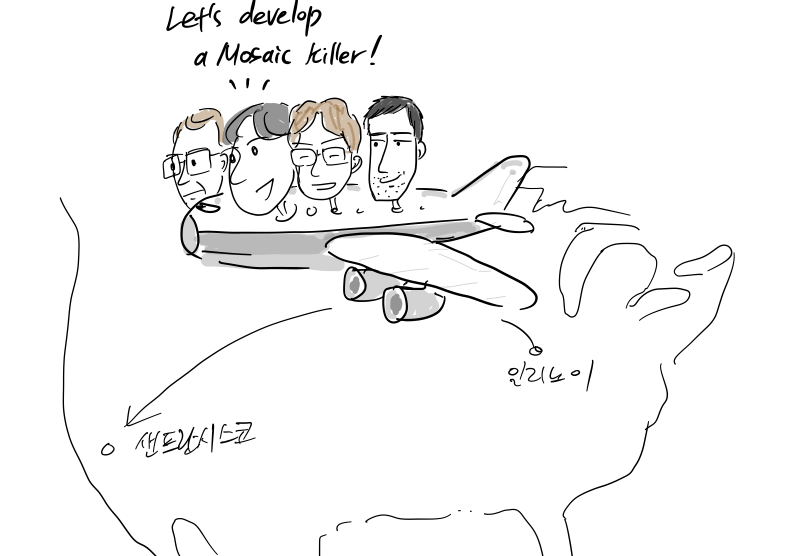

짐 클락도 실리콘 그래픽스에서 함께 일한 부하 직원들을 창업한 회사로 데려온다.

### 모자익 커뮤니케이션 설립

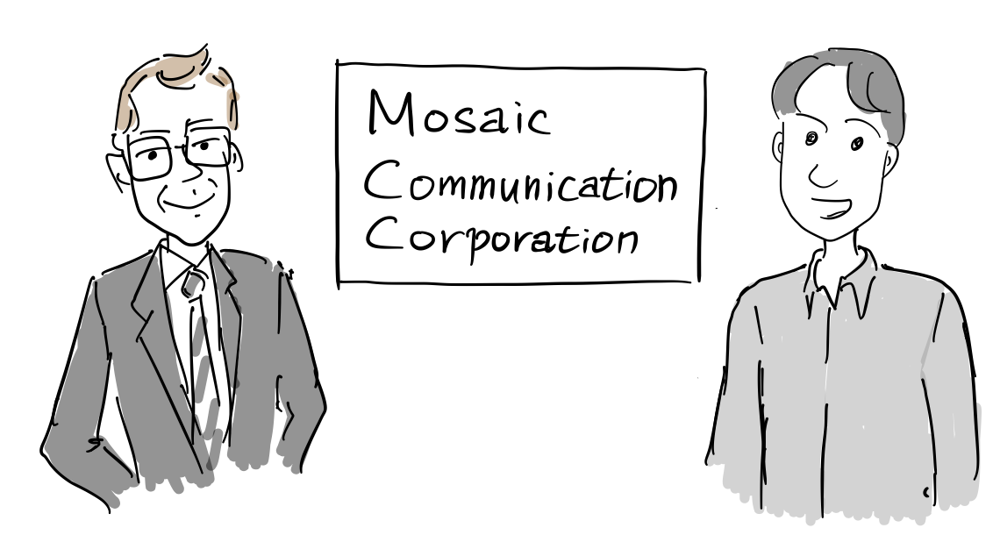

그리고 마침내 1994년 4월 짐 클락(Jim Clark)과 마크 앤드리슨은 각기 일리노이에서 데려온 친구들과 실리콘 그래픽스에 영입한 직원들과 함께 캘리포니아 마운틴 뷰에 새로운 웹브라우저를 개발하기 위해 모자이크 커뮤니케이션(Mosaic Communication)이라는 회사를 설립한다. 회사 설립 자금을 댄 짐 클라크가 CEO를 맡았고, 마크 앤드리슨은 웹브라우저 개발을 책임지는 역할로 CTO을 맡았다.

“어떻게 웹브라우저를 다시 만들수 있겠나?”

“모두 제 머릿속에 있어서 다시 만들 수 있습니다.”

실리콘 그래픽스에서 합류한 직원들은 대학생으로 보이는 개발팀을 보고 놀랐다.

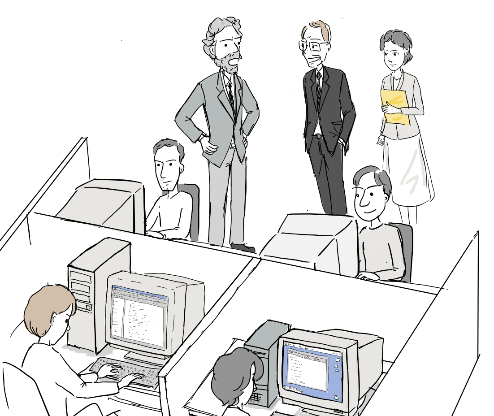

“이 어린 친구들이 웹브라우저를 만든다고? 전에 제대로 된 상업 소프트웨어를 만든 경험이라도 있는거야?”

이들은 Mosaic Killer를 의미하는 Mozilla라는 회사 캐릭터를 만들고 하루에 16~18시간을 일하면서 새로운 웹 브라우저 개발에 몰두한다.

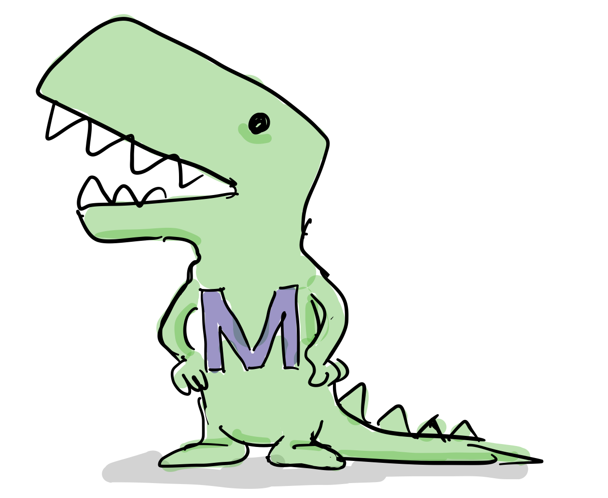

“내가 모질라다!”

때로는 사무실에서 잠을 자기도 하고

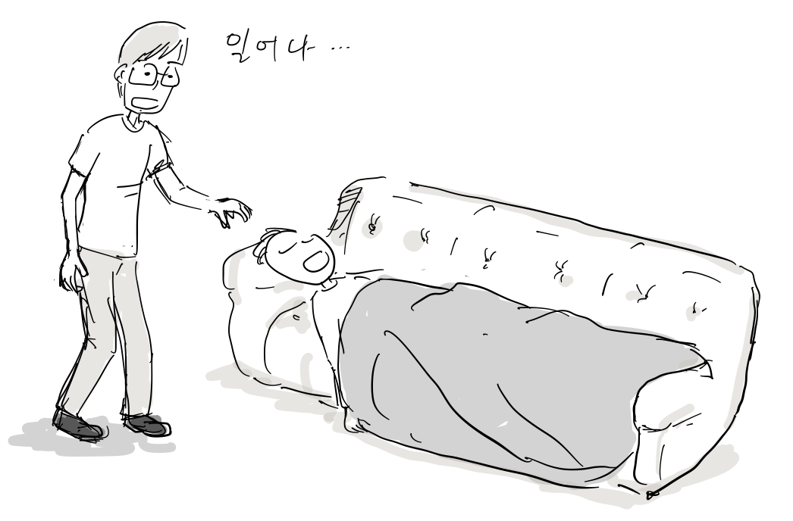

대부분의 시간을 사무실에서 보내면서 다시 웹 브라우저를 개발했다.

이 모든 것이 가능했던 이유는 당시 CTO인 마크 앤드리슨 나이가 23세였다.

그리고 1994년 10월 13일 모자익 넷스케이프(Mosaic Netscape)라는 웹브라우저의 베타 버전을 공개한다. 이 브라우저는 일반 사용자를 위해 14.4kbps 모뎀에 맞춰 성능을 최적화했고 JPEG 이미지를 지원했다.

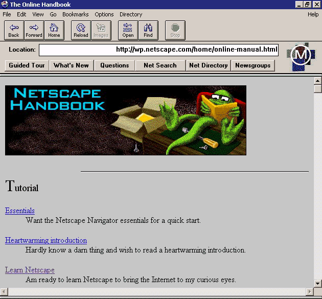

(출처: [위키피디아](https://en.wikipedia.org/wiki/Netscape_Navigator#/media/File:Mosaic_Netscape_0.9_on_Windows_XP.png))

NCSA와 법적 분쟁을 피하기 위해 바닥부터 다시 X-Window, Window, Mac용 웹 브라우저를 6개월만에 다시 개발했고, 개인 사용자에게는 무료로 다운로드 받도록하였다.

“와, 넷스케이프 브라우저가 모자익 브라우저 보다 빠른데..”

순식간에 기존 모자익 브라우저 사용자가 모자익 넷스케이프(Mosaic Netscape) 브라우저로 이동하기 시작했다.

시장의 독점적 지위가 위태로워지자, NCSA는 회사 이름에서 모자익(Moasic)이라는 이름을 사용하지 못하도록 압박을 가했고, 결국 1994년 11월 14일 회사 이름을 [넷스케이프 커뮤니케이션즈](https://ko.wikipedia.org/wiki/%EB%84%B7%EC%8A%A4%EC%BC%80%EC%9D%B4%ED%94%84)(Netscape Communication)으로 변경했다.

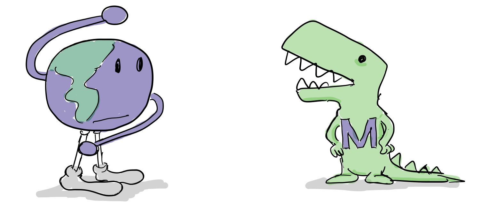

“내 이름은 안쓰면 안될까?”

“알았어, 모자익 이름은 안쓸게”

1994년 12월 15일 [넷스케이프 내비게이터](https://ko.wikipedia.org/wiki/%EB%84%B7%EC%8A%A4%EC%BC%80%EC%9D%B4%ED%94%84_%EB%82%B4%EB%B9%84%EA%B2%8C%EC%9D%B4%ED%84%B0)(Netscape Navigator)라는 새로운 이름의 웹 브라우저가 출시되었다. 출시와 동시에 넷스케이프 내비게이터는 폭발적 반응을 보이며, 웹 브라우저 시장에서 약 90%의 시장점유율을 차지하는 대성공을 거둔다.

마이크로소프트는 MSN이라는 독자 네트웍을 구축하려는 시도 때문에 재빨리 인터넷과 웹에 대응을 못했고,

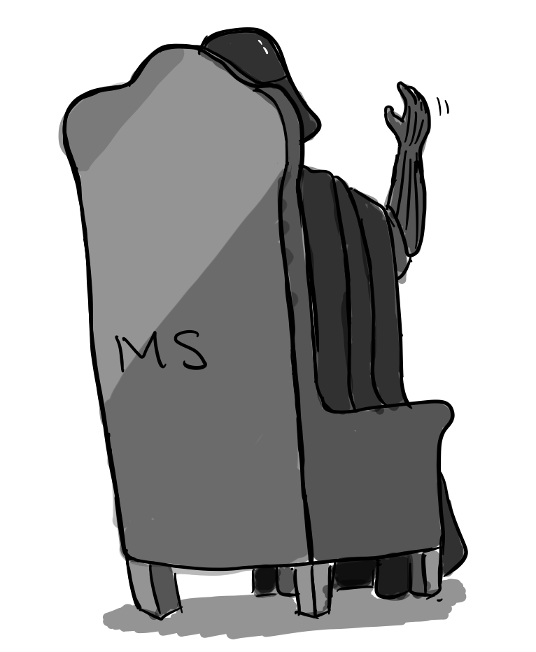

“인터넷과 월드와이드웹 때문에 MSN 계획에 차질이…”

결국 NCSA로 부터 모자익 브라우저 소스코드 라이선스 받은 [스파이글라스(Spyglass)](https://en.wikipedia.org/wiki/Spyglass,_Inc.)라는 회사에게 개발 용역을 맡기고 소소코드를 구입해서 급하게 웹브라우저를 개발했고 Windows95 출시때, 인터넷 익스플로러(Internet Explorer) 1.0을 포함시킬 수 있었다.

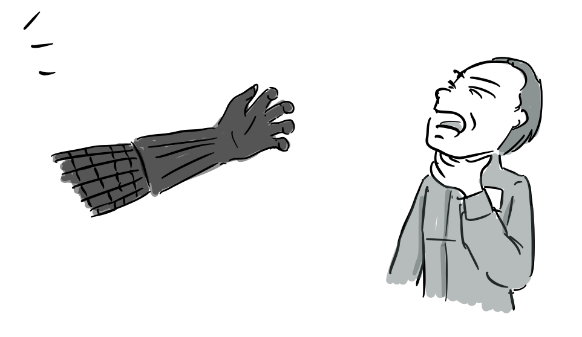

“MSN 프로젝트는 취소다. 수단과 방법을 가리지 말고, 어서 빨리 웹브라우저 개발을 서둘러라!”

1995년 8월 9일 넷스케이프(Netscape)사는 미국 주식 시장에 상장 되었고 30억불의 가치가 되는 회사로 성장한다.

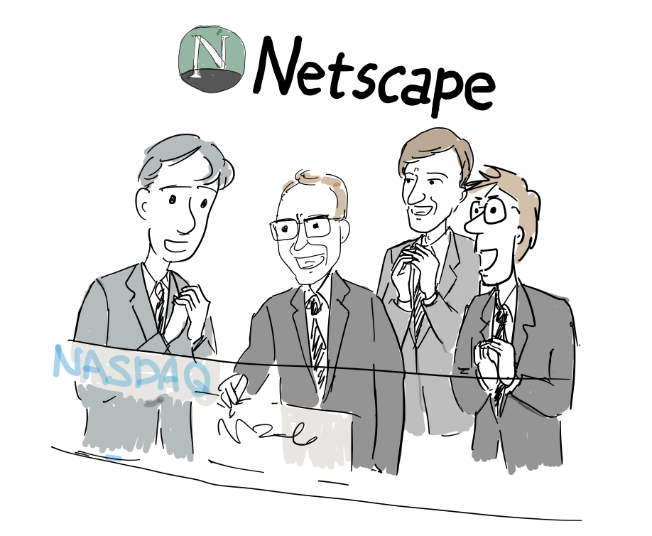

그리고, 비록 뒤늦게 웹브라우저 개발을 시작했지만, 마이크로소프트는 무섭게 웹 브라우저 기술을 따라잡기 시작한다.

“두고보자, 넷스케이프 브라우저!”

### 참고

\[1\] [20 Years Ago: Mosaic Browser First Mentioned in New York Times | Computer Science | UIUC (illinois.edu)](https://cs.illinois.edu/news/20-years-ago-mosaic-browser-first-mentioned-new-york-times)

\[2\] [How SGI has evolved from ‘Jurassic Park’ days (sfgate.com)](https://www.sfgate.com/technology/article/How-SGI-has-evolved-from-Jurassic-Park-days-2377252.php)

\[3\] 마크 앤드리슨, [위키피디아](https://ko.wikipedia.org/wiki/%EB%A7%88%ED%81%AC_%EC%95%A4%EB%93%9C%EB%A6%AC%EC%8A%A8)

\[4\] https://fortune.com/2015/08/09/remembering-netscape/

\[5\] [Mosaic and Internet Explorer Founding Engineer Chris Wilson](https://www.youtube.com/watch?v=2hHaCXAnx2Y)

\[6\] [Netscape and Mosaic Engineer Aleks “MacDaddy” Totic – YouTube](https://www.youtube.com/watch?v=IIGAy1GRNGw)

\[7\] [Mosaic and Netscape Engineer Jon Mittelhauser – YouTube](https://www.youtube.com/watch?v=P29YhEtnY28)

\[8\] [Netscape’s Rosanne Siino – YouTube](https://www.youtube.com/watch?v=vdHaF3Urf24)
