See the Pen [Star Wars Intro](https://codepen.io/cubix4u/pen/KKQrOjY) by Joone ([@cubix4u](https://codepen.io/cubix4u)) on [CodePen](https://codepen.io).

뒤늦게 웹의 중요성을 깨달은 마이크로소프트는 1994년 모자익 소스코드를 구입해서 새로운 웹 브라우저인 인터넷 익스플로러를 개발하기 시작한다. 그리고 불과 1년만에 인터넷 익스플로러(IE) 1.0을 출시하여 윈도95 사용자에게 무료로 제공한다. 이는 기업 사용자에게 비용을 받고 있었던 넷스케이프 사업 모델에 큰 위협이 된다.

넷스케이프사는 1997년 출시된 IE 3.0 부터 MS와 경쟁에서 밀리기 시작하자, 같은 해 부터 IE를 따라 잡기 위해 Gecko라는 차세대 엔진을 개발을 시작한다. 이와 함께, 1998년 3월 넷스케이프 네비게이터와 Gecko 엔진 소스코드를 공개하고 오픈소스 개발 활동을 지원을 위해 모질라(Mozilla)라는 팀을 만든다.

그럼에도 불구하고 넷스케이프 네비게이터의 시장 점유율은 5%이하로 떨어지고 1998년 결국 AOL에 인수된다. MS는 웹 브라우저 시장의 96%를 장악한 2001년 이후 IE6.0를 마지막으로 새로운 브라우저를 릴리스하지 않으며, 웹의 어둠의 시대가 시작되는데…

“로스야, 브라우저에 문제가 있구나. 자꾸 죽는구나”

“제가 볼께요. 뭔가 설치한 액티브 X 콘트롤이나 브라우저 플러그-인 때문에 브라우저가 문제가 일으키는 것 같아요. 일단 플러그-인을 모두 제거해볼께요..”

“안되겠어요. 윈도우를 다시 설치해야할 것 같아요..”

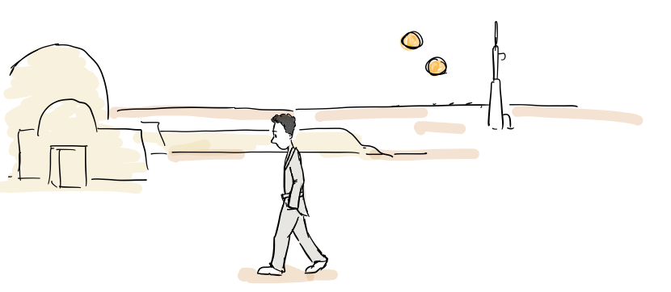

“인터넷 익스플로러는 각종 액티브X콘트롤과 플러그-인 때문에 죽는 일이 많아 문제야”

“넷스케이프 네비게이터를 쓰면 이런 문제가 덜할텐데, 브라우저가 느리고 IE에만 맞추어진 사이트가 너무 많아.”

블레이크 로스(Blake Ross)는 이런 경험을 통해 2000년 부터 Mozilla Project에 참여하게 된다. 그의 나이 불과 14살이다. 그 때 부터 버그를 수정했다.

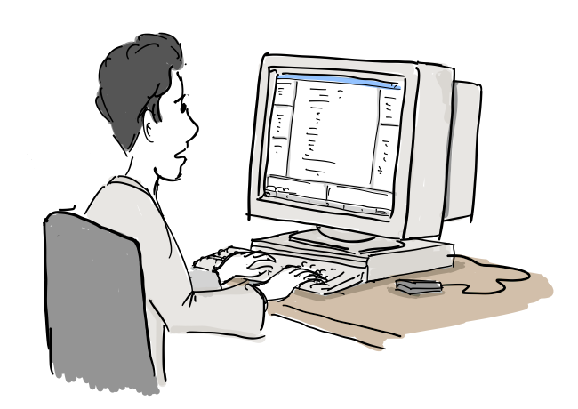

“아직 모질라에 희망이 있어. Gecko엔진도 점점 좋아지고…”

“이 친구 코딩 잘하는데, 어리긴하지만 나중에 인턴으로 일해도 되겠어.”

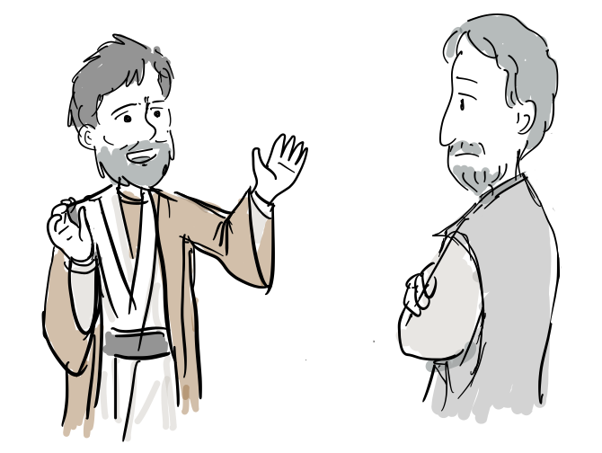

“이 아이를 제가 가르칠 수 있게 해주세요. 넷스케이프 인턴으로 일하면서 거대 제국 마이크로소프트와 싸워야합니다. IE끼워 팔기로 웹이 병들고 있습니다.”

“생각해보지요.”

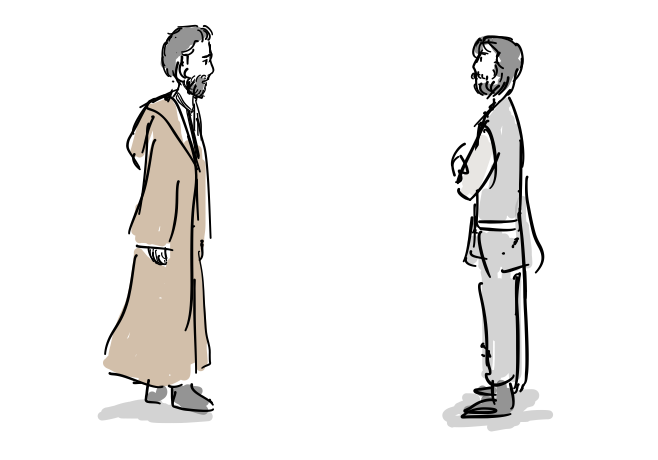

“네, 그럼 F/OSS가 함께 하기를…”

그리고 16살이 되는해에 넷스케이프사 초정으로 여름 방학 동안 인턴으로 일하게 된다.

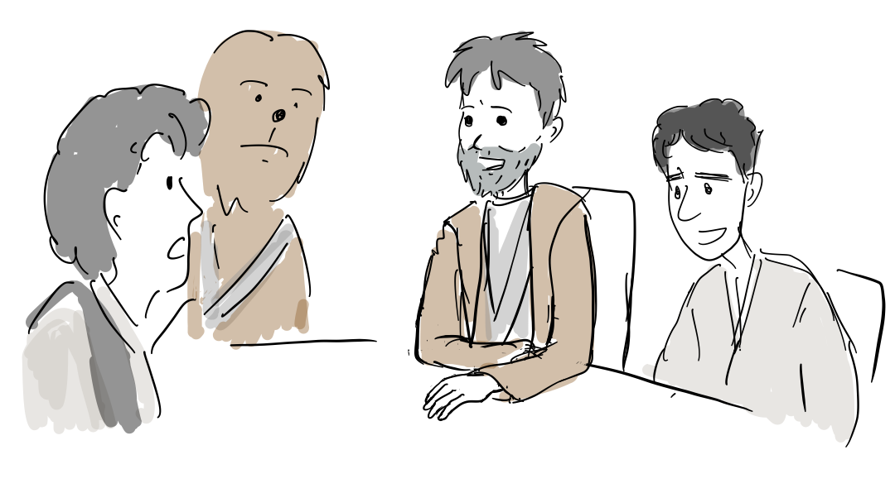

“모질라에 인턴으로 일하러 간다고요?”

“요즘 누가 넷스케이프 브라우저를 쓰나요? 그냥 속편하게 IE 쓰세요. 맥과 유닉스에서도 동작해요.”

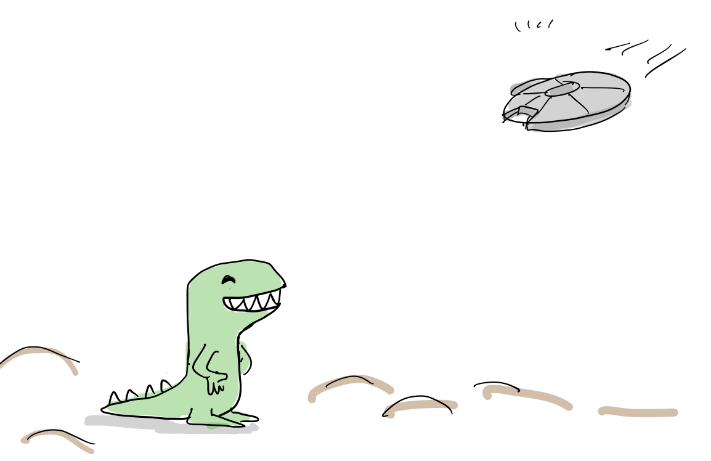

”모질라 도착입니다~”

“행운을 빌어요”

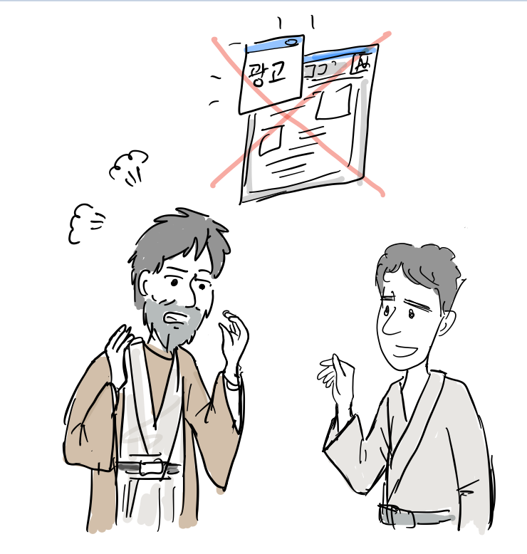

“드디어 Gecko엔진 기반으로 Netscape7는 나오는데, pop-up 블록 기능을 빼버렸네. 사람들이 이 기능을 얼마나 원하는데, Netscape 사이트에서 광고를 보여주는데 pop-up을 사용해서 그렇다는군.”

“그냥 우리가 필요한 간단한 브라우저를 만들어보면 어떨까요?”

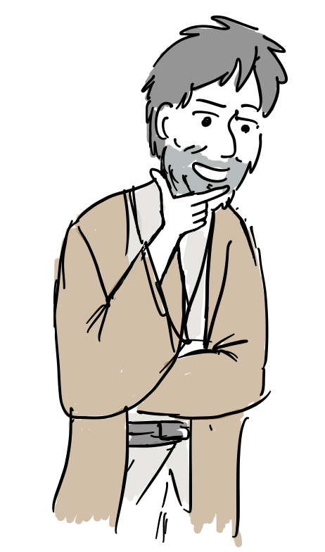

“좋은 생각인데, 인턴 과제로 좋은 아이디어 같군. 한번 시작해봐. 내가 도와줄게.”

데이비드 하얏(David Hyatt), 브레이크 로스(Blake Ross), 브라이언 라이너(Brian Ryner), 아사 도츨러(Asa Dotzler) 이렇게 네 사람으로 비공식 브라우저팀이 꾸려진다.

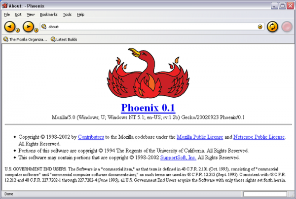

2002년 9월 23일 피닉스라는 이름으로 버전 0.1버전을 릴리스 한다.

하지만 AOL은 2003년 7월 15일 Gecko개발자와 Mozilla 재단 팀을 해고한다.

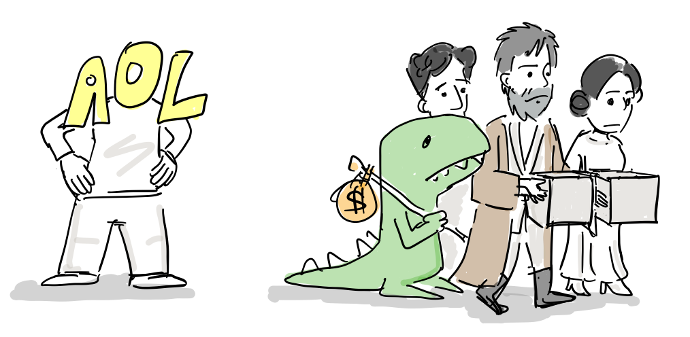

“AOL 브라우저는 이제 IE기반으로 나올거야. 안타깝지만, 계속 Gecko 엔진에 투자하기는 힘들어. 이백만불을 줄테니까, 알아서 생존하기를..”

다행히 다른 회사의 펀딩으로 Mozilla는 Gekco개발을 이어나가고 Firefox 브라우저 개발도 계속 진행하게 된다.

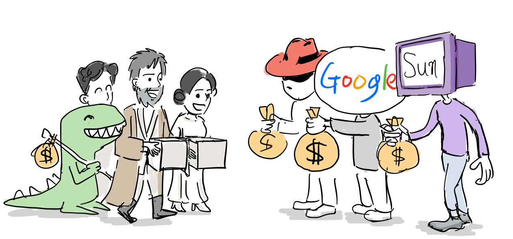

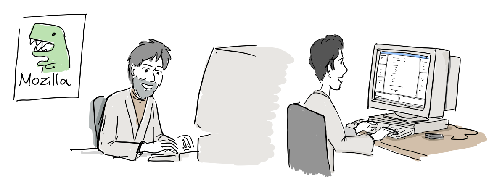

“최대한 단순하게!, XUL, XPCOM, Necko을 이용한 크로스 플랫폼 지원!”

“Pop-up 윈도우는 기본 차단, 최초 탭브라우징 지원!”

마침내 2004년 11월 9일 새로운 이름인 파이어폭스 1.0이 출시된다.

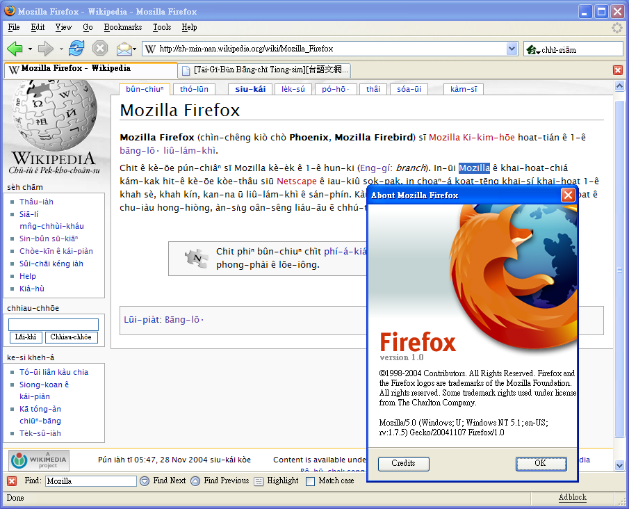

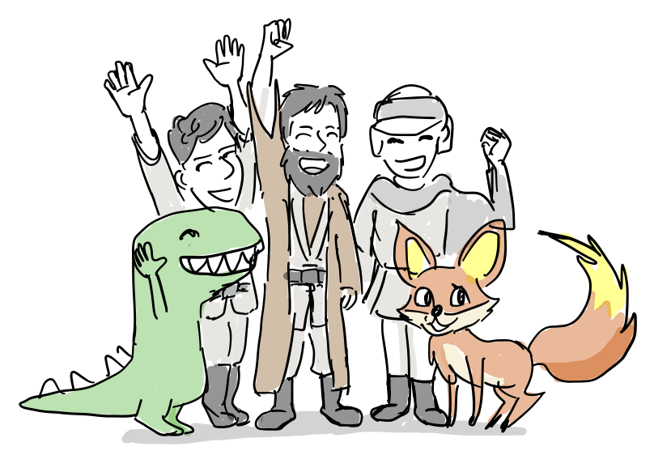

“파이어 폭스 1.0 출시!”

파이어폭스 브라우저가 시장 점유율 점차 늘려가자 마이크로소프트도 부랴부랴 2005년 개선된 IE 7.0을 출시한다. 6.0이후 4년만에 이루어진 대규모 업데이트였다.

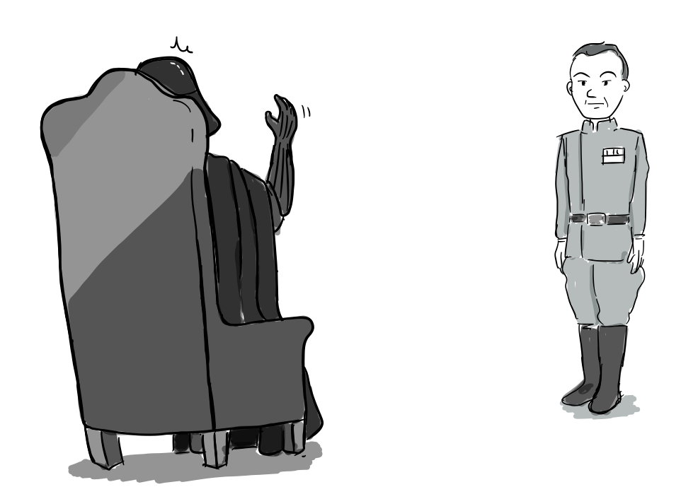

“Firefox에 대응할 새로운 IE 버전을 준비하시오”

“IE팀은 거의 해체되었습니다. 바로 새로운 버전을 개발하는 것은 무리가…”

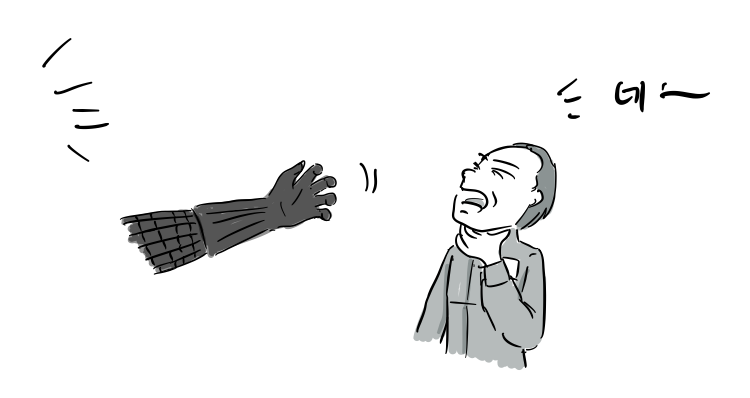

“당장 IE 7.0을 준비하시오!”

이후 파이어폭스는 시장 점유율을 25%까지 올리면서 Web 2.0의 기폭제가 되었고 오픈웹을 내세우며 IE의 독점을 무너뜨리고 모든 웹브라우저가 웹표준 안에서 서로 경쟁할 수 있는 토대를 마련하였다.

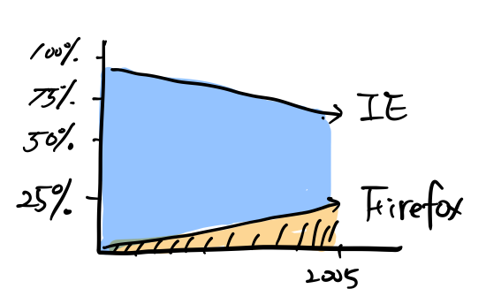

파이어폭스 개발 이후 데이드 하얏은 Apple로 옮겨 WebKit개발을 주도하고 블레이크 로스는 모질라를 떠나 대학에 진학한다.

-   [Founders at work](http://www.foundersatwork.com/): Chapter 29. Blake Ross: Creator, Firefox.
-   https://blog.mozilla.org/metrics/2009/11/09/firefox-hits-25-market-share-on-its-birthday/
