먼저 읽을 글: [KDE 프로젝트](https://joone.net/2020/05/20/34-%ec%98%a4%ed%94%88%ec%86%8c%ec%8a%a4-gui-%ed%88%b4%ed%82%b7-qt%ec%99%80-kde-%ed%94%84%eb%a1%9c%ec%a0%9d%ed%8a%b8%ec%9d%98-%ec%8b%9c%ec%9e%91/)

KHTML 시작은 KDE file manager로 부터 시작된다.

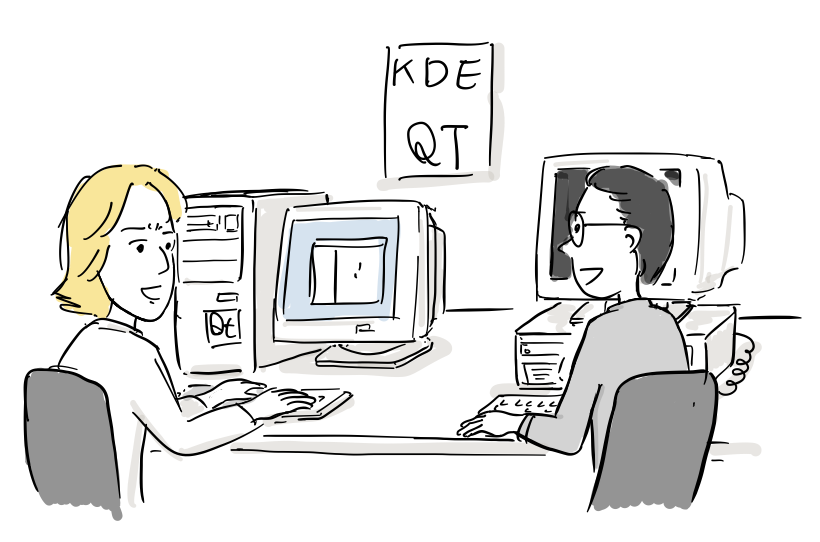

“KDE 파일 관리자에 HTML 읽기 기능을 넣으면 어떨까? 로컬에 저장된 HTML도 읽고 http로 서버에 있는 문서도 보여주는 거야. 우선은 HTML하고 HTTP만 지원하면 될 것 같아..”

“좋은 생각이네…HTML widget을 하나 만들면 파일 관리자에 통합하기 쉬울거야”

Torben Weiss와 Martin Jones는 Khtmlw라는 library를 만들어 KDE 파일 관리자에 통합한다. 그리고 1997년 11월에 Martin과 Torben은 khtmlw 향후 계획을 KDE 커뮤니티에 제안한다.

“앞으로 JavaScript, CSS Level 1,2, HTML4.0, Plug-in 지원해서 완전한 웹브라우저로 발전시킬 계획입니다. 여러분의 많은 참여바랍니다.”

“좋은 계획이긴한데, 박사 논문 쓰느라 참여할 시간이 없네..”

“자바스크립트 엔진에 CSS개발까지 우리 둘이 하기에는 무리인 것 같기도 하다.”

웹브라우저 개발이 지지부진한 가운데, 1998년 3월 모질라 코드가 공개된다.

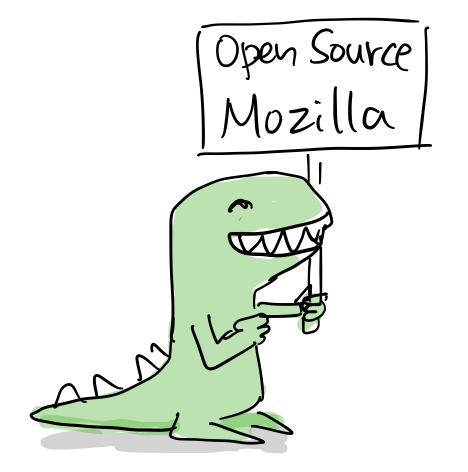

모질라 코드 공개 이후, KDE 커뮤니티에서는 웹브라우저 개발에 대한 논의가 이어졌다.

“모질라 코드가 오픈소스로 공개되었는데, khtmlw 계속 개발할 이유가 있을까요?”

“Gecko 엔진에 Qt로 브라우저 UI 만드는 것은 그렇게 재밌을 것 같지 않아요”

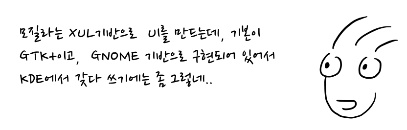

“모질라는 XUL기반으로 UI를 만드는데, 기본이 GTK+이고, GNOME 기반으로 구현되어 있어서 KDE에서 갖다 쓰기에는 좀 그렇네..”

우리가 직접 웹브라우저를 만드는게 재밌잖아? 우리한테, 이미 khtmlw도 있고..

넷스케이프 상황이 안좋은데 계속 모질라 코드를 업데이트할 수 있을까?

몇몇 KDE 커뮤니티 구성원이 모여 khtmlw를 fork해서 기능 개선을 시작했고, 1998년 11월 KHTML repository 만들어졌다.

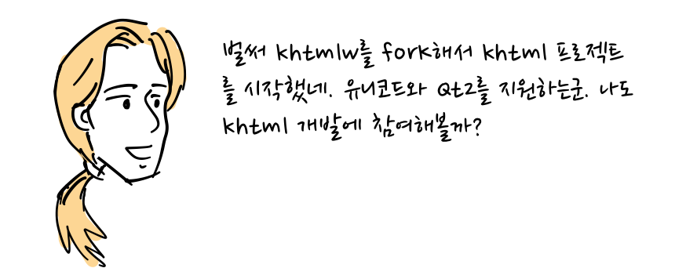

벌써 khtmlw를 forK해서 khtml 프로젝트를 시작했네. 유니코드와 QT2를 지원하는군. 나도 khtml 개발에 참여해볼까?

라스 크놀(Lars Knoll)은 1999년 5월 부터 우선 HTML DOM API를 지원하도록 코드를 재작성해서 1999년 8월 16일 KHTML 프로젝트를 처음으로 [KDE 그룹 메일링 리스트로 공개](https://marc.info/?l=kfm-devel&m=93489518402924)한다.

“안녕하세요. 제가 DOM Level 1을 지원하도록 KHTML을 재 작성했습니다. Tokenizer는 별로 건드리지 않았지만, 파서는 다시 작성했습니다.”

아직 kbrowser와 연동은 안되고 대신에 짧은 테스트 프로그램을 추가했습니다. 의견주세요!

이후, 라스 크놀은 Harri Porten이 만든 KJS 자바스크립트 엔진을 KHTML에 통합한다. 그리고 2000년 1월 부터 3월사에 Antti Koivisto와 Dirk Mueller가 개발한 CSS 기능을 추가하고 KHTML 아키텍쳐를 안정화한다.

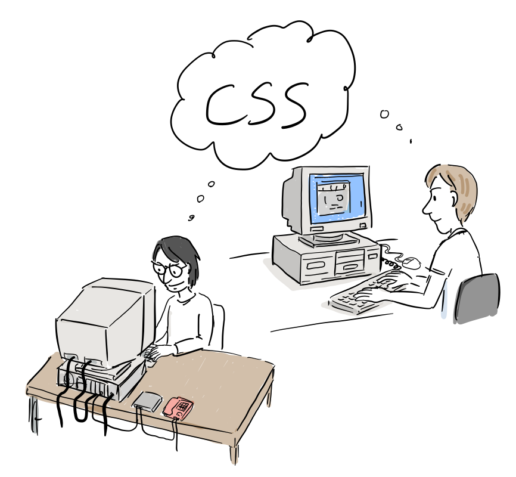

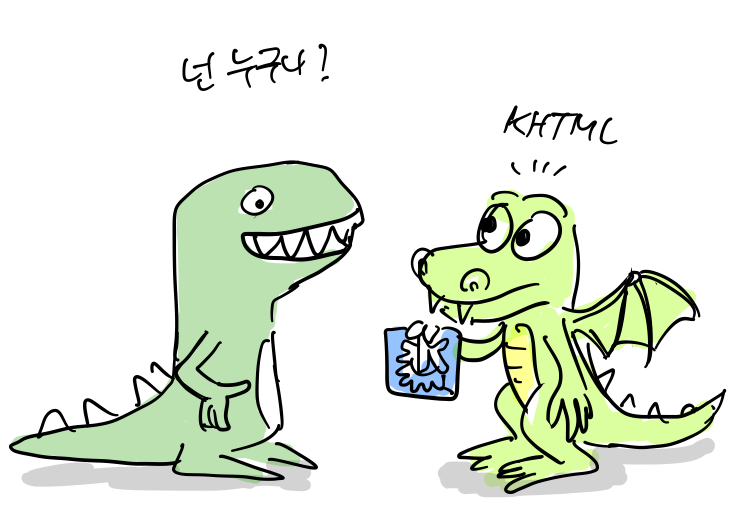

여러 사람의 협업으로 짧은 시간에 모질라 Gecko수준으로 웹엔진을 개발한 것이다.

게다가 IE 다음으로 오른쪽에서 왼쪽으로 읽는 히브리 언어와 아랍어 렌더링을 지원했는데, Firefox보다 빨리 구현했다.

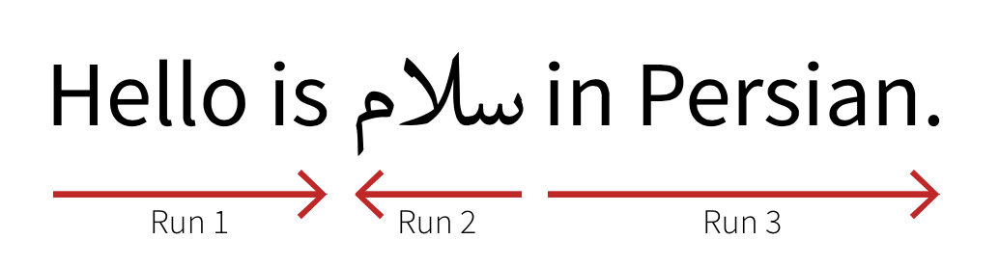

KHTML은 2000년 10월 23일에 릴리스된 KDE2.0에 처음으로 포함되었는데, KDE 파일 관리자였던 [Konqueror](https://en.wikipedia.org/wiki/Konqueror)에 HTML브라우저 기능을 제공했다.

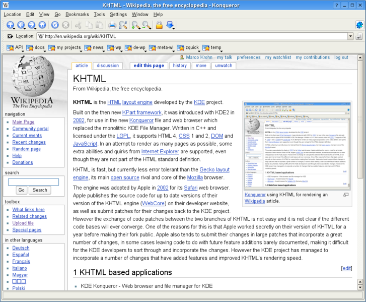

https://commons.wikimedia.org/wiki/File:Kde-konqueror-khtml-snapshot.png

KDE가 QT와 C++ 기반으로 개발된 리눅스 데스크탑이라, KHTML도 모든 기능을 충실하게 C++로 구현했다.

애플은 웹브라우저가 단순 브라우저 역할 뿐만 아니라 Itunes나 Mail 편집기에서 핵심 컴포넌트로 사용될 수 있는 기술의 필요성을 느끼고 2002년 부터 비밀리에 독자적인 웹브라우저 개발을 진행했다. 여기에는 마이크로소프트만 믿고 계속 맥 운영체제의 기본 브라우저로 인터넷 익스플로러를 사용하는데 따르는 위험 부담을 제거할 필요도 있었다.

“웹브라우저 개발은 어떻게 되가고 있나요?”

“여러 브라우저를 소스코드 수준에서 검토하고 있습니다.”

상용 웹브라우저와 오픈소스 브라우저 엔진 코드를 비교 평가한 후, 비교적 작고 잘 짜여진 KHTML을 선택하여 Safari 브라우저를 개발하고 2003년에 공개한다.

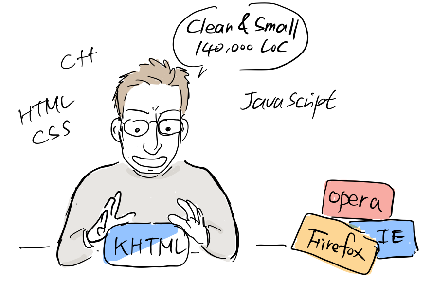

Apple이 비밀리에 KHTML기반으로 Safari브라우저를 개발했지만, KHTML이 LGPL라이선스를 따르기 때문에 2002년 부터 코드를 tarball형태로 공개했다. 하지만, 변경 사항이 너무 많아 KHTML에 다시 반영하기는 어려운 형태였다.

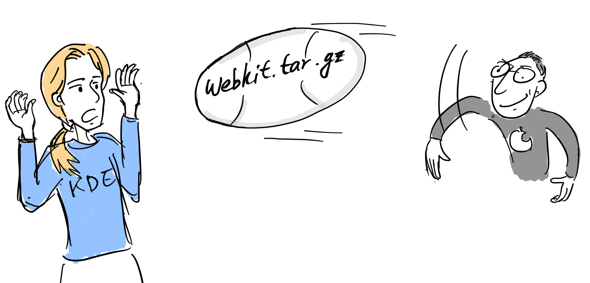

KDE 커뮤니티는 WebKit의 변경 사항을 KHTML에 반영했지만 작업의 어려움 때문에 불만이 커져갔다. 결국, 애플은 커뮤니티와 협업의 필요성을 느끼고 2005년 6월 7일 웹킷 소스코드 저장소와 bugzilla를 오픈해서 외부의 협업을 할 수 있는 기반을 마련한다.

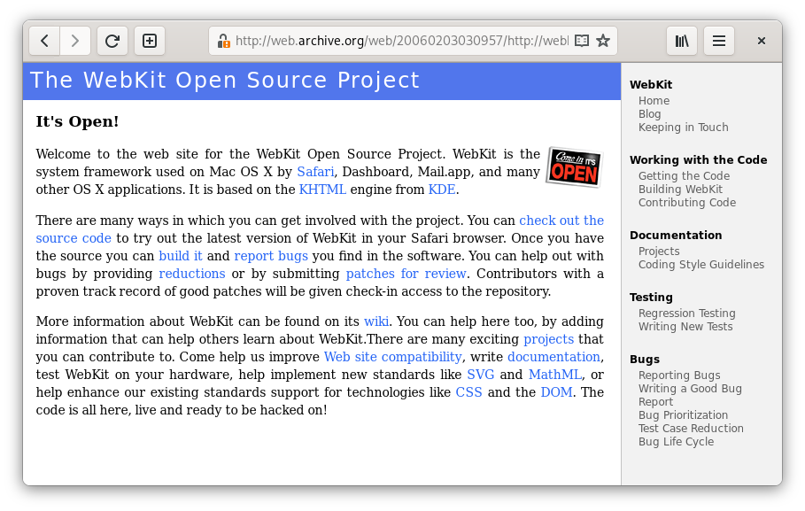

https://web.archive.org/web/20060203030957/http://webkit.opendarwin.org/

이후 WebKit코드는 여러 회사에서 웹브라우저를 만드는데 사용되었는데, 특히 모바일 기기에서 많이 사용되었다.

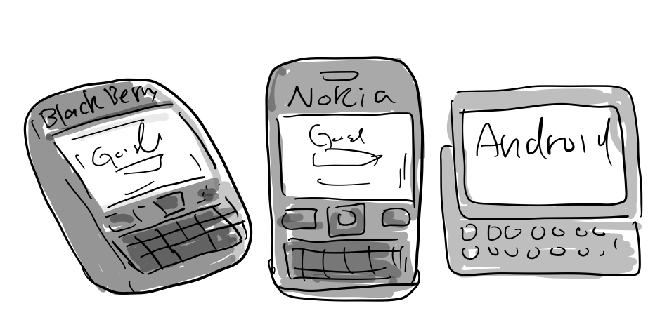

이후 구글은 WebKit코드를 기반으로 크롬/크로미엄 브라우저와 크롬 OS를 개발하는 등, KHTML를 기반으로 WebKit은 IE, Firefox와 더불어 주요한 웹엔진으로 자리를 잡게된다.

참고

-   https://arstechnica.com/gadgets/2007/06/ars-at-wwdc-interview-with-lars-knoll-creator-of-khtml/
-   https://arstechnica.com/information-technology/2007/07/the-unforking-of-kdes-khtml-and-webkit/
-   https://www.w3.org/html/wg/wiki/History/KHTML
-   [Lars Knoll and George Staikos: From KDE to WebKit](https://www.youtube.com/watch?v=Tldf1rT0Rn0) (https://www.youtube.com/watch?v=Tldf1rT0Rn0)
-   https://donmelton.com/2013/01/10/safari-is-released-to-the-world/
-   [148\. Don Melton on Apple, Safari, WebKit and Netscape](https://www.youtube.com/watch?v=3vB-V7doHvA) (https://www.youtube.com/watch?v=3vB-V7doHvA)
