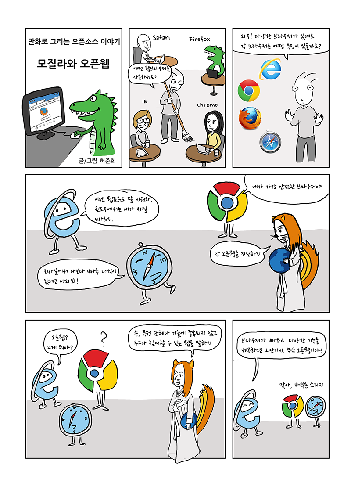
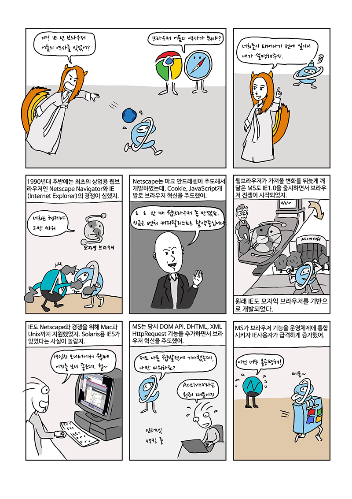
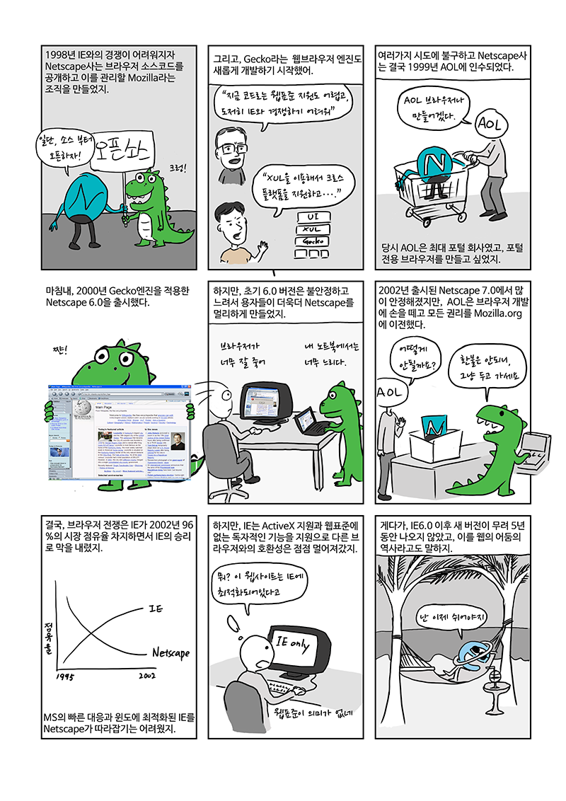
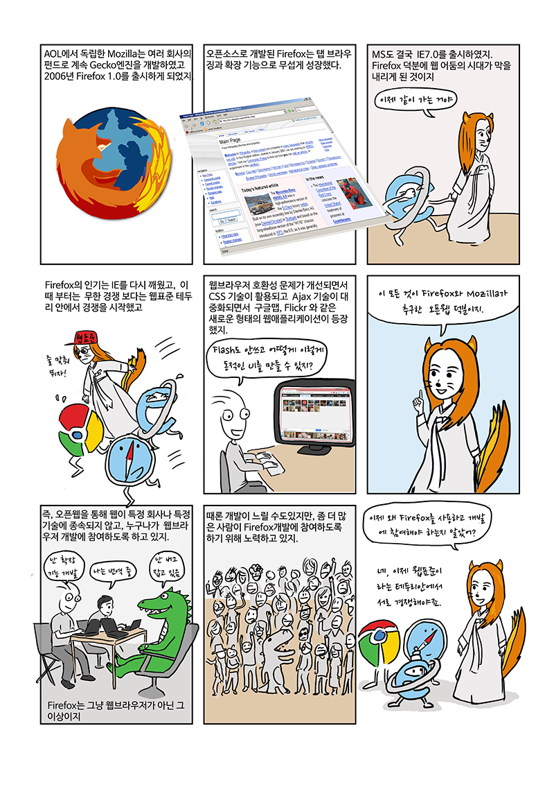

이 만화는 [이전 블로그에 먼저 소개](https://foss-story.blogspot.com/2015/07/blog-post.html)되었습니다. 웹브라우저와 연관된 내용이라서 여기에도 소개합니다. 현재 Firefox의 점유율은 많이 낮지만 여전히 오픈웹에 관해서는 균형자 역할을 하고 있고 웹표준 구현에 있어서 기준 역할을 하고 있습니다. 이것이 바로 우리가 Firefox에 관심을 가져야하는 이유이기도 합니다.
