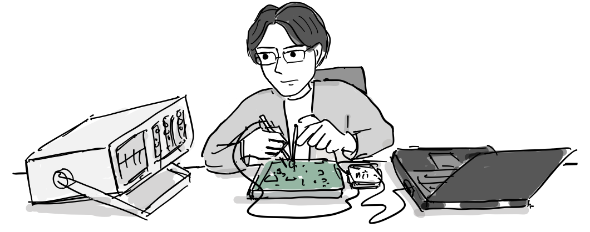
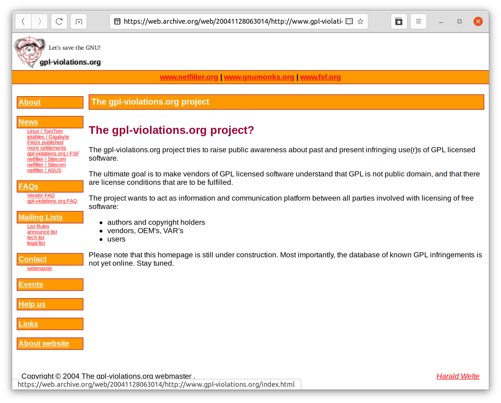
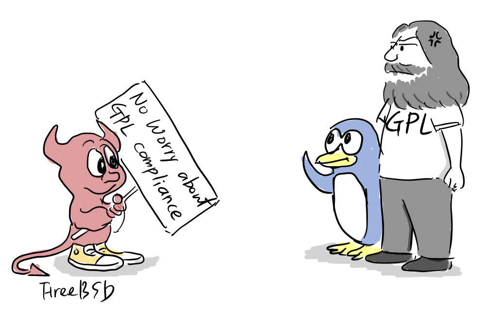

2000년 중반 이후, 임베디드 기기의 성능과 메모리가 증가하면서 RTOS 대신 리눅스 커널을 운영체제로 사용하는 디바이스가 늘어났다.

[하랄드 벨테(Harald Welte)](https://en.wikipedia.org/wiki/Harald_Welte)는 독일 출신 리눅스 해커로 2000년대 부터 리눅스 방화벽에 쓰이는 [netfilter](https://ko.wikipedia.org/wiki/%EB%84%B7%ED%95%84%ED%84%B0)/[iptables](https://ko.wikipedia.org/wiki/Iptables)과 플래시 메모리 기반 저장장치의 인터페이스 역할을 하는 [MTD(memory technology device)](https://en.wikipedia.org/wiki/Memory_Technology_Device) 등 리눅스 커널 모듈에 기여하고 있었다.

“리눅스 해킹은 잘되?”

“[iptable](https://ko.wikipedia.org/wiki/Iptables)이어서 요즘은 [MTD](https://en.wikipedia.org/wiki/Memory_Technology_Device)를 보고 있어.”

“[JFFS2](https://ko.wikipedia.org/wiki/JFFS2)가 MTD를 쓰니까 임베디드 디바이스에서 중요하겠네”

“그런데, 요즘 리눅스 커널 갖다 쓰는 임베디드 디바이스가 분명 많을텐데, 커널 코드를 공개한 경우를 거의 본적이 없어. 이거 큰 문제 아닌가?”

“음, 분명 리눅스 커널 코드를 고쳤을텐데, 그러면 GPL 라이선스 따라 분명 코드 전체를 공개해야 하거든.” “물론 다바이스 드라이버만 추가했다면 공개안해도 되긴하지만..”

“내가 한번 사례를 찾아봐야겠어”

“이 [라우터](https://ko.wikipedia.org/wiki/%EB%9D%BC%EC%9A%B0%ED%84%B0)는 분명히 리눅스 커널을 썼을 것이고, iptable을 고쳐서 썼을 것 같은데, 이것을 어떻게 증명하지…

“임베디드 기기에서 펌웨어를 덤프 뜨는 방법이 있었는데, 먼저 구글링을 해보자..”

“먼저 [JTAG](https://www.hackerschool.org/HardwareHacking/JTAG%20Hacking.pdf) 포트를 찾아서…” ([영상 참고](https://www.youtube.com/watch?v=TJaYU7Cu3NE), [문서](https://www.hackerschool.org/HardwareHacking/Flash%20Memory%20Dump%20%EC%8B%A4%EC%8A%B5.pdf))

벨테는 직접 하드웨어를 해킹에서 펌웨어를 덤프를 떠서 그 안에 netfilter/iptable 코드가 사용되었는지 일일히 심볼을 찾아서 이를 증명해냈다.

“찾았다. 리눅스 커널과 iptable를 쓴 것이 명확하고 이 회사 홈페이지 어디를 뒤져도 소스코드를 공개한 흔적이 없어..”

“이번 기회에 리눅스 커널을 갖다 쓰는 회사들이 어떻게 [GPL라이선스](https://ko.wikipedia.org/wiki/GNU_%EC%9D%BC%EB%B0%98_%EA%B3%B5%EC%A4%91_%EC%82%AC%EC%9A%A9_%ED%97%88%EA%B0%80%EC%84%9C)를 지켜야하는지 알려줘야할 것 같군. 우선, 변호사를 고용해서 소송 준비를 해야겠어.”

2004년 4월 뮌헨 지방 법원은 리눅스 커널을 사용하고도 커널 소스코드를 공개하지 않은 라우터 제조업체인 Sitecom에 제품 판매 금지 명령을 내렸다\[[관련 기사](https://www.cnet.com/tech/tech-industry/gpl-gains-clout-in-german-legal-case/)\].

“GPL 라이선스로 배포되고 있는 netfileter/iptable 코드의 공개 없이 사이트컴의 라우터 제품의 판매를 금지합니다.”

2004년 [gpl-violations.org](https://gpl-violations.org/)라는 사이트를 열고 본격적으로 행동에 나섰다. 우선, 자신이 리눅스에 구현한 iptable을 사용한 제품을 찾아 수정 여부를 확인하고, 만약 iptable을 수정했음에도 불구하고 리눅스 커널 소스 코드를 공개하지 않았다면 민사 소송을 진행했다. 다른 리눅스 해커들의 법적 권한을 위임받아 소송을 함께 진행했다.

2012년까지 소송한 건수는 100여개 이르렀고 모든 소송에서 승리했다.

한국 제조업체도 예외는 아니였다.

“법무팀에서 연락이 왔는데, 저희 제품 인터넷폰이 GPL를 위반했다고 합니다.”

“뭐? GPL이 뭔가요?”

“상무님 일전에 제가 리눅스 커널을 공개해야 한다고 말씀 드렸는데, 그 때 누가 일일히 확인하냐고 그냥 놔두자고 한 기억 나세요?”

“아, 이런걸로 소송을 걸 수 있나요?”

“네, 하랄드 벨테(Harald Welte)라는 리눅스 해커가 자신의 코드가 사용된 증거를 찾아서 GPL라이선스

위반으로 소송을 건 상태라 가능합니다.”

“다행히, 합의 금액이 그리 크지 않은데, 리눅스 커널 코드를 공개하는 조건이 있습니다.”

“이런 우리가 수정하고 성능 최적화한 것을 고스란히 공개해야 한다고? 큰일이군.”

“정해진 기간내에 코드를 공개하지 않으면 독일에 제품을 못팔수도 있습니다.”

“소송 건 사람한테 연락해서 어떻게 좋은 방안을 찾아보세요”

“그리고 코드를 좀 못알보게 어떻게 해서 공개해야지..”

“제품 개발에 너무 바빠서 코드 공개를 못했습니다. 이제야 코드를 공개한 URL을 알려드립니다.”

“음.. 소스코드를 공개했지만, 그냥 zip파일로.. 심지어 커널 버전 정보를 제거했군.”

“이렇게 공개하면 어떤 부분을 고쳤는지 알기가 어렵지.”

“저 이렇게 코드를 공개하면 아무한테도 도움이 안됩니다. 우선 오리지널 tarball에서 수정한 부분을 diff를 떠서 변경 사항과 upstream tarball을 각각 공유해주세요.”

“(들켰다) 아. 네 잘 몰랐네요. 다시 업로드하겠습니다.”

이후 기업들은 제품 설명서에 소스코드를 다운로드를 받을 수 있는 방법을 안내하고, 변경한 코드를 쉽게 다운로드 받을 수 있는 웹사이트([예](https://opensource.samsung.com/uploadList?menuItem=tv_n_video))를 만들었고, 혹시나 개발자들이 잘 모르고 사용한 오픈소스 코드가 있는 확인할 수 있는 툴을 구입해서 적극적으로 오픈소스 라이선스를 지키기 위해 노력했다.

덕분에 오픈소스 코드를 검색해주는 툴이 상업적으로 팔리기도 했다.

“새로운 비즈니스 기회가 열렸네..”

“제품 출시전에 해야할 단계가 하나 더 늘었네.”

기업들은 소프트웨어 개발자들에게 오픈소스 소프트웨어 라이선스 교육을 의무적으로 받도록 했고, 함부로 인터넷상에 있는 코드를 사용하지 않도록 교육했다.

.

“여기 저기서 오픈소스 코드 copy & paste하지 마세요.”

소스코드를 공개하기를 꺼리는 일부 일본 회사는 리눅스 커널 대신 소스코드 공개 의무가 없는 [BSD 유닉스](https://ko.wikipedia.org/wiki/BSD)를 쓰는데, 소니와 닌텐도가 대표적인 예이다.

“수 많은 해커들이 게임기에서 탈옥(jailbreak)을 시도하기 때문에 OS 커널 코드 공개가 게임 개발사의 IP 보호와 사용자 정보 보호에 위협이 될 수 있습니다. 그래서 저희는 리눅스 커널 대신 수정한 소스 코드를 공개할 필요가 없는 BSD 유닉스를 사용합니다.”

BSD 커뮤니티는 이를 일종의 마케팅으로 활용하고 있다.

BSD 커뮤니티: 리눅스 대신 BSD 유닉스를 쓰세요. 소스 코드 공개할 필요 없어요..

당연히 리눅스 커뮤니티와 GNU에서는 이를 달갑게 보지 않는다.

현재도 GPL 라이선스 위반은 계속되고 있는데, [2021년 비지오 TV가 GPL 라이선스 위반한 사례](https://hackaday.com/2021/10/22/vizio-in-hot-water-over-smart-tv-gpl-violations/)가 발견되었고, 원플러스폰의 경우도 사용자로 부터 [리눅스 커널 공개를 압박](https://github.com/OnePlusOSS/android_kernel_oneplus_sm8250/issues/24)받고 있다.

“Oneplus폰 안드로이드12 업데이트했는데, 리눅스 커널 코드는 공개를 안하고 있네”

“리눅스 커널 코드 공개하라!!”

참고

-   Harald Welte, [위키피디아](https://en.wikipedia.org/wiki/Harald_Welte)
-   Harald Welte on the flood of GPL violations, [lwn.net](https://lwn.net/Articles/186944/), 2006
-   Step-by-Step Strategies and Case Studies for Embedded Software Companies to Adapt to the FOSS Ecosystem([pdf](https://link.springer.com/content/pdf/10.1007%2F978-3-642-33442-9_4.pdf))
-   https://www.cnet.com/tech/tech-industry/fortinet-settles-gpl-violation-suit/
-   https://www.youtube.com/watch?v=wVBitkk\_2Uw
-   https://ivanorsolic.github.io/post/hardwarehacking1/
-   https://blog.nvisium.com/intro-to-hardware-hacking-dumping-your-first-firmware
-   https://www.golem.de/0406/31852.html
-   [Why is BSD becoming more popular in embedded devices?](https://news.ycombinator.com/item?id=13938555)
-   [Harald Welte – The Faces of Open Source Law](https://www.youtube.com/watch?v=ZzyFvtLv7jI)
-   [What is FreeBSD by Gavin Atkinson](https://youtu.be/XnO4S7kb7vg?t=1071)
