리누스 토발즈는 리눅스 커널 개발을 시작하고 거의 10년 동안 CVS나 서브버전(SVN)과 같은 소스 관리 소프트웨어를 사용하지 않았다. 여러가지 불편함에도 불구하고 수많은 컨트리뷰터가 오픈소스 형태로 구현하는 리눅스 커널 개발 모델에는 기존 소스 코드 관리 소프트웨어가 구조 및 성능적으로 적합하지 않다고 생각했기 때문이다.

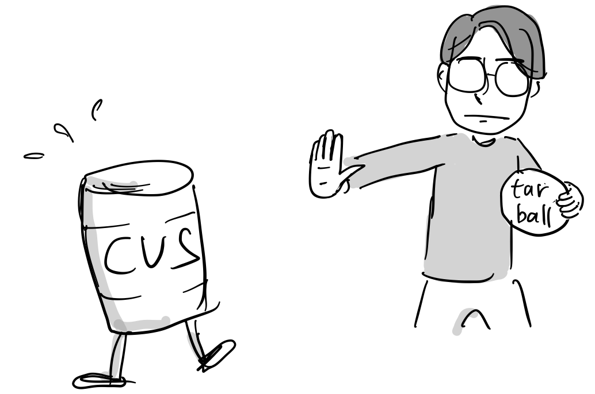

“CVS 보다 타볼([tarball](https://en.wikipedia.org/wiki/Tarball))과 패치(patch)를 사용하는 것이 훨씬 뛰어난 소스 코드 관리 방법입니다.”

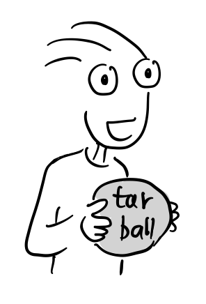

“여기서 타볼(tarball)이란?”

tar는 유닉스 명령어로 여러 파일이나 디렉토리를 하나의 파일로 묶어주는 툴입니다.

$ tar -cvf linux-2.1.tar ./linux-kernel-2.1/

$ tar -xvf linux2.1.tar

tar 아카이브 파일은 압축이 된 상태는 아닙니다. 따로 gzip 명령어로 압축을 하거나,

$ gzip linux2.1.tar

$ ls

$ linux2.1.tar.gz

이렇게 tar로 묶은 후, 바로 압축을 할 수 있습니다.

$ tar -zcvf linux-2.1.tar.gz ./linux-kernel-2.1/

압축을 해제하는 방법은,

$ tar -zxvf linux-2.1.tar.gz

이렇게 tar 툴로 여러 파일을 묶어서 하나의 파일로 만든 형태를 타볼(tarball)이라고 부릅니다.

“21세기에 patch와 diff라니…”

결국, 리눅스 커널 메인테이너나 컨트리뷰터들은 유닉스 툴인 [diff](https://ko.wikipedia.org/wiki/Diff)를 이용해서 패치를 만들고 [리눅스 커널 메일링 리스트](https://en.wikipedia.org/wiki/Linux_kernel_mailing_list)를 통해 리누스 토발즈에 전달하고 리누스는 필요한 패치를 자신의 로컬 컴퓨터에 있는 리눅스 커널 소스 트리에 머지해서 패치를 반영했다. 리눅스 커널 코드는 tarball형태로만 릴리스 되었다. 당시에는 diff와 patch라는 툴이 유일한 소스 코드 관리 툴이였다.

“[diff & patch 간단 사용법 소개](https://joone.net/2022/10/02/diff-patch/)“

정기적으로 리누스는 전체 코드 트리를 tarball로 압축해서 릴리스했는데, 당연히 각각 패치에 대한 구분이 없었다. 지금 보면 아주 원시적인 형태였다.

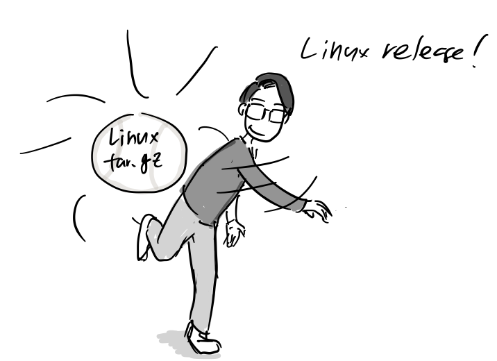

그렇다고 오픈소스 코드 관리 시스템(SCM: Source Code Management) 툴이 없는 것도 아니였다. [CVS](https://ko.wikipedia.org/wiki/CVS)와 나중에 나온 [Subversion](https://ko.wikipedia.org/wiki/%EC%95%84%ED%8C%8C%EC%B9%98_%EC%84%9C%EB%B8%8C%EB%B2%84%EC%A0%84)라는 툴이 있었고 대다수 오픈소스 프로젝트가 사용하고 있었다.

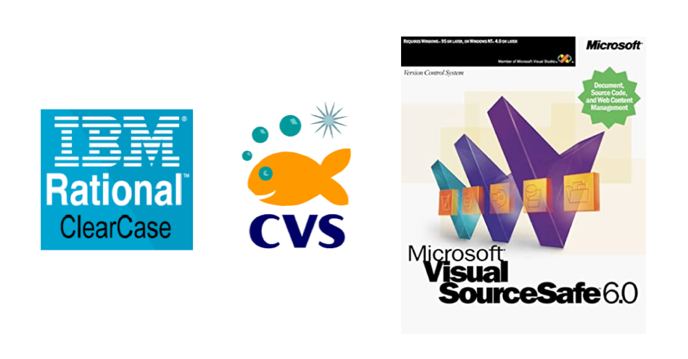

당시 기업들은 [IBM ClearCase](https://ko.wikipedia.org/wiki/%EB%9E%98%EC%85%94%EB%84%90_%ED%81%B4%EB%A6%AC%EC%96%B4%EC%BC%80%EC%9D%B4%EC%8A%A4)나 마이크로소프트 [비주얼 소스 세이프](https://ko.wikipedia.org/wiki/%EB%A7%88%EC%9D%B4%ED%81%AC%EB%A1%9C%EC%86%8C%ED%94%84%ED%8A%B8_%EB%B9%84%EC%A3%BC%EC%96%BC_%EC%86%8C%EC%8A%A4%EC%84%B8%EC%9D%B4%ED%94%84)를 사용했다. 당시 비주얼 소스 세이프가 소스 파일에 대한 체크인 체크아웃 개념을 지원해서 누가 체크인 한 파일은 체크아웃하기전까지 다른 사람이 편집할 수 없었는데, CVS에는 서버-클라이언트 기반으로 개발자 각자가 같은 소스 파일 동시에 편집할 수 있고 서버에 이를 머지해주었고, 같은 부분을 변경한 경우만 사람이 직접 머지를 하면 된다.

이는 당시 상용 툴을 뛰어넘는 기능이였다. 클라이언트-서버 기반으로 어디에 가도 인터넷만 연결되면 코드를 수정하고 서버에 반영할 수 있었다. 단, 코드가 변경되면 파일 전체의 복사본을 저장해두는 형식이여서 업데이트에 많은 시간이 걸리는게 단점 이었다.

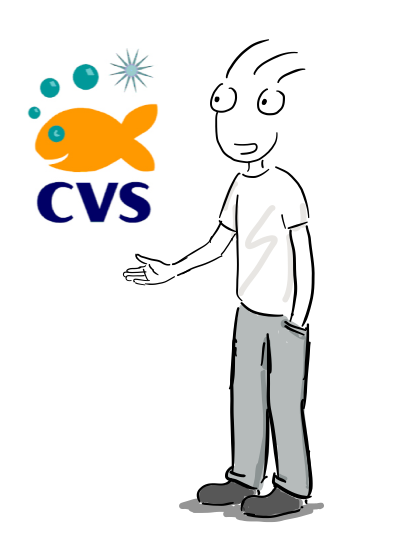

“CVS 좋아요. 여러 사람이 동시에 같은 파일을 각자 컴퓨터에서 편집할 수 있고, 변경 사항을 서버에서 머지도 해줘요.”

“진심으로 CVS를 좋아하나요? 그렇다면 정신 병원에 있어야할 것 같은데요..\[3\]”

CVS의 문제는 파일 단위로만 변경이 추적 가능해서, single revision 단위로 큰 패치를 인식할 수 없었고, 어떤 개발자가 패치를 작성했는지 알기 어려웠다. 브랜치를 만들면 모든 파일의 복사본을 서버에 만들고 이를 모두 다시 다운로드 받아야 하기 때문에 리눅스 커널 처럼 큰 프로젝트에서 브랜치를 만들면 서버에 부하가 많이 걸려서 다른 작업에 영향을 줄 수 밖에 없었다. 게다가 머지 작업 역시 서버에서 처리하는데, 브랜치 머지는 시간이 너무 오래걸렸다.

2000년대 부터 사용되기 시작한 서브버전(subversion) 역시 분산환경을 지원하지 않아 리눅스 코드 관리에 사용될 수 없었다.

“서브버전의 선전 문구가 뭔지 아세요? “SVN: CVS를 제대로 만든 것.” 입니다.

이 말만 들어도 이 프로젝트가 완전히 방향성을 잃었다는 것을 알 수 있습니다\[3\].

“제가 그래서 quilt라는 툴을 만들어 mm tree를 관리했죠. patch가 모여 quilt가 되듯이…”

이렇게 리눅스 프로젝트에 마땅한 소스 관리 툴이 없자, 당시 메모리 관리 기능을 비롯한 실험적인 기능이 먼저 머지되던 리눅스 커널 브랜치인 [mm tree](https://en.wikipedia.org/wiki/Mm_tree)가 있었는데, 이를 관리하는 리눅스 커널 메인테이너인 [앤드류 모튼(Andrew Morton)](https://en.wikipedia.org/wiki/Andrew_Morton_\(computer_programmer\))은 직접 [quilt](https://en.wikipedia.org/wiki/Quilt_\(software\))라는 툴을 직접 만들어 패치를 관리에 사용했다. quilt는 스택 개념을 이용 patch 단위로 변경 사항을 로컬에서 관리할 수 있는 리눅스 툴이다. [사용 방법 소개 글](https://joone.net/2022/10/02/quilt-%ec%82%ac%ec%9a%a9%ed%95%98%ea%b8%b0/).

이처럼 리누스가 10년 넘게 tarball과 patch파일로만 리눅스 커널 소스코드를 관리하다 보니 리눅스 해커들 사이에 불만이 늘어났다.

“리누스는 왜 아직 소스 관리툴을 적용하지 않는거야? 패치 관리 힘드네..”

“그러게, 대충 cvs나 subversion이라도 쓰지.. 지금이 21세기야..”

결국, 2002년 리누스는 BitKeeper라는 소스 관리툴을 선택하는데, 이 선택으로 리눅스 커뮤니티는 일대 혼란에 빠지고 만다.

“뭐? 오픈소스가 아니라고?”

“무슨 생각으로 리누스가 독점 소프트웨어를 선택한거야?”

게다가 개발사인 BitMover는 무료로 툴을 쓰는대신 몇 가지 제약을 두었다.

-   리눅스 커널 개발에 다른 소스 관리 툴을 사용금지
-   회사에서 라이선스 남용을 감시하기 위해 BitKeeper 메타 데이터 제어 가능
-   메타 데이터 없이 커널 개발자는 커널 버전 비교 불가능

“여러분의 불만은 알겠지만, 제가 만족할만한 오픈소스 코드 관리툴이 없습니다.“

BitKeeper는 분산 시스템입니다. 저장소가 쉽게 복사되고 합쳐질 수 있어요. 우리가 리눅스 커널을 개발하는 방식에 잘 맞아요.

“그래서 어쩔 수 없이 BitKeeper를 선택하니, 그냥 쓰세요.”

“음 이 기회에 리눅스 커널을 포크해버려..?”

이렇게 3년간 BitKeeper를 사용하면서 리누스와 커널 개발자 사이 긴장감은 높아져갔다.

Samba, rsync개발자인, 앤드류 드리젤(Andrew Tridgell)이 BitKeeper를 리버스 엔지니어링해서 오픈소스 버전 개발을 시도했다. 이건 시간의 문제였다.

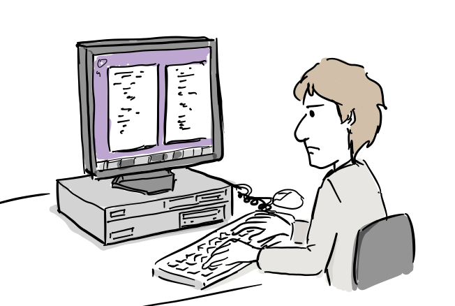

“BitKeeper 프로토콜을 분석해보자..”

BitKeeper 개발사도 리눅스 커널 공동체에 경고를 날렸다.

“이런식으로 커널 공동체에서 저희 제품을 리버스 엔지니어링을 한다면 더 이상 저희 소프트웨어를 리눅스 커널 개발에 사용할 수 없을수도 있습니다. 조심하세요.”

결국 [리누스는 BitKeeper사용 철회를 공식적으로 알렸다](https://lwn.net/Articles/130681/).

“이제 마음들이 편하신가? 저는 BitKeeper를 대치할만한 소스 관리 툴을 찾기전에는 리눅스 커널 코드에 손도 안될 생각입니다.”

“뭐지, 리누스가 삐진건가?”

“큰일이네, 리누스가 커널 개발에서 손을 떼려나봐..”

“잘됐네, 우리끼리 SVN써서 코드 관리하면 되겠네..”

“음… 그래 내가 소스 코드 관리 시스템을 하나 만들어야겠다.”

1.  소스파일이 손상되어서는 안돼. 메모리가 깨지거나 파일시스템이 깨져서 파일이 깨지는 일이 발생하는 것을 사람들은 잘 몰라. 믿기지 않겠지만, 자주 일어나는 문제지만, 대부분의 코드 관리 시스템에서 파일의 무결성을 확인하지 않지.
    
    
    
2.  성능 문제가 없어야해. 리눅스 커널 프로젝트는 큰 프로젝트잖아. 코드 업데이트, 머지, branch 작업이 빨리 끝나야해.
    
    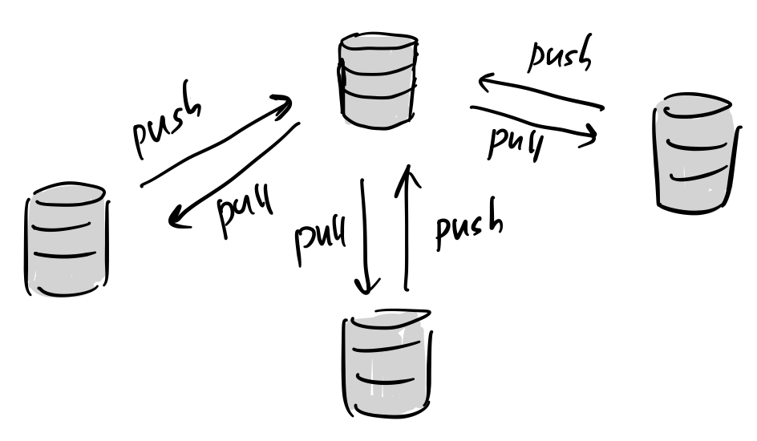
    
3.  분산 환경 아주 중요하지. 중앙 집중형 코드 관리가 아니라 각자 로컬에 코드 저장소가 있어야해. 인터넷 연결 없이도 모든 변경 히스토리를 볼 수 있어야 하고 코드 변경을 계속 커밋할 수 있어야하지. 수천명이 같은 프로젝트에 참여한다고 생각하면 정말 중요한 기능이 아닐 수 없지.
    
    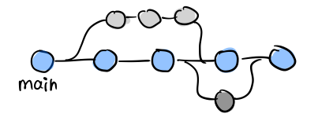
    
4.  브랜치 만들기와 브랜치 머지가 빨라야해. 분산환경이 되면 각자 저장소에 손쉽게 브랜치를 만들 수 있을거야. 브랜치 머지는 당연히 빠르겠지. CVS에서 브랜치 머지하려면 아마 하루 정도 시간을 비워야할 걸?
    
    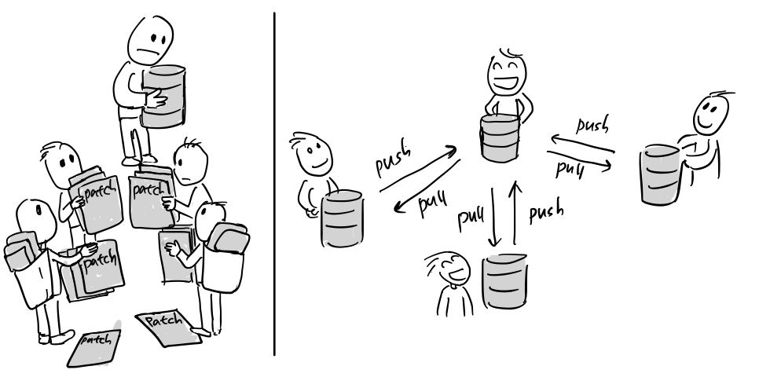
    
5.  분산환경이 중요한 또 다른 이유는, 중앙 집중형 소스 관리의 경우 오픈소스 프로젝트에 맞지 않아. 왜냐면 모든 개발자에게 커밋 권한을 줄 수 없기 때문이지.
6.  분산환경에서는 개발자가 자신의 저장소에 뭐든 해도 상관없어. 아무도 신경을 안쓰니까.
    
    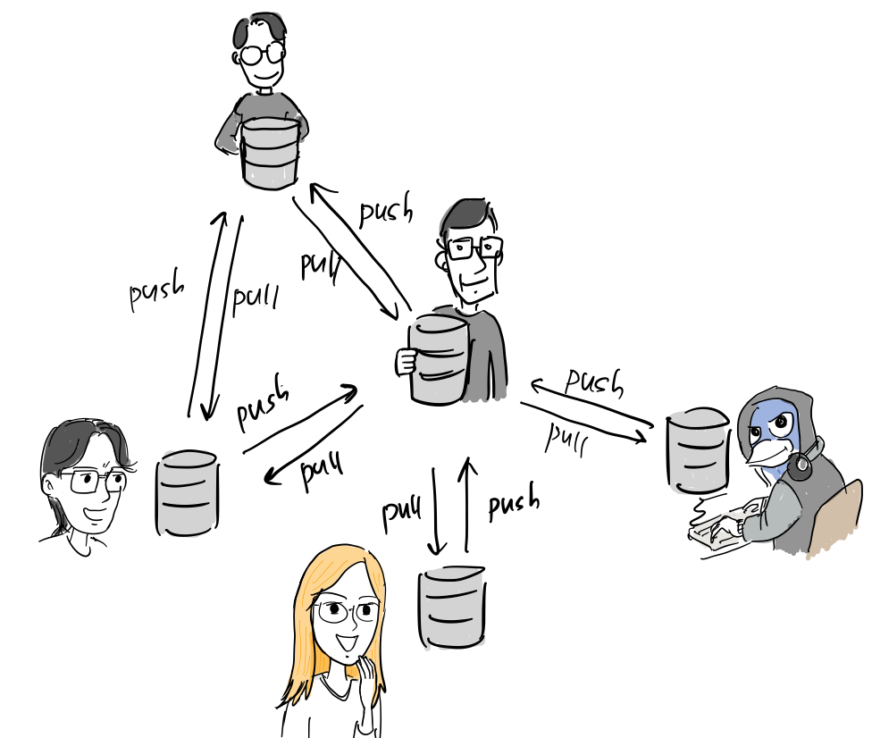
    
7.  나중에 잘 만들어진 코드가 있으면 내가 그냥 해당 저장소에 있는 브랜치를 바로 가져올 수 있으면 되지.

“요즘 리누스 뭐해?”

“글쎄, 패치 리뷰도 안해주는데..”

“커널 릴리스 안할건가?”

2005년 6월 리누스는 깃(Git)를 공개한다.

“드디어 리눅스 소스 코드 관리 툴 완성. 이름은 깃(Git)!”

“뭐야 리누스가 드디어 리눅스 커널 코드 관리를 위해 뭔가 만들었어.”

“커널 개발 속도가 이전과 비교가 안될 정도로 빨라졌어”

“우리가 원하는 모든 기능이 다 들어있잖아..”

몇 개월간 안정화 작업을 거친후, 가장 활발하게 기여해 온 주니오 하마노(Junio C. Hamano)에게 프로젝트 운영권을 넘기고 다시 리눅스 커널 개발에 몰두한다.

그후 Git은 모든 코드 관리 시스템 시장을 빠르게 잠식해 갔고 Git 저장소(repository)를 무료로 호스팅해주는 [github.com](https://github.com)이 마이크로소프트에 인수되면서 오픈소스 프로젝트 뿐만 아니라 업계의 표준 소스코드 관리툴로 자리잡게 된다. 그리고 이제는 모든 개발자가 github를 통해 자신의 코드를 공유하고 협업하는 개발자 문화를 만들어냈다.

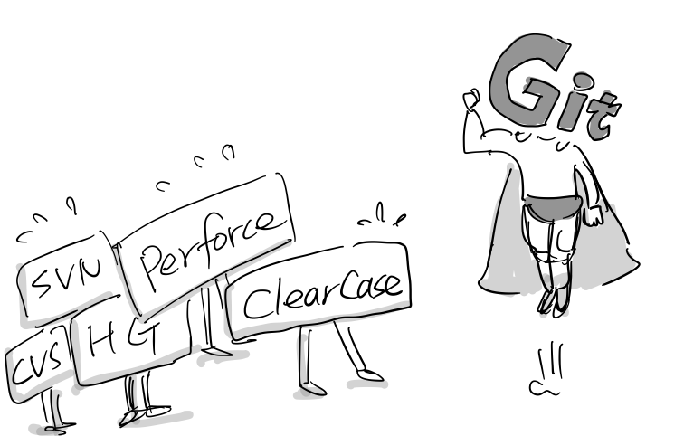

.

n

“제 생각에 리누스 토발즈의 최대 업적은 리눅스 커널 개발이 아니라 Git 개발입니다.”

\[1\] Linus on the BK withdrawal, https://lwn.net/Articles/130681/

\[2\] https://www.linuxjournal.com/content/git-origin-story

\[3\] Tech Talk: Linus Trovalds on git, [Youtube](https://www.youtube.com/watch?v=4XpnKHJAok8), 2007
