### 실리콘 그래픽스 GLX와 OpenGL 개발

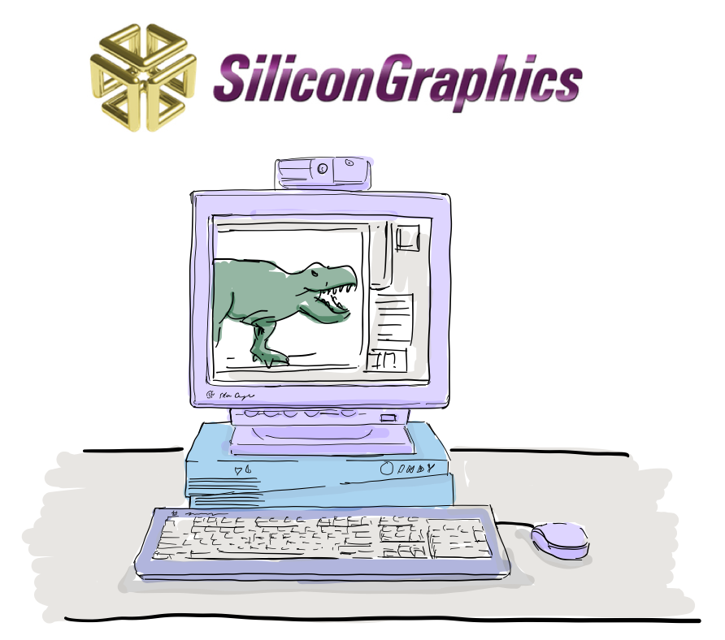

[실리콘 그래픽스](https://ko.wikipedia.org/wiki/실리콘_그래픽스)는 3D 그래픽에 특화된 워크스테이션 제조사로서 이 회사의 제품은 1980년대 부터 2000년대 초반까지 쥬라기 공원, 터미네이터2와 같은 영화 제작, 캐드 등 전문 분야에서 많이 사용되었다.

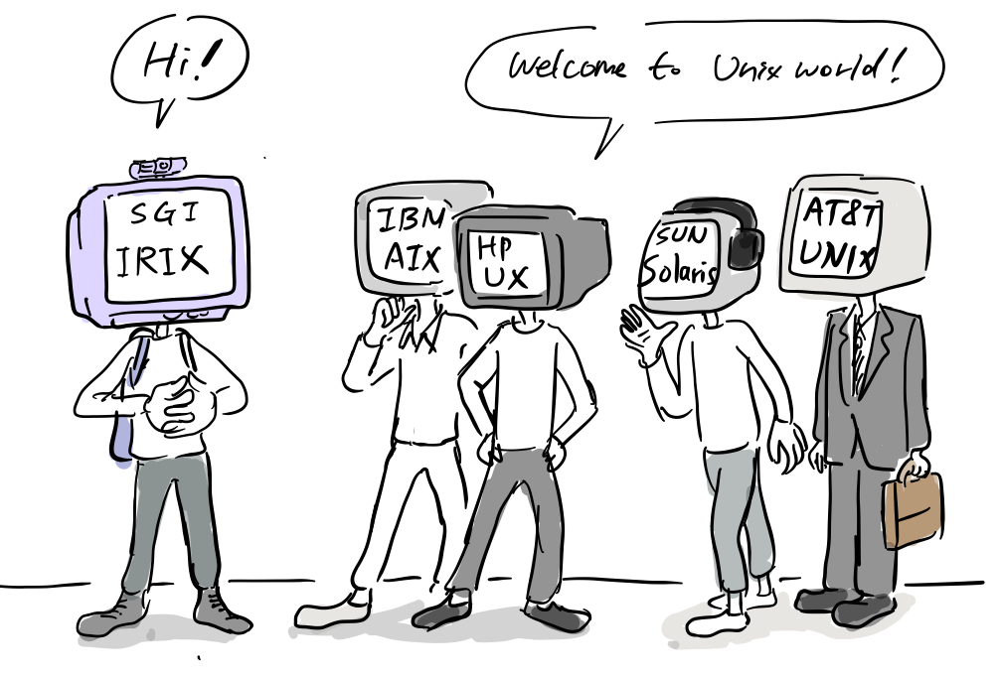

실리콘 그래픽스는 당시 IRIX라는 유닉스 계열 운영체제를 갖고 있었는데, [Unix System V](https://ko.wikipedia.org/wiki/유닉스_시스템_V)에 BSD 확장을 기반으로 개발되었다. 1991년 [IRIX](https://ko.wikipedia.org/wiki/IRIX)4.0을 발표하면서 X 윈도우를 도입했고, 3D 그래픽스가 가능하도록 [GLX](https://en.wikipedia.org/wiki/GLX)라는 X 윈도우 익스텐션을 개발했다. (참고: X윈도우 역사: [1](https://joone.net/2018/06/21/22-x-window-%ed%83%84%ec%83%9d/),[2](https://joone.net/2018/07/24/23-x11%ec%9d%98-%ed%83%84%ec%83%9d/),[3](https://joone.net/2018/08/04/25-xfree86%ea%b3%bc-x-org/))

나중에 3D 그래픽스 API는 [OpenGL](https://ko.wikipedia.org/wiki/OpenGL)이라는 이름으로 공개되었고, 1999년 GLX(OpenGL Extension to the X Window System)는 XFree86에 적용되도록 오픈소스로 공개했다\[6\]. 나중에 X.Org Foundation이 포크한 X11R6.7.0에도 적용되었다. (자세한 내용은 [25. XFree86과 X.Org](https://joone.net/2018/08/04/25-xfree86과-x-org/) 참고)

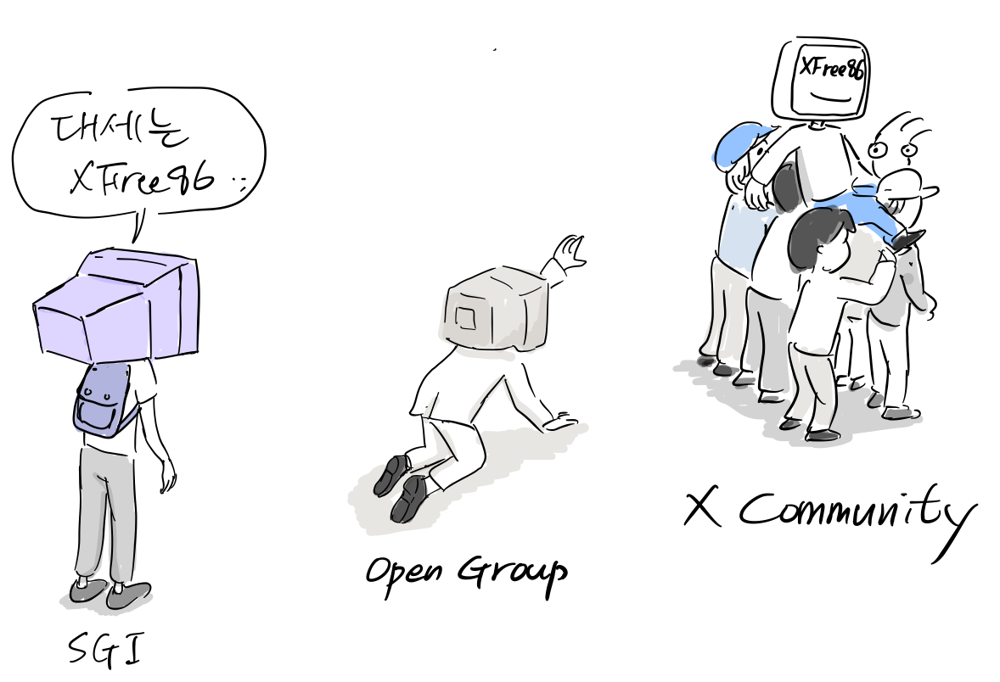

“대세는 XFree86이네.. 우리도 XFree86에서 코드를 가져와야하는 입장이니, GLX 익스텐션이 XFree86과 잘 동작하려면 코드를 공개할 수 밖에..”

이후 PC에 설치된 리눅스에서도 GLX 확장을 통해 OpenGL 지원이 가능해졌다.

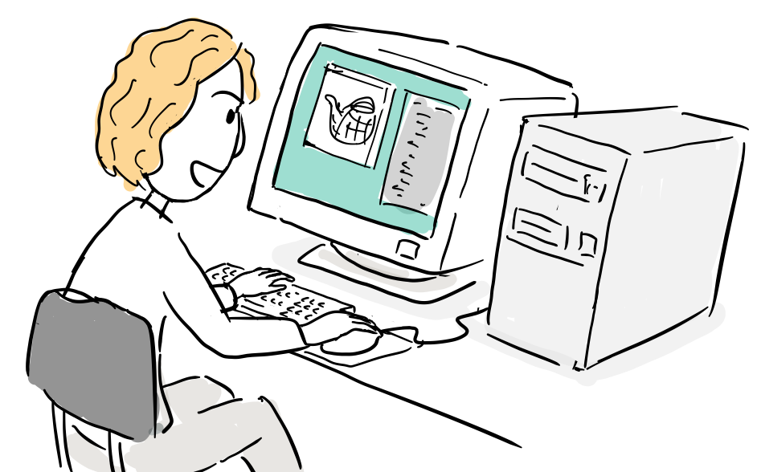

“리눅스에 GLX 확장을 설치하니, OpenGL이 가속되는구나.”

단, GLX는 기존 X 윈도의 아키텍처에 안에서 구현되다 보니, 모든 OpenGL 명령어가 [IPC](https://ko.wikipedia.org/wiki/프로세스_간_통신)를 통해 OpenGL 프로그램에서 X 서버로 전송되었다.

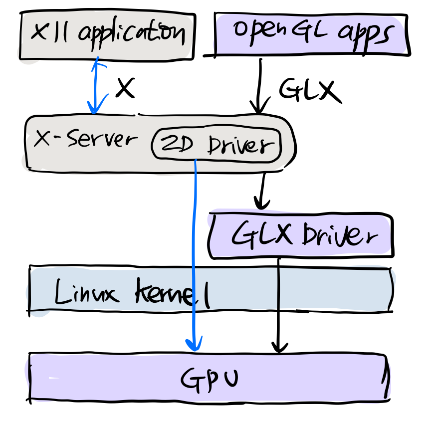

### GLX의 문제점

“리눅스에서 OpenGL이 지원되서 좋긴한데, 성능이 제대로 안나와…”

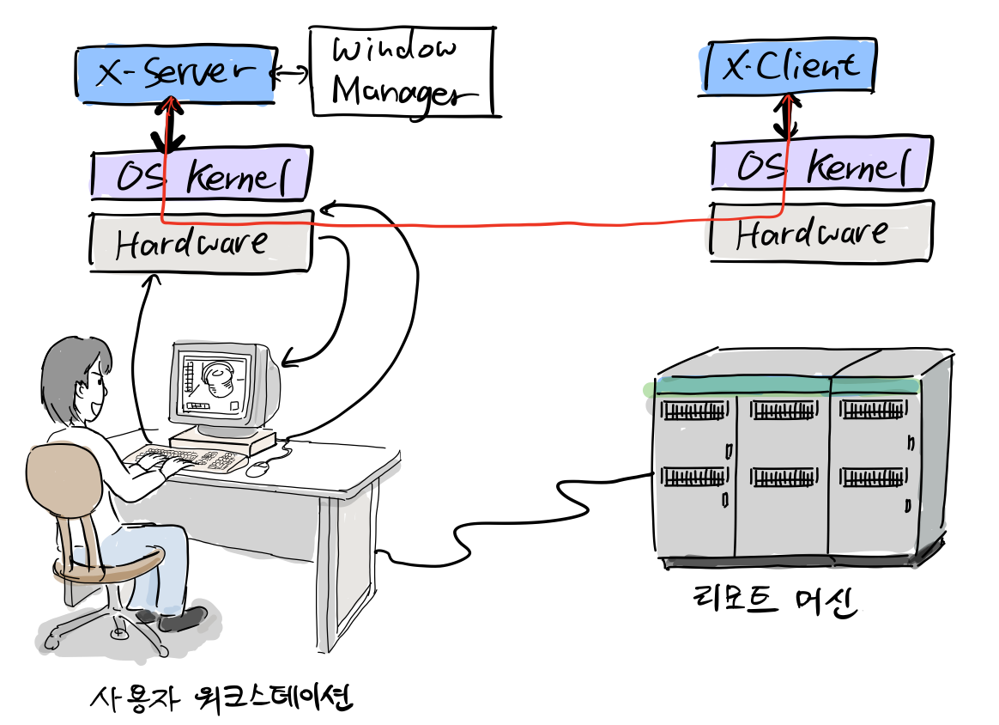

“그게 X 클라이언트가 리모트 머신에서 실행될 수도 있기 때문에 모든 OpenGL 명령어를 네트워크를 통해 전송해서 그런거야.”

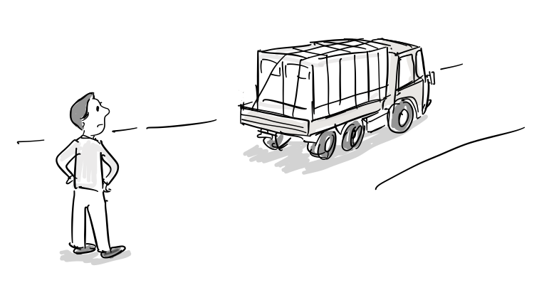

“드디어 DEC [VAX](https://en.wikipedia.org/wiki/VAX) 서버가 은퇴하는군… 잘가라~”

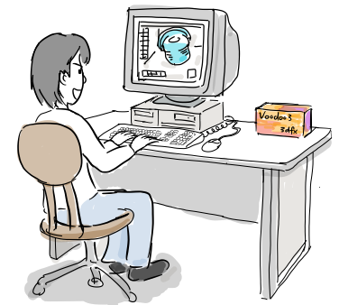

“이제 PC에도 GPU가 있고 X 클라이언트와 서버 모두 내 PC에서 실행하는데, 굳이 OpenGL 명령어를 IPC로 전송할 필요가 있을까?”

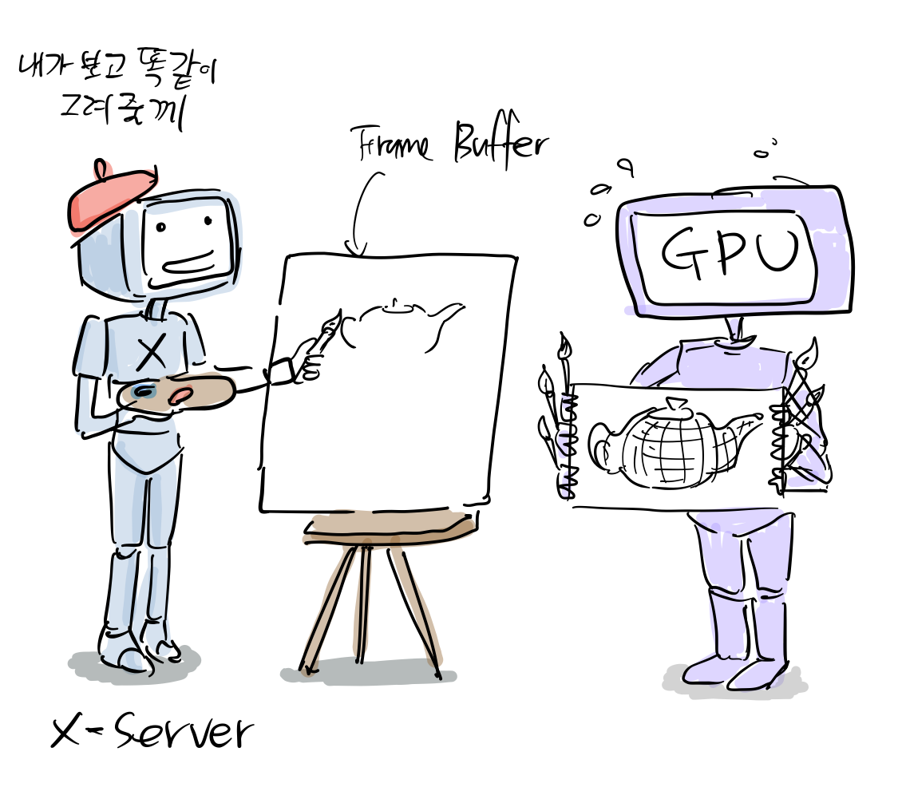

“프레임 버퍼에는 나만 그릴 수 있어요. GPU씨가 OpenGL로 그린 3D 주전자 그림은 내가 보고 똑같이 그려줄께요. 거기 가만히 서있어요.”

“프레임 버퍼는 원래 내껀데…”

이러한 문제를 인식한 일부 X 개발자들이 X 코어 프로토콜이나 서버의 핵심 코드를 개선하려고 했으나, 기존 XFree86의 코어 개발자들은 어떠한 수정도 받아들이지 않았다.([25\. XFree86과-x-org/ 참고](https://joone.net/2018/08/04/25-xfree86과-x-org/))

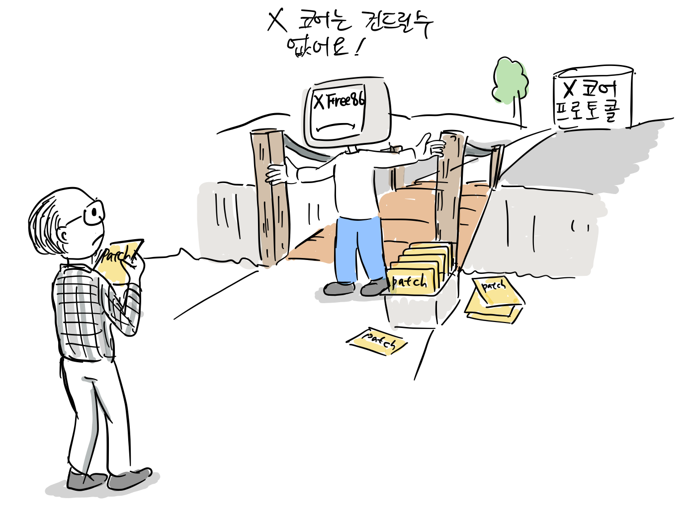

“안쓰는 프로토콜 좀 제거하고 이렇게 고치면 안될까요? “기존 X윈도용 애플리케이션이 많아요. 가능한 코어는 건드리면 안돼요!”

### 애플 쿼츠 컴포지터 개발로 데스크탑 GPU로 가속

1990년대 들어 데스크탑 기술이 일반화되면서 트루타입 폰트와 벡터 그래픽이 도입되었다.

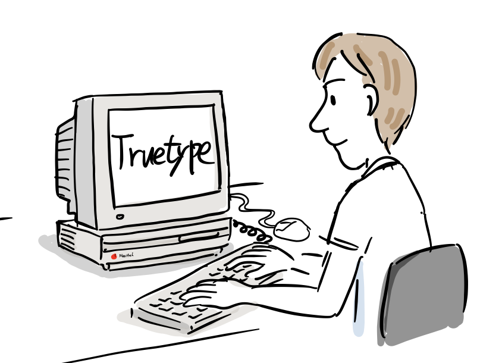

“아무리 폰트를 확대해도 계단이 안보이네”

또한, 컴퓨터에 내장된 메모리 크기도 늘어나서 각 윈도 화면을 비트맵 형태로 메모리에 저장할 수 있게 되어 그림자 효과나 윈도 전환이나 최소화나 최대화시 시각 효과를 보여줄 수 있게 되었다.

이 분야의 선두 주자는 바로 애플이였다. 애플은 이미 [포스트스크립트](https://en.wikipedia.org/wiki/PostScript) 형태로 윈도를 저장하는 기술을 갖고 있던 [넥스트스텝(NextStep)](https://en.wikipedia.org/wiki/NeXTSTEP)이라는 운영 체제를 인수해 차세대 운영체제로 Mac OSX를 만들었다.

애플은 2002년 Mac OSX Jaguar에서 OpenGL을 이용해 시각적으로 멋진 에니메이션 효과가 구현된 윈도우 컴포지터를 선보였다.

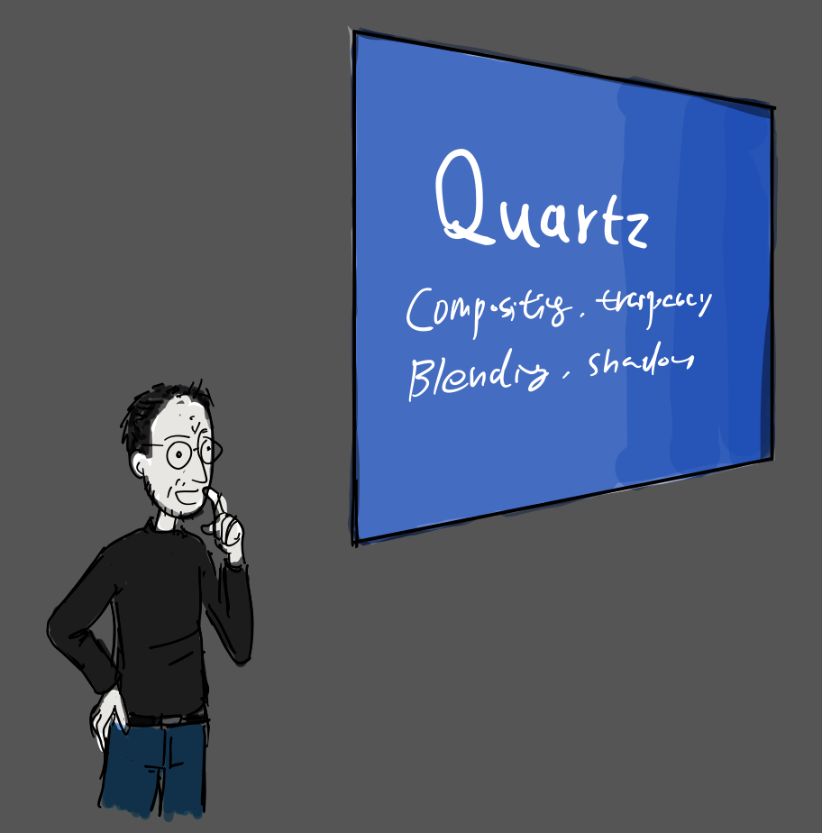

“OSX [Quartz](https://en.wikipedia.org/wiki/Quartz_\(graphics_layer\))기술로 새로운 데스크탑 시대가 열렸습니다.” (발표 [비디오](https://www.youtube.com/watch?v=VkEj8jDVA6U) 참고)

### GLX와 Compiz 이용한 리눅스 데스크탑 가속

2004년 노벨에서 일하고 있던 데이비드 레이브맨도 OSX [Quartz Compositor](https://en.wikipedia.org/wiki/Quartz_Compositor)와 같은 윈도 컴포지터 개발을 준비한다.

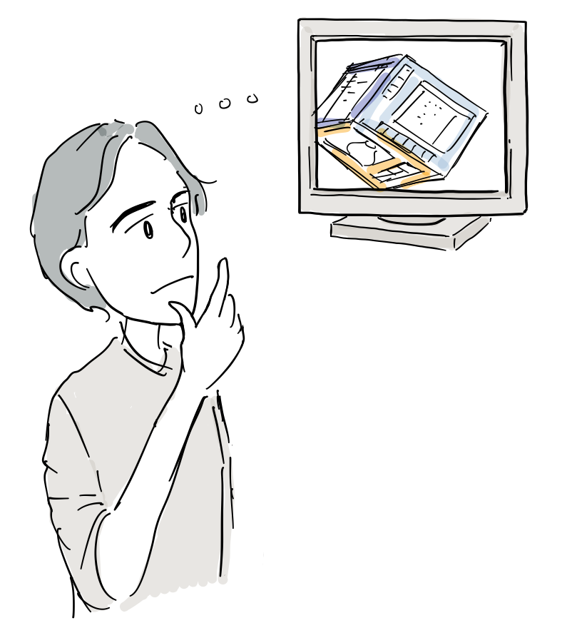

“리눅스 데스크탑에서도 OSX과 같은 [윈도 컴포지터](https://en.wikipedia.org/wiki/Compositing_window_manager)가 필요해.”

“GLX로는 도저히 OSX과 같은 성능을 낼 수 없어. 바로 GPU에 접근할 수 방법이 필요해..”

그는 X 윈도우의 새로운 확장인 XGL과 함께 [Compiz](https://en.wikipedia.org/wiki/Compiz)라는 윈도 컴포지터를 개발한다. 다양한 플러그인 형태의 여러 3D 효과를 지원했고 많은 리눅스 사용자의 인기를 얻었다.

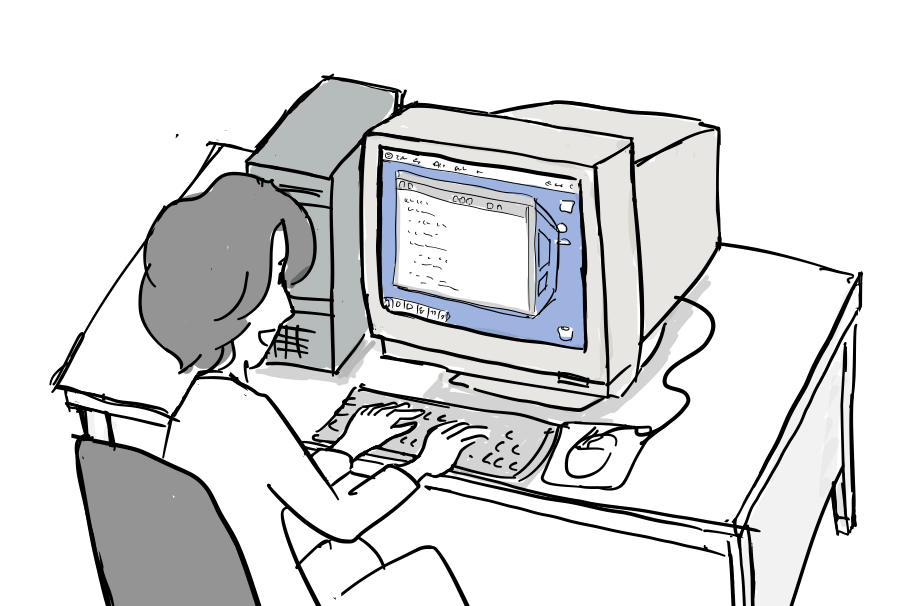

“컴피즈? 와.. 리눅스에서 이런게 가능해? 믿을 수 없어.”

### X.Org에서는 DRI 구현

X.Org 진영도 X 서버를 통하지 않고 바로 OpenGL 명령어를 GPU에 보내고 GPU가 직접 렌더링한 결과를 바로 프레임 버퍼에 출력하기 위해 [DRI](https://en.wikipedia.org/wiki/Direct_Rendering_Infrastructure)(Direct Rendering Infrastructure)를 개발한다. 또한 [VA-API](https://en.wikipedia.org/wiki/Video_Acceleration_API)를 이용해서 하드웨어 가속을 이용해서 동영상을 플레이할 방법을 만들었다.

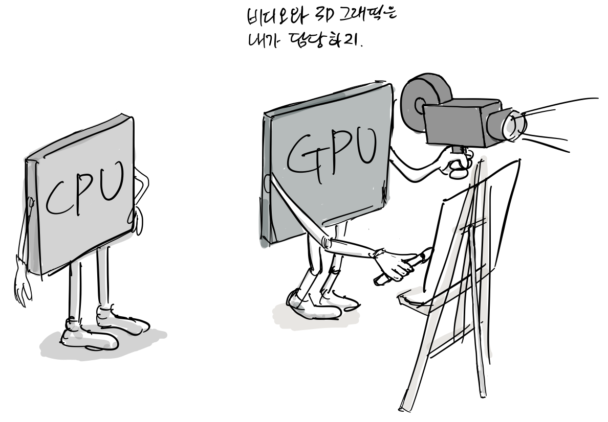

2008년 크리스티안(Kristian Høgsberg)은 레드헷에서 X 윈도 개발자로 일하고 있었다. 그는 GLX로 개발된 OpenGL 애플리케이션도 DRI를 이용할 수 있도록 [AIGLX](https://ko.wikipedia.org/wiki/AIGLX)를 개발했다.

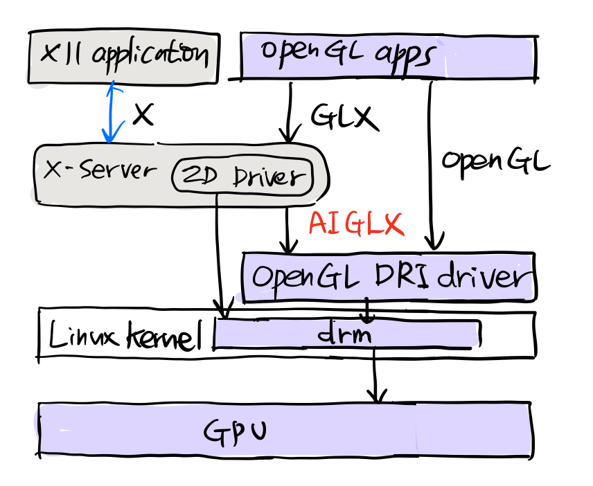

출처: [위키피디아](https://en.wikipedia.org/wiki/AIGLX#/media/File:Linux_graphics_drivers_DRI_current.svg)

Compiz구현을 위해 개발된 XGL은 나중에 AIGLX로 합해진다.

물론 이러한 구현을 모두가 반기는 것은 아니였다.

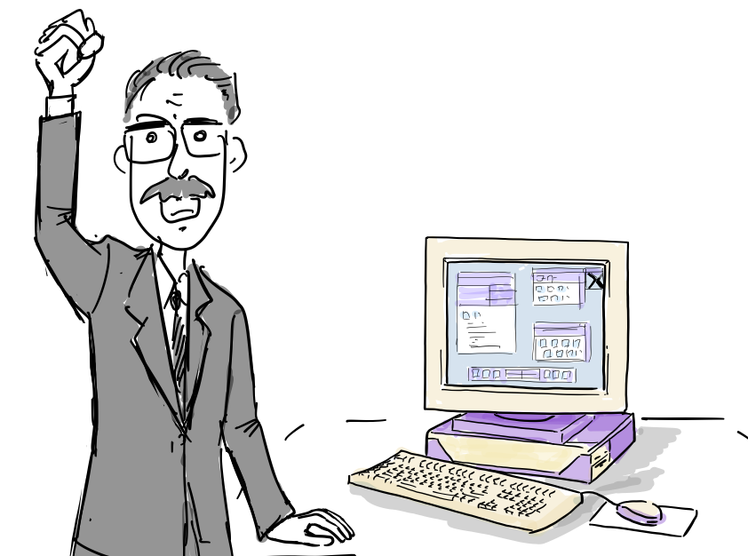

“뭐? X 윈도우가 [네트워크 투명성(Network Transparency)](https://en.wikipedia.org/wiki/Network_transparency)을 포기했다고? X 클라이언트와 X 서버가 같은 머신에 있을 필요가 없다는 것이 얼마나 중요한 기능인데…”

“GPU의 가속을 위해 X윈도우의 본질을 훼손하다니…”

[키스 패커드(Keith Packard)](https://en.wikipedia.org/wiki/Keith_Packard), X 개발자

“X의 원래 주요 기능 중 하나인 [네트워크 투명성](https://en.wikipedia.org/wiki/Network_transparency)을 중요하게 생각하는 애플리케이션이 지금 얼마나 될까요?\[4\]” “거의 없습니다”

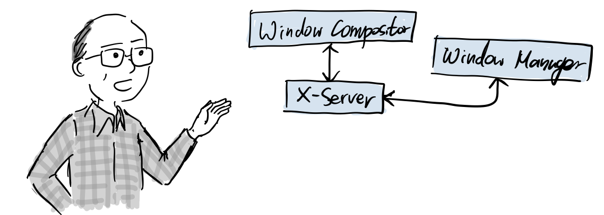

“보시다 시피 시간이 지나면서 X윈도 시스템은 X 서버, 윈도 관리자, 윈도 컴포지터 등 여러 프로세스로 나누어졌습니다. 이 모든 부분은 복잡한 비동기 프로토콜로 연결되고, 결과적으로 성능이 저하됩니다.”

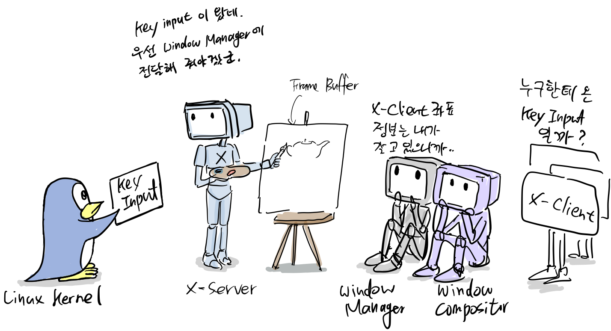

“예를 들어, 모든 키 입력이 발생하면 응용 프로그램, X 서버 및 윈도 컴포지터 등 세 가지 이상의 프로세스를 통과해야 합니다.”

“게다가 X서버가 바로 디스플레이 컨트롤러에 접근해야 하므로 루트 권한을 가져야 하는데, 이는 심각한 보안 문제를 발생시킬 수 있습니다.”

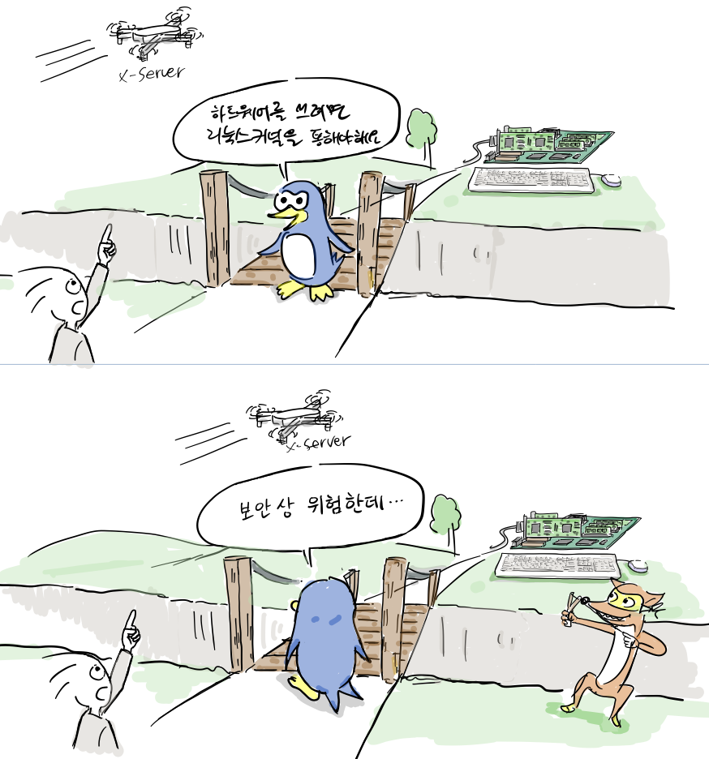

“지난 몇 년동안 일부 [Xlib](https://ko.wikipedia.org/wiki/Xlib) API는 제대로 동작을 안했는데, 아무도 모르고 있었죠.”

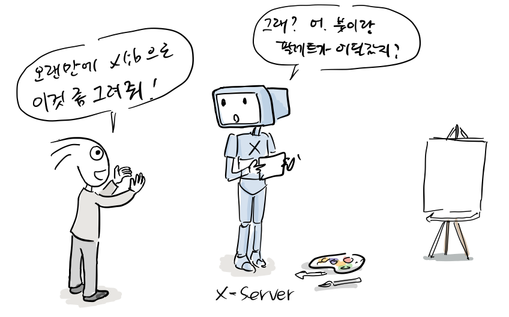

“사실 X 윈도가 맥, 윈도 등 다른 윈도우 시스템 보다 먼저 시작된 프로젝트였지만 코어 X 윈도우 시스템은 1988년 이후 2000년대까지 변한게 없습니다..”

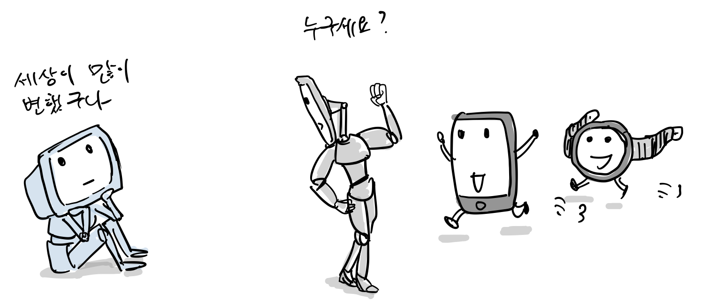

“그 동안 데스크탑 변화를 전혀 따라잡지 못했죠”

X 윈도 개발에 참여하면서 이와 같은 문제를 인식하고 있던 크리스티안은 새로운 개념의 윈도 컴포지터를 생각하기 시작했다.

“현재 리눅스 데스크탑에서 윈도우 시스템을 구현하려면 X 서버, 윈도 관리자, 윈도 컴포지터 이렇게 세개의 프로세스가 필요하구나..”

“그런데, X 서버는 Window Manager, 윈도 컴포지터, 애플리케이션간 메시지를 받아 그냥 전송하는 역할만하지”

### X의 문제점\[5\]

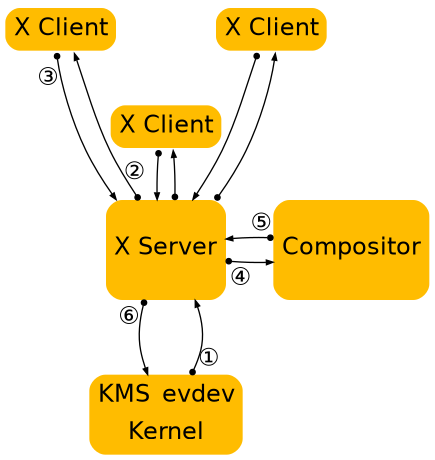

1.  일단, 커널에서 받은 모든 이벤트 메시지는 X-서버로 가지.
2.  X-서버는 해당 이벤트를 관련된 클라이언트에 전달하지
3.  클라이언트는 이 이벤트를 받고 어떻게 할지 결정을 해. 버튼을 눌렀다면, 버튼을 새로 그리지. 하지만 화면에 바로 나타나지 않고 업데이트된 버튼을 렌더링해달라고 Compositor에게 요청을 해야돼. 그런데 바로 못하고 X 서버에게 대신 요청을 하지. 원래 X 클라이언트는 X 서버에게만 페인팅 요청을 할 수 있거든. 그런데 현재는 누가 Xlib 2D API를 쓰나? 클라이언트는 이미 카이로 API로 페인팅을 했고 그 결과를 pixmap으로 만들어서 X서버에 전달하지.
4.  하여간 X 서버는 렌더링 요청을 클라이언트로 부터 받고 pixmap을 공유 메모리나, DMA 버퍼를 이용해서 윈도 컴포지터가 접근할 수 있도록 하지.
    
    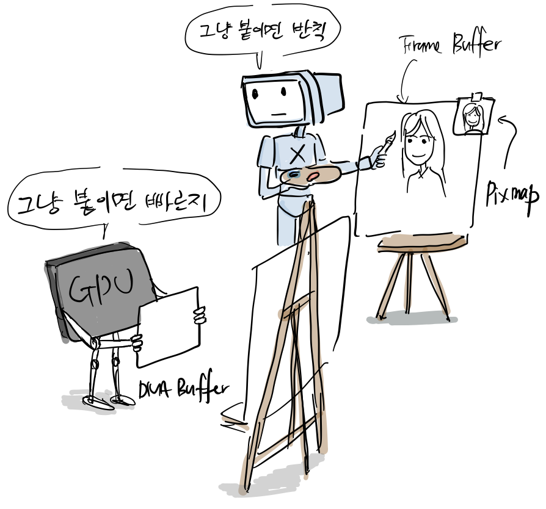
    
5.  그 다음 X 윈도우는 다시 그릴 영역을 계산해서 윈도 컴포지터에서 damage event를 날리지.
6.  Damage event를 받은 윈도 컴포지터는 전달 받은 pixmap을 GPU 텍스쳐로 만들고 해당 영역만 다시 컴포지팅한다. 그 결과는 GPU의 백버퍼 역할을 하는 프레임 버퍼에 저장되지. 그리고 다시 X 서버에 이 결과를 렌더링 해달라고 요청하지.
7.  X서버는 컴포지터의 백버퍼를 프론트 버퍼로 복사하고 [page-flip](https://en.wikipedia.org/wiki/Multiple_buffering#Page_flipping)을 하면 비로소 모니터에 눌려진 버튼이 나타나지… 휴~

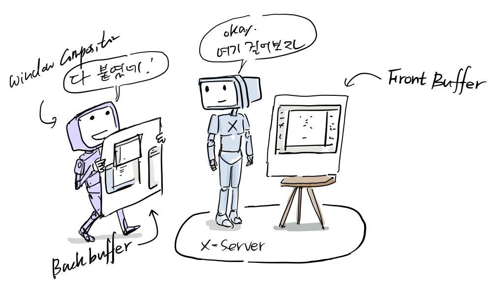

“여기서 빼먹은게 있는데, 윈도 관리자는 타이틀 바와 프레임을 그려주는 일종의 xclient야. 윈도 관리자는 윈도가 그려질 위치를 알고 있으니까, 윈도 컴포지터는 윈도 관리자로 부터 각 창의 위치 정보를 받아서 일종의 [Scene graph](https://en.wikipedia.org/wiki/Scene_graph)를 작성해서 컴포지팅을 하지.”

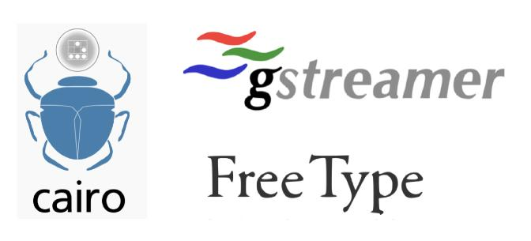

“앞서 이야기했지만, 이제 클라이언트가 알아서 모든 것을 그리지. 2D 벡터는 Cairo로 벡터 폰트는 [FreeType](https://ko.wikipedia.org/wiki/%ED%94%84%EB%A6%AC%ED%83%80%EC%9E%85)으로, 동영상은 GStreamer로 렌더링하는 세상이야..”

### Wayland의 탄생\[5\]

“그냥 루트 권한이 필요한 기능을 커널로 내리고 Windows Compositor만 있어도 되지 않을까?”

“좋은 생각이야”

1.  X 서버가 갖고 있는 이벤트 핸들링, 메모리 관리, 커맨드 스케줄링, 화면 모드 설정 기능을 리눅스 커널로 이동하여 [evdev](https://en.wikipedia.org/wiki/Evdev), [KMS(Kernel Module Setting)](https://en.wikipedia.org/wiki/Mode_setting) 와 [GEM](https://lwn.net/Articles/283798/) 커널 모듈로 관리한다.
    
    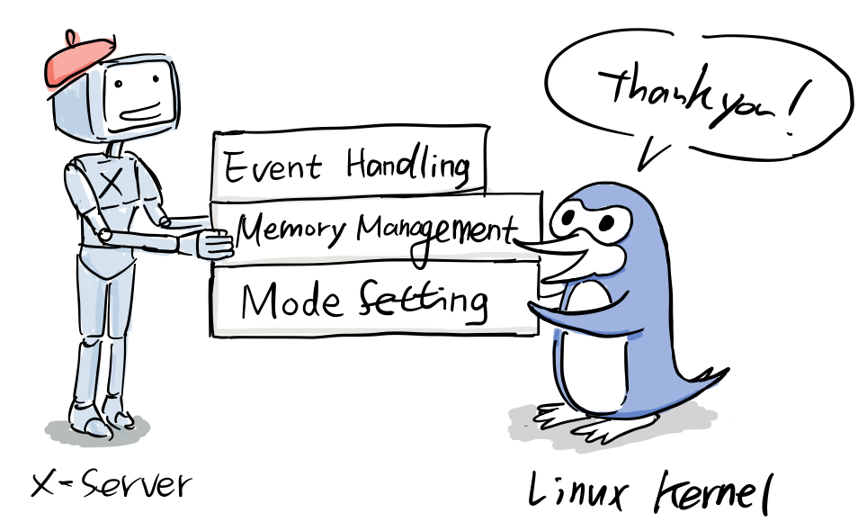
    
2.  더 이상 윈도 서버가 루트 권한으로 실행될 필요가 없지..
3.  클라이언트가 모든 페인팅을 책임진다. 폰트, 위젯 등 단 창은 클라이언트 또는 윈도우 컴포지터가 그릴 수 있다.
4.  GLX는 EGL로 대치된다.
    
    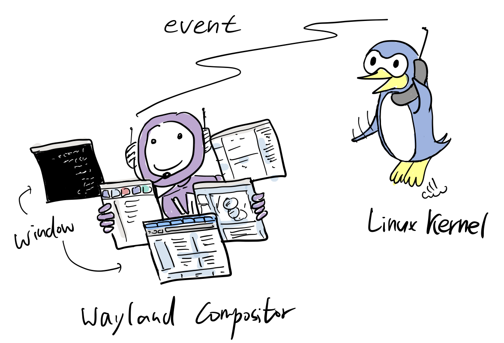
    
5.  윈도 컴포지터가 각 윈도 텍스쳐를 컴포지팅해서 화면에 표시한다.

크리스티안은 Wayland라는 이름으로 Compositor와 애플리케이션이 어떻게 데이터와 메시지를 교환할지 프로토콜을 설계하고, 실제 구현체는 Weston이라는 이름을 지었다. 플러그인구조로 데스크톱, 모바일 등 다양한 GUI환경을 지원하도록 하였다.

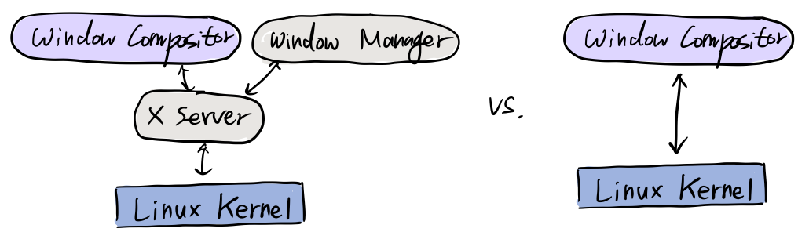

이후 Wayland는 ChromeOS와 GNOME, KDE에 모두에 적용되어 X 윈도없이도 데스크탑 구현이 가능해졌다. 많은 임베디드 디바이스도 [DirectFB](https://en.wikipedia.org/wiki/DirectFB)나 X 윈도 대신 Wayland를 사용하고 있다.

그럼에도 아직까지 많은 리눅스 배포본이 X 윈도우를 리눅스 데스크탑에서 기본으로 설치하고 있고, wayland도 X서버를 wayland client로 실행할 수 있는 호환 기능을 제공한다.

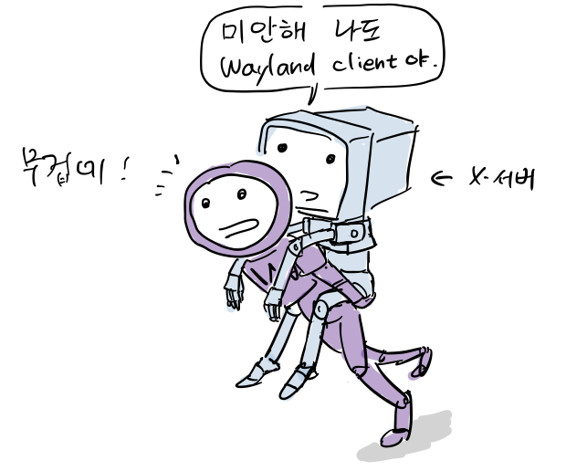

참고

1.  Wayland – Beyond X, [link](http://www.h-online.com/open/features/Wayland-Beyond-X-1432046.html), 2012
2.  Wayland FAQ, https://wayland.freedesktop.org/faq.html
3.  The Real Story Behind Wayland and X – Daniel Stone (linux.conf.au 2013), [Youtube](https://www.youtube.com/watch?v=RIctzAQOe44), 2013
4.  LPC: Life after X, [lwn.net](https://lwn.net/Articles/413335/), 2010
5.  https://wayland.freedesktop.org/docs/html/ch01.html
6.  https://en.wikipedia.org/wiki/GLX
7.  [“A Political History of X” – Keith Packard (LCA 2020)](https://www.youtube.com/watch?v=cj02_UeUnGQ), Youtube, 2020
8.  [Interview: Kristian](https://archive.fosdem.org/2012/interview/kristian-hogsberg.html) , FOSDEM 2012
