2000년 봄, [크리스 래트너](https://ko.wikipedia.org/wiki/%ED%81%AC%EB%A6%AC%EC%8A%A4_%EB%9D%BC%ED%8A%B8%EB%84%88)(Chris Lattner)는 미국 오레곤주에 위치한 [포틀랜드 대학(University of Portland)](https://en.wikipedia.org/wiki/University_of_Portland)에서 전산학과 졸업을 앞두고 있었다.

“탄야, 좋은 소식이 있어. 일리노이 대학 석사과정에 입학 허가를 받았어.”

“와 잘됐다. 나도 NCSA에서 입사 제안을 받았어.”

참고로, The National Center for Supercomputing Applications(NCSA)는 모자익 브라우저를 만든 연구소이다.

탄야는 크리스의 여자 친구로 두 사람은 함께 포틀랜드에서 일리노이주 어배너로 이사를 간다.

​​

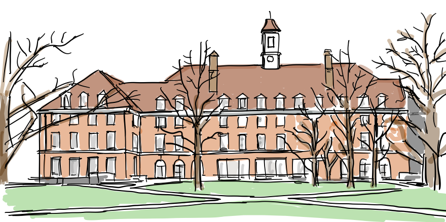

2000년 가을 부터 크리스는 [일리노이주 어배너](https://ko.wikipedia.org/wiki/%EC%96%B4%EB%B0%B0%EB%84%88_\(%EC%9D%BC%EB%A6%AC%EB%85%B8%EC%9D%B4%EC%A3%BC\))에 위치한 [일리노이 대학 어배너-샘페앤 캠퍼스](https://ko.wikipedia.org/wiki/%EC%9D%BC%EB%A6%AC%EB%85%B8%EC%9D%B4_%EB%8C%80%ED%95%99%EA%B5%90_%EC%96%B4%EB%B0%B0%EB%84%88-%EC%84%90%ED%8E%98%EC%9D%B8#:~:text=%EC%9D%BC%EB%A6%AC%EB%85%B8%EC%9D%B4%20%EB%8C%80%ED%95%99%EA%B5%90%20%EC%96%B4%EB%B0%B0%EB%84%88-%EC%84%90%ED%8E%98%EC%9D%B8%20%28%EC%98%81%EC%96%B4%3A%20University%20of%20Illinois%20at,%EB%B6%84%EB%A5%98%22%EC%97%90%20%EB%94%B0%EB%9D%BC%20R1%20%EB%B0%95%EC%82%AC%20%EA%B3%BC%EC%A0%95%20%EC%97%B0%EA%B5%AC%20%EB%8C%80%ED%95%99%EC%9C%BC%EB%A1%9C%20%EB%B6%84%EB%A5%98%EB%90%9C%EB%8B%A4.)에서 석사 과정으로 컴파일러 연구를 시작한다.

“석사 과정 연구로 어떤 주제를 생각하고 있어?”

“새로운 컴파일러 설계에 대한 연구를 생각하고 있어..”

“뭔데?”

### 전통적인 컴파일러 설계 방식

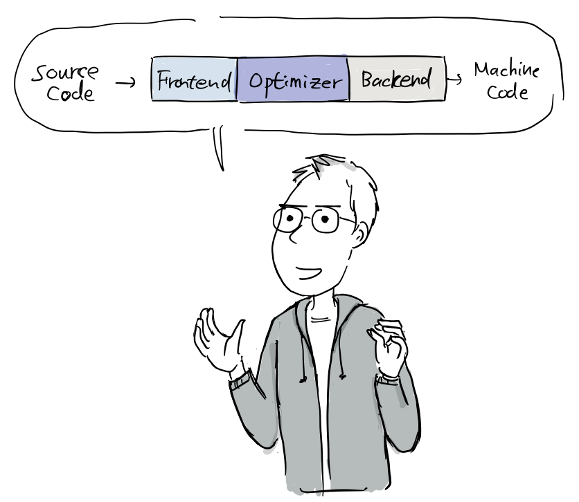

“우리가 C언어와 같은 전통적인 정적 컴파일러를 개발할 때, 가장 인기있는 디자인은 컴파일러를 주요 컴포넌트로, 그러니까 프런트 엔드, 최적화 및 백엔드로 나누는거야. 그리고 순차적으로 각 컴포넌트를 실행하면 소스 코드를 최종 실행가능한 기계어 코드로 변환하지.”

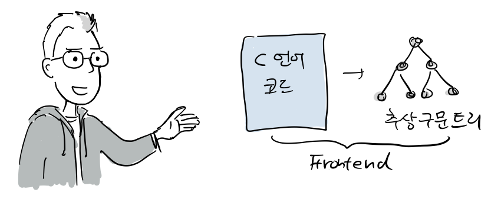

“각 단계를 설명하자면, 먼저 프런트 엔드는 소스 코드를 구문 분석하여 오류를 확인하고 입력 코드를 나타내는 언어별 [**추상 구문 트리**(abstract syntax tree, AST)](https://ko.wikipedia.org/wiki/추상_구문_트리)를 생성하지.”

“최적화는 말그대로 코드의 실행 시간을 개선하기 위해 죽은 코드 제거, 중복 계산 제거, 루프 언롤링([Loop unrolling](https://en.wikipedia.org/wiki/Loop_unrolling)) 등과 같이 다양한 변환 작업을 수행하지. 일반적으로 언어 및 대상 아키텍처에 다소 독립적이야.” (참고: [컴파일러 최적화](https://en.wikipedia.org/wiki/Optimizing_compiler))

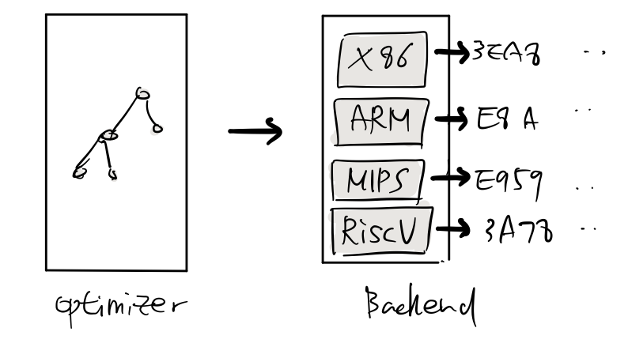

“그런 다음 백엔드(코드 생성기라고도 함)는 코드를 대상 명령어 세트에 매핑해서 기계어 코드를 생성하지. 정확한 기계어 코드를 만드는 것 외에도 아키텍처 특성에 맞는 특화된 코드를 생성하는 역할을 하지.”

“또한 공통적으로 명령어 선택, 레지스터 할당 및 [명령어 스케줄링](https://en.wikipedia.org/wiki/Instruction_scheduling)을 제공하지.”

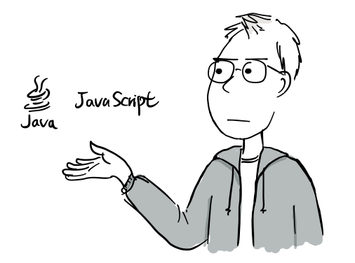

“[인터프리터](https://ko.wikipedia.org/wiki/%EC%9D%B8%ED%84%B0%ED%94%84%EB%A6%AC%ED%84%B0)와 [JIT(Just-In-Time) 컴파일러](https://ko.wikipedia.org/wiki/JIT_%EC%BB%B4%ED%8C%8C%EC%9D%BC)도 사실 거의 같은 방식으로 동작해. 그래서, 위와 같은 디자인을 따르는 컴파일러를 크게 세가지로 나눌 수 있지.

-   GCC와 같은 전통적인 정적 컴파일러와
-   베이직 처럼 [인터프리터](https://ko.wikipedia.org/wiki/%EC%9D%B8%ED%84%B0%ED%94%84%EB%A6%AC%ED%84%B0) 형태인 런타임 컴파일러
-   자바스크립트와 같은 [JIT 컴파일러](https://ko.wikipedia.org/wiki/JIT_%EC%BB%B4%ED%8C%8C%EC%9D%BC)(실행하는 시점에 스크립트를 기계어 코드로 변환해서 실행)

### 기존 컴파일러의 문제

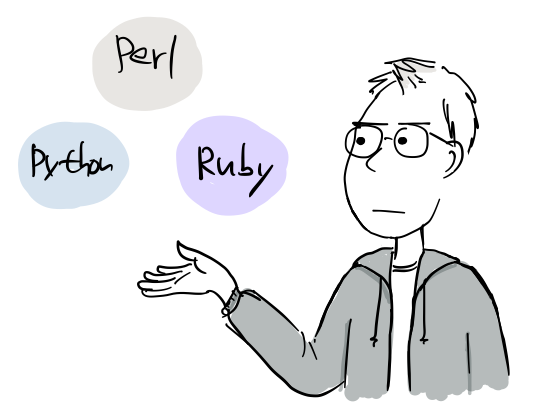

“문제는 대부분의 컴파일러가 이렇게 같은 디자인을 따르는데도 실제로는 펄(Perl), 파이썬(Python), 루비 컴파일러 사이에는 어떤 코드도 공유되고 있지 않아”

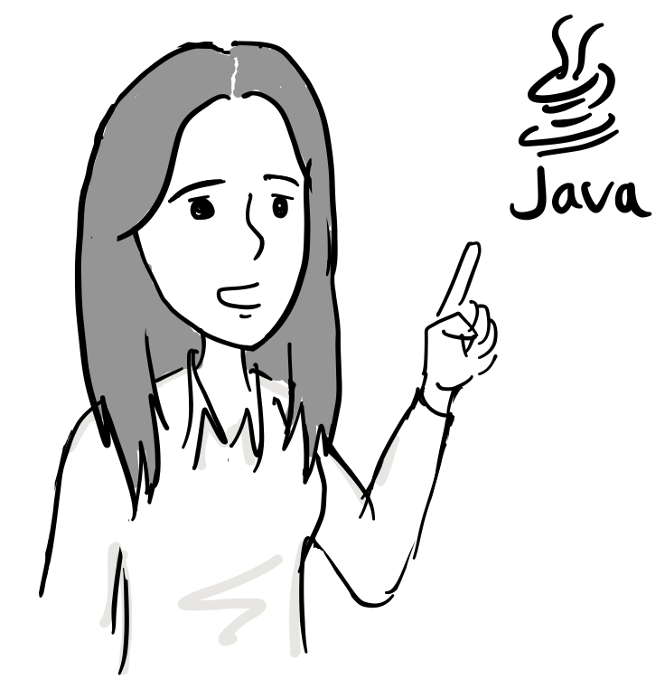

“자바 언어는?”

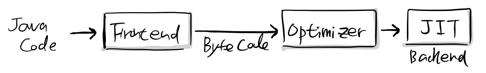

“자바와 .NET에서 사용하는 [가상 머신](https://ko.wikipedia.org/wiki/%EA%B0%80%EC%83%81_%EB%A8%B8%EC%8B%A0)도 이런 방식으로 설계되어 있지. 프런트엔드에서 바이트 코드를 생성하면 옵티마이저(옵티마이저)에서 최적화를 수행하고 백엔드에서 JIT 기능을 수행하지. 물론 이러한 가상머신 모델을 C/C++와 같은 네이티브 언어에는 적용할수가 없어.”

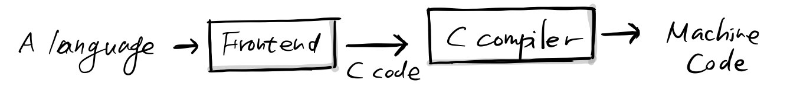

“그렇다고 컴파일러 컴포넌트를 재사용하는 방법이 아주 없는 것은 아니야. 좋은 예는 아니지만, 프런트엔드에서는 무조건 C 언어를 생성하면 옵티마이저와 백엔드는 그냥 기존 C 컴파일러를 사용할 수 있지.

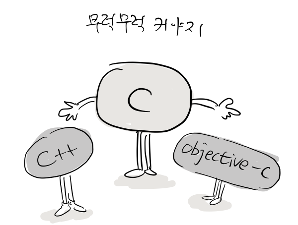

초기 C++과 Objective-C가 이런식으로 구현되었어.”

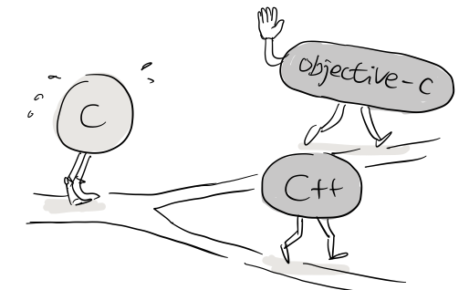

“이방식의 단점은 쉽게 개발할 수 있지만, 예외 처리를 구현하기 어렵고, 디버깅이 복잡하고, 사실상 두번 컴파일하니까 성능도 떨어져. 무엇보다도 새로 만드는 언어의 특정 기능을 C언어로 표현할 수 없다면 이런 방식은 쓸모가 없지.”

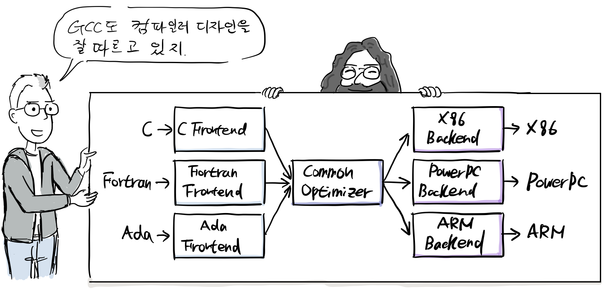

“네이티브 언어만 지원하긴 하지만 GCC도 여러모로 앞서 이야기한 컴파일 디자인을 잘 따르고 있어. 사실 처음에는 C언어만 지원했지만, Fortran, C++, Objective-C, Ada, Go, D 언어와 X86, PowerPC, ARM 등 다양한 아키텍처를 지원하면서 위와 같은 컴파일러 디자인 모델을 따르려고 끊임없이 개선을 해왔지.”

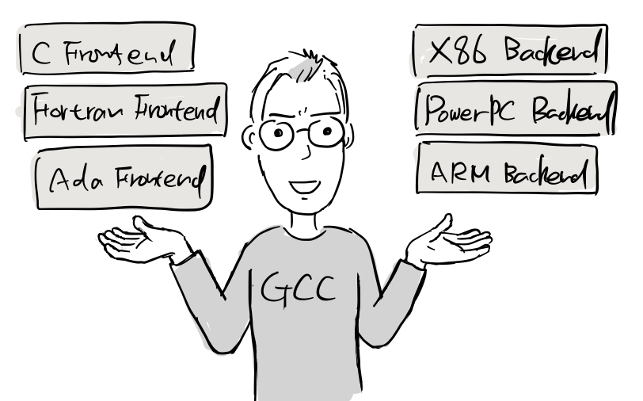

“이러한 디자인 덕분에 GCC와 같은 컴파일러는 프론트엔드에서 다양한 언어를 지원하고 백엔드에서는 여러 CPU 아키텍처로 기계어 코드를 생성하지”

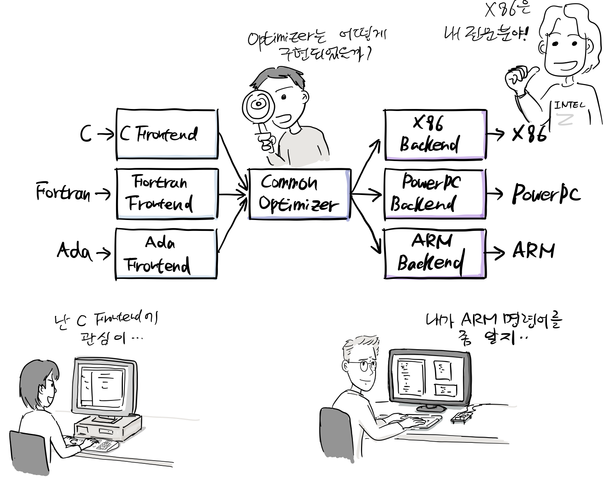

“사실 이렇게 단계를 나누면 여러 사람이 각자의 관심에 맞게 원하는 부분에 기여를 할 수 있고, 쉽게 새로운 언어와 아키텍처를 지원할 수 있지. GCC가 이러한 컴파일 디자인 덕을 많이 봤어”

“그럼에도 불구하고, GCC는 내가 원하는 방식의 컴파일러는 아니야?”

“문제가 뭔데?”

### GCC의 문제

“문제는 GCC 컴파일러는 단일 프로그램으로 구현되어 있어서, 다른 애플리케이션에서 GCC 전체 또는 일부 모듈만 따로 가져와 사용하는 것이 거의 불가능하지..”

“물론, 스크립트 언어도 다른 애플케이션에 쉽게 런타임을 임베딩할 수 있지만, 역시 파서와 같은 일부 기능을 떼어내서 다른 프로그램에서 사용할 방법은 없어.”

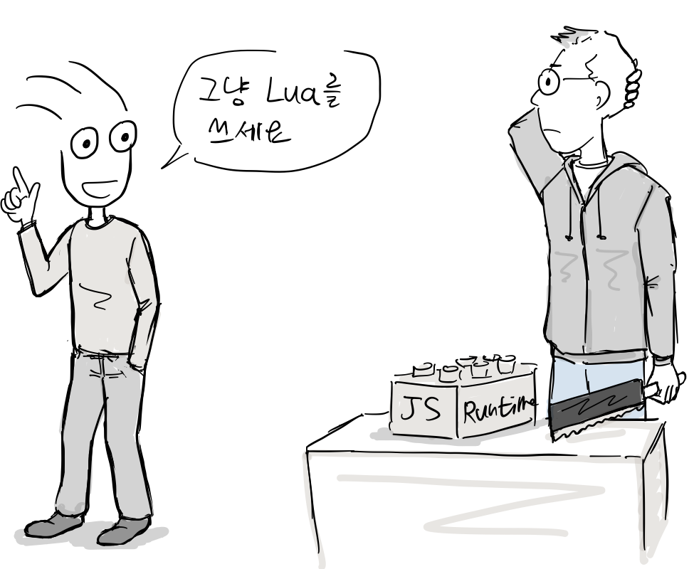

“여러 게임엔진에서 [루아(Lua)](https://ko.wikipedia.org/wiki/%EB%A3%A8%EC%95%84_\(%ED%94%84%EB%A1%9C%EA%B7%B8%EB%9E%98%EB%B0%8D_%EC%96%B8%EC%96%B4\))라는 스크립트 언어를 지원하는데, C언어와 유사하거든. 그런데, 바닥 부터 다시 만든거야. 아마 GCC를 가져다 붙이기에는 어려웠겠지?”

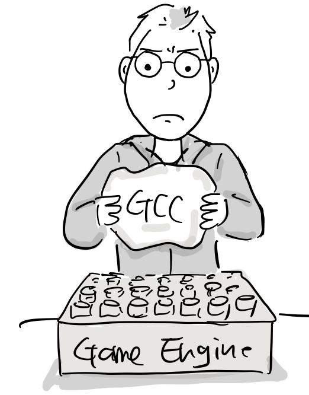

“맞아, 왜냐하면 GCC를 게임 엔진에 라이브러리 형태로 통합하거나 어떤 언어의 런타임이나 JIT 컴파일러로 사용할 수 없어”

“만약 GCC에서 C/C++ 파서만 떼어내서 라이브러리 형태로 사용할 수 있으면 [정적 프로그램 분석](https://ko.wikipedia.org/wiki/%EC%A0%95%EC%A0%81_%ED%94%84%EB%A1%9C%EA%B7%B8%EB%9E%A8_%EB%B6%84%EC%84%9D)(static program analysis), 코드 인덱싱, [리팩터링](https://ko.wikipedia.org/wiki/%EB%A6%AC%ED%8C%A9%ED%84%B0%EB%A7%81) 툴은 쉽게 만들 수 있을거야”

“왜 안되는데”

“일단, GCC는 전역변수를 많이 사용하고 데이터 구조가 부실하게 설계되어 있어.”

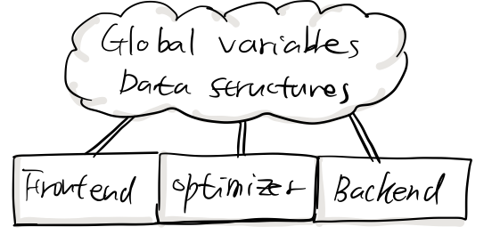

“코드 사이즈가 크기도 하고, 컴파일을 줄이기 위해 내부적으로 매크로를 많이 사용하고 있지. 그래서 일부 기능을 분리하거나 라이브러리 형태로 빌드할 수 없어.”

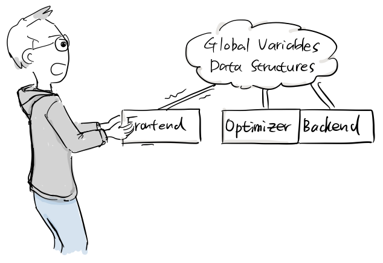

“게다가 워낙 오래된 프로젝트라서 앞에서 소개한 것 처럼 3 단계가 딱 떨어지게 구현된게 아닌거든. 예를 들어 백엔드는 프런트엔드에 있는 AST를 거쳐 디버그 정보를 생성하고, 프론트엔드에서 백엔드에서 필요한 데이터 구조를 생성하기도 하지.”

“또한 전체 컴파일러는 명령어 인터페이스에 설정한 전역 데이터 구조에 의존적이야.”

### 컴파일러 인프라스트럭처

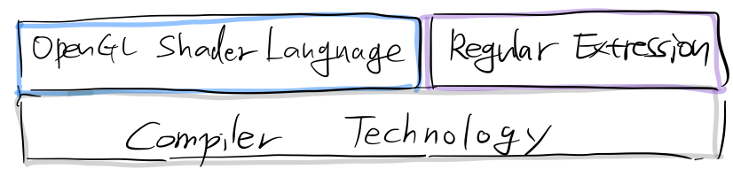

”사실 [OpenGL 셰이더(shader) 언어](https://ko.wikipedia.org/wiki/GLSL), 정규 표현식 처리에도 컴파일 기술이 필요하지. 이런 부분은 기존 컴파일러들이 신경도 안쓰고 있어.”

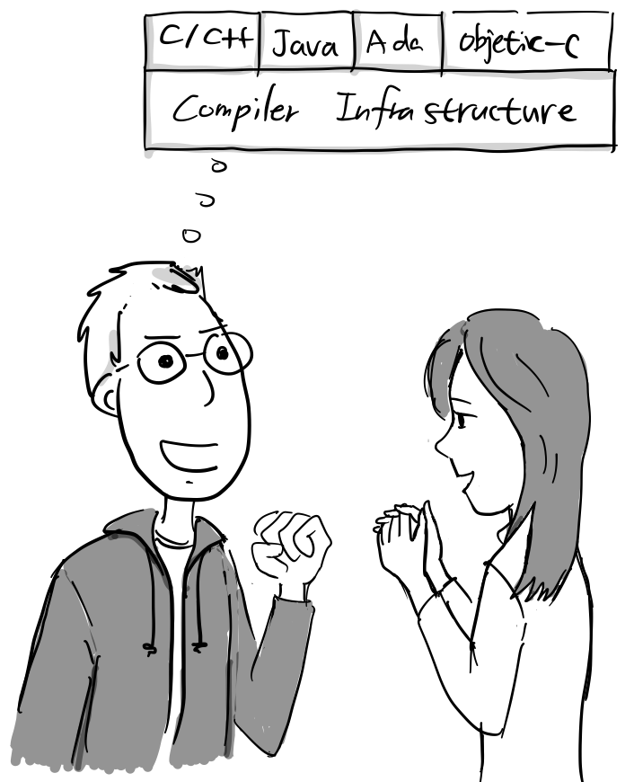

“하나의 컴파일 인프라스트럭처를 잘 만들어 놓으면 모든 컴퓨터 언어에서 같은 컴파일러 기능을 공유할 수 있는 방법이 있을텐데.. 내가 한번 만들어보려고해..”

“음 아이디어가 좋은데, 나도 돕고 싶다.”

탄야 래트너(Tanya Lattner)는 원래 전자공학을 전공했지만, 이후 그의 논문을 리뷰해주면서 컴파일 기술을 접하게 되고, 같은 대학 석사과정에 입학하여 함께 LLVM 연구와 개발을 도왔다. 테스트를 작성했으며 LLVM이 오픈소스 프로젝트로 자리잡는데 필요한 메일링 리스트, 홈페이지, SVN, 릴리스, LLVM개발 미팅을 도왔다.

[2편](https://joone.net/2023/01/19/50-llvm-%ed%94%84%eb%a1%9c%ec%a0%9d%ed%8a%b8-2-2/)에서 계속됩니다.

### 참고

\[1\] https://en.wikipedia.org/wiki/LLVM

\[2\] Christ Lattner’s Homepage, http://www.nondot.org/sabre/

\[3\] [Interview with LLVM Foundation President Tanya Lattner](https://www.youtube.com/watch?v=vXHeHJY3CXI)

\[4\] [LLVM](https://www.aosabook.org/en/llvm.html), The architecture of open source applications, aosabook.org

\[5\] [LLVM + Gallium3D: Mixing a Compiler With a Graphics Framework](https://people.freedesktop.org/~marcheu/fosdem09-g3dllvm.pdf)

\[6\] [\[llvm-dev\] Introduction: DirectX Shader Compiler and LLVM](https://lists.llvm.org/pipermail/llvm-dev/2017-January/109613.html)

\[7\] LLVM/GCC Integration Proposal, [GCC mailing list](https://gcc.gnu.org/legacy-ml/gcc/2005-11/msg00888.html), 2005

\[8\] Re: LLVM/GCC Integration Proposal, [GCC mailing list](https://gcc.gnu.org/legacy-ml/gcc/2005-11/msg00918.html), 2005

\[9\] Apple Originally Tried To Give GPL’ed LLVM To GCC https://forums.freebsd.org/threads/apple-originally-tried-to-give-gpled-llvm-to-gcc.44533/

https://www.phoronix.com/news/MTU4MzE

\[10\] Apple’s Selective Contributions to GCC, [lwn.net](https://lwn.net/Articles/405417/), 2010
