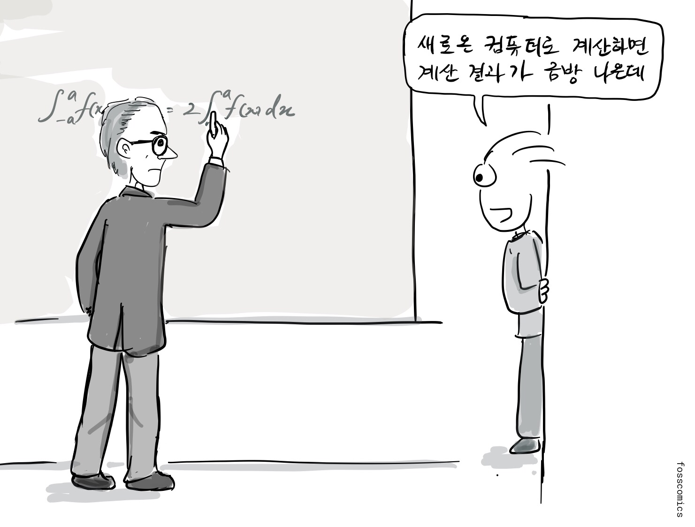
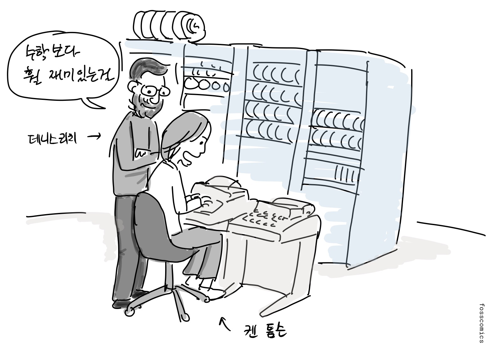
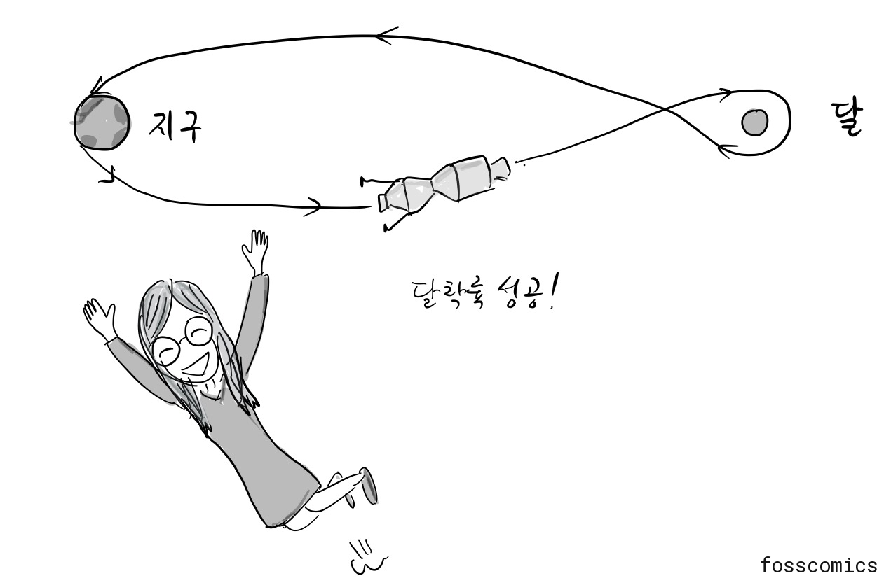
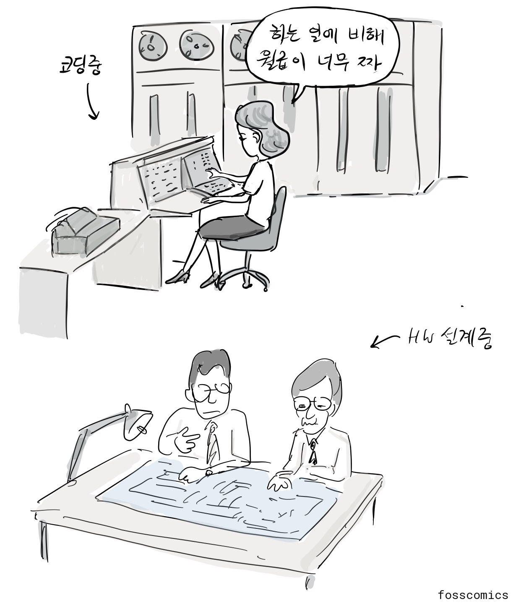
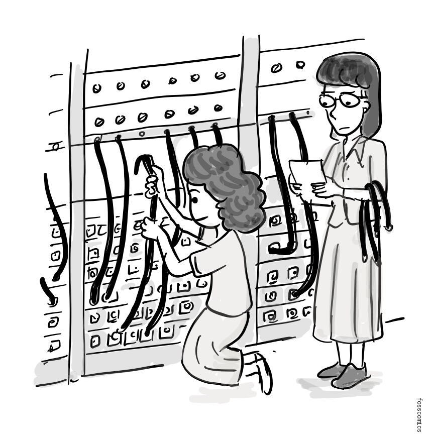
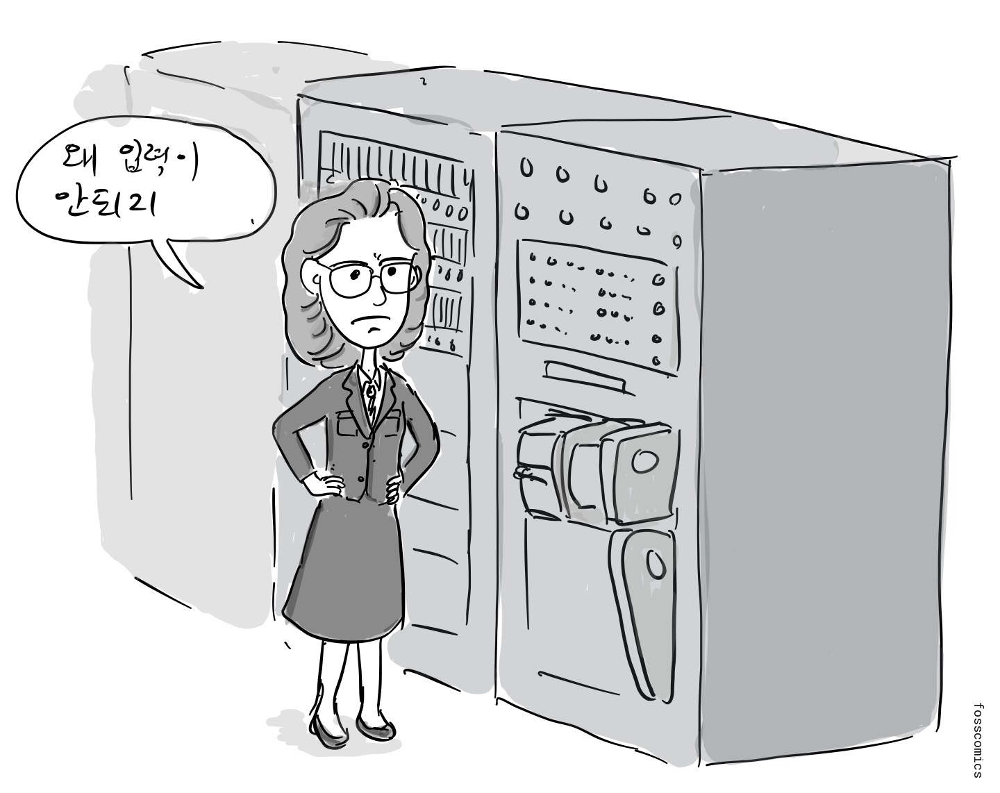
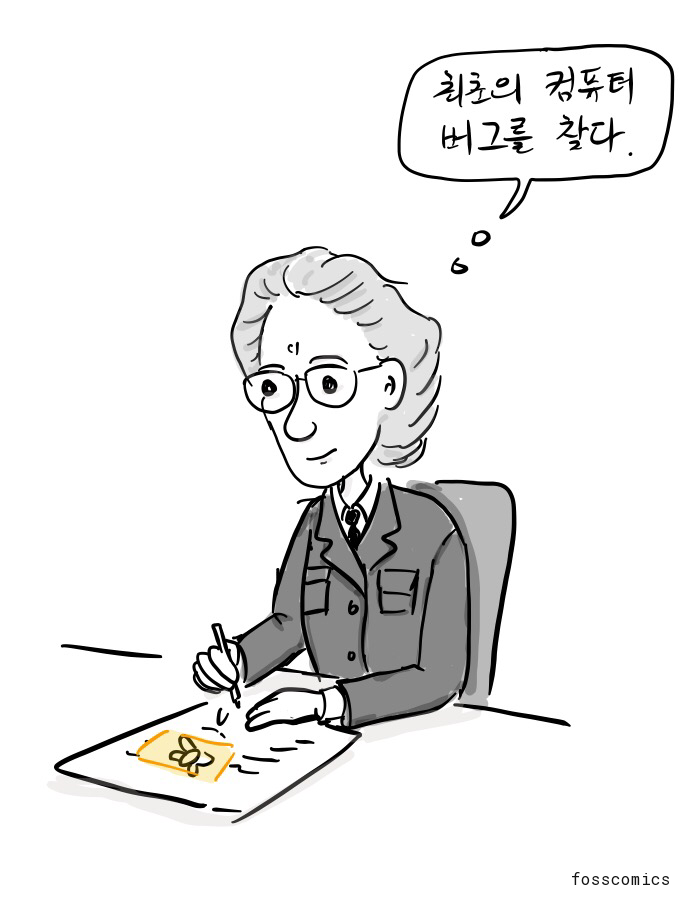

1960년대까지 컴퓨터 공학의 중심은 하드웨어였다. 컴퓨터와 주변 기기는 방 하나를 가득 채울 만큼 컸고, 값이 비쌌으며, 운영에도 많은 인력이 필요했다. 소프트웨어는 아직 독립된 공학 분야로 널리 인정받지 못했다.

> "설치끝!" \
> "어떻게 프로그래밍을 해야하나?"

초기 컴퓨팅에서 수학은 중심적인 역할을 했고, 많은 초기 프로그래머가 수학을 전공했다.

> "새로운 컴퓨터로 계산하면 계산 결과가 금방 나오지"

과학자와 공학자도 종이에서 하던 계산과 실험을 컴퓨터로 옮기기 위해 프로그래밍을 배웠다. 그중에는 프로그래밍에 깊이 빠져 아예 프로그래머를 직업으로 삼은 사람도 있었다.

> "수학 보다 훨 재미있는걸"

C와 유닉스를 만든 데니스 리치는 대학에서 물리학과 응용수학을 공부했다.

[마거릿 해밀턴](https://ko.wikipedia.org/wiki/마거릿_해밀턴_\(과학자\))은 대학에서 수학을 공부한 뒤 MIT에 들어가 날씨 예측 소프트웨어를 만들었고, 이후 SAGE 방공 프로젝트에 참여했다. 남편이 하버드 로스쿨에 다니는 동안 생계를 돕기 위해 프로그래밍 일을 시작했다. 당시에는 컴퓨터 과학과 소프트웨어 공학을 정규 과정에서 배우기 어려웠기 때문에 프로그래머들은 대부분 실무를 통해 일을 익혔고, 소프트웨어 개발도 기존 공학 분야만큼 진지하게 받아들여지지 않았다.

> "당시에는 컴퓨터 과학과 소프트웨어 공학의 정규 교육과정이 아니었죠. 그래서 프로그래머들은 실무 경험을 통해 일을 배워야 했어요."

해밀턴은 시스템 프로그래밍 전문가가 된 뒤 MIT Instrumentation Laboratory에 합류했다. 그곳에서 아폴로 사령선과 달 착륙선의 탑재 비행 소프트웨어를 개발한 Software Engineering Division을 이끌었다. 해밀턴의 회고에 따르면 처음에는 소프트웨어를 위한 별도의 예산이나 일정이 없었고, 요구 사항에도 소프트웨어가 명시되지 않았다. 하지만 소프트웨어는 우주선과 달 착륙선을 제어하는 데 꼭 필요했다. 해밀턴은 주말에 일하면서 딸을 사무실에 데려오기도 했다[1].

> "엄마 집에 언제가요?" \
> "다 끝났어 이제 가자"

1960년대 말에는 아폴로 유도·소프트웨어 작업에 수백 명이 참여했으며, 흔히 약 400명으로 집계된다[1]. 1969년 아폴로 11호는 달 착륙에 성공했다.

> "달착륙 성공!"

해밀턴은 소프트웨어도 하드웨어 공학과 같은 전문적 위상을 가져야 한다고 주장하며 `소프트웨어 공학`이라는 용어를 널리 알렸다. 그가 이 용어를 처음 만들었는지를 두고는 자료마다 설명이 다르지만, 이 개념을 정착시키는 데 기여했다[4].

> "소프트웨어 공학!"

초기 프로그래머 가운데는 여성이 많았다. 프로그래밍은 상당한 수학·기술 능력이 필요한 일이었지만, 사무직이나 단순 작업으로 분류되어 하드웨어 공학보다 낮은 임금을 받는 경우가 많았다[2]. 프로그래밍의 위상과 임금이 높아지면서 채용 관행과 성 역할에 대한 기대는 점차 남성을 선호하는 방향으로 바뀌었다.

> "하는 일에 비해 월급이 너무 작아"

에니악에 처음 배정된 프로그래머 여섯 명은 모두 여성이었다[3].

수학 박사였던 [그레이스 호퍼](https://ko.wikipedia.org/wiki/그레이스_호퍼)는 선구적인 프로그래머로, 훗날 초기 컴파일러 가운데 하나를 개발했다. 1947년 호퍼가 하버드 Mark II 팀에서 일하던 중 컴퓨터에 문제가 생겼다.

> "왜 입력이 안되지?"

팀은 기계의 릴레이 가운데 하나에 나방이 끼어 있는 것을 발견했다.

> "릴레이 안에 나방이 죽어 있네"

팀은 나방을 로그북에 붙이고 `First actual case of bug being found`라고 적었다. 기술적 결함을 뜻하는 `bug`라는 말은 이 사건보다 훨씬 전부터 쓰였지만, 호퍼와 Mark II 팀은 컴퓨팅 분야에서 `bug`와 `debugging`이라는 말을 널리 알리는 데 기여했다[5].

> "최초의 컴퓨터 버그를 찾다."

이처럼 여성들은 초기 프로그래밍에서 선구적인 역할을 했고, 소프트웨어 공학의 토대를 세우는 데 기여했다.

## 참고 자료

1. [Her Code Got Humans on the Moon—And Invented Software Itself](https://www.wired.com/2015/10/margaret-hamilton-nasa-apollo/), Wired
2. [Computer Programming Used To Be Women's Work](http://www.smithsonianmag.com/smart-news/computer-programming-used-to-be-womens-work-718061/), Smithsonian Magazine
3. [How Female ENIAC Programmers Pioneered the Software Industry](https://web.archive.org/web/20160716023848/https://iq.intel.com/how-female-eniac-programmers-pioneered-the-software-industry/), Intel iQ
4. [Margaret Hamilton's Apollo Code](https://science.nasa.gov/people/margaret-hamilton/), NASA
5. [Log Book With Computer Bug](https://americanhistory.si.edu/collections/object/nmah_334663), Smithsonian National Museum of American History

[1]: https://www.wired.com/2015/10/margaret-hamilton-nasa-apollo/ "Her Code Got Humans on the Moon—And Invented Software Itself, Wired"
[2]: http://www.smithsonianmag.com/smart-news/computer-programming-used-to-be-womens-work-718061/ "Computer Programming Used To Be Women's Work, Smithsonian Magazine"
[3]: https://web.archive.org/web/20160716023848/https://iq.intel.com/how-female-eniac-programmers-pioneered-the-software-industry/ "How Female ENIAC Programmers Pioneered the Software Industry, Intel iQ"
[4]: https://science.nasa.gov/people/margaret-hamilton/ "Margaret Hamilton's Apollo Code, NASA"
[5]: https://americanhistory.si.edu/collections/object/nmah_334663 "Log Book With Computer Bug, Smithsonian National Museum of American History"