Until the 1960s, software was largely treated as part of the hardware. Computers and their peripherals filled entire rooms, were expensive, and required considerable money and staff to operate. Software was not yet widely recognized as an engineering discipline in its own right.

> "Installation done!"

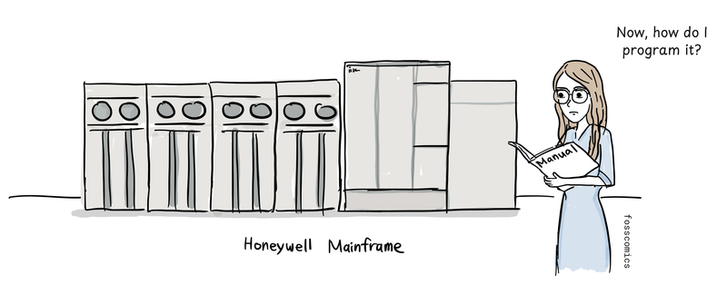
> "Now, how do I program it?"

Mathematics played a central role in early computing, so students studying mathematics often found their way into programming.

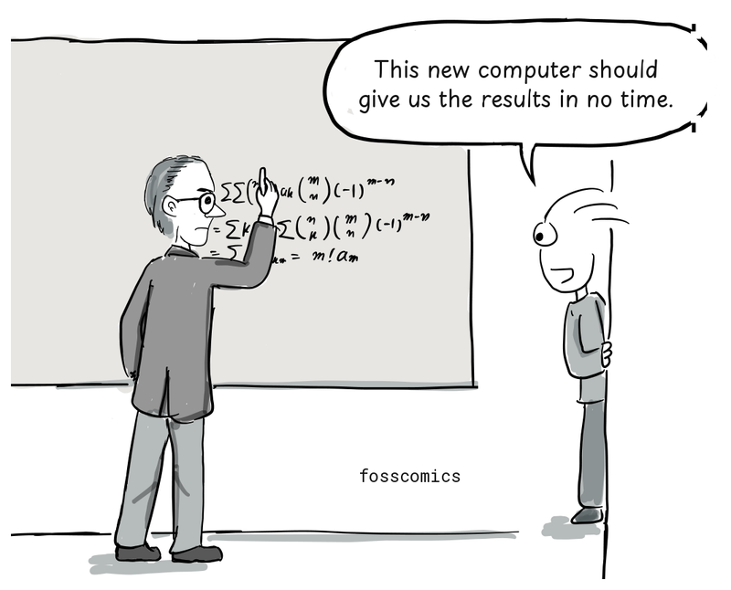
> "This new computer should give us the results in no time."

People studying science or engineering also learned to program, since computers could perform calculations and experiments that had previously been done by hand. Some became so absorbed in programming that they made it their profession.

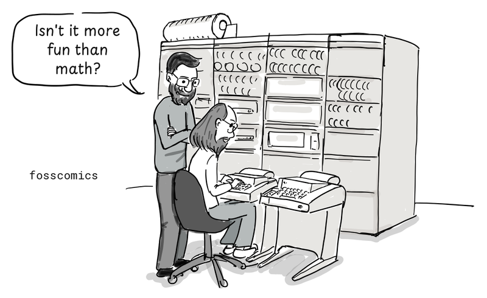
> "Isn't it more fun than math?"

Dennis Ritchie, who helped create Unix and the C programming language, studied physics and applied mathematics at university.

The story of [Margaret Hamilton](https://en.wikipedia.org/wiki/Margaret_Hamilton_\(software_engineer\)), who worked on the Apollo program in the 1960s, offers a glimpse of how software was developed and regarded at the time. After studying mathematics at university, she began working as a programmer at MIT to support her husband's studies.

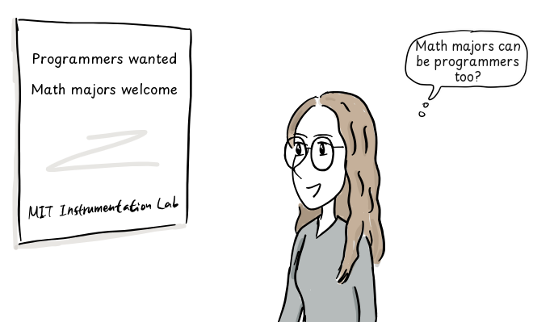
> "Math majors can be programmers too?"

She first developed weather prediction software with meteorologist Edward Lorenz, then worked on the SAGE air-defense project. Formal courses in computer science and software engineering were hard to find, so programmers mostly learned on the job. Software development was also not taken as seriously as the established engineering disciplines.

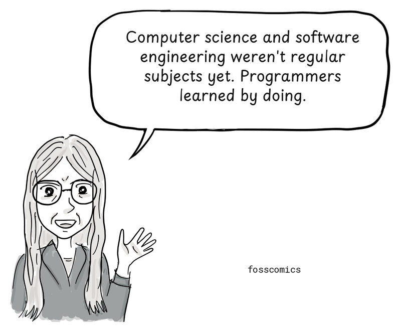
> "Computer science and software engineering weren't regular subjects yet. Programmers learned by doing."

After becoming an expert in systems programming, Hamilton joined MIT's Instrumentation Laboratory. There she led the Software Engineering Division, whose team developed onboard flight software for Apollo's command and lunar modules[&lbrack;4&rbrack;][4]. Software had initially been overlooked in Apollo's budgets, schedules, and requirements[&lbrack;1&rbrack;][1]. Yet it played a critical role in controlling the spacecraft and lunar lander. Hamilton sometimes brought her daughter to work on weekends as she worked to make the software more reliable.

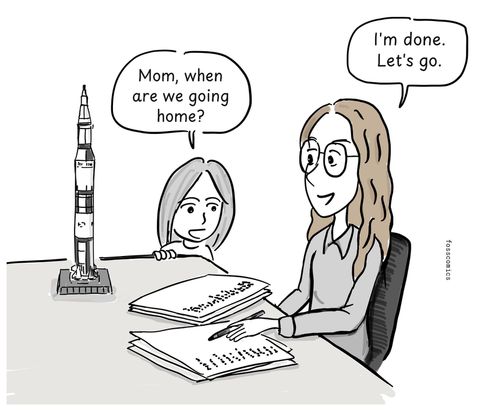
> "Mom, when are we going home?" \
> "I'm done. Let's go."

By the late 1960s, the Apollo guidance and software effort had grown to hundreds of people, often summarized as roughly 400 contributors[&lbrack;1&rbrack;][1]. In 1969, Apollo 11 successfully landed on the Moon.

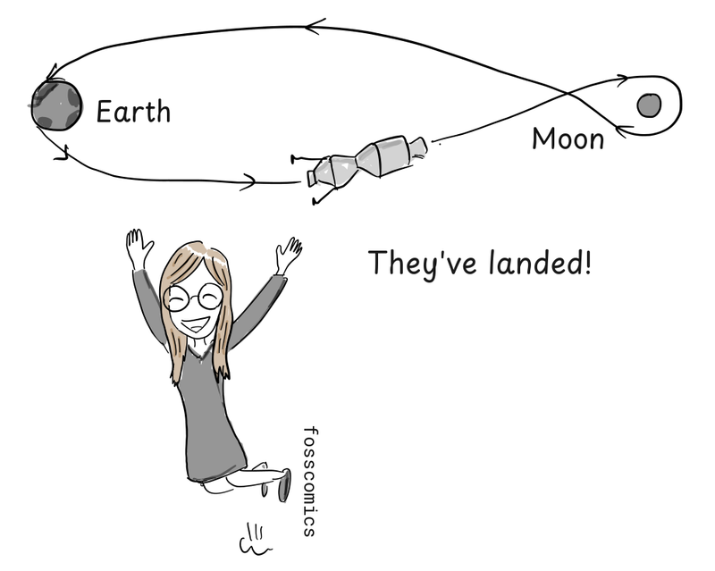
> "Moon landing success!"

Hamilton argued that software should have the same professional standing as other engineering disciplines and helped popularize the term "software engineering." Sources differ on whether she coined the term, but she helped establish the concept[&lbrack;4&rbrack;][4].

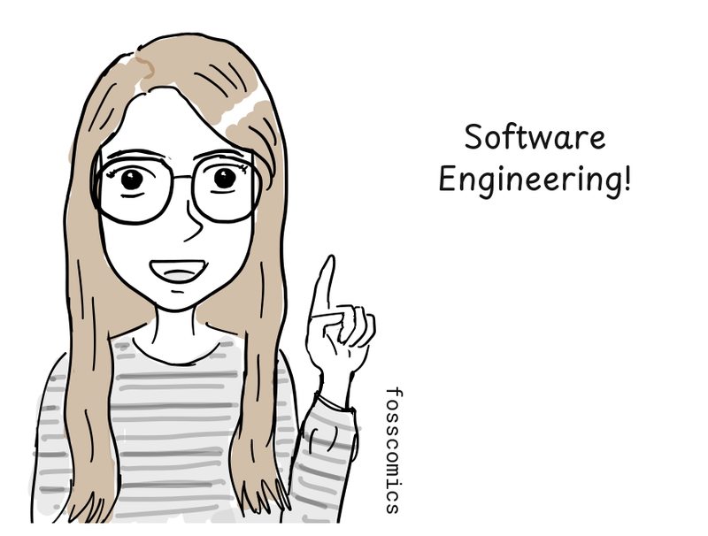
> "Software Engineering!"

Many early software developers were women, a striking contrast with today's male-dominated field. Programming was often considered less important than hardware development, assigned to women, and poorly paid[&lbrack;2&rbrack;][2]. This helps explain why so many photographs of early computers show women working at them.

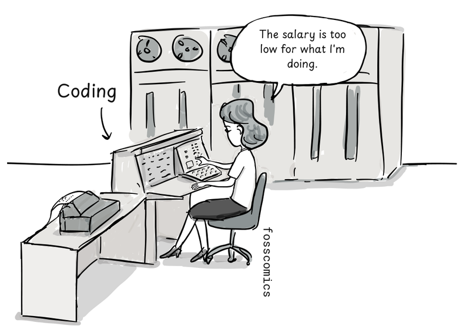
> "The salary is too low for what I'm doing."

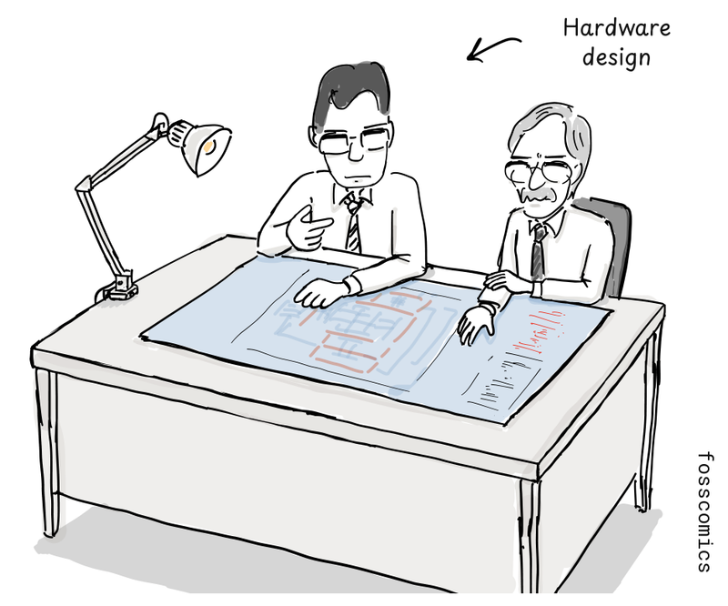

The six programmers originally assigned to ENIAC were all women[&lbrack;3&rbrack;][3].

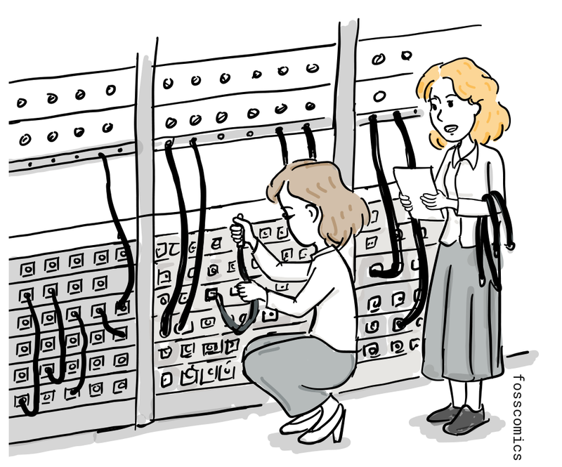

[Grace Hopper](https://en.wikipedia.org/wiki/Grace_Hopper) held a doctorate in mathematics and became a pioneering programmer who later developed one of the earliest compilers. In 1947, she was working with the [Harvard Mark II](https://en.wikipedia.org/wiki/Harvard_Mark_II) team when the machine began malfunctioning.

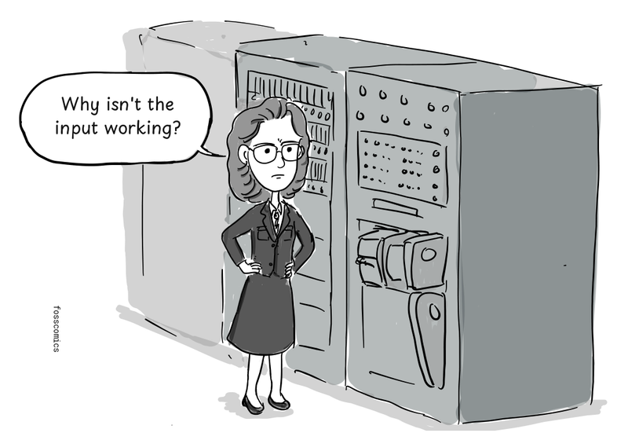
> "Why isn't the input working?"

The team found a moth trapped in one of the machine's relays.

> "There's a dead moth inside the relay."

They taped the moth into the logbook with the note "First actual case of bug being found." Engineers had used the word "bug" for technical faults long before this incident, but Hopper and the Mark II team helped popularize "bug" and "debugging" in computing[&lbrack;5&rbrack;][5].

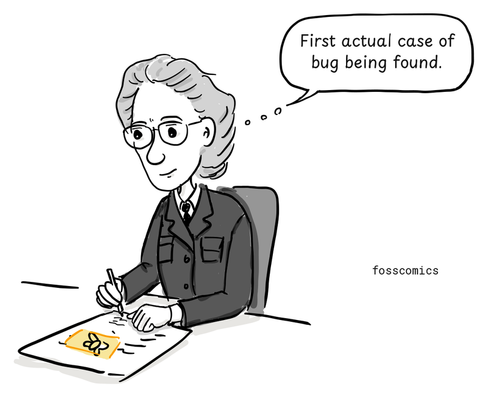
> "First actual case of bug being found."

Women played a pioneering role in early programming and helped lay the foundations of software engineering.

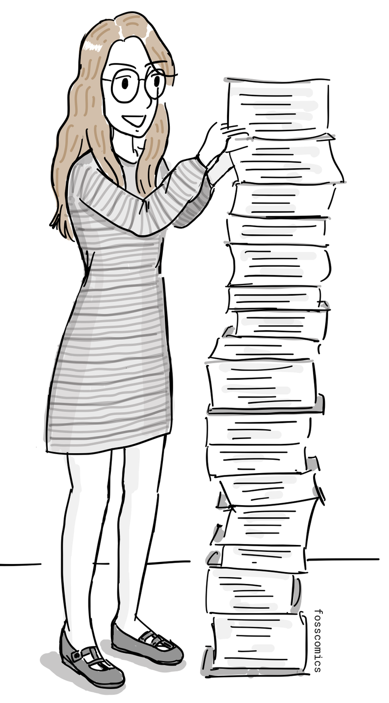

## References

1. Her Code Got Humans on the Moon—And Invented Software Itself, [wired.com](https://www.wired.com/2015/10/margaret-hamilton-nasa-apollo/)
2. Computer Programming Used To Be Women’s Work, [Smithsonian Magazine](http://www.smithsonianmag.com/smart-news/computer-programming-used-to-be-womens-work-718061/)
3. How Female ENIAC Programmers Pioneered the Software Industry, [Intel iQ](https://web.archive.org/web/20160716023848/https://iq.intel.com/how-female-eniac-programmers-pioneered-the-software-industry/)
4. [Margaret Hamilton's Apollo Code](https://science.nasa.gov/people/margaret-hamilton/), NASA
5. [Log Book With Computer Bug](https://americanhistory.si.edu/collections/object/nmah_334663), Smithsonian National Museum of American History
6. [The Hidden Heroines of Chaos](https://www.quantamagazine.org/hidden-heroines-of-chaos-ellen-fetter-and-margaret-hamilton-20190520/), Quanta Magazine

[1]: https://www.wired.com/2015/10/margaret-hamilton-nasa-apollo/ "Her Code Got Humans on the Moon—And Invented Software Itself, wired.com"
[2]: http://www.smithsonianmag.com/smart-news/computer-programming-used-to-be-womens-work-718061/ "Computer Programming Used To Be Women’s Work, Smithsonian Magazine"
[3]: https://web.archive.org/web/20160716023848/https://iq.intel.com/how-female-eniac-programmers-pioneered-the-software-industry/ "How Female ENIAC Programmers Pioneered the Software Industry, Intel iQ"
[4]: https://science.nasa.gov/people/margaret-hamilton/ "Margaret Hamilton's Apollo Code, NASA"
[5]: https://americanhistory.si.edu/collections/object/nmah_334663 "Log Book With Computer Bug, Smithsonian National Museum of American History"
