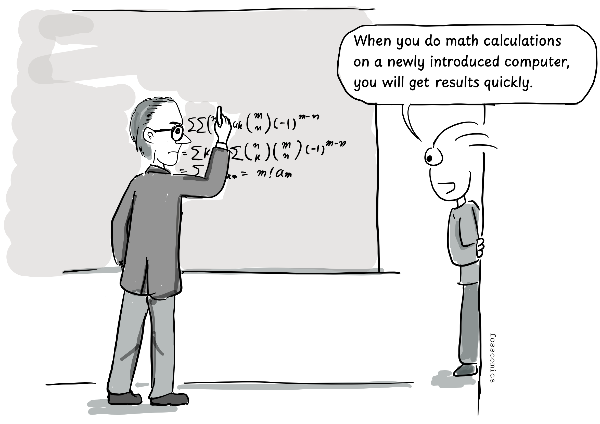
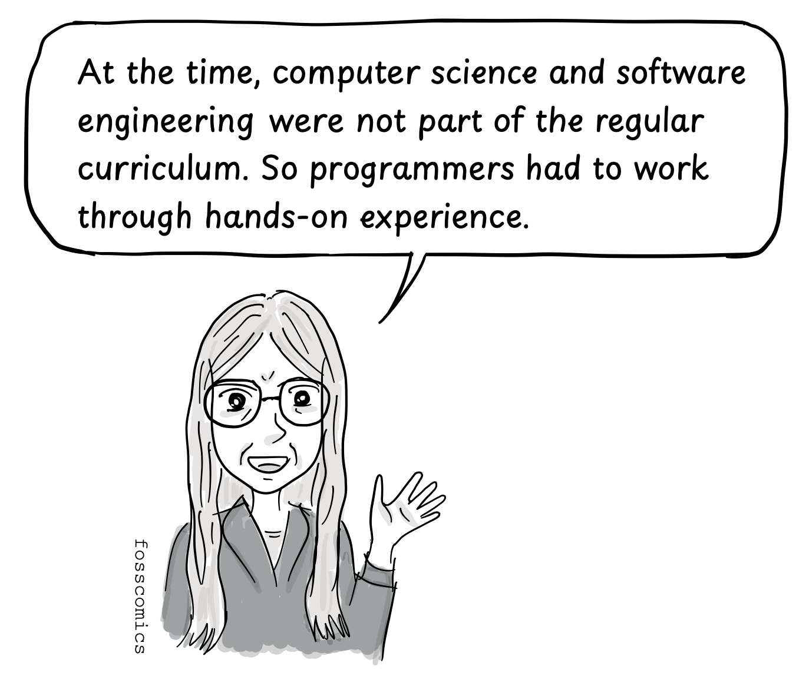
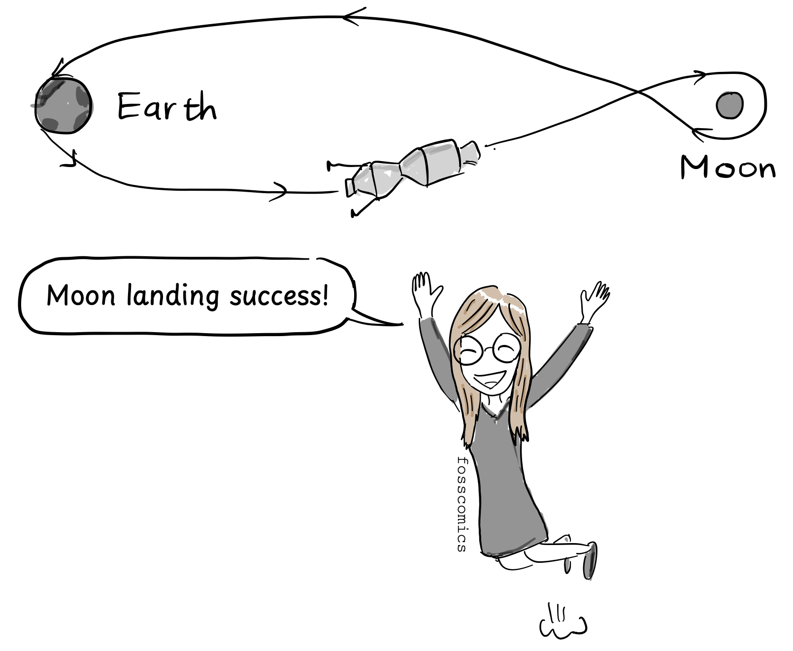
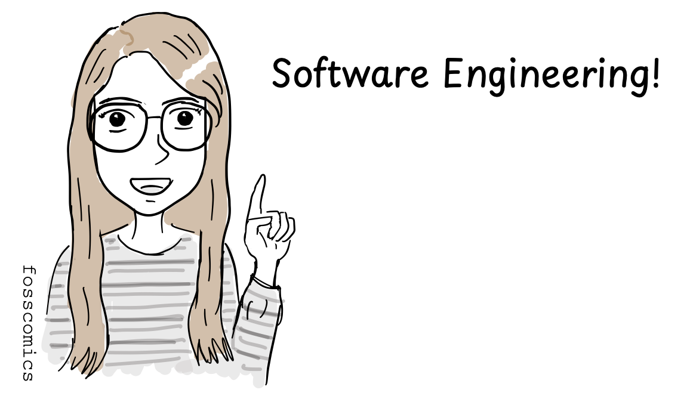
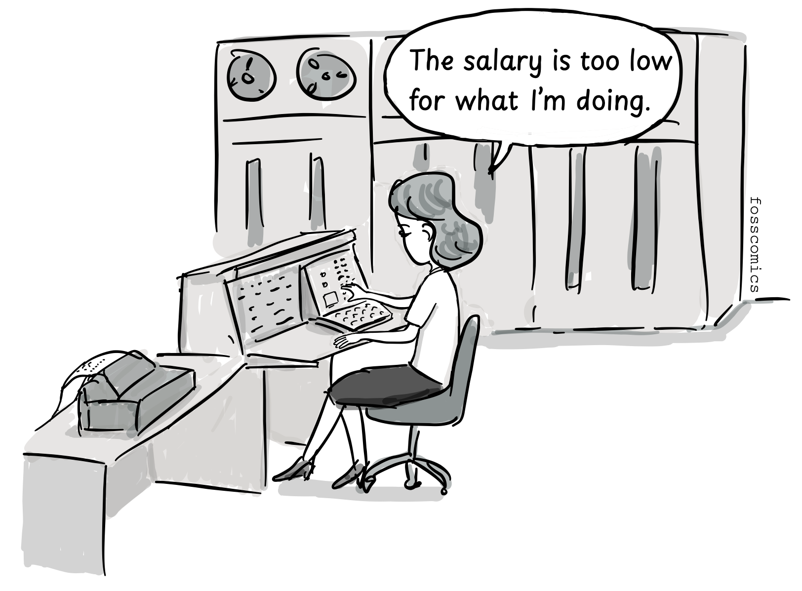
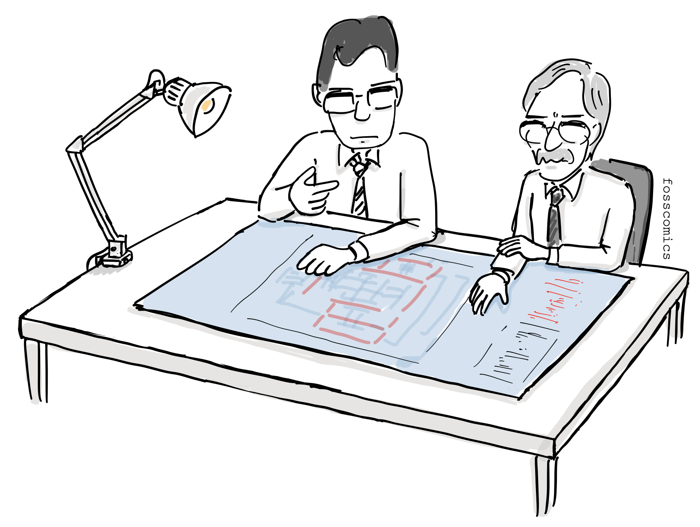
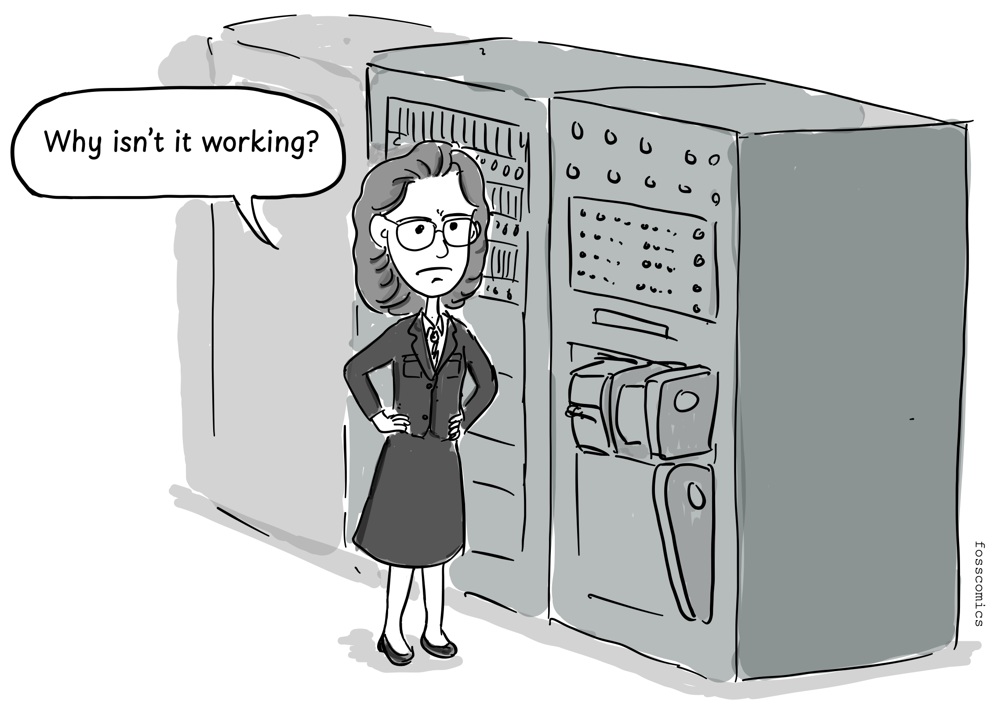
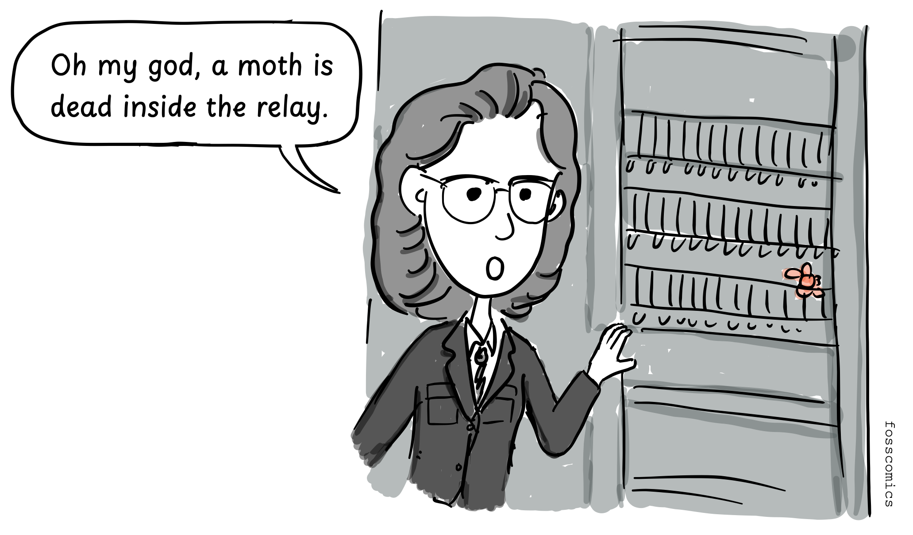
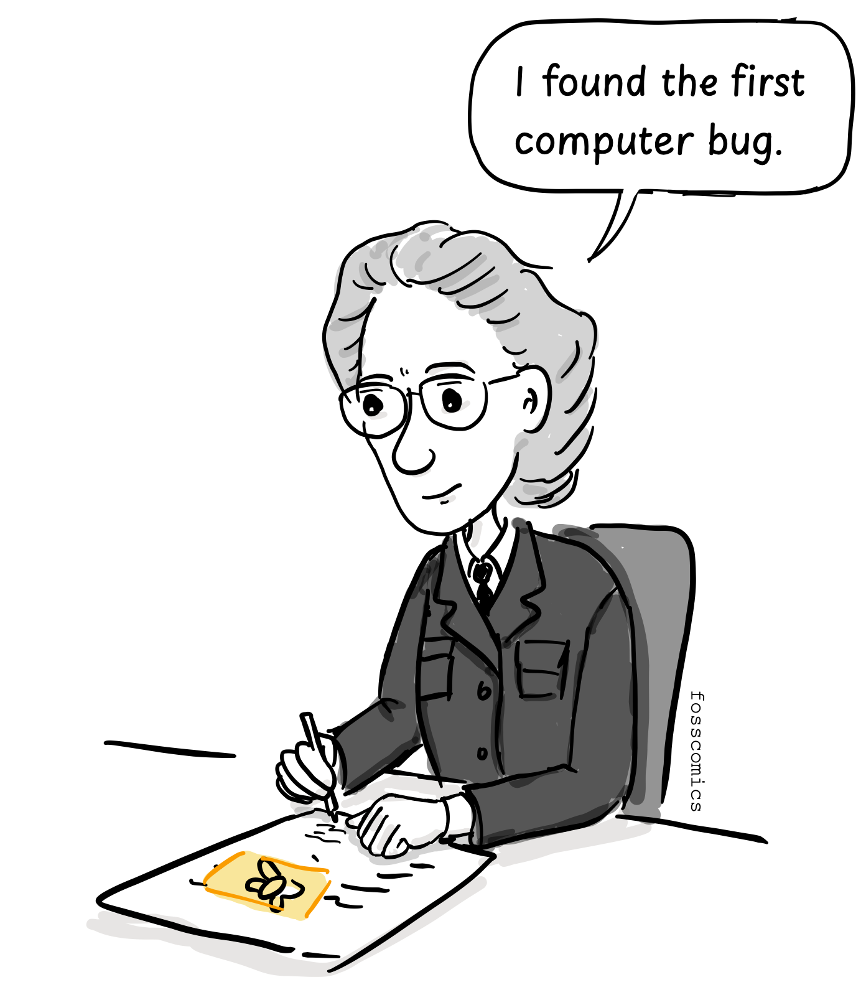

Until the 1960s, hardware was the main focus of computer engineering. Computers and peripheral devices were large machines that filled big rooms, they were costly and required manpower to operate. Unlike today, software back then was not a separate field of engineering or science

> “Installation done!” \
> “Hmm, how can I program it?

Mathematicians were involved in the invention of early computers so it was easy for students majoring in mathematics to approach computer programming in the early days.

> “When you do math calculations on a newly introduced computer, you will get results quickly.”

People who majored in science or engineering learned programming because they could do mathematical calculations and various experiments with computers that were previously done manually.  Some of them fell in love with programming and changed their jobs as programmers.

> "Isn't it more fun than math?"

Dennis Ritchie, creator of C and Unix, originally studied physics and applied mathematics in university.

According to the story of [Margaret Hamilton](https://www.google.com/url?q=https://en.wikipedia.org/wiki/Margaret_Hamilton_\(software_engineer\)\&sa=D\&source=editors\&ust=1711344782241302\&usg=AOvVaw0bBc1TYrN-WqSclV4FS9H8), who participated in the Apollo 11 mission in the 1960s and developed the lunar lander software, software development was not taken seriously as engineering and was not even considered a science.

[Margaret Hamilton](https://www.google.com/url?q=https://en.wikipedia.org/wiki/Margaret_Hamilton_\(software_engineer\)\&sa=D\&source=editors\&ust=1711344782241610\&usg=AOvVaw0RDR6qlOSVo4LMEctuVd0y), participated in the Apollo 11 mission in the 1960s and developed the lunar landing software. Notably she observed that software development was not taken as seriously as engineering and was not even considered a science.

After studying mathematics in university, she began working as a programmer at MIT to support her husband's Ph.D. At that time, without any proper software development training, she joined in the development of a program to predict the weather.

> “At the time, computer science and software engineering were not part of the regular curriculum. So programmers had to work through hands-on experience.”

Following this, she became a system programming expert and participated in the Apollo 11 mission. At the time, the Apollo 11 mission did not include any budget and schedule for software development, and there was no mention of software in the requirements[&lbrack;1&rbrack;][1] However, software was important enough to control the flight of the spacecraft and the lunar lander. Margaret took her daughter to the office on weekends to develop more reliable software.

> “Mom, when are we going home?” \
> “Just finished. Let's go now”

Eventually, in 1968, as many as 400 people participated in the development of the lunar lander software, and the Apollo 11 mission was successfully completed.

> "Moon landing success!"

In particular, she first used the term “software engineering” at the beginning of the Apollo missions so that software could be recognized as an independent domain like hardware. She also helped to create a course work about computer programming at MIT[&lbrack;4&rbrack;][4].

An interesting fact is that many software developers were women until the 1960s, but this is a significant difference compared to the current situation where men dominate the computer programming field. The reason is that at the time, software development was less important than hardware development, so women were mainly in charge, and they were also paid less than men[&lbrack;2&rbrack;][2]. If you look for black and white photos of early computers on the Internet, you can see a lot of women in front of the computers.

> “The salary is too low for what I’m doing”

All the people who did the programming by connecting the functional unit boards at ENIAC were women[&lbrack;3&rbrack;][3].

Grace Hopper, who created the first compiler and did the first debugging(?), is also a woman and a doctor of mathematics. In 1947, Hopper was working on programming with the [Mark II](https://www.google.com/url?q=https://en.wikipedia.org/wiki/Harvard_Mark_II\&sa=D\&source=editors\&ust=1711344782243847\&usg=AOvVaw3ByDRjzRpDHS4Qzy0FXlUZ). One day her punch card input was not working.

> “Why isn’t it working”

Eventually, she found out that the computer wasn't working properly because of the dead moth inside the relay.

> “Oh my god, a moth is dead inside the relay.”

And while attaching the moth to the workbook, she left a note saying that it was the first computer bug

> “I found the first computer bug([a picture from Wikipedia](https://en.wikipedia.org/wiki/Harvard_Mark_II%23/media/File:First_Computer_Bug,_1945.jpg)).

In the early days when computers were used, women played a pioneering role in software development and created the foundation for software engineering to be born.

## References

1. Her Code Got Humans on the Moon—And Invented Software Itself, [wired.com](https://www.wired.com/2015/10/margaret-hamilton-nasa-apollo/)
2. Computer Programming Used To Be Women’s Work, [Smithsonian Magazine](http://www.smithsonianmag.com/smart-news/computer-programming-used-to-be-womens-work-718061/)
3. How Female ENIAC Programmers Pioneered the Software Industry, [Intel iQ](https://web.archive.org/web/20160716023848/https://iq.intel.com/how-female-eniac-programmers-pioneered-the-software-industry/)
4. Margaret Hamilton, [wikipedia](https://en.wikipedia.org/wiki/Margaret\_Hamilton\_(scientist))

[1]: https://www.wired.com/2015/10/margaret-hamilton-nasa-apollo/ "Her Code Got Humans on the Moon—And Invented Software Itself, wired.com"
[2]: http://www.smithsonianmag.com/smart-news/computer-programming-used-to-be-womens-work-718061/ "Computer Programming Used To Be Women’s Work, Smithsonian Magazine"
[3]: https://web.archive.org/web/20160716023848/https://iq.intel.com/how-female-eniac-programmers-pioneered-the-software-industry/ "How Female ENIAC Programmers Pioneered the Software Industry, Intel iQ"
[4]: https://en.wikipedia.org/wiki/Margaret\_Hamilton\_(scientist) "Margaret Hamilton, wikipedia"