[1편](https://joone.net/2023/01/19/49-llvm-%ed%94%84%eb%a1%9c%ec%a0%9d%ed%8a%b8-1-2/)에서 이어집니다.

### LLVM 공개

크리스 래트너는 오랜 연구 끝에 2003년 LLVM(low level virtual machine)을 공개한다.

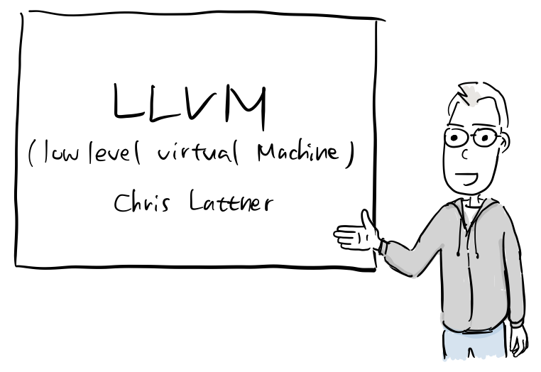

(참고로, 아래 발표는 논문 내용을 기반으로 구성한 것임을 알립니다.)

“안녕하세요. LLVM 프로젝트를 소개합니다. LLVM은 컴파일러의 프런트엔드와 백엔드를 개발하는데 필요한 기능을 제공하는 컴파일 인프라스트럭처입니다.”

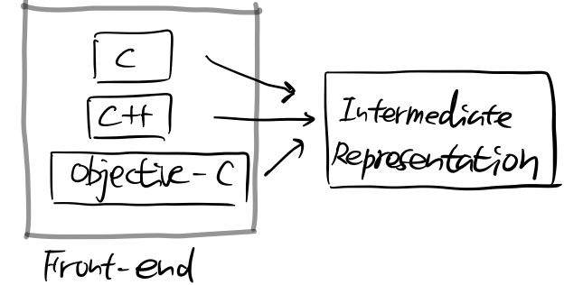

“기본적으로 프런트엔드에서 다양한 언어를 지원할 수 있고, 프런트엔드에서 처리된 결과가 언어에 독립적인 [중간 표현(intermediate representation )](https://en.wikipedia.org/wiki/Intermediate_representation)으로 나옵니다.”

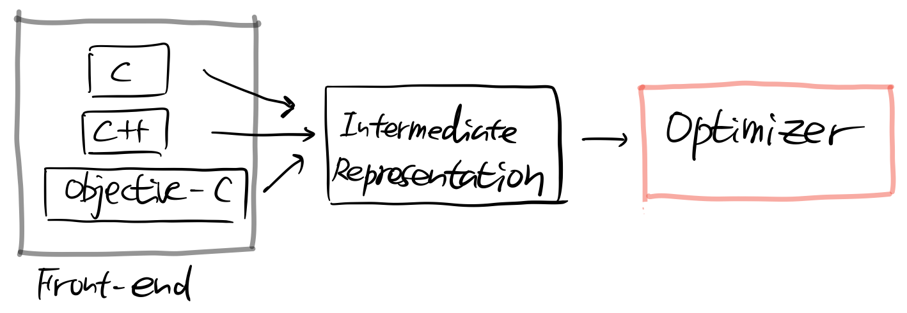

“이를 옵티마이저에서 최적화 하기 때문에 모든 프런트엔드가 같은 옵티마이저를 공유할 수 있습니다.”

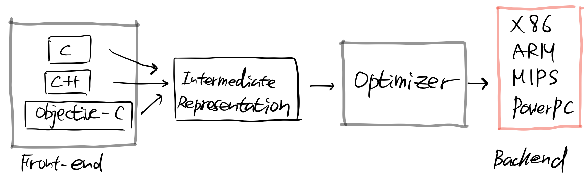

“백엔드에서는 다양한 컴퓨터 아키텍처를 지원합니다.”

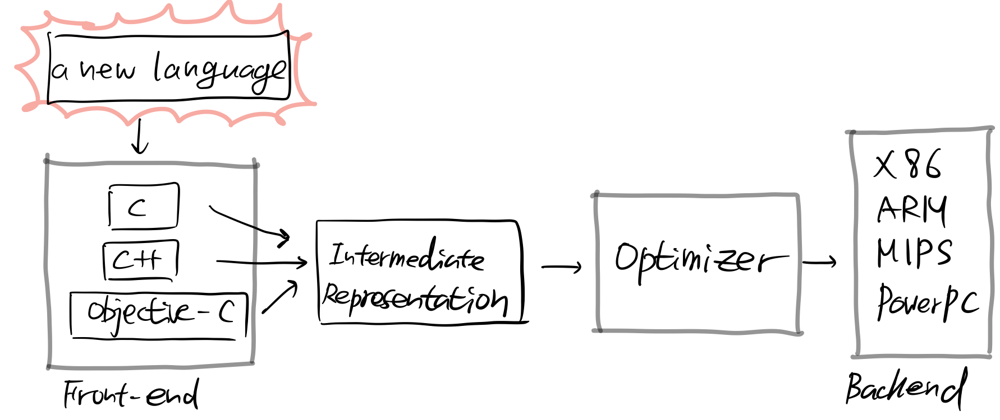

“기본적으로 프런트엔드만 구현하면 옵티마이저, 백엔드는 그대로 공유할 수 있습니다.”

“중간 표현이 무엇입니까? 좀 더 자세히 설명해줄 수 있나요?”

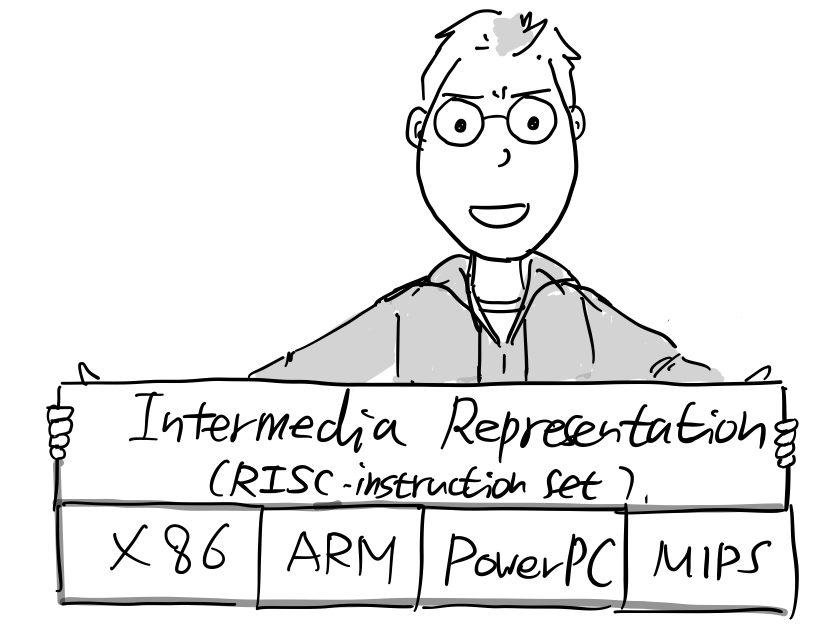

“중간 표현은 어셈블리어와 비슷한 저수준 프로그래밍 언어라고 할 수 있습니다. 특정 아키텍처를 표현한 것이 아니라 CPU 명령어 세부 사항을 추상화하여 타입이 있는 RISC 명령어(Reduced Instruction Set Computing) 셋으로 표현하였습니다.”

“LLVM은 가상머신에도 사용할 수 있나요?”

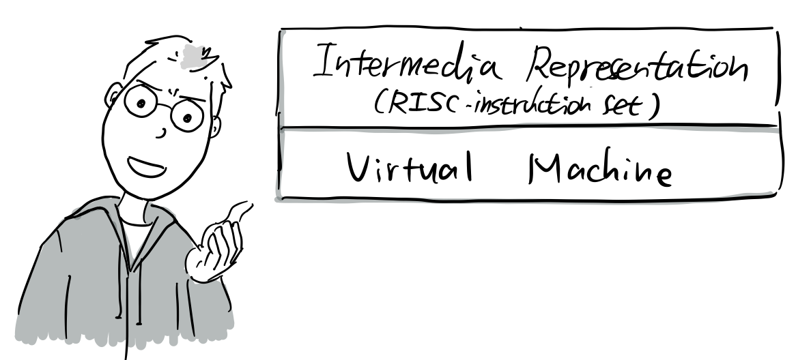

“물론입니다. 중간 표현을 VM이나 인터프리터가 실행할 수 있기 때문에 LLVM은 GCC와 같은 정적 컴파일러가 지원하지 못한 가상머신과 인터프리터 방식의 언어도 지원할 수 있습니다.”

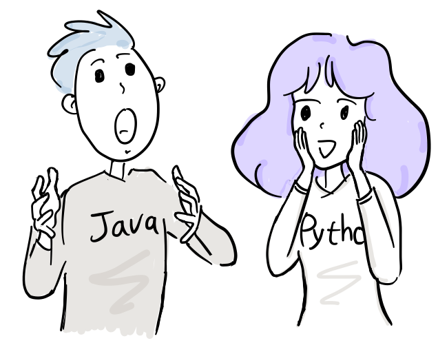

“그러면 중간 표현의 예를 간단한 데모와 함께 보여드리겠습니다.”

@.str = internal constant \[14 x i8\] c”hello, world\\0A\\00″

declare i32 @printf(i8\*, …)

define i32 @main(i32 %argc, i8\*\* %argv) nounwind {

entry:

%tmp1 = getelementptr \[14 x i8\], \[14 x i8\]\* @.str, i32 0, i32 0

%tmp2 = call i32 (i8\*, …) @printf( i8\* %tmp1 ) nounwind

ret i32 0

}

“먼저 LLVM 인터프리터로 위 중간 표현 코드를 실행해보겠습니다.”

$ lli hello.ll

hello, world

“어떠한 파일을 생성하지 않고 바로 중간 표현 코드를 실행해서 hello, world라는 문자열을 출력합니다.”

“이제는 중간표현 코드를 컴파일해서 오브젝트 코드를 생성하고 실행 파일을 만드는 과정입니다.”

$ llvm-as hello.ll && llc –filetype obj hello.bc && clang -o hello hello.o

$ ls

hello hello.bc hello.ll hello.o README.md

$ ./hello

hello, world

(참고로 초기에는 GCC 프런트엔드를 C/C++ 컴파일러로 사용했고, clang은 나중에 애플에서 개발)

“LLVM 인터프리터나 컴파일러를 이용해서 실행 파일로 만든 후 위와 같이 실행할 수 있습니다.”

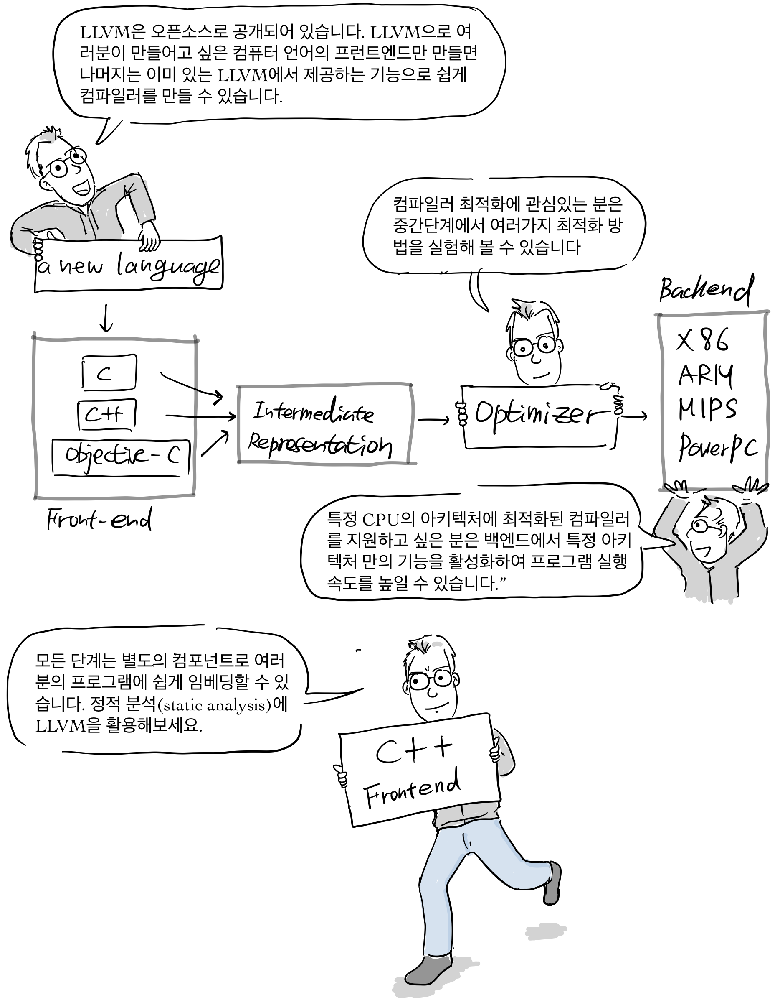

“LLVM은 오픈소스로 공개되어 있습니다. LLVM으로 여러분이 만들어고 싶은 컴퓨터 언어의 프런트엔드만 만들면 나머지는 이미 있는 LLVM에서 제공하는 기능으로 쉽게 컴파일러를 만들 수 있습니다.

“컴파일러 최적화에 관심있는 분은 중간단계에서 여러가지 최적화 방법을 실험해 볼 수 있습니다.”

“특정 CPU의 아키텍처에 최적화된 컴파일러를 지원하고 싶은 분은 백엔드에서 특정 아키텍처 만의 기능을 활성화하여 프로그램 실행 속도를 높일 수 있습니다.”

“모든 단계는 별도의 컴포넌트로 여러분의 프로그램에 쉽게 임베딩할 수 있습니다. 정적 분석(static analysis)에 LLVM을 활용해보세요.”

### Apple에서 LLVM 개발 지속

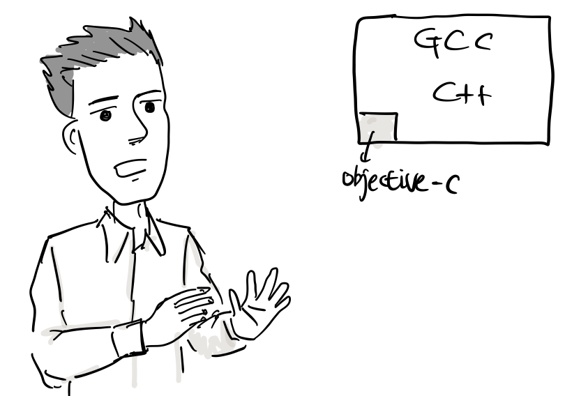

“GCC 프로젝트에서 Objective-C가 그렇게 중요하지 않으니 우리가 수정한 코드를 반영하는데, 시간이 많이 걸립니다. 더욱 큰 문제는 iPhone에서는 서명된 앱만 실행할 수 있는데, 이는 앱 바이너리 수정을 막기 때문에 GPL3라이선스와 충돌이 일어납니다. 결국, 우리만의 컴파일러가 필요합니다.\[10\]”

“그러면 최고 전문가를 찾아야지.”

애플은 2005년 크리스를 고용했고, 그는 계속해서 llvm-gcc front 작업과 함께, PowerPC, X86 백엔드 최적화 작업을 했다. 또한 OpenGL 셰이더 컴파일러에 LLVM을 적용했다. 그리고 LLVM을 GCC에 통합하기 위해 노력한다.

### GCC 통합 노력 실패

LLVM은 원래 C/C++지원을 위해 GCC 프런트엔드를 사용했고 크리스는 LLVM이 GCC의 새로운 아키텍처로 사용되기를 원했고 [이를 커뮤니티에 제안](https://gcc.gnu.org/legacy-ml/gcc/2005-11/msg00888.html)한다.

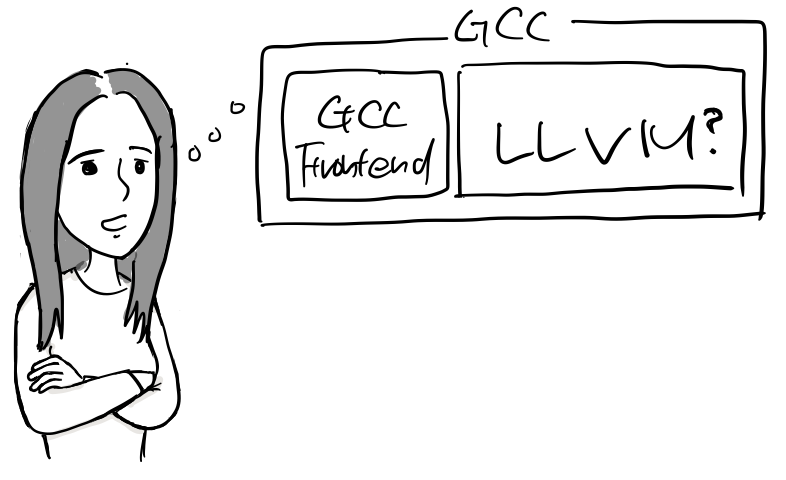

“GCC 커뮤니티가 과연 좋아할까? 지금까지 자신들이 개발한 코드를 다 버려야할지도 모르는데..”

“GCC는 최적화 부분은 기존 상용 컴파일러 보다 부족해서 성능상 문제가 있어요. LLVM을 도입하면 모든 프런트엔드가 함께 최적화된 부분을 공유할 수 있습니다”

“그리고 GCC와 통합을 위해 LLVM도 GPL라이선스를 따를 예정입니다. LLVM은 C++로 개발되었지만 기존 C로 개발된 GCC 코드와 통합하는데는 문제가 없습니다.”

하지만, GCC 공동체는 LLVM이 여러 언어를 지원하는데 유리한 디자인을 갖고 있다는 것을 인정했지만, 이 많은 사용자가 있는 GCC를 크게 변경하는데 무리가 있다고 생각했다. 결국 이러한 견해를 좁이지 못하고 LLVM은 GCC에 적용되지 못한다.\[7\]\[8\]

“ GCC 사용자도 C/C++과 같은 네이티브 언어 말고도 다른 언어를 지원하기를 원하지만, 실제 구현은 어렵지. 그래서 LLVM 통합이 해볼만 시도는 아닐까?”

“LLVM이야 공동체도 없고 그냥 GCC에 적용한다고 해도 문제가 없지. 하지만, GCC 공동체는 고인물들이 많아서 코드 베이스가 많이 바뀌면 사람들이 싫어할것 같아”

“도대체 애플이 무슨 꿍꿍이가 있어서 GPL까지 수용하면서 LLVM을 통합하려고 할까요? 난 애플을 믿을 수가 없어요”

“게다가 C++ 코드라니?”

(참고로, [GCC도 4.8 버전 부터는 C++ 코드로 구현되고 있다](https://gcc.gnu.org/gcc-4.8/changes.html))

### Clang 릴리스

결국, 애플은 LLVM과 GCC 통합을 포기하고 새롭게 C/C++ 프런트엔드인 Clang 컴파일러를 만들어 2007년 처음 릴리스 한다.

“더 이상 GCC의존성은 안녕~”

### Swift 개발

크리스는 2010년 부터 혼자서 프로그래밍 언어인 [Swift](https://ko.wikipedia.org/wiki/%EC%8A%A4%EC%9C%84%ED%94%84%ED%8A%B8_\(%ED%94%84%EB%A1%9C%EA%B7%B8%EB%9E%98%EB%B0%8D_%EC%96%B8%EC%96%B4\))를 개발을 시작했는데, 이 프로젝트가 사내에 알려지게 된다.

“LLVM을 개발하고 있는 크리스 라트너가 개인적으로 새로운 프로그래밍 언어를 만들고 있는데, Objective-C를 대체할 수 있을 것 같습니다. 회사 공식 프로젝트로 만드는 것은 어떨까요?”

결국, 애플의 여러 엔지니어가 개발에 합류하고 공식적인 프로젝트가 된다. 그리고 2014년 WWDC에서 Xcode 6와 함께 Swift를 소개했다.

“와 이제 Objective-C 몰라도 iOS 앱 만들 수 있는거야?”

이후, 크리스는 구글, 테슬라, SiFive를 거쳐 2022년 [Modular AI](https://www.modular.com/)라는 회사를 창업해서 머신 러닝 개발 플랫폼을 개발하고 있다.

크리스와 결혼한 탄야는 2014년 부터 LLVM Foundation의 회장으로 여전히 프로젝트를 이끌고 있다.

### 참고

\[1\] https://en.wikipedia.org/wiki/LLVM

\[2\] Christ Lattner’s Homepage, http://www.nondot.org/sabre/

\[3\] [Interview with LLVM Foundation President Tanya Lattner](https://www.youtube.com/watch?v=vXHeHJY3CXI)

\[4\] [LLVM](https://www.aosabook.org/en/llvm.html), The architecture of open source applications, aosabook.org

\[5\] [LLVM + Gallium3D: Mixing a Compiler With a Graphics Framework](https://people.freedesktop.org/~marcheu/fosdem09-g3dllvm.pdf)

\[6\] [\[llvm-dev\] Introduction: DirectX Shader Compiler and LLVM](https://lists.llvm.org/pipermail/llvm-dev/2017-January/109613.html)

\[7\] LLVM/GCC Integration Proposal, [GCC mailing list](https://gcc.gnu.org/legacy-ml/gcc/2005-11/msg00888.html), 2005

\[8\] Re: LLVM/GCC Integration Proposal, [GCC mailing list](https://gcc.gnu.org/legacy-ml/gcc/2005-11/msg00918.html), 2005

\[9\] Apple Originally Tried To Give GPL’ed LLVM To GCC https://forums.freebsd.org/threads/apple-originally-tried-to-give-gpled-llvm-to-gcc.44533/

https://www.phoronix.com/news/MTU4MzE

\[10\] Apple’s Selective Contributions to GCC, [lwn.net](https://lwn.net/Articles/405417/), 2010
