파이썬을 개발한 [귀도 반 로섬](https://ko.wikipedia.org/wiki/%EA%B7%80%EB%8F%84_%EB%B0%98_%EB%A1%9C%EC%84%AC)은 1956년 네덜란드에서 태어났다. 학창 시절, 그는 전형적인 너드였다. 운동은 별로 좋아하지 않았고, 전자회로 설계에 관심이 많아 이것 저것 만들어보는 것이 취미였다.

“축구 안할래?”

“나 지금 라디오 조립하느라고 좀 바빠서..”

암기가 필요한 역사에는 흥미가 없었지만, 기본적인 개념에서 뭔가를 유도하여 문제를 해결하는 과목인 수학과 과학은 잘 했다.

결국, 그는 1974년 암스테르담 대학에 입학해서 전공으로 수학을 선택한다. 당시 학생들은 입학만 하면 어떤 전공도 자유롭게 선택할 수 있었다.

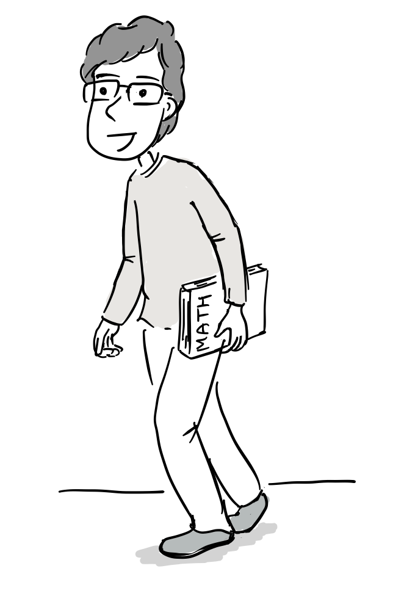

“드디어 대학에서 수학을 공부하는구나!”

하지만 그는 2학년에 올라가자 흥미로웠던 수학에 흥미를 잃고 만다. 너무 내용이 어려워졌고 자신이 대학 수학에는 재능이 별로 없다고 깨닫는다.

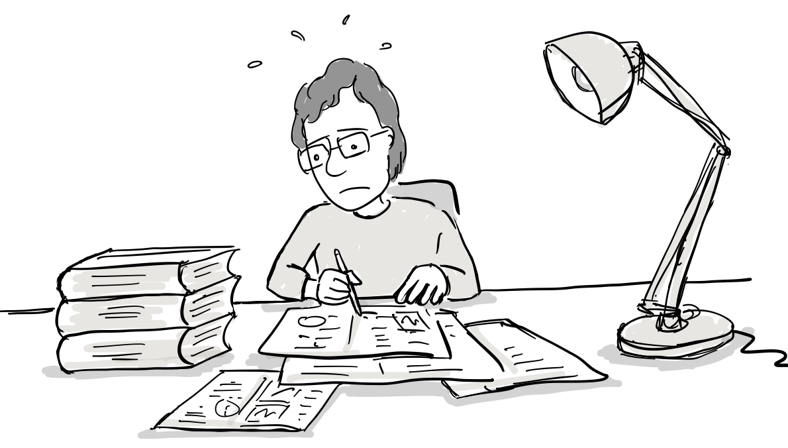

다행히 1학년 때 [파스칼 언어](https://ko.wikipedia.org/wiki/%ED%8C%8C%EC%8A%A4%EC%B9%BC_\(%ED%94%84%EB%A1%9C%EA%B7%B8%EB%9E%98%EB%B0%8D_%EC%96%B8%EC%96%B4\))를 배우면서 [메인프레임](https://ko.wikipedia.org/wiki/%EB%A9%94%EC%9D%B8%ED%94%84%EB%A0%88%EC%9E%84)을 사용할 수 있었고 프로그래밍에 흥미를 느껴 [알골(ALGOL) 60](https://ko.wikipedia.org/wiki/%EC%95%8C%EA%B3%A8_60)이란 언어도 혼자 공부했다.

당시는 펀치카드로 코딩을 하고 오퍼레이터가 대신 컴퓨터에 입력을 해서 나중에 실행결과를 받았다.

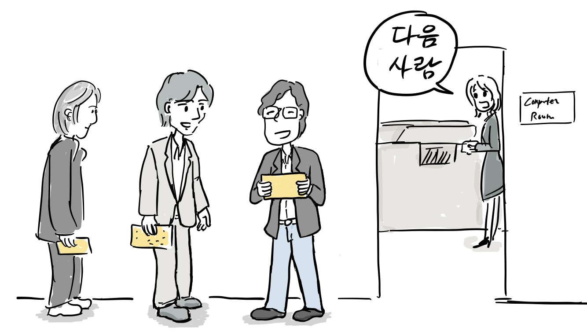

“드디어 내 차례가 왔다”

귀도는 수학 공부 보다는 지하 메인프레임실에서 시간을 더 보내며 파스칼, 알골, [포트란](https://ko.wikipedia.org/wiki/%ED%8F%AC%ED%8A%B8%EB%9E%80)을 공부했다. 파트 타임으로 일하는 선배들에게 많은 것을 배우고, 메인 프레임실에 자주 오던 물리학자와 수학자들과 교류한다.

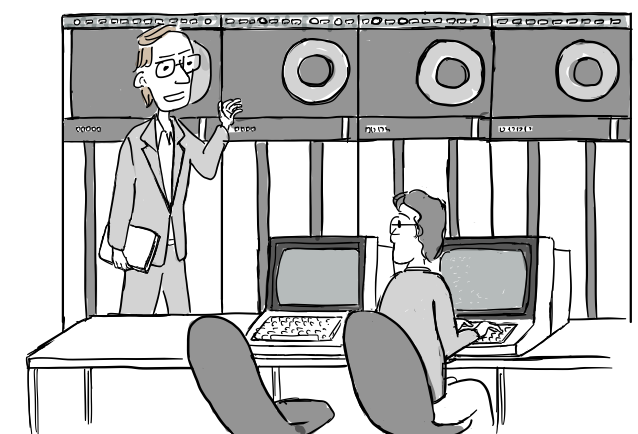

“귀도, 컴퓨터실에 매일 출근하네..”

“네, 알골을 공부하고 있습니다. 나중에 뭐좀 물어볼게요”

“언제라도”

“포트란이 배우기 쉽고 수치 계산하기에는 최고 아닌가?”

“무슨소리! 알골60이 블록 구조로 설계되었고, 재귀 호출도 지원하잖아?”

참고로 귀도는 알골 언어를 더 좋아했다.

수학과에서 컴퓨터 프로그래밍 과목이 있었지만, 주로 수학 계산에 필요한 것만 가르쳐서 그렇게 흥미롭지는 않았다. 그러다 2학년때 같은 암스테르담에 있는 자유대학에 컴퓨터 학과 수업이 더 좋다는 것을 알게 된다.

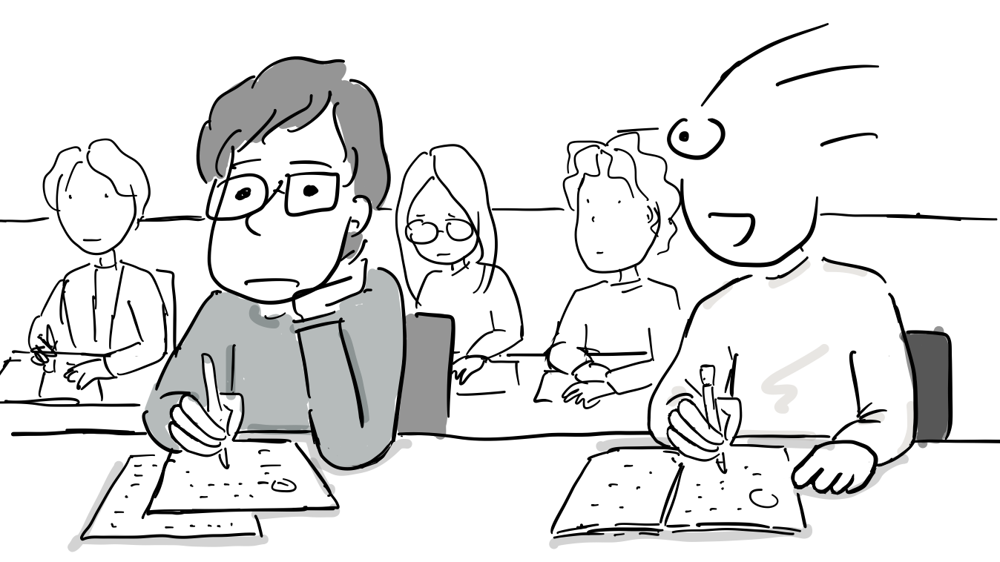

“귀도, 컴퓨터 과학을 제대로 배우려면 [자유대학](https://ko.wikipedia.org/wiki/%EC%95%94%EC%8A%A4%ED%85%8C%EB%A5%B4%EB%8B%B4_%EC%9E%90%EC%9C%A0_%EB%8C%80%ED%95%99%EA%B5%90)이 훨씬 좋아. 과목도 다양하고 좋은 교수님도 많지. 우리학교하고 학점 교환이 되니까, 가서 수업을 신청할 수 있어.”

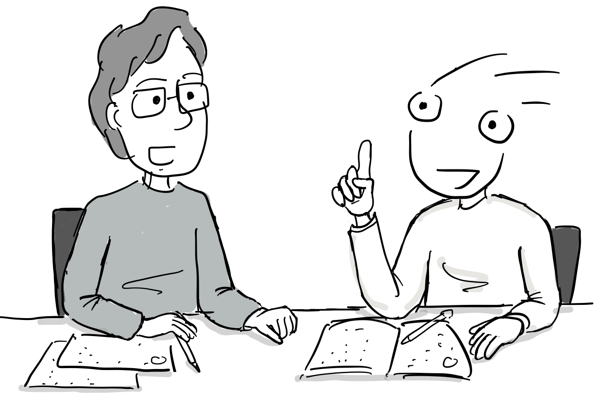

“정말? 다음학기에는 꼭 자유대학에 개설된 컴퓨터 수업을 신청해야겠는데..”

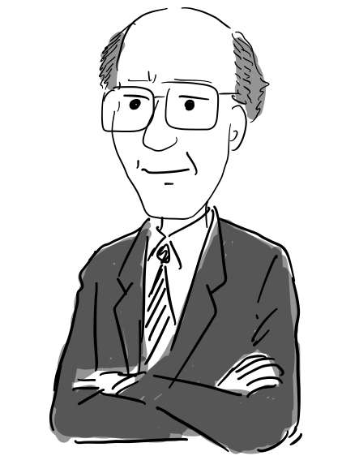

미닉스로 유명한 [앤드루 타넨바움 교수](https://ko.wikipedia.org/wiki/%EC%95%A4%EB%93%9C%EB%A3%A8_%ED%83%80%EB%84%A8%EB%B0%94%EC%9B%80)([30](https://joone.net/2019/02/09/30-%eb%a6%ac%eb%88%85%ec%8a%a4-%ec%9d%b4%ec%95%bc%ea%b8%b0-%eb%a6%ac%eb%88%85%ec%8a%a4-vs-%eb%af%b8%eb%8b%89%ec%8a%a4-1%eb%b6%80/), [31](https://joone.net/2019/05/26/31-%eb%a6%ac%eb%88%85%ec%8a%a4-%ec%9d%b4%ec%95%bc%ea%b8%b0-%eb%a6%ac%eb%88%85%ec%8a%a4-vs-%eb%af%b8%eb%8b%89%ec%8a%a4-2%eb%b6%80/)편 참고)는 자유 대학에서 운영체제, 데이터베이스, 네트워크를 가르쳤고 그 밑에는 연구중인 박사 과정 학생이 많았다.

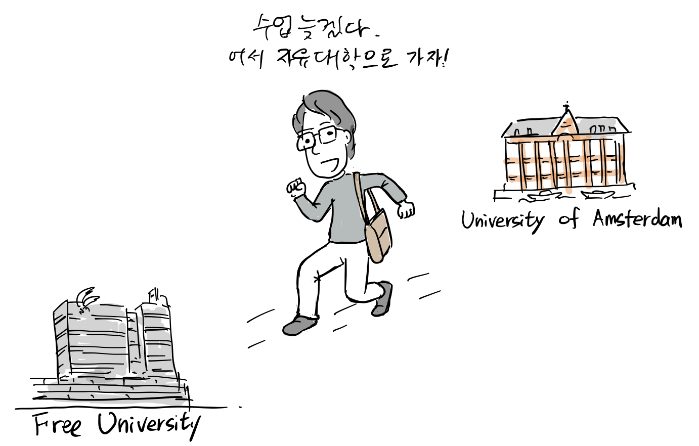

귀도는 대학간 학점 교류 프로그램을 통해 자유 대학에서 전산학 관련 수업을 들었다.

학부를 마친후, 대학원에서는 본격적으로 컴퓨터 과학을 공부했고 파트 타임으로 *Mathematical Center*(현 [CWI research institute](https://en.wikipedia.org/wiki/Centrum_Wiskunde_%26_Informatica)) 에서 일을 했다.

참고로, 최단거리 검색 알고리즘으로 유명한 [에츠허르 데이크스트라(Dijkstra)](https://ko.wikipedia.org/wiki/%EC%97%90%EC%B8%A0%ED%97%88%EB%A5%B4_%EB%8D%B0%EC%9D%B4%ED%81%AC%EC%8A%A4%ED%8A%B8%EB%9D%BC) 교수는가 해당 알고리즘을 고안한 시기는 1956년으로, 그 당시에 그는 Mathematical Center에서 프로그래머로 일하고 있었다.

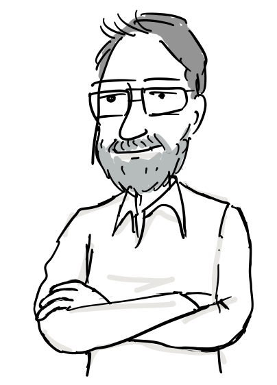

“운영체제와 알고리즘을 공부한 사람이라면 내 이름쯤은 들어봤을 걸”

Mathmatical Centre는 암스테르담 대학과 자유대학이 함께 메인프레임과 같은 비싼 컴퓨터를 공동으로 사용할 수 있는 기관이었고 건물은 자유 대학 내에 있었다.

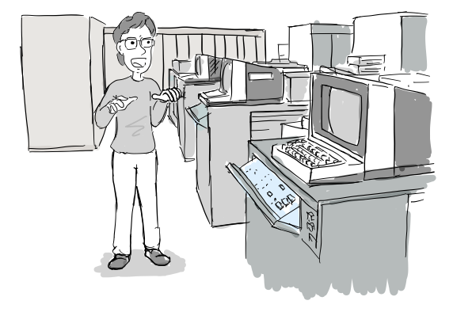

“이제 메인 프레임은 마음껏 사용할 수 있겠군…”

Mathmatical Center는 당시 인기있었던 [IBM 메인프레임](https://ko.wikipedia.org/wiki/IBM_%EB%A9%94%EC%9D%B8%ED%94%84%EB%A0%88%EC%9E%84)이 아닌 [Control Data Mainframe](https://en.wikipedia.org/wiki/Control_Data_Corporation)을 사용했다. 그가 맡은 업무는 시스템 관리자로 운영체제와 소프트웨어를 설치하거나 업데이트하는 역할이었다.

석사를 마친 후, 같은해 1982년 Mathematical center의 정식 직원이 되어 개발자로 일을 하게 된다. 참고로 1983년 Mathematical Center는 Centrum Wiskunde & Informatica (CWI)로 이름을 변경한다.

첫 프로젝트로 [ABC](https://en.wikipedia.org/wiki/ABC_\(programming_language\))라는 프로그래밍 언어를 개발하는 프로젝트에 참여하게 된다.

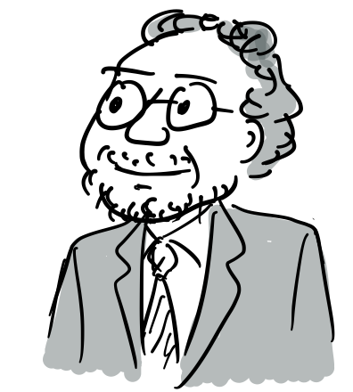

ABC언어는 [램버트 미르텐스(Lambert Meertens)](https://en.wikipedia.org/wiki/Lambert_Meertens)가 디자인한 언어로 C언어와 달리 전문적인 프로그래머가 아닌 과학자, 연구실 조교, 프로 사용자들이 쉽게 배우고 어떤 제약없이 사용할 수 있도록 설계되었고, 훗날 파이썬 개발에 큰 영향을 준다.

“우와 ABC 언어라?”

귀도가 팀에 조인했을 때, 이미 ABC언어의 프로토타입이 있었고, 기본 데이터 타입, [파서](https://ko.wikipedia.org/wiki/%EA%B5%AC%EB%AC%B8_%EB%B6%84%EC%84%9D#:~:text=%EC%BB%B4%ED%93%A8%ED%8C%85%EC%97%90%EC%84%9C%20%ED%8C%8C%EC%84%9C\(parser\)%EB%8A%94,%EB%B6%84%EC%84%9D%EA%B8%B0%EB%A5%BC%20%EC%9D%B4%EC%9A%A9%ED%95%98%EA%B8%B0%EB%8F%84%20%ED%95%9C%EB%8B%A4.), 인터프리터를 다시 만들고 있어서 컴파일러의 개발작업 초기부터 참여할 수 있었다.

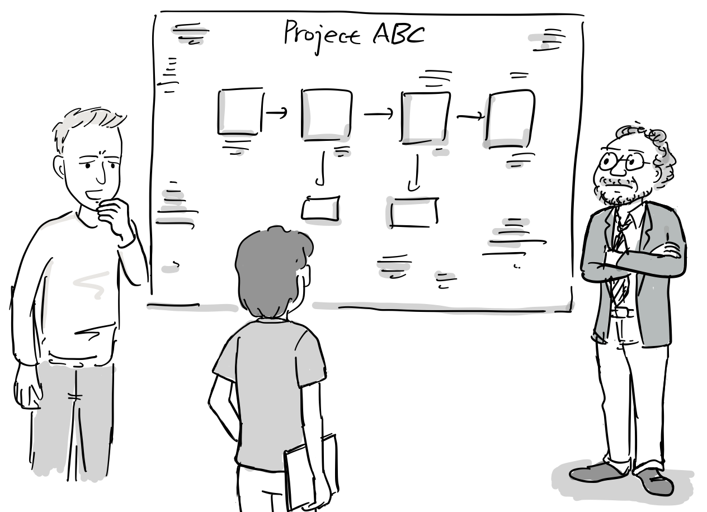

“때마침 바닥부터 다시 만들고 있으니, 프로젝트에 참여하기 좋을거야.”

ABC 언어가 유닉스에서 C로 개발되었지만, 당시는 각 유닉스마다 독자적인 C 컴파일러를 갖고 있어서 같은 C 소스 코드를 서로 다른 유닉스 머신에서 컴파일하는데 어려움이 뒤따랐다.

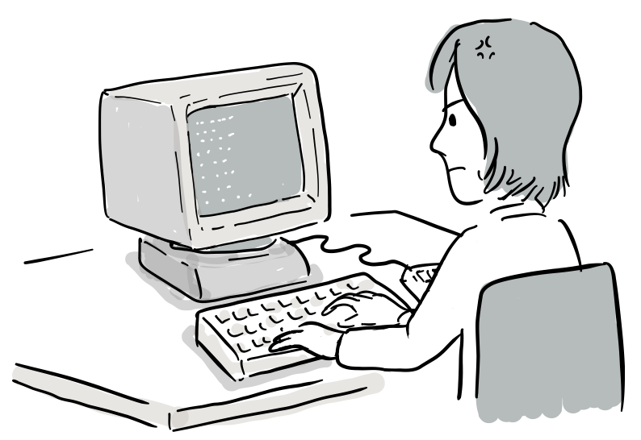

“설명대로 했는데, 컴파일이 안되네…”

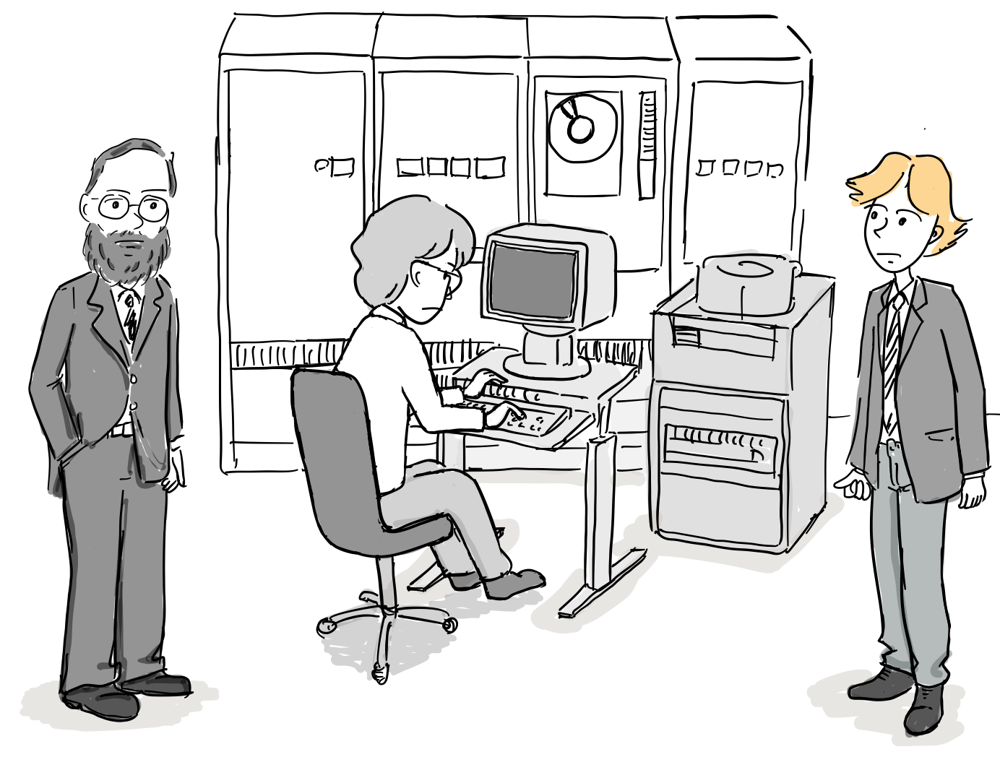

“분명히 저희 워크스테이션에서는 컴파일이 잘되었거든요..”

게다가 모든 기관들이 유닉스 머신을 갖고 있는 것이 아니라서 ABC언어가 무료임에도 불구하고 보급하는데 어려움이 있었다.

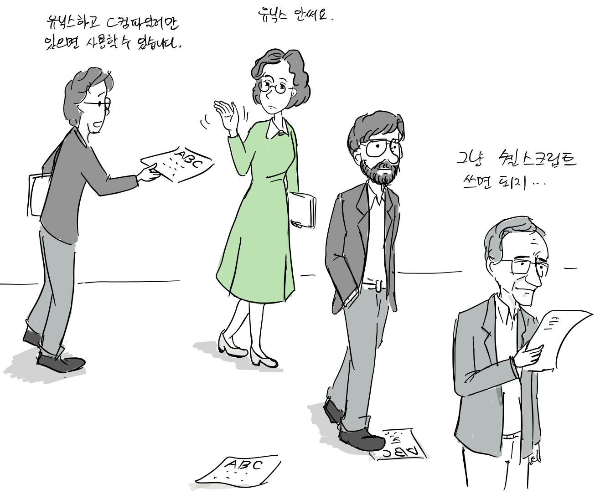

“ABC언어를 쓰세요 무료입니다..”

“우리는 유닉스가 없어요..”

게다가 당시는 인터넷도 대학이나 연구소에 있는 일부 사람만 쓸 수 있어서 지금처럼 누구나 쉽게 프로그램을 다운로드하기 어려웠다. 그래서 인터넷에 연결이 안된 유닉스의 경우, 개발자가 직접 해당 기관을 방문해서 설치를 도와줬다. 하지만, 유럽이라는 지리적 한계 때문에 미국까지 ABC언어가 보급되는 데는 어려움이 뒤따랐다.

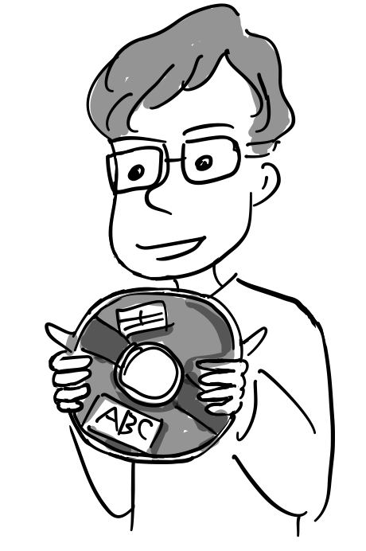

“이 테이프가 미국 가서 잘 동작해야할텐데..”

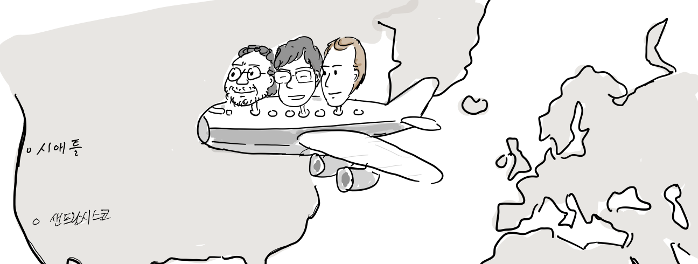

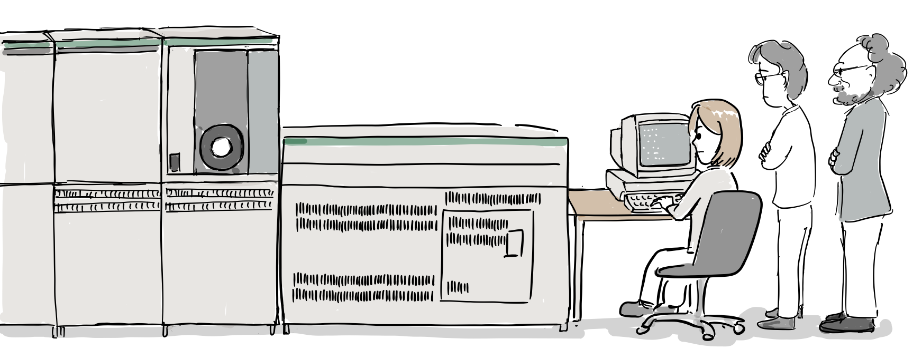

“컴파일은 되었는데, 실행 중에 에러가 나는군요”

“돌아가기 전까지 해결 가능한가?”

ABC 프로젝트는 많은 사용자를 확보하지 못한 이유로 결국 취소된다.

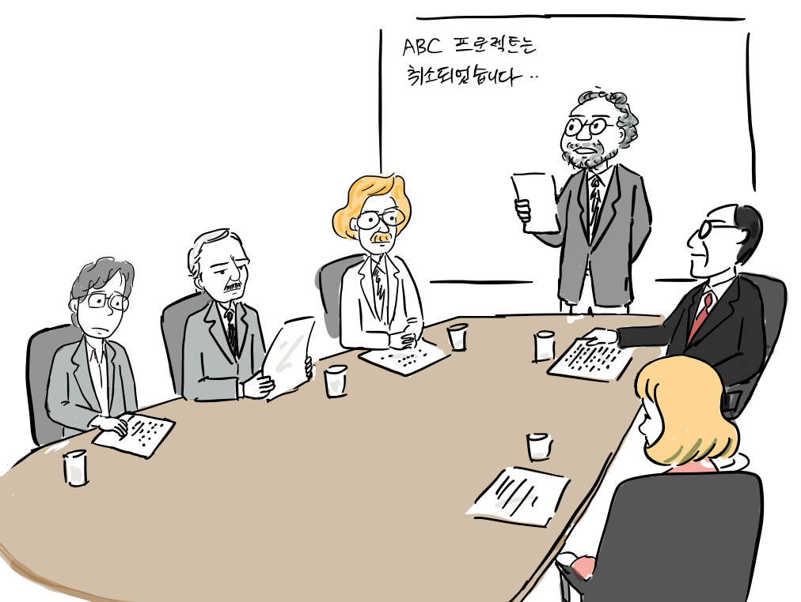

“안타깝지만, 더 이상 펀드를 못받게 되어 프로젝트가 취소되었음을 알립니다.”

이후 CWI는 [Amoeba 운영체제 프로젝트](https://en.wikipedia.org/wiki/Amoeba_\(operating_system\))에 참여한다. 참고로, Amoeba는 미닉스를 개발한 타넨바움 교수의 연구실 프로젝트로 분산형 마이크로 커널을 만드는 프로젝트였다.

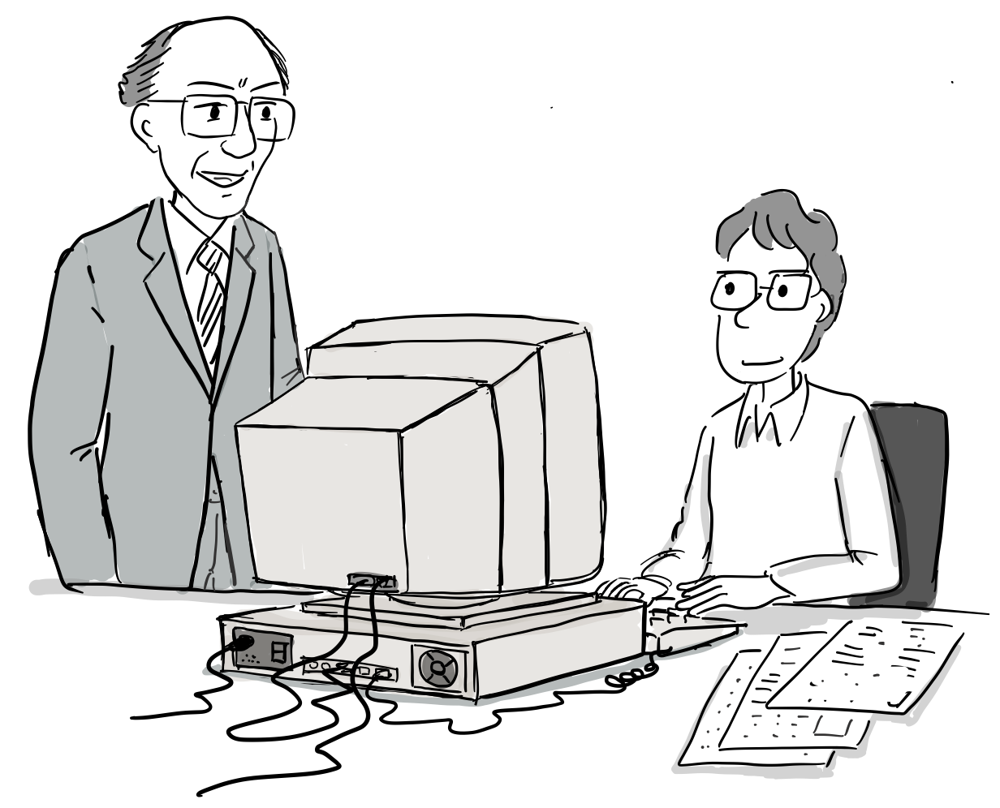

“Amoeba 운영체제의 로그인 프로그램이 필요합니다.”

“네, C언어는 익숙하니 금방 만들 수 있을 겁니다.”

이 프로젝트에서 귀도는 C언어로 로그인 프로그램을 작성했다. 하지만, C언어 개발 경험이 많음에도 불구하고, 파일시스템에 있는 파일이 변경되었는지를 확인해야 하는 등 시스템과 연동되는 부분이 많아서 개발 기간이 예상 보다 오래 걸렸다.

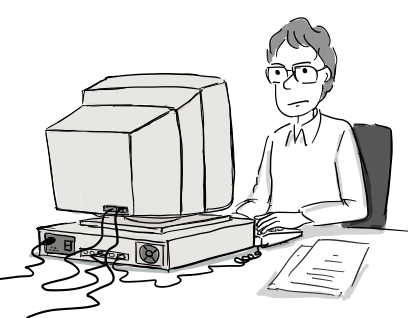

“ABC 언어가 있다면 15분이면 해결될 문제인데…”

“C언어로 개발하니 1주일은 걸리는 것 같네…”

“으악 또 CRASH!”

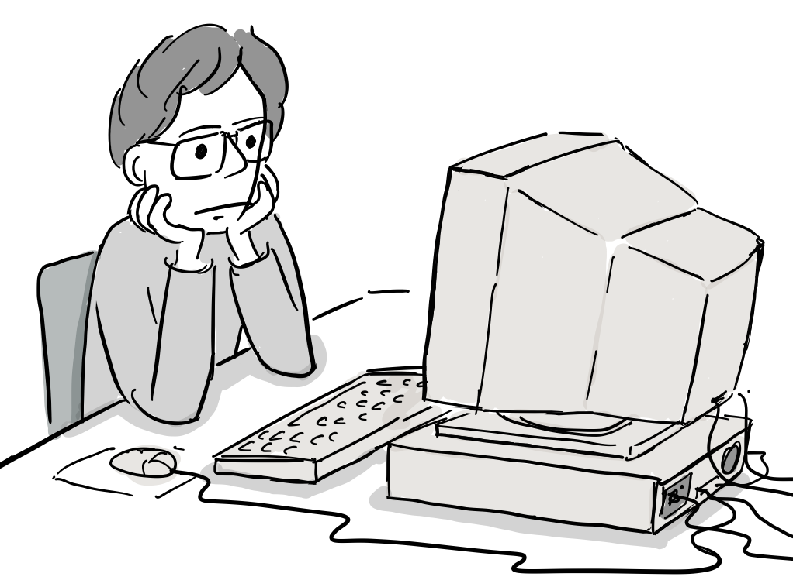

“ABC언어를 사용해 보자고 이야기해 볼까?”

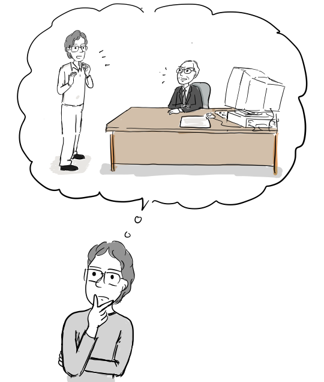

“ABC언어?”

“안돼, 허락을 구하려면 몇 달은 걸릴거야”

“그래, 그냥 간단한 스크립트 언어를 만들어보자”

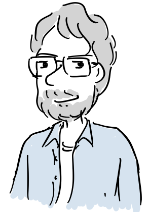

“허락을 구하는 것 보다 용서를 구하는게 더 나을 때가 있다.”

참고: 인터뷰에서 실제 한말

ABC언어 수준의 큰 프로젝트는 아니라, 몇달 정도 작업해서 Ameoba 프로그래밍 툴킷의 한부분으로 만들 계획이였고, 일단 주어진 일을 빨리 하고 남는 시간에 그만의 프로그래밍 언어를 만들 수 있을 것이라 생각했다.

89년 12월 크리스마스 휴가 때, 드디어 개발을 시작했다.

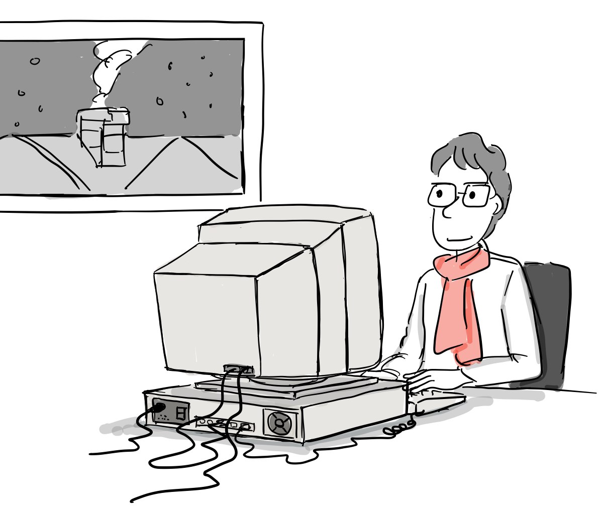

<2편에서 계속>

참고

\[1\] [Van Rossum, Guido oral history, part 1](https://www.computerhistory.org/collections/catalog/102738720), Computer History Museum

\[2\] [Van Rossum, Guido oral history, part 2](https://www.computerhistory.org/collections/catalog/102738761), Computer History Museum

\[3\] https://www.cwi.nl/en/events/lectures-2019/speakers-lectures-thursday-21-november-2019/
