[1편](https://joone.net/2023/04/14/52-python-%ed%94%84%eb%a1%9c%ea%b7%b8%eb%9e%98%eb%b0%8d-%ec%96%b8%ec%96%b4-1/)에서 이어집니다.

1989년 12월 [귀도 반 로섬](https://ko.wikipedia.org/wiki/%EA%B7%80%EB%8F%84_%EB%B0%98_%EB%A1%9C%EC%84%AC)은 크리스마스 휴가기간 동안 드디어 파이썬 개발을 시작한다.

“드라마가 끝났네. 크리스마스라고 딱히 할 일도 없으니, 그동안 생각해 왔던 새로운 프로그래밍 언어를 만들어보자.”

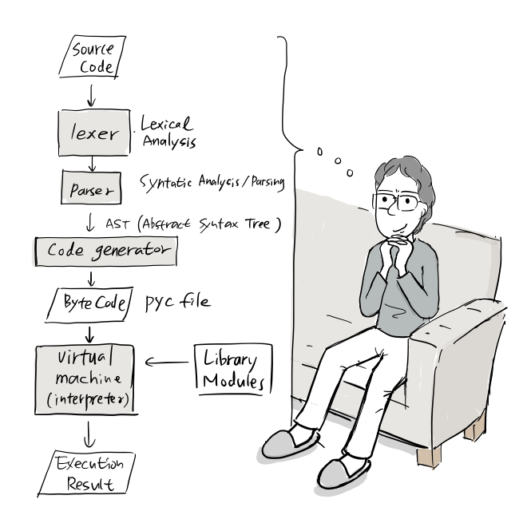

그의 머릿속에는 새로운 프로그래밍 언어에 대한 디자인이 이미 있었다.

참고:

어휘 분석기 (Lexer, Scanner, Tokenizer): 어휘 분석기는 컴파일 또는 해석 과정의 첫 번째 단계. 주요 작업은 입력 소스 코드를 읽고 토큰이라는 의미의 최소 단위로 나누는 것.

구문 분석기 (Syntax Analyzer): 어휘 분석기에서 생성한 토큰 시퀀스를 사용하여 추상 구문 트리(AST) 또는 구문 트리라는 데이터 구조를 생성. 흔히 파서라고 부름.

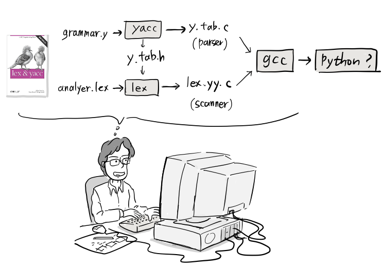

“먼저 어휘분석기를 만들고 그리고 구문분석기를 만들어야하는데, [Lex](https://ko.wikipedia.org/wiki/Lex)와 [Yacc](https://ko.wikipedia.org/wiki/Yacc)를 한번 써볼까?”

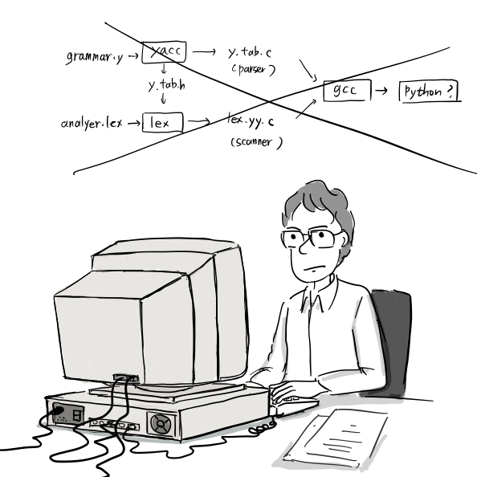

“Lex와 Yacc는 너무 불필요한 코드를 많이 생성하고, 입력 데이커가 커지니까 Lex가 생성한 코드가 죽어버리는구나..”

“안되겠다. 내가 바닥부터 파서를 만들어야겠다. 먼저, 문법을 정의하자”

“가능한 한 사용하기 쉽고, 객체지향 개념도 지원하고”

“이름은 무엇으로 할까”

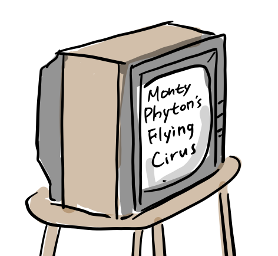

“아, 이름은.. 파이썬??”

파이썬이라는 이름은 “Monty Python’s Flying Circus”라는 영국 드라마에서 따왔다. 당시 귀도는 이 드라마를 네덜란드 TV에서 자막으로 보고 있었다.

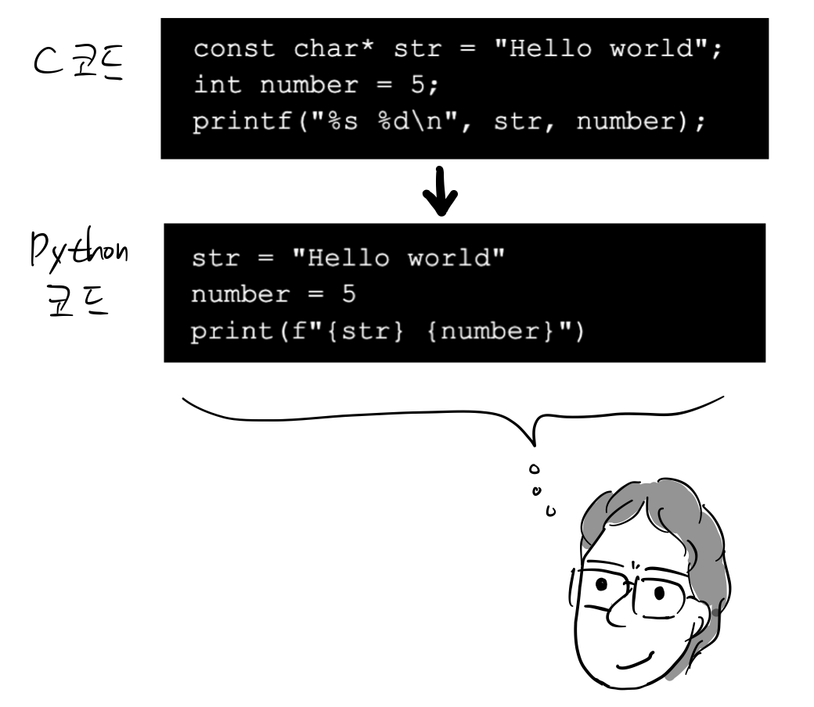

“타입(Type)은 선언하지 않고 동적으로 타입을 결정할 수 있게 하면 개발자들이 타입을 잘못 정의해서 발생하는 문제를 줄일 수 있을거야. 물론 좀 느릴 수는 있겠지.”

기능 확장이 어려웠던 [ABC언어](https://ko.wikipedia.org/wiki/ABC_\(%ED%94%84%EB%A1%9C%EA%B7%B8%EB%9E%98%EB%B0%8D_%EC%96%B8%EC%96%B4\))에 대한 기억을 되살려 파이썬에는 쉽게 기능을 확장할 수 있도록 모듈 기능을 추가했다. 추가 기능을 위해 다시 소스코드를 빌드하는 것이 아니라 config에 모듈만 추가해도 이전 버전에서도 새 확장을 쓰도록 하는 것이었다. 그리고 누구나 쉽게 C로 모듈을 만들어서 파이썬기능을 확장하도록 했다.

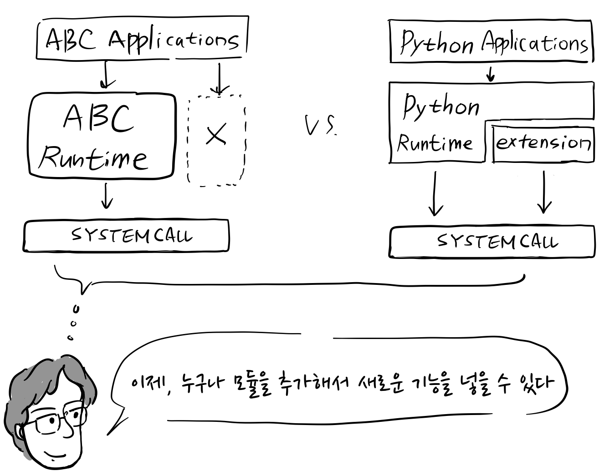

“이제, 누구나 모듈을 추가해서 새로운 기능을 넣을 수 있다”

파이썬의 프롬프트 모드는 ABC언어에서 아이디어를 가져왔다.

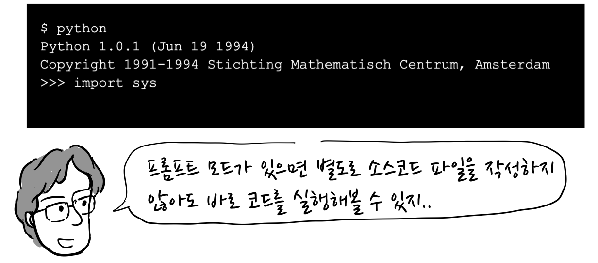

“프롬프트 모드가 있으면 별도로 소스코드 파일을 작성하지 않아도 바로 코드를 실행해볼 수 있지..”

참고: 파이썬 1.0.1의 Prompt 모습 ([Youtube](https://www.youtube.com/watch?v=vhhAWd_NKBI))

“C언어로 코딩을 하다 보면 들여쓰기를 잘못 이해해서 생기는 버그가 많지. 그래서 파이썬에서는 들여쓰기를 강제하고 대신 중괄호를 없애면?“

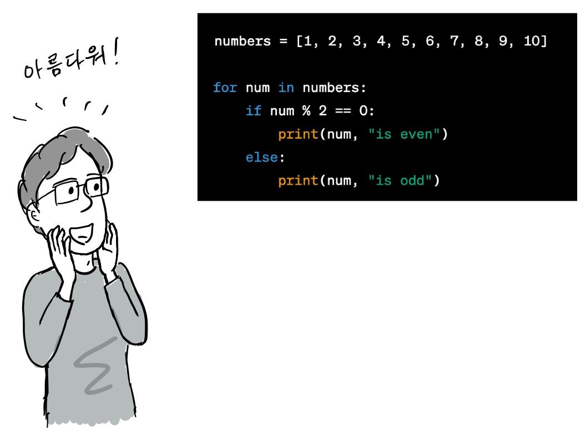

“오~ 아름다워!”

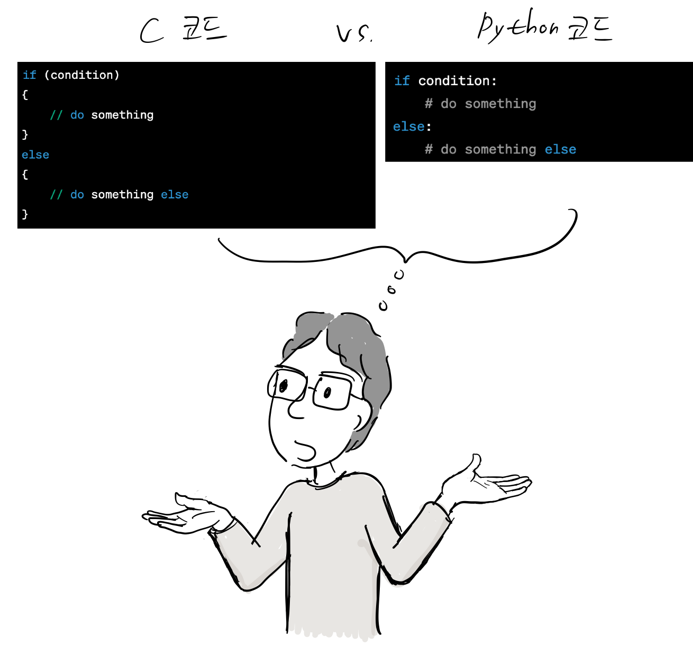

“그리고, 중괄호 쓰는 것은 화면 낭비 아닌가?”

“뿐만 아니라 중괄호를 입력하는 방법 때문에 개발자들이 끊임없이 논쟁을 하곤 하지.”

“맞아, 세상에서는 두 종류의 C 언어 개발자가 있지..”

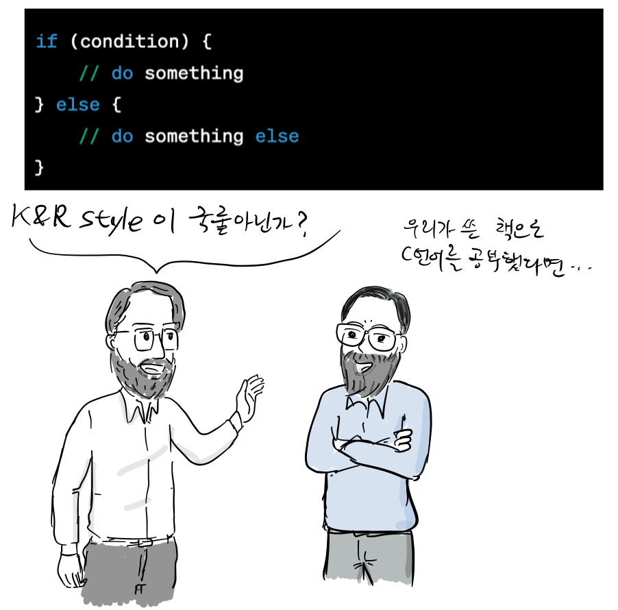

“[K&R 스타일](https://en.wikipedia.org/wiki/Indentation_style#K&R_style)을 쓰는 개발자와”

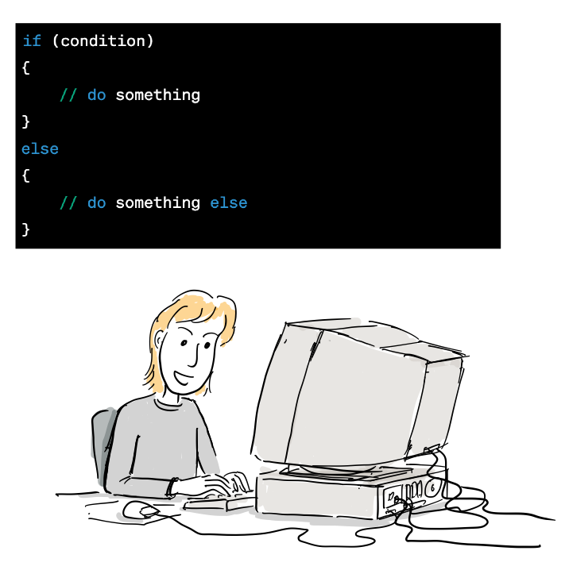

“안쓰는 개발자!”

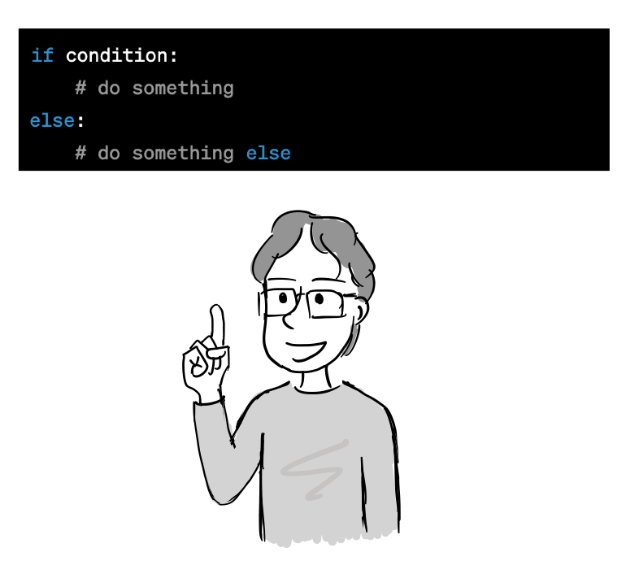

“파이썬은 적어도 그럴 일은 없지 누가 작성해도 똑같이 보일테니까..”

1990년 12월, 개발에 착수한지 1년만에 [아메바(Amoeba) 운영체제](https://ko.wikipedia.org/wiki/%EC%95%84%EB%A9%94%EB%B0%94_\(%EC%9A%B4%EC%98%81_%EC%B2%B4%EC%A0%9C\))에서 파이썬 언어가 동작하기 시작했다. 확장을 통해 아메바 시스템 콜(system call)을 지원하도록 했고 그 결과 파일시스템과 네트워크에 접근이 가능해졌다

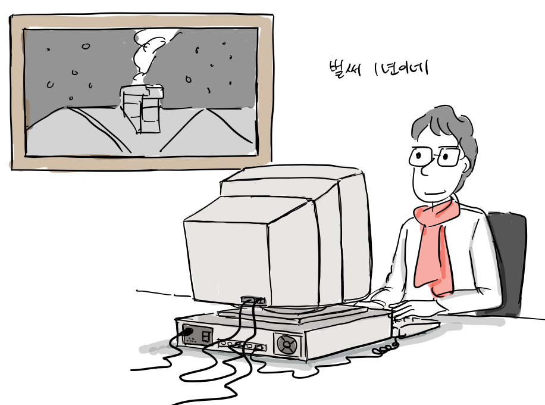

“드디어, 파이썬 스크립트로 만든 프로그램이 동작하는구나!”

.

“제가 만든 파이썬 언어를 사용하면 이렇게 빠르게 원하는 기능을 쉽게 구현할 수 있어요”

그는 파이썬이 ABC 프로그래밍 언어의 전철을 밟고 싶지 않았기 때문에 외부에 공개를 원했다. 결국, CWI를 설득해서 외부에 오픈소스 형태로 파이썬을 공개할 수 있도록 허락을 받는다.

CWI도 딱히 상업적 용도로 Amoeba나 파이썬 개발을 지원한 것이 아니므로 귀도가 오픈소스 라이선스를 선택할 수 있었다.

“하고 싶은대로 하세요~”

귀도는 아메바 운영체제 팀에서 [X 윈도 시스템](https://ko.wikipedia.org/wiki/X_%EC%9C%88%EB%8F%84_%EC%8B%9C%EC%8A%A4%ED%85%9C)을 접하고 나서 [MIT 라이선스](https://ko.wikipedia.org/wiki/MIT_%ED%97%88%EA%B0%80%EC%84%9C)에 흥미를 느껴 파이썬에도 MIT 라이선스를 적용한다.

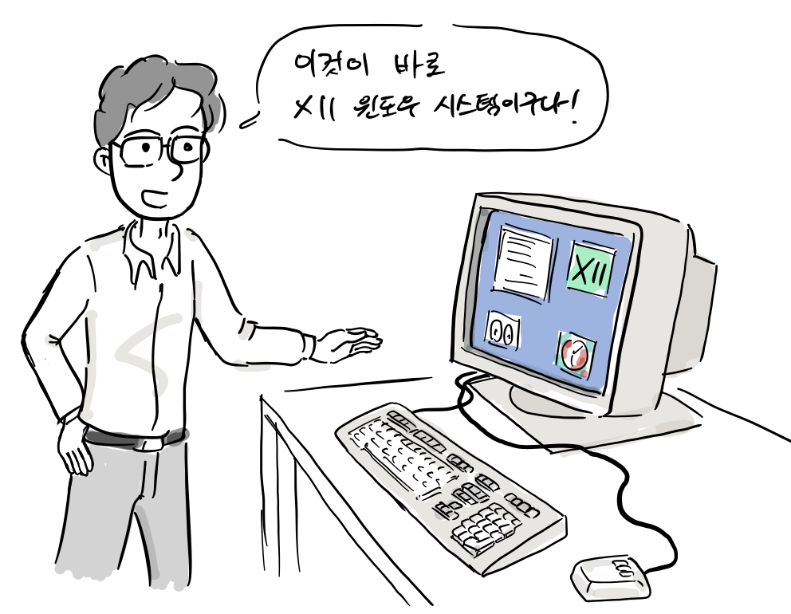

1991년 2월, 귀도는 마침내 파이썬 0.9.0 버전을 외부에 공개하였고, 점차 많은 개발자로 부터 인기를 얻기 시작했다.

그는 초창기 부터 커뮤니티 활성화에도 힘을 썼는데, 처음에는 메일링 리스트로 list python-list@cwi.nl을 만들었다가 너무 사용자가 많아지자 [유즈넷( USENET)](https://ko.wikipedia.org/wiki/%EC%9C%A0%EC%A6%88%EB%84%B7) 뉴스그룹에 [comp.lang.python](https://groups.google.com/g/comp.lang.python)을 만들었다. 귀도 스스로 커뮤니티 질문과 요청에는 빠르게 응답하고 필요한 부분은 바로 파이썬에 반영했다.

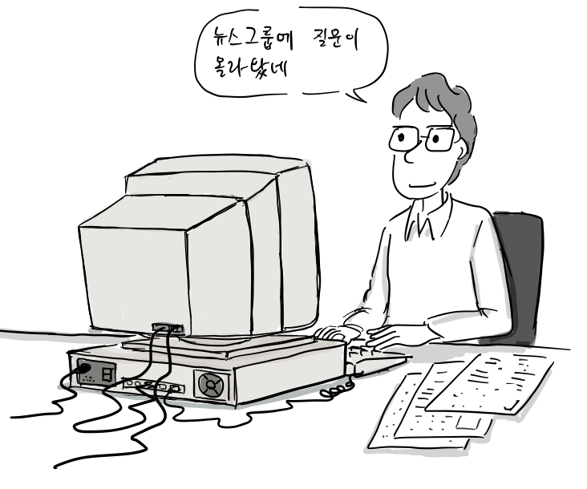

사람들이 자발적으로 정기적인 워크샵을 개최했고, 이후 이 워크샵은 [Pycon](https://us.pycon.org/2023/)으로 발전하게 된다.

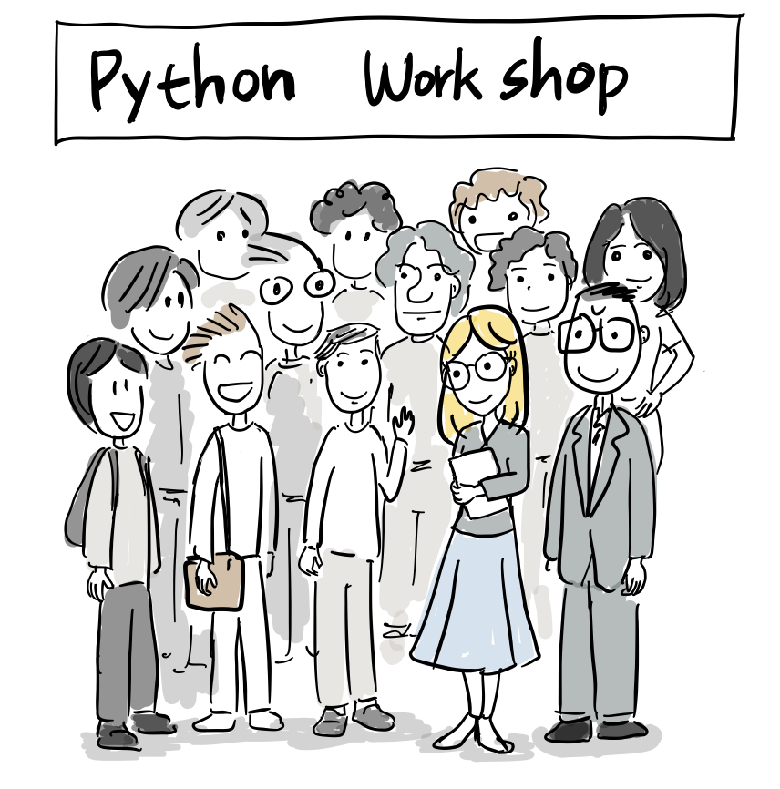

1994년 [함수형 프로그래밍](https://ko.wikipedia.org/wiki/%ED%95%A8%EC%88%98%ED%98%95_%ED%94%84%EB%A1%9C%EA%B7%B8%EB%9E%98%EB%B0%8D) 도구와 문자열 처리가 개선된 파이썬 1.0을 출시한다.

[국제 인터넷 표준화 기구(IETF)](https://ko.wikipedia.org/wiki/%EA%B5%AD%EC%A0%9C_%EC%9D%B8%ED%84%B0%EB%84%B7_%ED%91%9C%EC%A4%80%ED%99%94_%EA%B8%B0%EA%B5%AC)을 본따서 [Python Enhancement Proposal System](https://peps.python.org/)을 만들어 누구나 언어 스펙을 제안할 수 있도록 했다.

귀도는 미국에서 개최된 파이썬 워크샵에 참석했다가 [미국 국립표준기술연구소(NIST, National Institute of Standards and Technology)](https://ko.wikipedia.org/wiki/%EB%AF%B8%EA%B5%AD_%EA%B5%AD%EB%A6%BD%ED%91%9C%EC%A4%80%EA%B8%B0%EC%88%A0%EC%97%B0%EA%B5%AC%EC%86%8C)로 부터 잡오퍼를 받고 1995년 미국으로 이주하고 계속 파이썬 개발을 지속한다.

특히 [야후](https://ko.wikipedia.org/wiki/%EC%95%BC%ED%9B%84!)에서는 [야후 메일](https://ko.wikipedia.org/wiki/%EC%95%BC%ED%9B%84!_%EB%A9%94%EC%9D%BC) 개발에 적극적으로 파이썬을 도입했다.

“비록 최신 프로그래밍 언어이긴 하지만, 파이썬 스크립트 언어를 사용하면 몇 달 만에 야후 웹메일을 만들 수 있으니, 마이크로소프트 [핫메일](https://ko.wikipedia.org/wiki/%ED%95%AB%EB%A9%94%EC%9D%BC)을 따라잡을 수 있을 거야.”

“그래? 진행시켜”

파이썬 인기가 늘어나자 90년대 후반에는 [오라일리(O’reilly) 출판사](https://ko.wikipedia.org/wiki/%EC%98%A4%EB%9D%BC%EC%9D%BC%EB%A6%AC_%EB%AF%B8%EB%94%94%EC%96%B4)에서 파이썬 프로그래밍 책을 출판하기도 했고, [리처드 스톨먼](https://ko.wikipedia.org/wiki/%EB%A6%AC%EC%B2%98%EB%93%9C_%EC%8A%A4%ED%86%A8%EB%A8%BC)과 [에릭 레이먼드](https://ko.wikipedia.org/wiki/%EC%97%90%EB%A6%AD_%EB%A0%88%EC%9D%B4%EB%A8%BC%EB%93%9C)와도 교류를 하였다. 1999년 [OSCON 컨퍼런스](https://en.wikipedia.org/wiki/O%27Reilly_Open_Source_Convention)에는 파이썬 프로그래밍 트랙이 있었고, 귀도는 [팀 오라일리](https://ko.wikipedia.org/wiki/%ED%8C%80_%EC%98%A4%EB%9D%BC%EC%9D%BC%EB%A6%AC)의 초청으로 해당 OSCON에 참석했다.

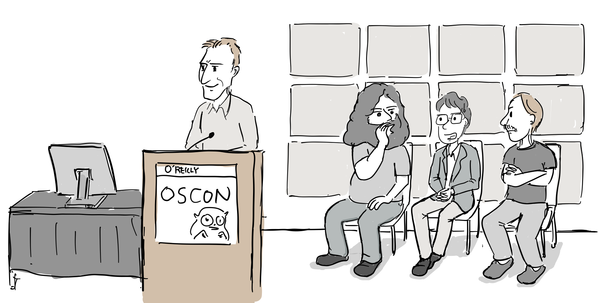

(참고로, 모든 등장 인물이 실제로 한무대에 있었던 것은 아닙니다.)

“파이썬이 [자유소프트웨어](https://ko.wikipedia.org/wiki/%EC%9E%90%EC%9C%A0_%EC%86%8C%ED%94%84%ED%8A%B8%EC%9B%A8%EC%96%B4)로서 MIT보다 [GPL](https://ko.wikipedia.org/wiki/GNU_%EC%9D%BC%EB%B0%98_%EA%B3%B5%EC%A4%91_%EC%82%AC%EC%9A%A9_%ED%97%88%EA%B0%80%EC%84%9C)로…?

“그냥 오픈소스라고 부릅시다.”

“하하, 파이썬은 자유 소프트웨어이죠.. 그런데 오픈소스라고 부르는 것도 좋아요..”

이후에도 계속 파이썬 커뮤니티를 이끌며 2000년 10월 2.0버전을 출시한다. 여기서 [가비지 컬렉션](https://ko.wikipedia.org/wiki/%EC%93%B0%EB%A0%88%EA%B8%B0_%EC%88%98%EC%A7%91_\(%EC%BB%B4%ED%93%A8%ED%84%B0_%EA%B3%BC%ED%95%99\)) 시스템 개선, [유니코드](https://ko.wikipedia.org/wiki/%EC%9C%A0%EB%8B%88%EC%BD%94%EB%93%9C) 지원 등이 추가되었다.

2001년에는 [파이썬 소프트웨어 재단(PSF)](https://ko.wikipedia.org/wiki/%ED%8C%8C%EC%9D%B4%EC%8D%AC_%EC%86%8C%ED%94%84%ED%8A%B8%EC%9B%A8%EC%96%B4_%EC%9E%AC%EB%8B%A8) 설립하고 수석 디자이너로 파이썬 개발을 이끈다.

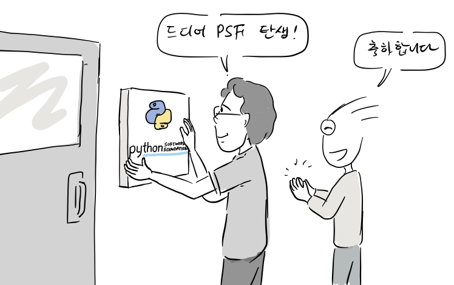

그는 수석 디자이너로서 파이썬과 관련된 주요 의사 결정에서 옳은 방향과 사람들이 실제로 원하는 것 사이의 균형을 맞추고 모든 사람이 같은 것을 원하지 않을 때 무엇을 해야 할지 결정해야 하는 역할을 맡았다.

그리고 2008년에는 파이썬 3.0을 릴리스한다.

“파이썬이 왜 이렇게 인기가 많은가?”

첫번째, 문법이 쉽다. 파이썬은 가독성이 높고 깔끔한 문법을 가지고 있어 프로그래밍을 처음 시작하는 사람들에게 배우기 쉽다. 변수 타입이 없는 것을 잊지 말자.

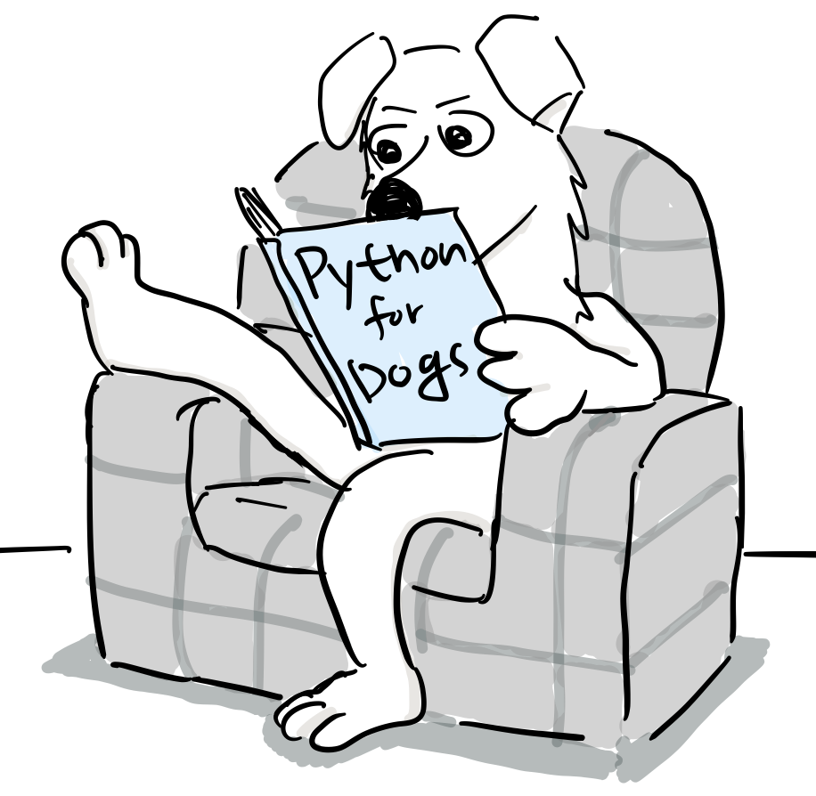

두번째, 용도가 다양하다. 파이썬은 웹 개발, 데이터 분석, 인공 지능, 자동화 등 다양한 분야에서 사용할 수 있다.

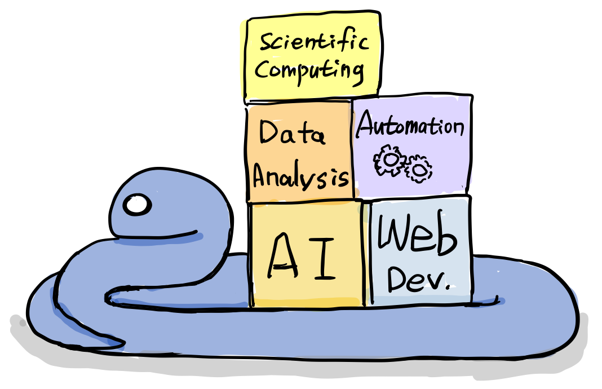

세번째, 파이썬은 풍부한 표준 라이브러리와 외부 패키지를 제공하여 개발자들이 원하는 기능을 빠르고 쉽게 구현할 수 있도록 한다.

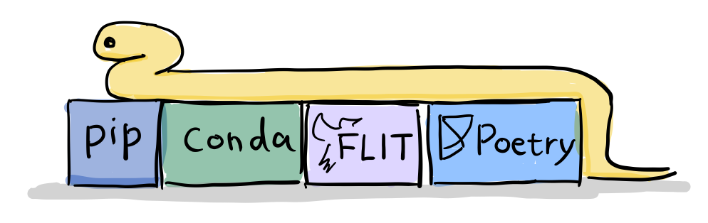

네번째, 파이썬은 전 세계적으로 큰 커뮤니티를 가지고 있어 개발자들이 문제 해결이나 새로운 기술을 배우기가 쉽다.

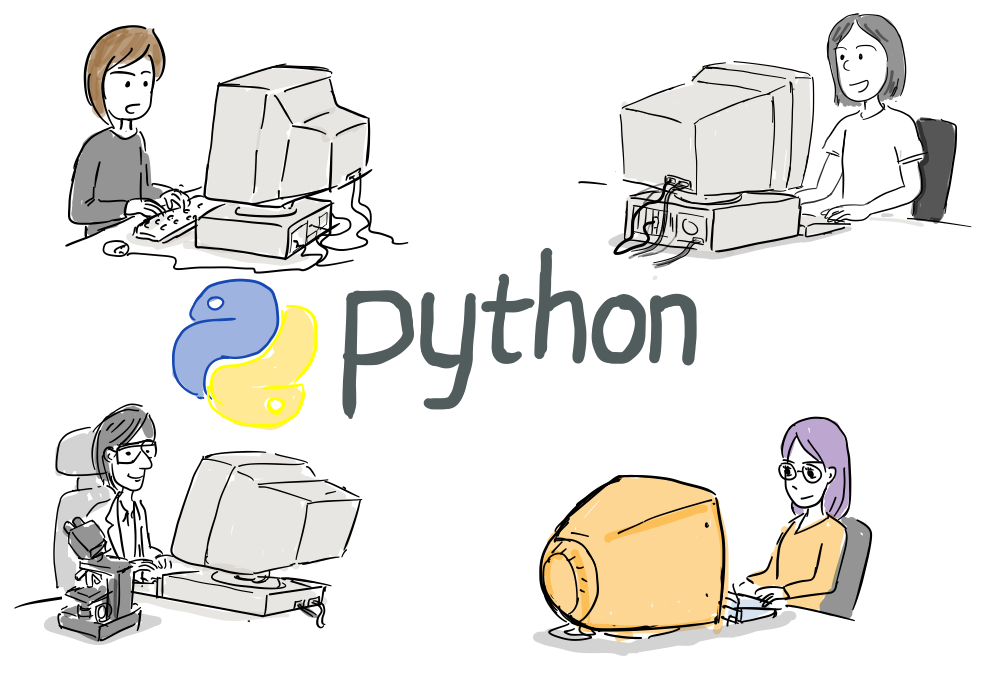

다섯번째, 기본적으로 크로스 플랫폼을 지원하여 Windows, MacOS, Linux 등 다양한 플랫폼에서 개발자들이 일관된 코드를 작성할 수 있다.

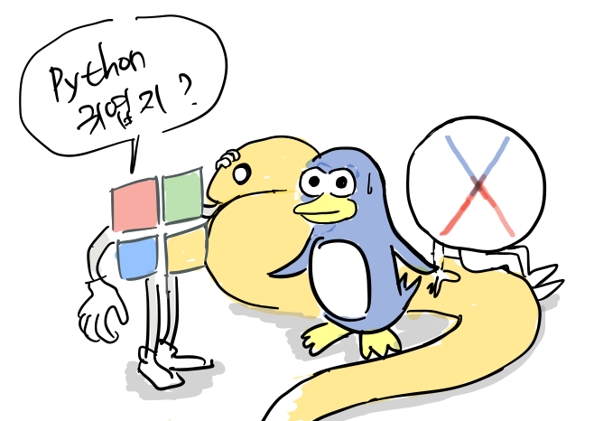

파이썬은 함수를 객체로 취급하고 동적 타이핑을 지원한다. 이로 인해 개발자들은 코드를 더욱 유연하게 작성할 수 있으며 여러 프로그래밍 패러다임(객체 지향, 함수형 등)을 사용할 수 있다.

“특히 위와 같은 이유로 머신 러닝 분야에서 독보적인 인기를 누리고 있는데 이유는 다음과 같다.”

특히, 통계나 머신 러닝을 공부하는 과학자나 엔지니어들이 파이썬을 많이 사용하다 보니, NumPy, pandas, scikit-learn, TensorFlow, Keras, PyTorch 등과 같은 관련 패키지가 많이 개발되었고, 그 결과 머신러닝 분야에서 독보적인 인기를 누리고 있다.

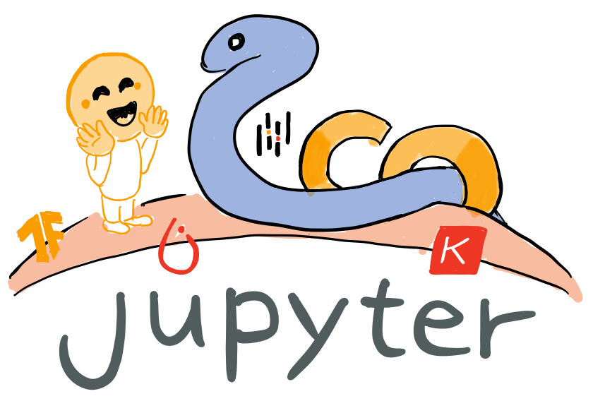

하지만 2018년, 귀도는 파이썬 프로젝트 수석 디자이너에서 물러나고 개발에서 손을 뗀다.

“이제 나이도 있고, 일을 줄여야 할 것 같군.”

“게다가 재단에서 벌어지는 의사 결정 과정도 너무 힘드네.”

“내가 없으면 더 많은 사람들이 파이썬 프로젝트에서 중요한 역할에 참여할 수 있을거야..” “과감하게 손을 떼자.”

하지만 이후, [은퇴를 번복하고 마이크로소프트에 입사](https://techcrunch.com/2020/11/12/python-creator-guido-van-rossum-joins-microsoft/)해서 [더 빠른 파이썬(Faster 파이썬) 프로젝트](https://devblogs.microsoft.com/python/python-311-faster-cpython-team/) 등 왕성한(?) 활동을 재개했다.

### 참고

\[1\] [Van Rossum, Guido oral history, part 1](https://www.computerhistory.org/collections/catalog/102738720), Computer History Museum

\[2\] [Van Rossum, Guido oral history, part 2](https://www.computerhistory.org/collections/catalog/102738761), Computer History Museum

\[3\] https://www.linuxjournal.com/article/3709

\[4\] https://www.cwi.nl/en/events/lectures-2019/speakers-lectures-thursday-21-november-2019/
