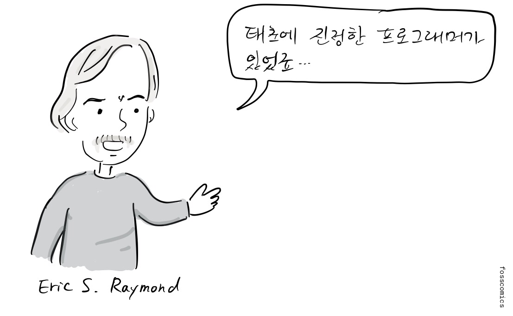
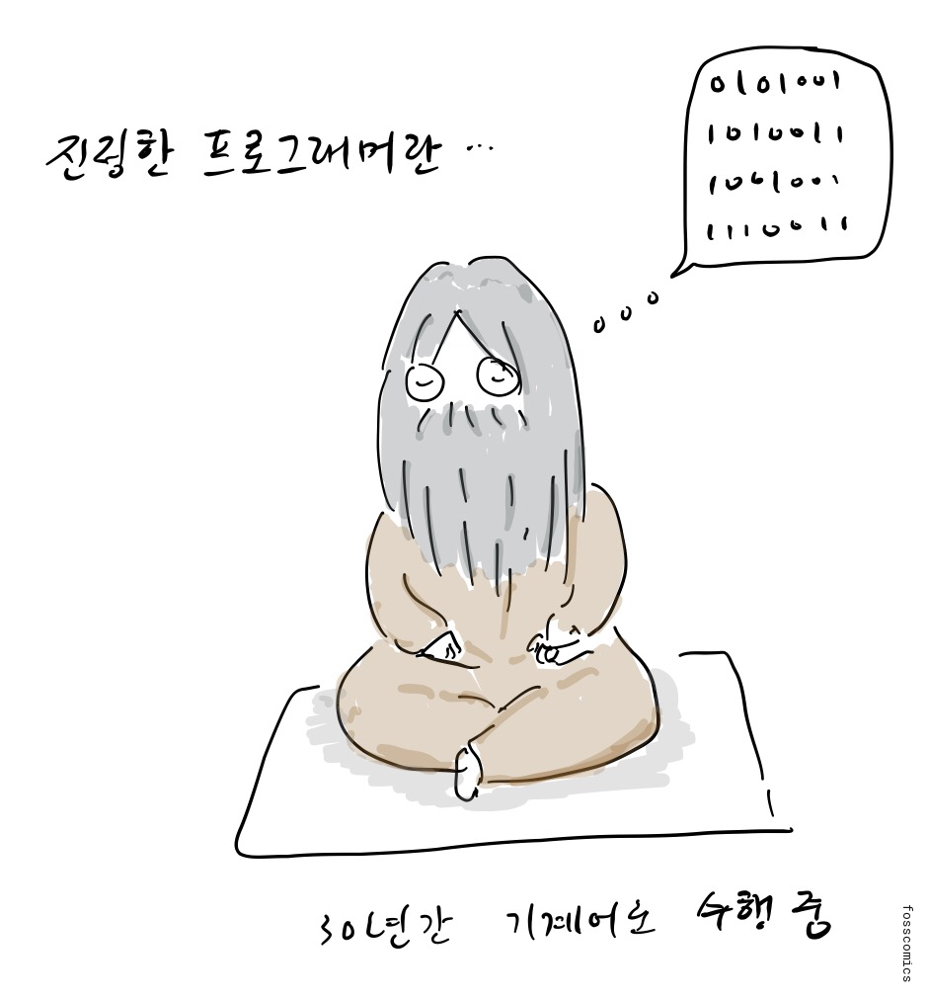
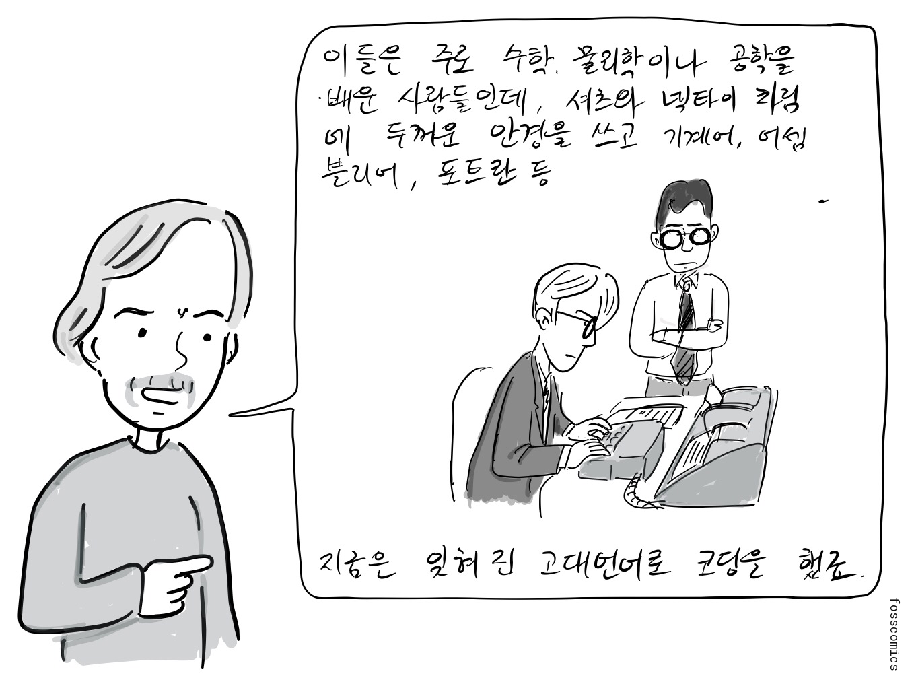
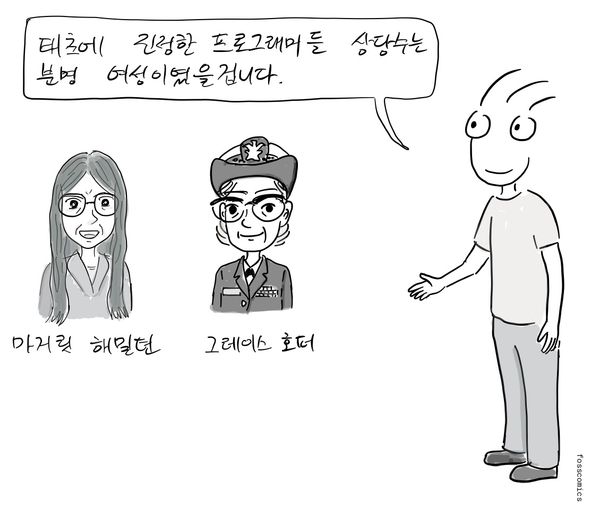
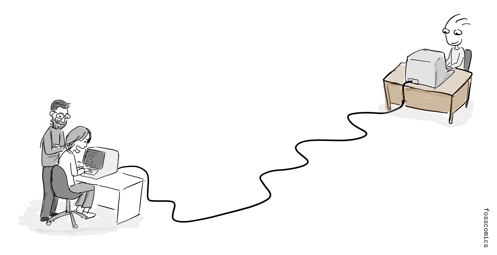
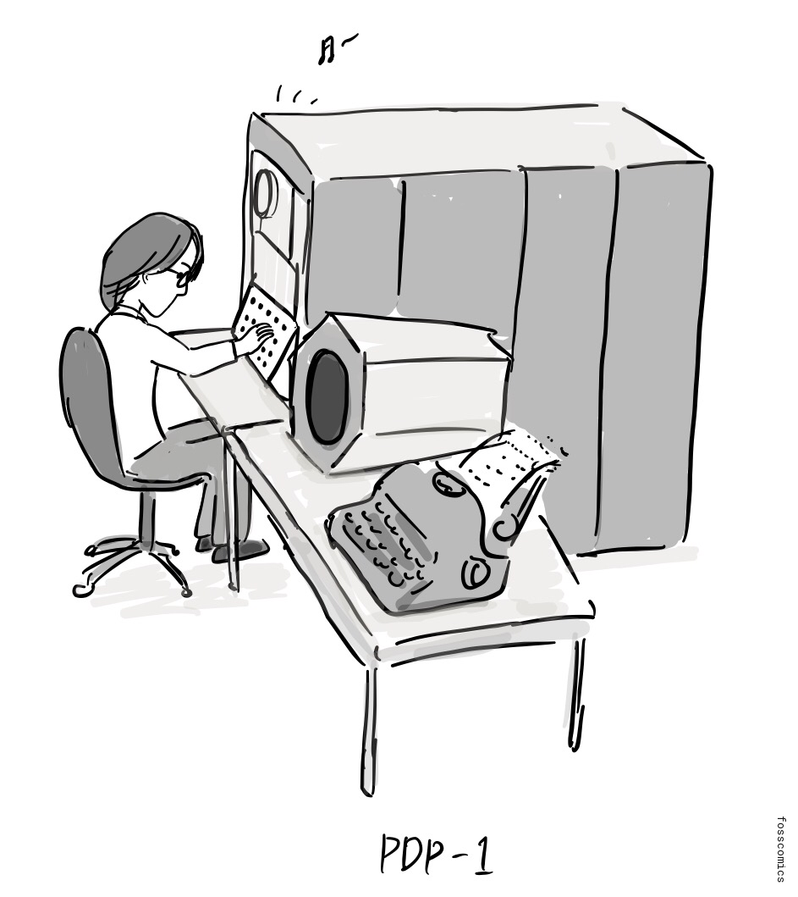
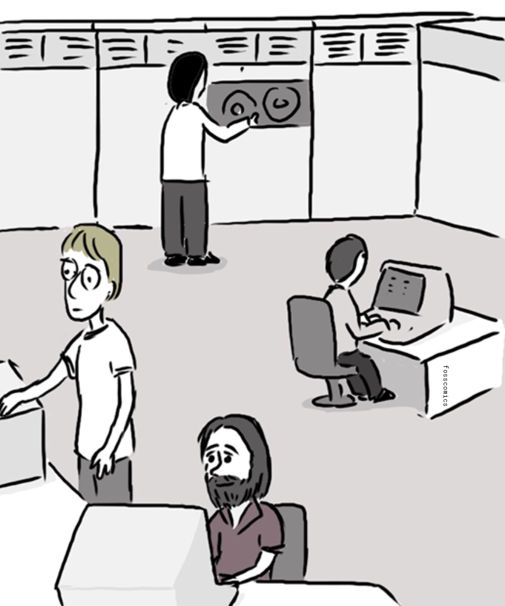

알림: 이번 만화는 에릭 레이몬드의 "[해커문화의 짧은 역사](https://github.com/ganadist/catb/blob/master/md/01_brief_history.markdown)"를 참고했습니다.

> "태초에 진정한 프로그래머가 있었죠 ..."

> "진정한 프로그래머란 ..." \
> "30년간 기계어로 수련 중"

> "이들은 주로 수학, 물리학이나 공학을 배운 사람들인데, 셔츠와 넥타이 차림에 두꺼운 안경을 쓰고 기계어, 어셈블리어, 포트란 등 지금은 잊혀진 고대언어로 코딩을 했죠."

[위키피디아의 프로그래밍 언어 역사 페이지](https://en.wikipedia.org/wiki/History_of_programming_languages)를 보면 컴퓨터 초창기에 개발된 프로그래밍 언어들을 찾아볼 수 있다. 처음 들어보는 프로그래밍 언어가 있다면, 지금은 더 이상 쓰이지 않는 고대 언어일 가능성이 크다.

물론 당시 여성 프로그래머들의 활약도 빼놓을 수 없다.

> "태초에 진정한 프로그래머들 상당수는 분명 여성이었을겁니다."

이러한 진정한 프로그래머들이 만들어 놓은 문화는 대화형 컴퓨팅과 네트워크를 발전시켰고, 오늘날의 오픈 소스 해커 문화에도 영향을 주었다[&lbrack;1&rbrack;][1].

MIT의 초기 해커 문화는 PDP-1이 도착하기 전 테크 모델 철도 클럽에서 시작되었다. DEC는 1959년에 PDP-1을 선보였고, MIT는 1960년에 초기형 한 대를 받았다. 당시 PDP-1을 접한 학생들은 재미로 [Spacewar!](https://en.wikipedia.org/wiki/Spacewar!)라는 비디오 게임을 만들었다. 이 게임은 가장 초기의 비디오 게임 가운데 하나로 큰 영향을 남겼다. 이들은 문서 편집기와 체스 프로그램도 만들었고, 컴퓨터 음악을 연주하기도 했다.

아래 유튜브 동영상에서 PDP-1으로 음악을 연주하고 Spacewar!를 실행하는 모습을 볼 수 있다.

<iframe loading="lazy" class="youtube-player" width="1176" height="662" src="https://www.youtube.com/embed/7bzWnaH-0sg?version=3&amp;rel=1&amp;showsearch=0&amp;showinfo=1&amp;iv_load_policy=1&amp;fs=1&amp;hl=en-US&amp;autohide=2&amp;wmode=transparent" allowfullscreen="true" style="border:0;" sandbox="allow-scripts allow-same-origin allow-popups allow-presentation allow-popups-to-escape-sandbox"></iframe>

당시 MIT는 프로젝트 MAC의 AI 그룹과 이후 인공지능연구소를 중심으로 해커 문화의 주요 거점이 되었다. 존 매카시는 1958년 MIT에서 [Lisp](https://ko.wikipedia.org/wiki/리습)를 개발했다. 1967년 무렵 AI 그룹의 프로그래머들은 PDP-6에서 [ITS(Incompatible Timesharing System)](https://en.wikipedia.org/wiki/Incompatible_Timesharing_System)라는 시분할 운영체제를 개발하기 시작했고, 이후 PDP-10 계열 컴퓨터에서도 개발을 이어갔다. 이들은 소프트웨어와 기술 아이디어를 다른 대학과 연구기관에 무료로 제공했다. 인터넷의 전신인 ARPANET에 MIT 시스템이 연결된 이후, 이러한 프로그램과 작업 방식은 연결된 다른 공동체로 더 쉽게 퍼져나갔다.

## 미국 컴퓨터 역사 박물관 읽을거리
1. PDP-1 복원 프로젝트, [미국 컴퓨터 역사 박물관](https://www.computerhistory.org/pdp-1)
2. PDP-1 시연 연구실, [미국 컴퓨터 역사 박물관](https://computerhistory.org/exhibits/pdp-1/)

## 참고 자료

1. 에릭 레이몬드, [해커문화의 짧은 역사](https://github.com/ganadist/catb/blob/master/md/01_brief_history.markdown)

[1]: https://github.com/ganadist/catb/blob/master/md/01_brief_history.markdown "에릭 레이몬드, 해커문화의 짧은 역사"