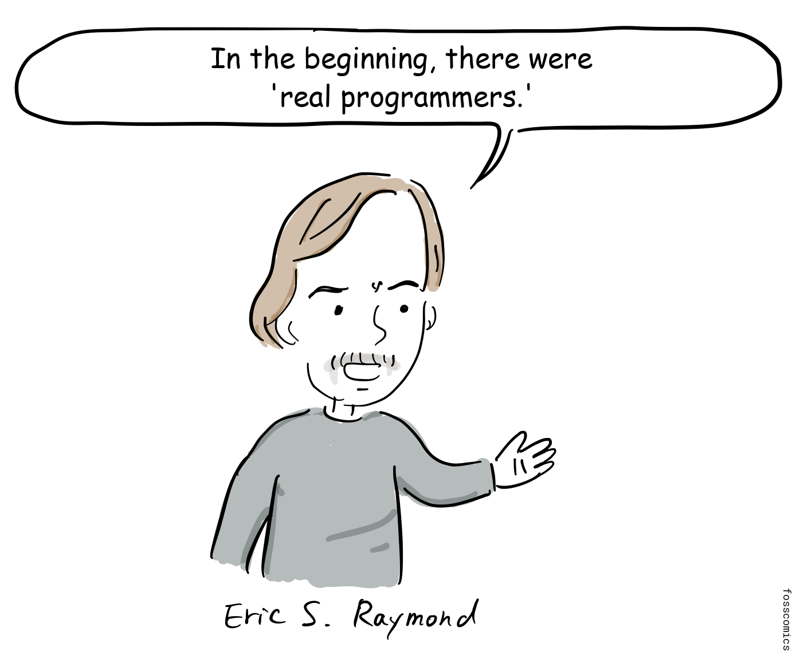
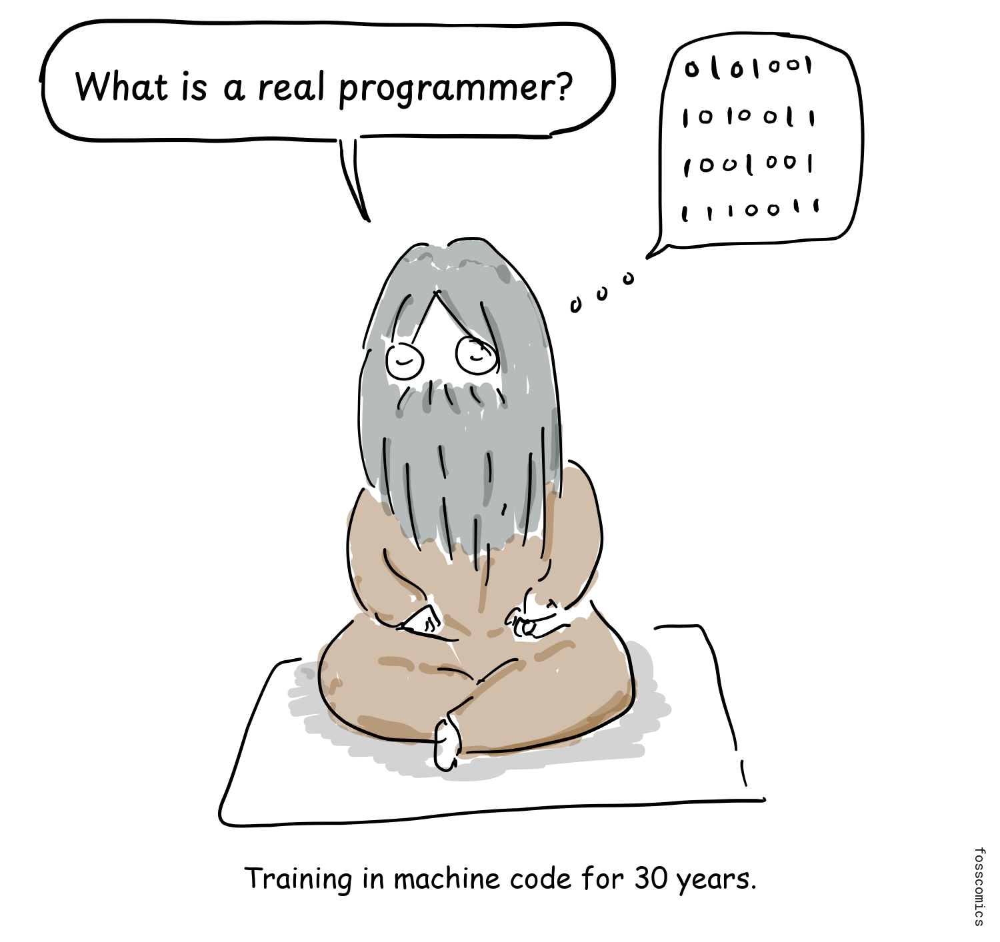
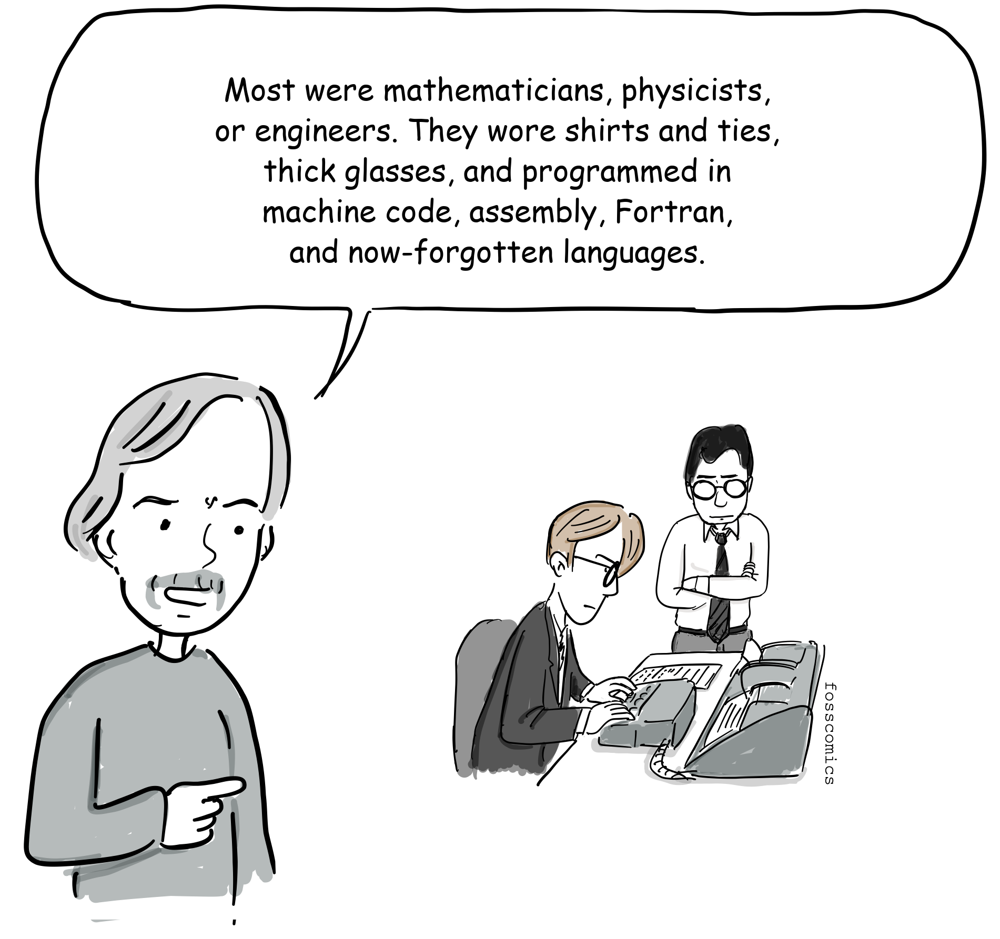
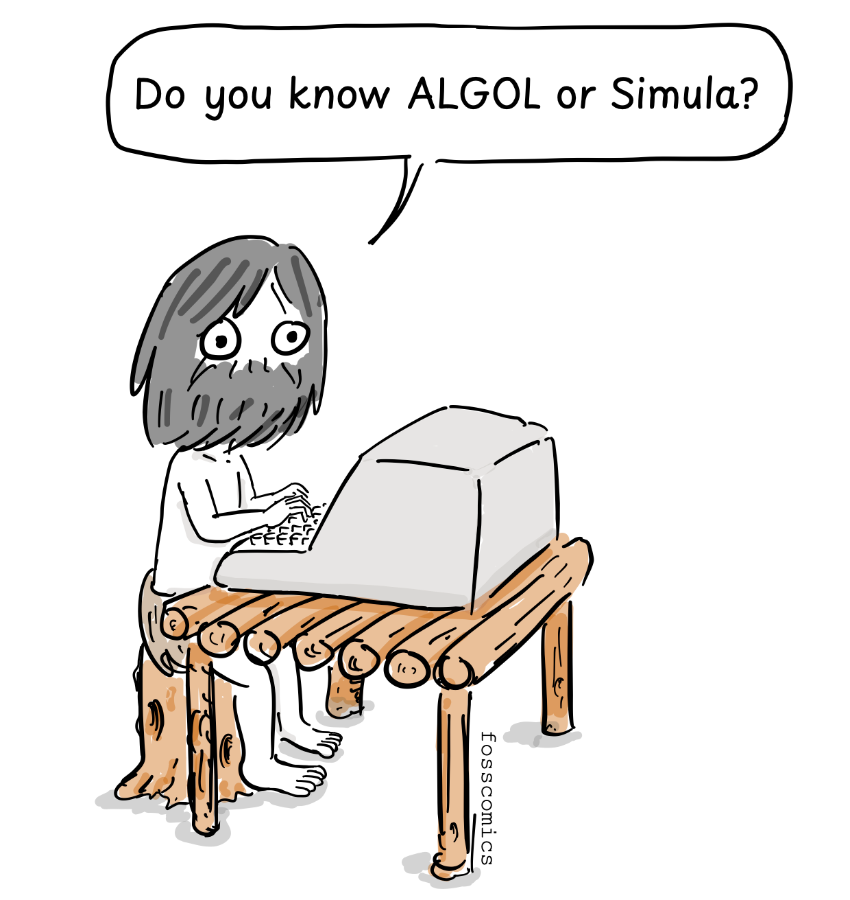
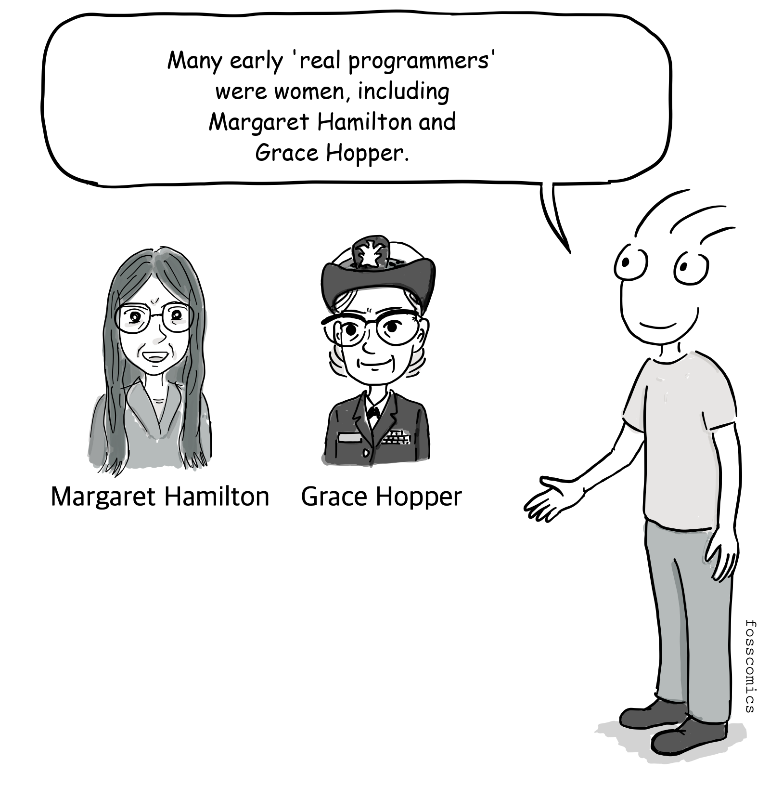
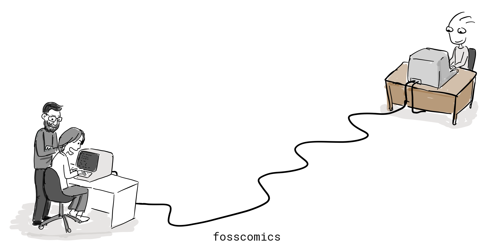
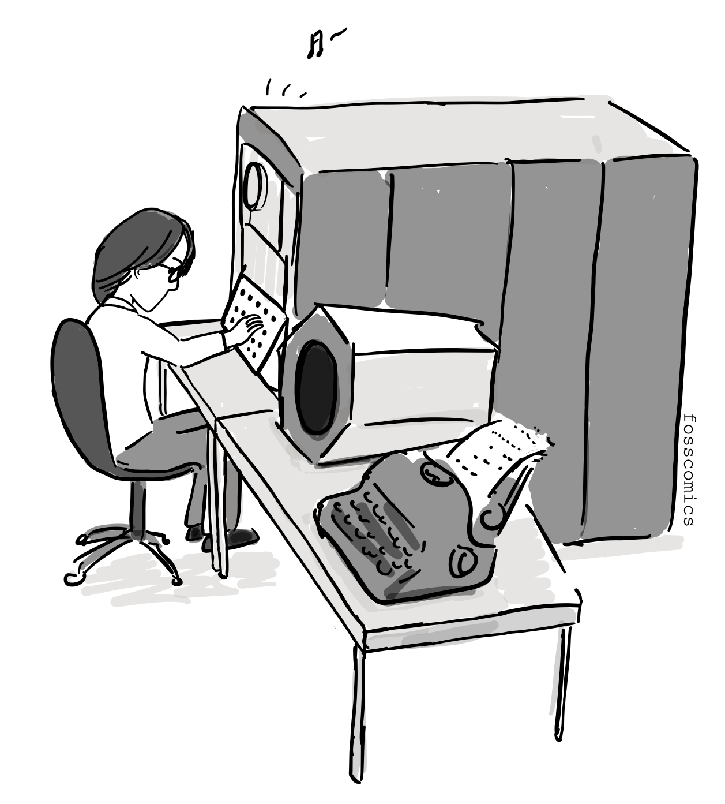
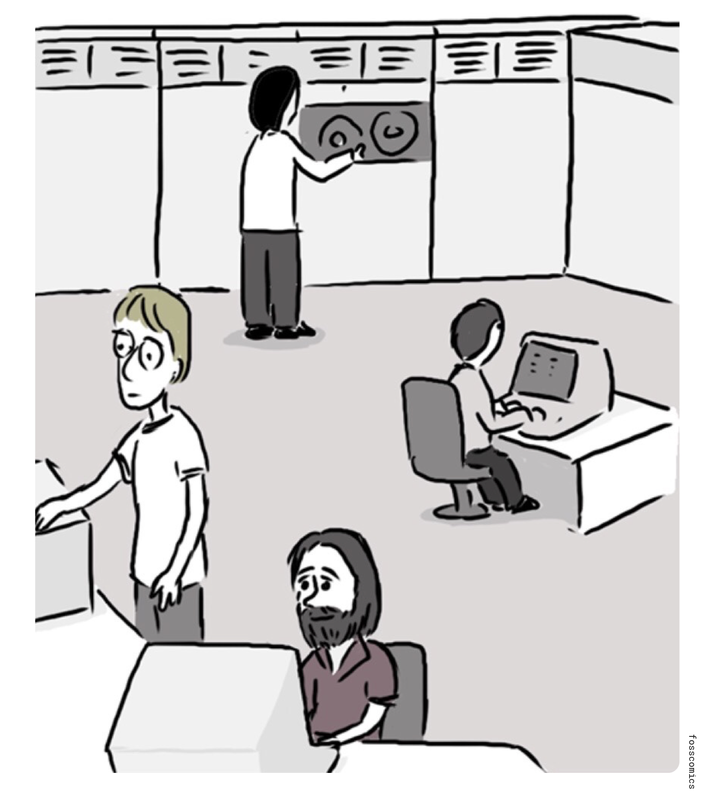

Note: These comics were written with reference to Eric S. Raymond's "[A Brief History of Hackerdom](http://www.catb.org/~esr/writings/cathedral-bazaar/hacker-history/)." The phrase "real programmers" is Raymond's retrospective framing, not a neutral historical category.

> "In the beginning, there were 'real programmers.'"

> "What is a real programmer?" \
> "Training in machine code for 30 years."

> "These were mostly people who had studied mathematics, physics, or engineering, and they wore dress shirts and ties, thick horn-rimmed glasses, and wrote code in machine language, assembler, Fortran, and ancient computer languages that are now forgotten."

If you visit [the Wikipedia page on the history of programming languages](https://en.wikipedia.org/wiki/History_of_programming_languages), you will find a long list of languages developed in the early days of computing. You may encounter some languages on the list that you've never heard of before. These are likely to be ancient, obsolete languages that are no longer in use.

> "Do you know ALGOL or Simula?"

Of course, we must also acknowledge the contributions of women programmers during this period.

> "Many early 'real programmers' were women, including Margaret Hamilton and Grace Hopper."

This culture of early programmers helped develop computing and networks. It also contributed to today's hacker and open-source cultures[&lbrack;1&rbrack;][1].

MIT's early hacker culture had roots in the Tech Model Railroad Club before the PDP-1 arrived. Digital Equipment Corporation introduced the PDP-1 in 1959, and MIT received an early machine in 1960. Students and staff who encountered it created a text editor and a chess program, experimented with computer music, and developed [Spacewar!](https://en.wikipedia.org/wiki/Spacewar!) for fun. Spacewar! became one of the earliest and most influential video games.

In the YouTube video below, you can see the music playing and Spacewar! running on PDP-1.

<iframe width="560" height="315" src="https://www.youtube.com/embed/7bzWnaH-0sg?si=Y6mJVLcK9A5pPsQf" title="YouTube video player" frameborder="0" allow="accelerometer; autoplay; clipboard-write; encrypted-media; gyroscope; picture-in-picture; web-share" referrerpolicy="strict-origin-when-cross-origin" allowfullscreen></iframe>

At the time, MIT was becoming a major center of hacker culture through Project MAC's AI group and the later Artificial Intelligence Laboratory. John McCarthy developed [Lisp](https://en.wikipedia.org/wiki/Lisp_(programming_language)) at MIT in 1958. Around 1967, programmers in the AI group began developing [ITS (Incompatible Timesharing System)](https://en.wikipedia.org/wiki/Incompatible_Timesharing_System) on the PDP-6; development later continued on PDP-10 computers. They shared software free of charge, along with technical ideas, with other universities and research institutions. After MIT's systems joined ARPANET, a precursor to the Internet, these programs and practices spread more easily to connected communities.

## Readings from the Computer History Museum
1. PDP-1 Restoration Project, [chm](https://www.computerhistory.org/pdp-1)
2. PDP-1 Demo Lab, [chm](https://computerhistory.org/exhibits/pdp-1/)

## References
1. Eric S. Raymond, A Brief History of Hackerdom, [http://www.catb.org](http://www.catb.org/~esr/writings/cathedral-bazaar/hacker-history/)

[1]: http://www.catb.org/~esr/writings/cathedral-bazaar/hacker-history/ "Eric Steven Raymond, A Brief History of Hackerdom, http://www.catb.org"
