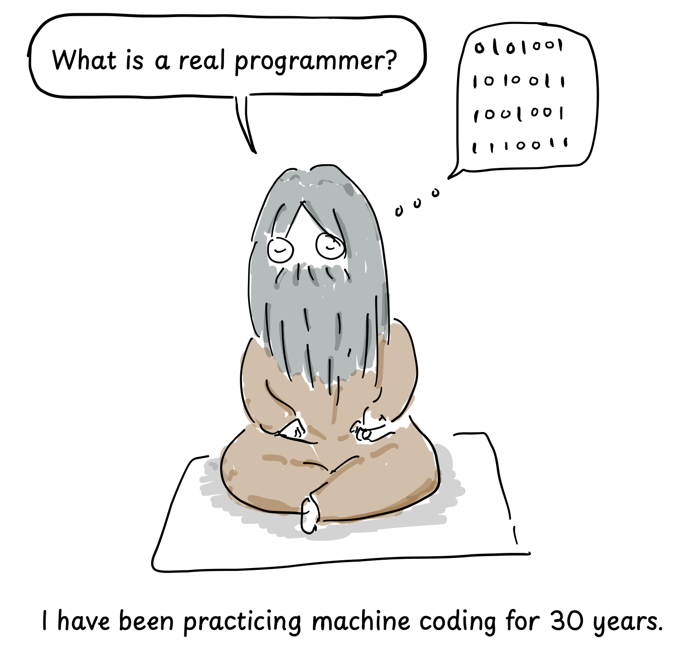

Note: These comics were written with a reference to  “[A Brief History of Hackerdom](https://www.google.com/url?q=http://www.catb.org/~esr/writings/cathedral-bazaar/hacker-history/\&sa=D\&source=editors\&ust=1711344815826052\&usg=AOvVaw1hhNtgiZ4iwOVv7n966JhY)” by Eric S. Raymond.

> “In the beginning, there were real programmers.”

> “What is a real programmer?”\
> I have been practicing machine coding for 30 years

> “These were mostly people who had studied mathematics, physics or engineering, and they wore dress shirts and ties, thick horn-rimmed glasses, and wrote codes with machine language, assembler, Fortran, and ancient computer languages that are now forgotten.”

If you visit [the Wikipedia page on the History of Programming Languages](https://www.google.com/url?q=https://en.wikipedia.org/wiki/History_of_programming_languages\&sa=D\&source=editors\&ust=1711344815827013\&usg=AOvVaw3UaJts5ZTFuo8WpLDedMCY), you will find a list of the programming languages that were developed in the early days of computing. You may encounter some languages on the list that you've never heard of before - these are likely to be ancient, obsolete languages that are no longer in use.

Of course, we must also acknowledge the contributions of female programmers during this time period.

> “A lot of the real programmers in the beginning were obviously women such as [Margaret Hamilton](https://en.wikipedia.org/wiki/Margaret_Hamilton_\(software_engineer\)) and Grace Hopper."

This culture of real programmers has developed computing and networks. In addition, it has evolved into the open source hacker culture of today[&lbrack;1&rbrack;][1].

The early hacker culture begins with the introduction of the first computer called PDP-1 by MIT in 1961[&lbrack;1&rbrack;][1]. At this time, some students who came across the PDP-1 developed the first video game called [Spacewar!](https://www.google.com/url?q=https://en.wikipedia.org/wiki/Spacewar!\&sa=D\&source=editors\&ust=1711344815828204\&usg=AOvVaw2bc_EyRX-19Ol_owmzNTwB) for fun, and also made a text editor and a chess game. They were also the first to play computer music.

In the YouTube video below, you can see the music playing and Spacewar! running on PDP-1.

<iframe width="560" height="315" src="https://www.youtube.com/embed/7bzWnaH-0sg?si=Y6mJVLcK9A5pPsQf" title="YouTube video player" frameborder="0" allow="accelerometer; autoplay; clipboard-write; encrypted-media; gyroscope; picture-in-picture; web-share" referrerpolicy="strict-origin-when-cross-origin" allowfullscreen></iframe>

At the time, the MIT Artificial Intelligence Lab was the birthplace of hacker culture. In the late 1960s, they developed a time-sharing operating system called  [ITS(Incompatible Timesharing System)](https://en.wikipedia.org/wiki/Incompatible_Timesharing_System)that ran on PDP-10 and a language called [LISP](https://en.wikipedia.org/wiki/Lisp_(programming_language)), which was made available free of charge to other universities and corporations. After the early form of the Internet, the ARPAnet, was connected, the hacker culture spread to other universities and institutions along with ITS.

## References
1. Eric S. Raymond, A Brief History of Hackerdom, [http://www.catb.org](http://www.catb.org/~esr/writings/cathedral-bazaar/hacker-history/)

[1]: http://www.catb.org/~esr/writings/cathedral-bazaar/hacker-history/ "Eric Steven Raymond, A Brief History of Hackerdom, http://www.catb.org"
