## 모형 기차에서 컴퓨터로

:::panel
MIT 해커 문화는 [테크 모델 철도 클럽](https://en.wikipedia.org/wiki/Tech_Model_Railroad_Club)에 뿌리를 두고 있다. 이 동아리는 움직이는 모형 기차를 만들고, 기차끼리 충돌하지 않도록 릴레이 제어 시스템을 연구했다[&lbrack;1&rbrack;][1]. 

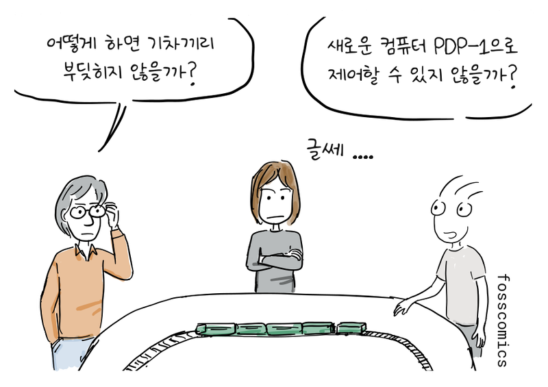
> "어떻게 하면 기차끼리 부딪히지 않을까?" \
> "새로운 컴퓨터 PDP-1으로 제어할 수 있지 않을까?" \
> "글쎄 ...."

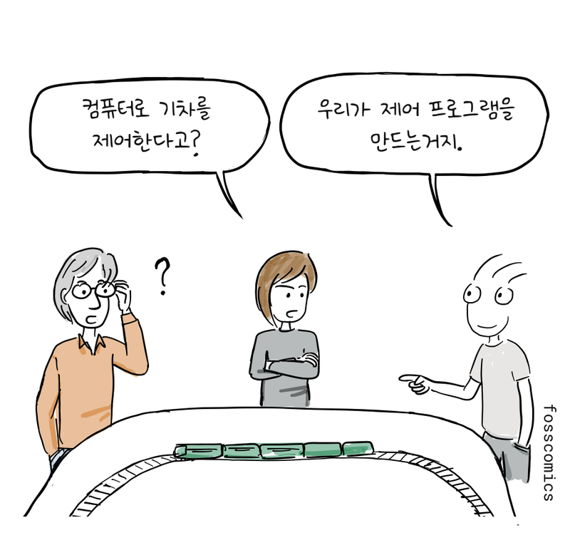
> "컴퓨터로 기차를 제어한다고?" \
> "우리가 제어 프로그램을 만드는거지."
:::

:::panel
참고로, 아래 동영상은 컴퓨터로 움직이는 모형 기차를 제어하는 예를 보여 준다.

<iframe src="https://www.youtube.com/embed/dqLUUXWgba4?si=f4QZp3gTxWdDRnrt" title="YouTube video player" style="display:block; width:100%; max-width:560px; aspect-ratio:16 / 9; margin:0 auto; border:0;" allow="accelerometer; autoplay; clipboard-write; encrypted-media; gyroscope; picture-in-picture; web-share" referrerpolicy="strict-origin-when-cross-origin" allowfullscreen></iframe>

:::

:::panel
DEC에서 만든 [PDP 시리즈](https://en.wikipedia.org/wiki/Programmed_Data_Processor)은 해커 문화에 큰 기여를 했고, 후속 기종은 자유 소프트웨어 탄생의 중요한 환경을 제공했다. 이 컴퓨터들은 비교적 저렴한 가격으로 판매되어 특히 대학에서 인기가 많았고 미니컴퓨터라는 분야를 확립하는 데 기여했다. 참고로, DEC는 1961년 PDP-1을 MIT에 기증했다[&lbrack;2&rbrack;][2].

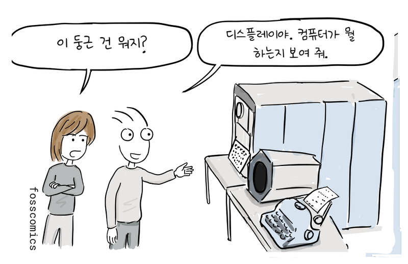
> "이 둥근 건 뭐지?" \
> "디스플레이야. 컴퓨터가 뭘 하는지 보여 줘."
:::

## 밤샘 프로그래밍과 Spacewar!

:::panel
그 후, 테크 모델 철도 클럽 회원들은 TX-0와 이후 PDP-1에 더 많은 시간을 보내게 된다.

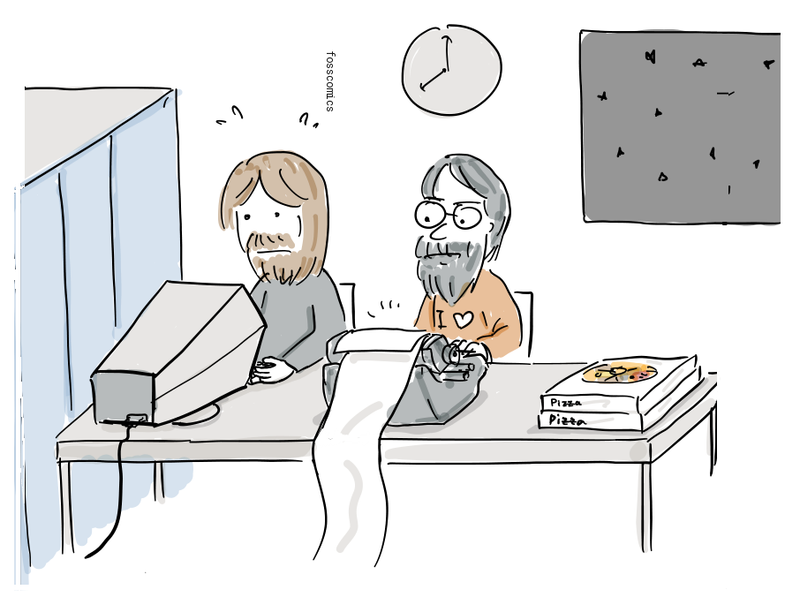
:::

:::panel
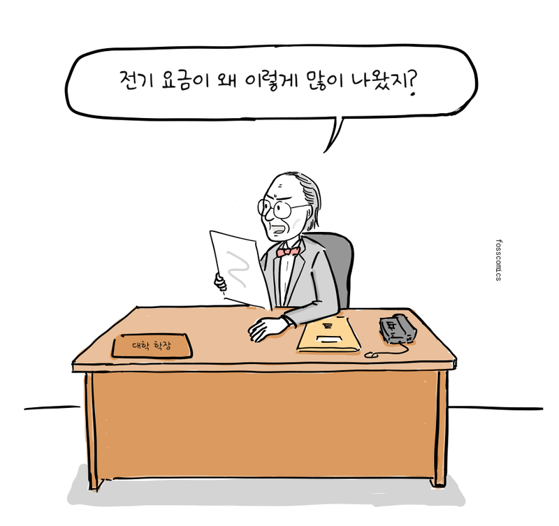
> "전기 요금이 왜 이렇게 많이 나왔지?"

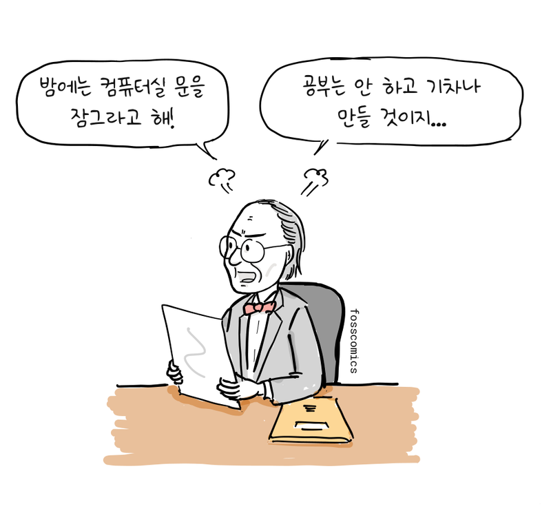
> "밤에는 컴퓨터실 문을 잠그라고 해!" \
> "공부는 안 하고 기차나 만들 것이지..."
:::

:::panel
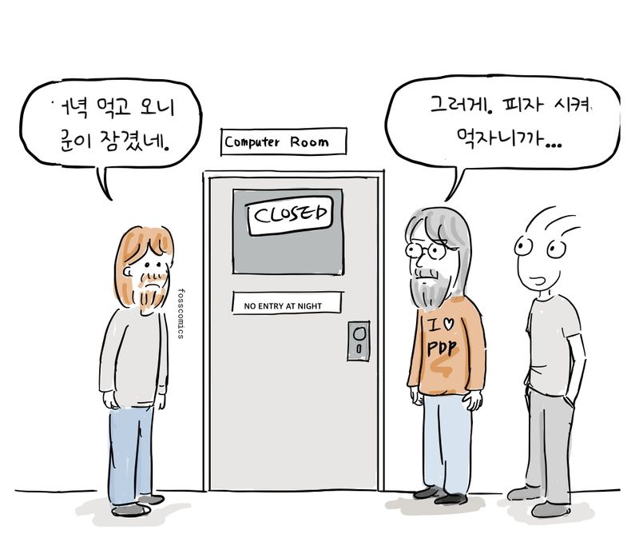
> "저녁 먹고 오니 문이 잠겼네." \
> "그러게. 피자 시켜 먹자니까..."

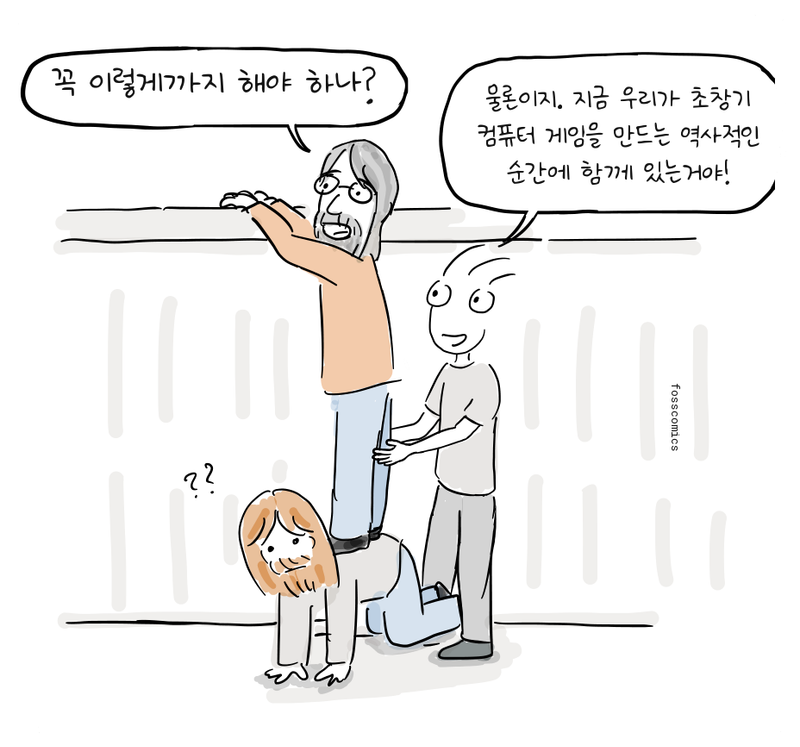
> "꼭 이렇게까지 해야 하나?" \
> "물론이지. 지금 우리가 초창기 컴퓨터 게임을 만드는 역사적인 순간에 함께 있는거야!"
:::

:::panel

그리고 학생들은 재미를 위해 초창기의 가장 영향력 있는 컴퓨터 게임 가운데 하나인 [Spacewar!](https://en.wikipedia.org/wiki/Spacewar!)를 만들었다[&lbrack;5&rbrack;][5].

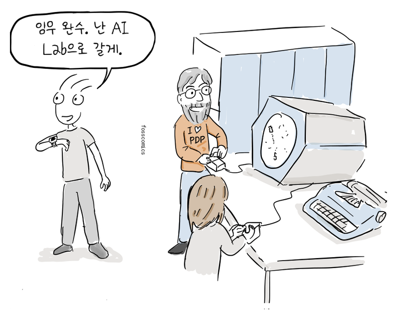
> "임무 완수. 난 AI Lab으로 갈게."
:::

## 인공지능 그룹과 ITS의 탄생

MIT의 초기 해커 공동체는 인공지능 연구의 선구자인 마빈 민스키와 Lisp 언어를 창시한 존 매카시가 이끌던 연구 그룹과 긴밀하게 연결되어 있었다[&lbrack;6&rbrack;][6]. 자유 소프트웨어 운동으로 잘 알려진 리처드 스톨먼도 훗날 MIT 인공지능연구소(AI Lab)에 합류해 이 공동체의 일원이 되었다[&lbrack;7&rbrack;][7].

:::panels columns="3" label="리처드 스톨먼, 마빈 민스키, 존 매카시"

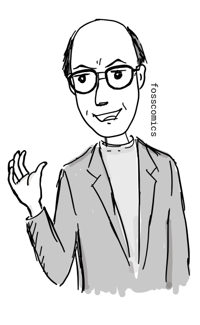
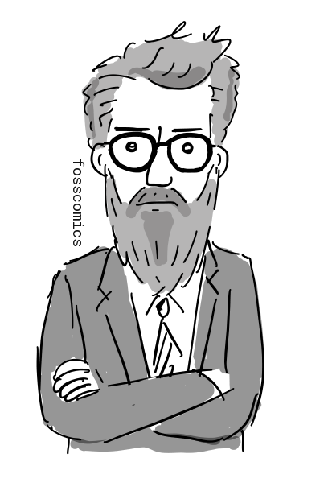
:::

:::panel
1963년 [프로젝트 MAC](https://en.wikipedia.org/wiki/Project_MAC)이 출범하자 민스키가 이끌던 인공지능 그룹도 여기에 참여했다[&lbrack;4&rbrack;][4]. 프로젝트 MAC의 다른 그룹은 GE, 벨 연구소와 함께 [Multics](https://en.wikipedia.org/wiki/Multics)라는 운영체제를 개발하고 있었다. MIT의 초기 멀틱스 시스템에는 GE-645가 사용되었다[&lbrack;8&rbrack;][8].

:::

:::panel rounded="true"

하지만 Multics의 설계 방향에 동의하지 않았던 인공지능 그룹의 프로그래머들은 1967년부터 자신들의 운영체제인 ITS(Incompatible Timesharing System)를 개발하기 시작했다[&lbrack;3&rbrack;][3]. 이 그룹은 1970년 프로젝트 MAC에서 분리되어 독립된 인공지능연구소가 되었다[&lbrack;4&rbrack;][4].

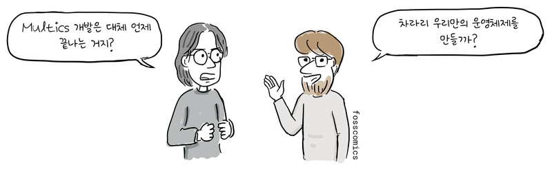
> "Multics 개발은 대체 언제 끝나는 거지?" \
> "차라리 우리만의 운영체제를 만들까?"
:::

:::panel
MIT 해커 [톰 나이트](https://en.wikipedia.org/wiki/Tom_Knight_(scientist))는 최초의 ITS 커널을 개발했다.

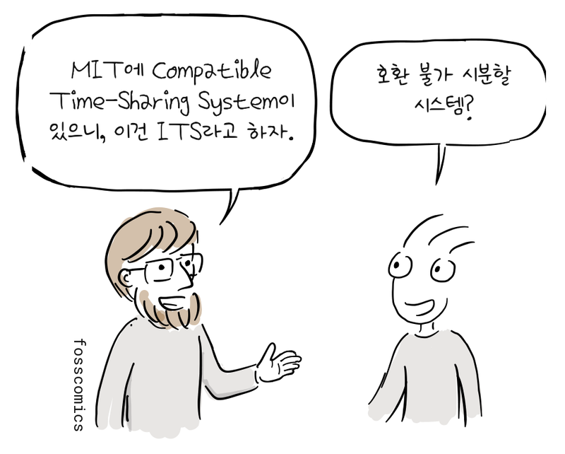
> "MIT에 Compatible Time-Sharing System이 있으니, 이건 ITS라고 하자." \
> "호환 불가 시분할 시스템?"
:::

:::panel
ITS 개발은 PDP-6에서 시작됐고 시스템은 어셈블리어로 작성되었다.

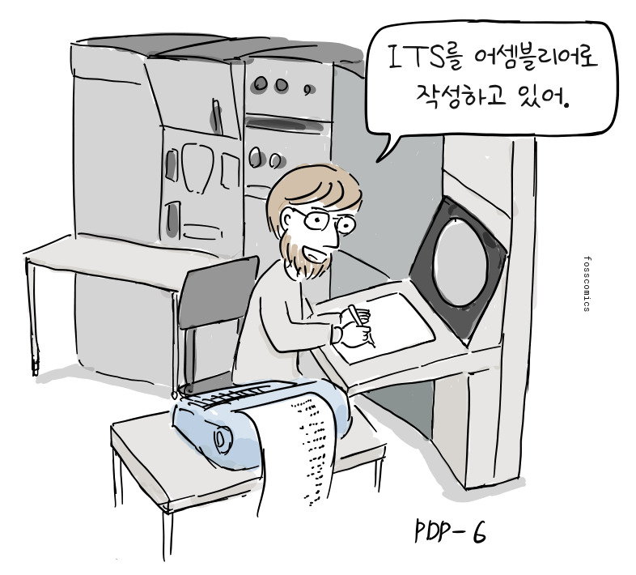
> "ITS를 어셈블리어로 작성하고 있어."
:::

## 열린 시스템과 공유 문화

:::panel rounded="true"
당시 ITS 운영체제는 오늘날에는 찾아보기 힘든 독특한 사용자 환경을 제공했다. 초기에는 로그인하지 않고도 시스템을 사용할 수 있었고, 사용자가 자신의 이름을 밝혀도 암호가 필요하지 않았다. 문서와 소스 코드를 포함한 모든 파일도 누구나 편집할 수 있었다.

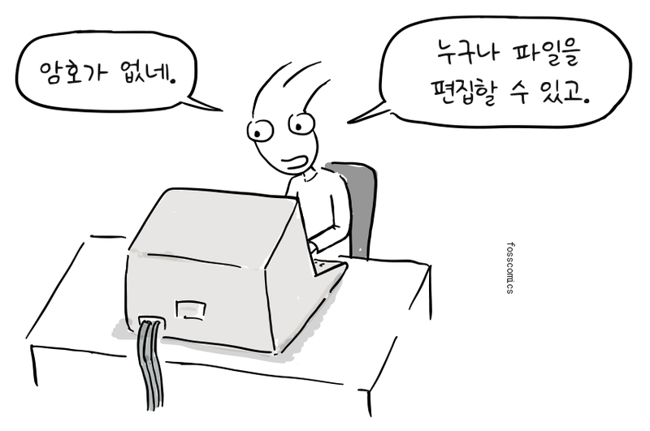
> "암호가 없네." \
> "누구나 파일을 편집할 수 있고."
:::

:::panel rounded="true"

또한, MIT 내부뿐만 아니라 다른 기관이나 학교에서도 ARPANET을 통해 ITS에 접속할 수 있었다. 이러한 ITS의 열린 철학과 협력적인 공동체 환경은 해커 문화와 자유·오픈 소스 소프트웨어 운동에 큰 영향을 끼쳤으며, 훗날 위키로 구현된 개방형 협업 지식 공유 모델을 앞서 보여 주었다[&lbrack;3&rbrack;][3].

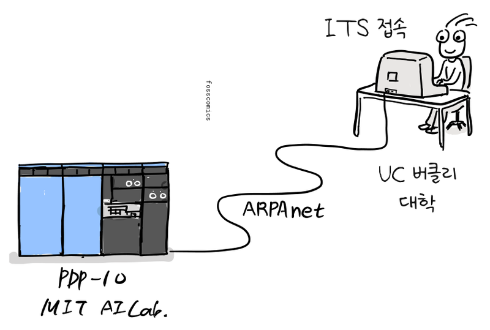
:::

:::panel

훗날 자유 소프트웨어 운동을 시작한 리처드 스톨먼도 1971년부터 MIT AI Lab에서 일하면서 공동체의 일원으로 ITS 운영체제 개발에 참여했고, 여기서 해커 문화의 영향을 받는다.

:::

:::panel

당시 많은 기관에서는 소프트웨어를 하드웨어의 일부로 취급해 별도의 비용 없이 공유하고 사용했다. 일부 기업도 소스 코드와 함께 소프트웨어를 배포해 사용자가 수정하고 복사할 수 있도록 했다. 하지만 이런 관행이 어디서나 통용된 것은 아니었고, 상용 소프트웨어도 이미 존재했다.

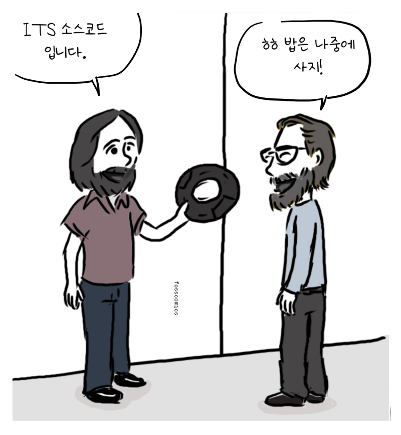
> "ITS 소스코드 입니다." \
> "ㅎㅎ 밥은 나중에 사지!"
:::

## 참고 자료

1. 해커, [위키백과](https://en.wikipedia.org/wiki/Hacker)
2. PDP-1, [위키백과](https://en.wikipedia.org/wiki/PDP-1)
3. 비호환 시분할 시스템(ITS), [위키백과](https://en.wikipedia.org/wiki/Incompatible\_Timesharing\_System)
4. 프로젝트 MAC, [위키백과](https://en.wikipedia.org/wiki/Project_MAC)
5. 스페이스워!, [미국 컴퓨터 역사 박물관](https://www.computerhistory.org/pdp-1/spacewar/)
6. 존 매카시, [위키백과](https://en.wikipedia.org/wiki/John_McCarthy_(computer_scientist))
7. GNU 프로젝트, [리처드 스톨먼](https://www.gnu.org/gnu/thegnuproject.en.html)
8. GE-645 멀틱스 시스템의 그림과 구성, [MIT, 제롬 솔처](https://web.mit.edu/saltzer/www/multics.html)

[1]: https://en.wikipedia.org/wiki/Hacker "해커, 위키백과"
[2]: https://en.wikipedia.org/wiki/PDP-1 "PDP-1, 위키백과"
[3]: https://en.wikipedia.org/wiki/Incompatible\_Timesharing\_System "비호환 시분할 시스템(ITS), 위키백과"
[4]: https://en.wikipedia.org/wiki/Project_MAC "프로젝트 MAC, 위키백과"
[5]: https://www.computerhistory.org/pdp-1/spacewar/ "스페이스워!, 미국 컴퓨터 역사 박물관"
[6]: https://en.wikipedia.org/wiki/John_McCarthy_(computer_scientist) "존 매카시, 위키백과"
[7]: https://www.gnu.org/gnu/thegnuproject.en.html "GNU 프로젝트, 리처드 스톨먼"
[8]: https://web.mit.edu/saltzer/www/multics.html "GE-645 멀틱스 시스템의 그림과 구성, MIT, 제롬 솔처"
