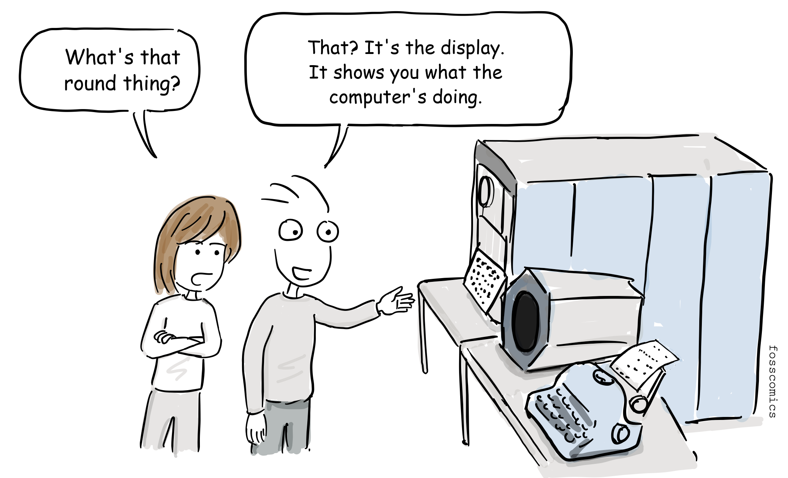
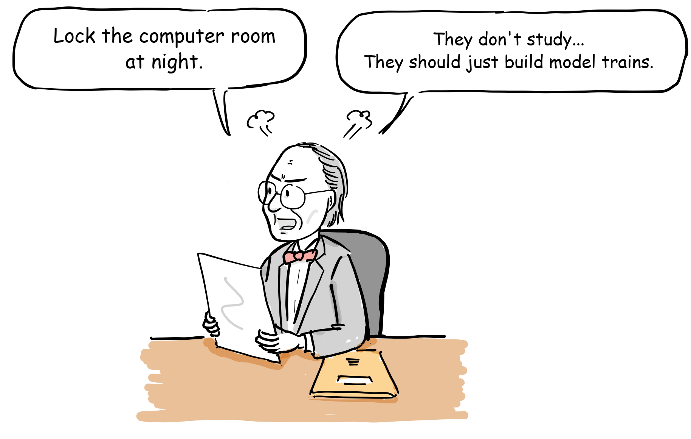
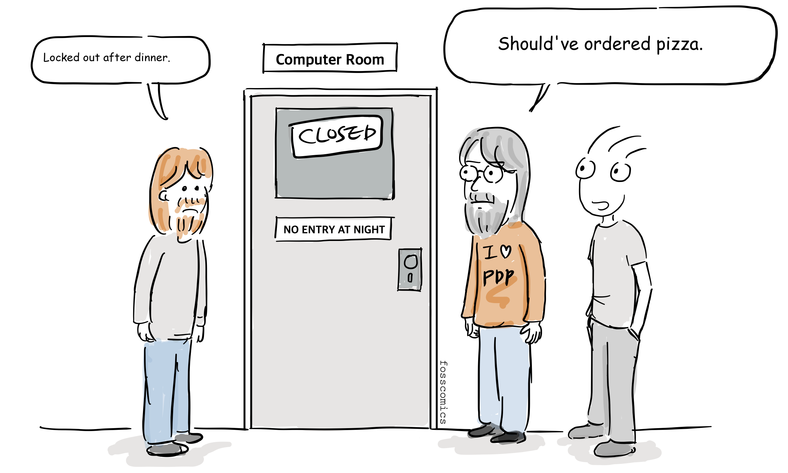
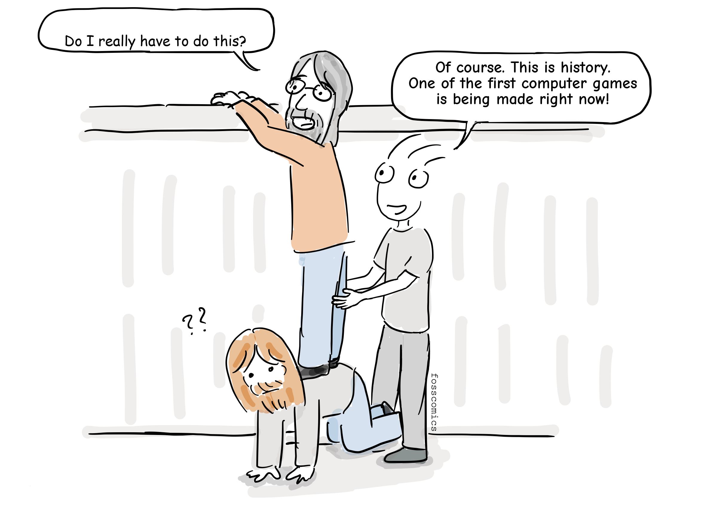
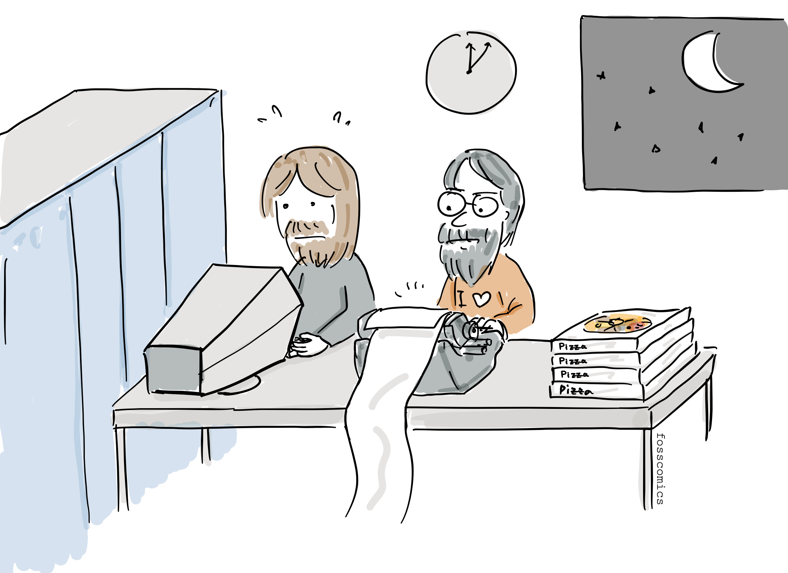
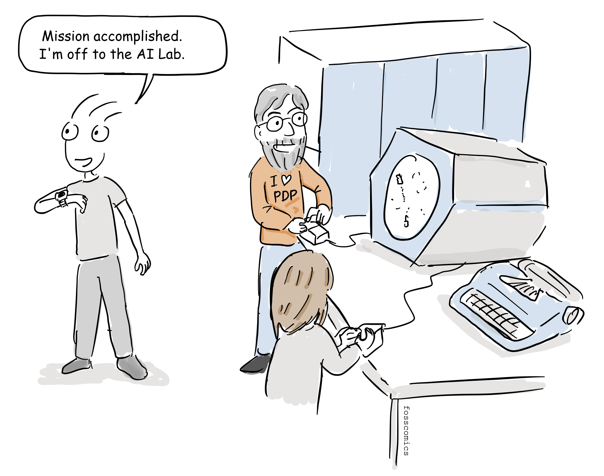
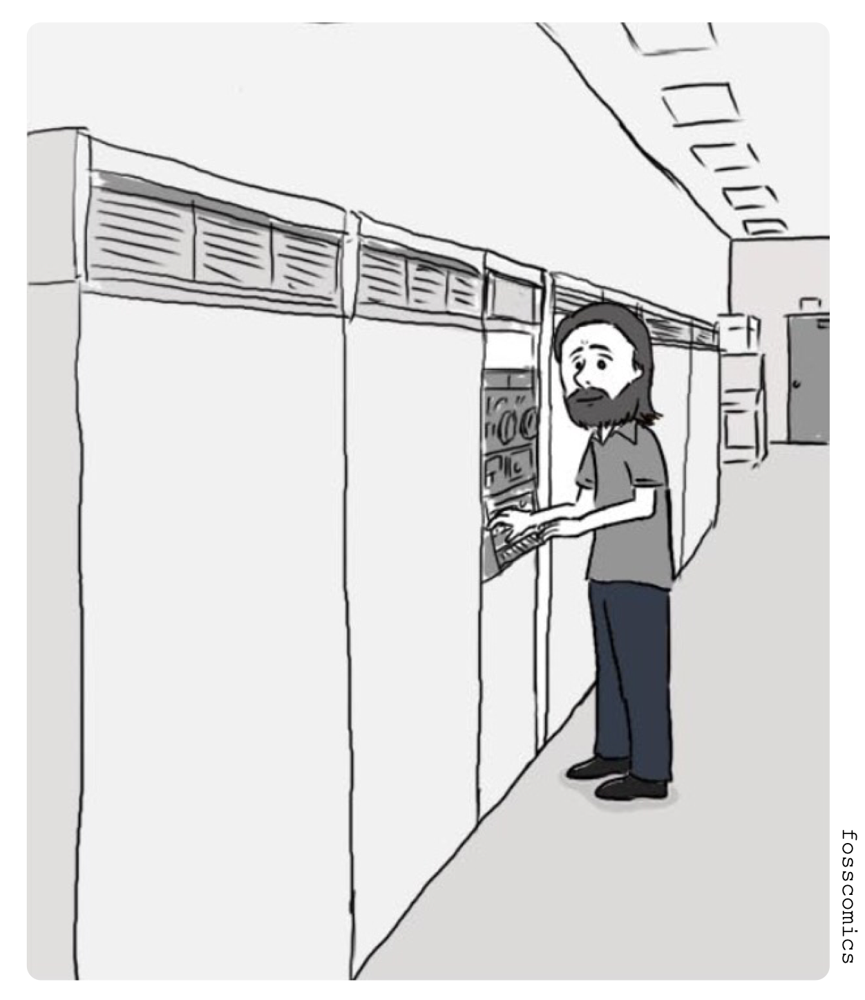
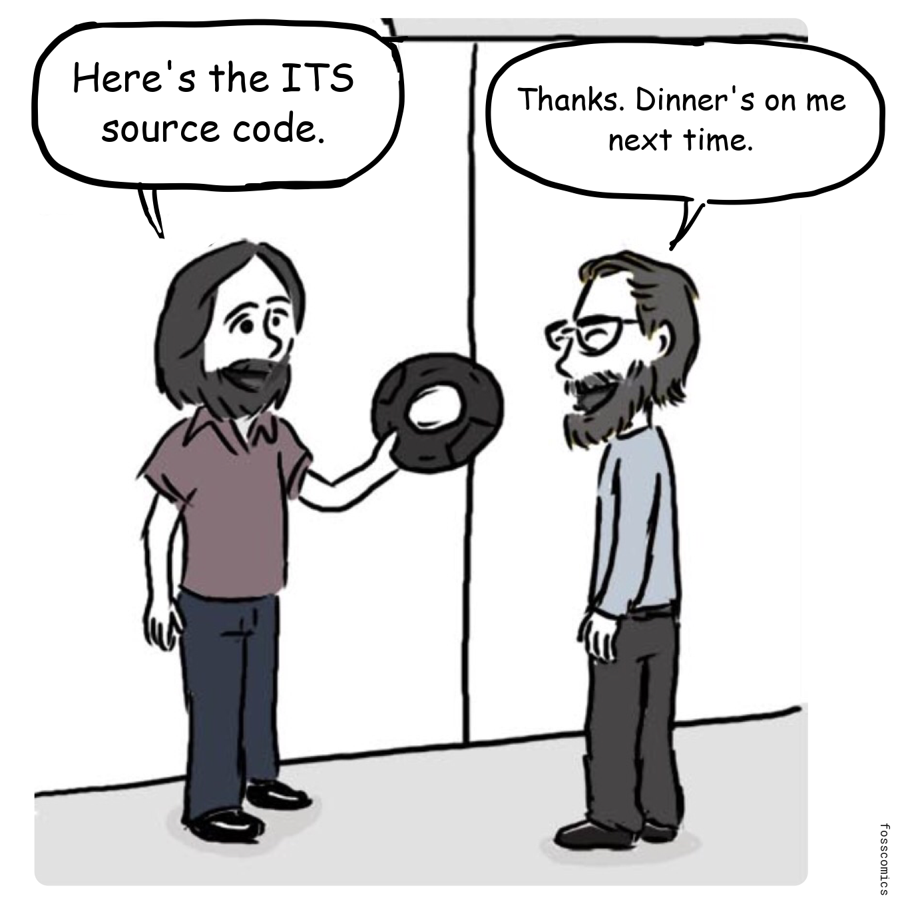

MIT's hacker culture started with the [Tech Model Railroad Club](https://en.wikipedia.org/wiki/Tech_Model_Railroad_Club) at MIT. This club built a model railroad and developed relay systems to keep the trains from colliding with each other[&lbrack;1&rbrack;][1].

> "How do we keep the trains from crashing?"\
> "Hmm..."\
> "What if we controlled them with the new PDP-1?"

> "Control the trains with the PDP-1?" \
> "Sure. We'd just write a control program."

For reference, the video below shows how a computer can be used to control moving model trains.

<iframe src="https://www.youtube.com/embed/dqLUUXWgba4?si=f4QZp3gTxWdDRnrt" title="YouTube video player" style="display:block; width:100%; max-width:560px; aspect-ratio:16 / 9; margin:0 auto; border:0;" allow="accelerometer; autoplay; clipboard-write; encrypted-media; gyroscope; picture-in-picture; web-share" referrerpolicy="strict-origin-when-cross-origin" allowfullscreen></iframe>

The [PDP series](https://en.wikipedia.org/wiki/Programmed_Data_Processor), made by Digital Equipment Corporation (DEC), contributed greatly to hacker culture, and later models provided an important environment for the birth of free software. These relatively inexpensive computers were particularly popular at universities and helped establish the minicomputer category. For reference, DEC donated a PDP-1 to MIT in 1961[&lbrack;2&rbrack;][2].

> "What's that round thing?" \
> "That? It's the display. It shows you what the computer's doing."

Members of the Tech Model Railroad Club spent more time with the TX-0 and, later, the PDP-1.

> "How did the electric bill get this high?"

> "Lock the computer room at night." \
> "They don't study... They should just build model trains."

> "Locked out after dinner." \
> "Should've ordered pizza."

> "Do I really have to do this?" \
> "Of course. This is history. One of the first computer games is being made right now!"

For fun, the students created one of the earliest and most influential computer games, called [Spacewar!](https://en.wikipedia.org/wiki/Spacewar/)[&lbrack;4&rbrack;][4].

> "Mission accomplished. I'm off to the AI Lab."

At the time, the MIT Artificial Intelligence Group was a center of hacker culture within Project MAC. A separate Project MAC group was developing an operating system called [Multics](https://en.wikipedia.org/wiki/Multics) with GE and Bell Labs. However, because of differing opinions about operating system development, the AI programmers began developing their own operating system, ITS (Incompatible Timesharing System), in 1967[&lbrack;3&rbrack;][3][&lbrack;5&rbrack;][5].

> "Is Multics ever going to be finished?"\
> "Why don't we build our own operating system?"

MIT hacker [Tom Knight](https://en.wikipedia.org/wiki/Tom_Knight_(scientist)) (right) developed the first kernel for ITS.

> "MIT had the Compatible Time-Sharing System. Let's call this one ITS." \
> "Incompatible Timesharing System?"

Actual development started on the PDP-6, and it was all written in assembly language.

> "I'm writing ITS in assembly."

At the time, the ITS operating system had a unique user environment rarely found today. In the early days, people could use the system without logging in, and users who identified themselves did not need a password. All files, including documentation and source code, could be edited by anyone.

> "No password?" \
> "And anyone can edit the files."

In addition, it was possible to access ITS not only inside MIT but also from other institutions or schools through ARPAnet. The wide-open ITS philosophy and collaborative online community had a great impact on hacker culture and the free and open source software movement, and anticipated the open, collaborative knowledge-sharing model later embodied by wikis[&lbrack;3&rbrack;][3].

Richard Stallman, who later started the free software movement, also participated in the development of the ITS operating system as a member of the community while working at the MIT AI Lab beginning in 1971, where he was influenced by the hacker culture.

At many institutions, software was treated as part of the hardware package and was shared and used without separate payment. Some companies also distributed their software with source code, allowing users to modify and copy it.

> "Here's the ITS source code." \
> "Thanks. Dinner's on me next time."

## References

1. Hacker, [Wikipedia](https://en.wikipedia.org/wiki/Hacker)
2. PDP-1, [Wikipedia](https://en.wikipedia.org/wiki/PDP-1)
3. Incompatible Timesharing System, [Wikipedia](https://en.wikipedia.org/wiki/Incompatible_Timesharing_System)
4. Spacewar!, [Computer History Museum](https://www.computerhistory.org/pdp-1/spacewar/)
5. Project MAC, [Multics History Project](https://www.multicians.org/project-mac.html)

[1]: https://en.wikipedia.org/wiki/Hacker "Hacker, Wikipedia"
[2]: https://en.wikipedia.org/wiki/PDP-1 "PDP-1, Wikipedia"
[3]: https://en.wikipedia.org/wiki/Incompatible_Timesharing_System "Incompatible Timesharing System, Wikipedia"
[4]: https://www.computerhistory.org/pdp-1/spacewar/ "Spacewar!, Computer History Museum"
[5]: https://www.multicians.org/project-mac.html "Project MAC, Multics History Project"
