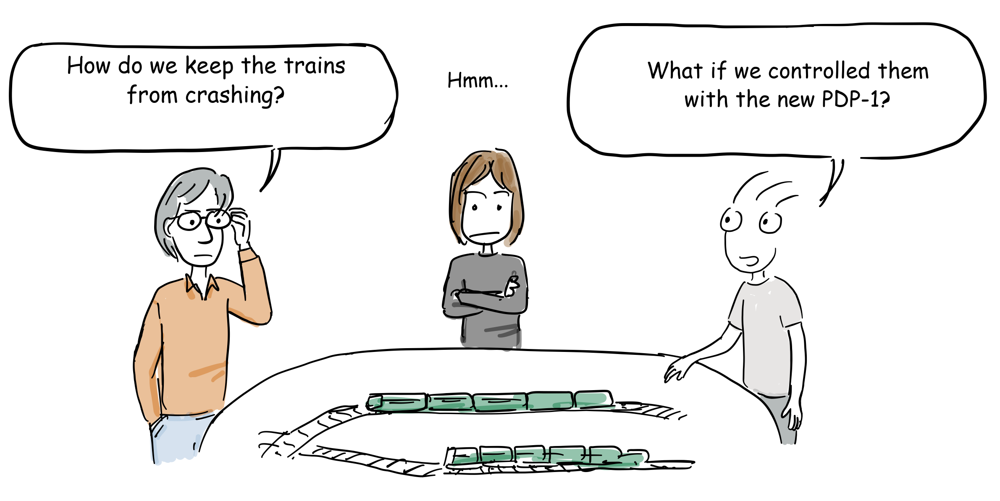
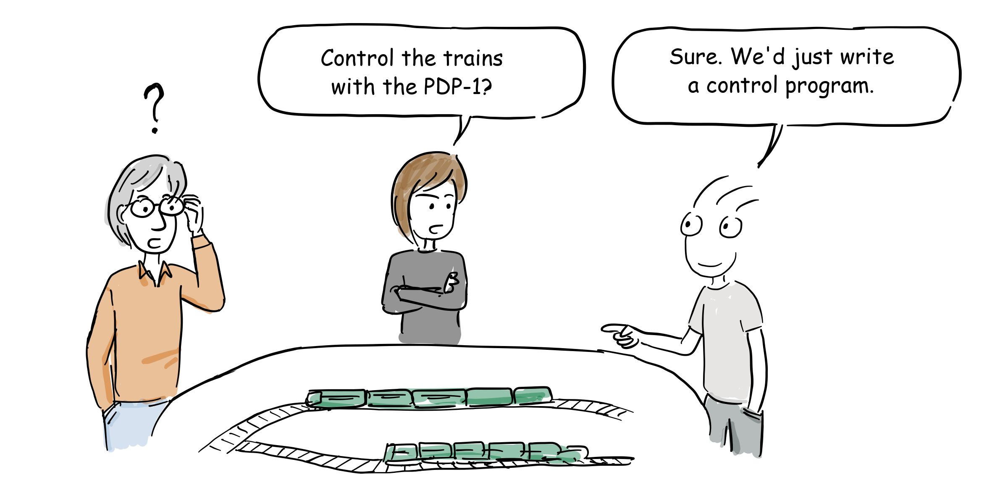
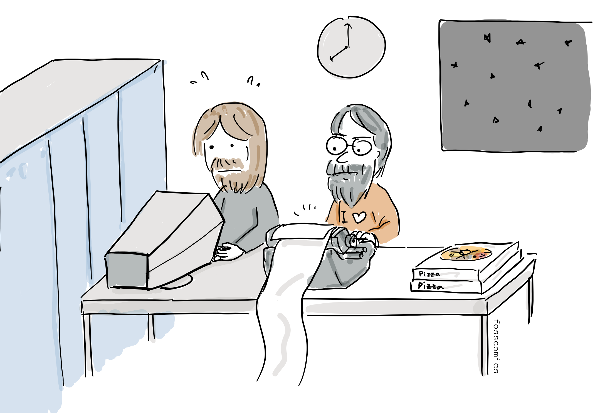
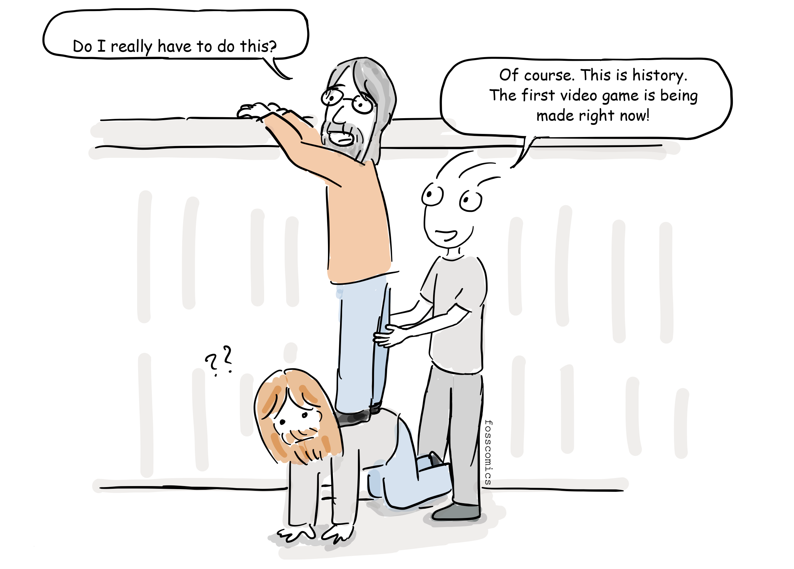
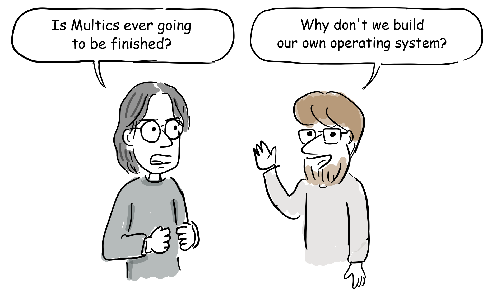
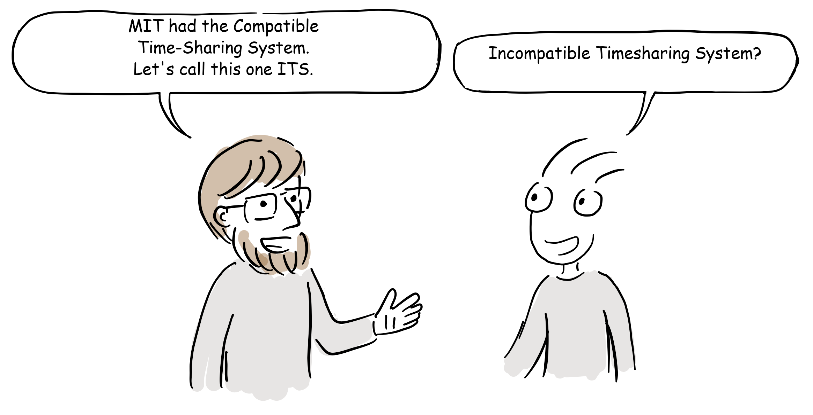
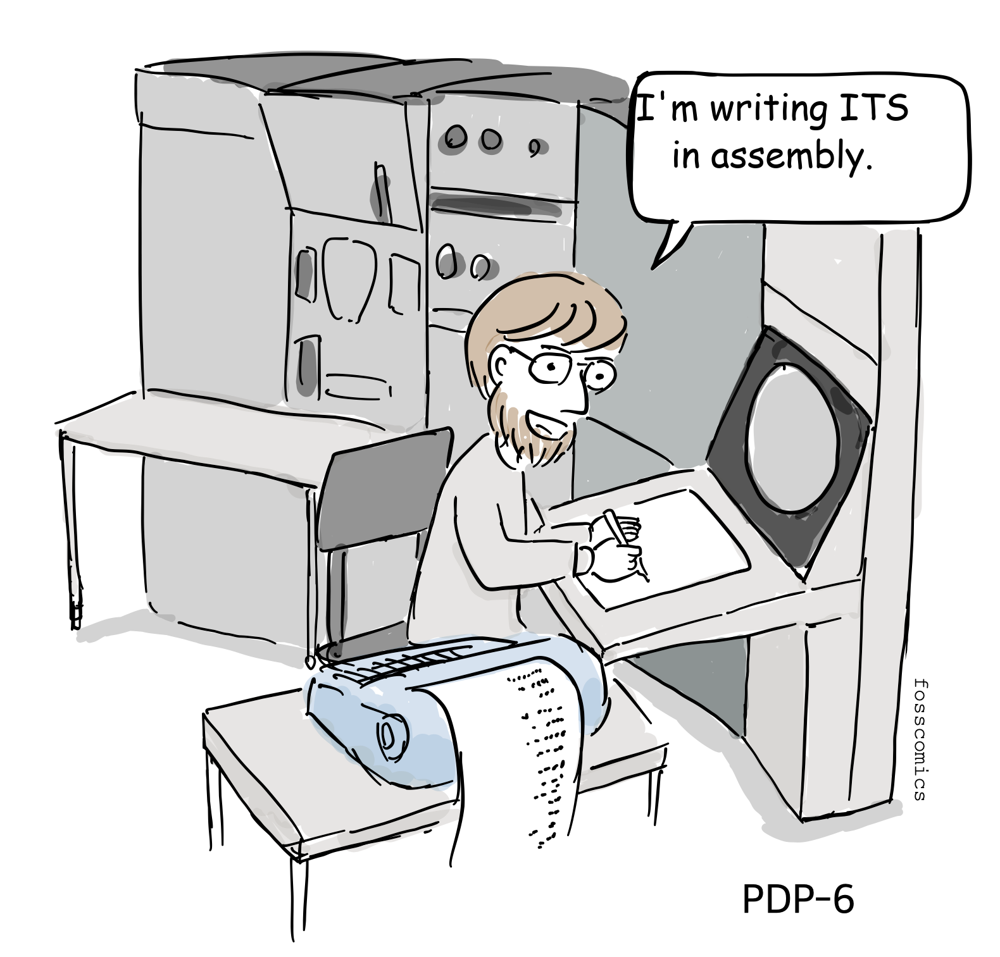
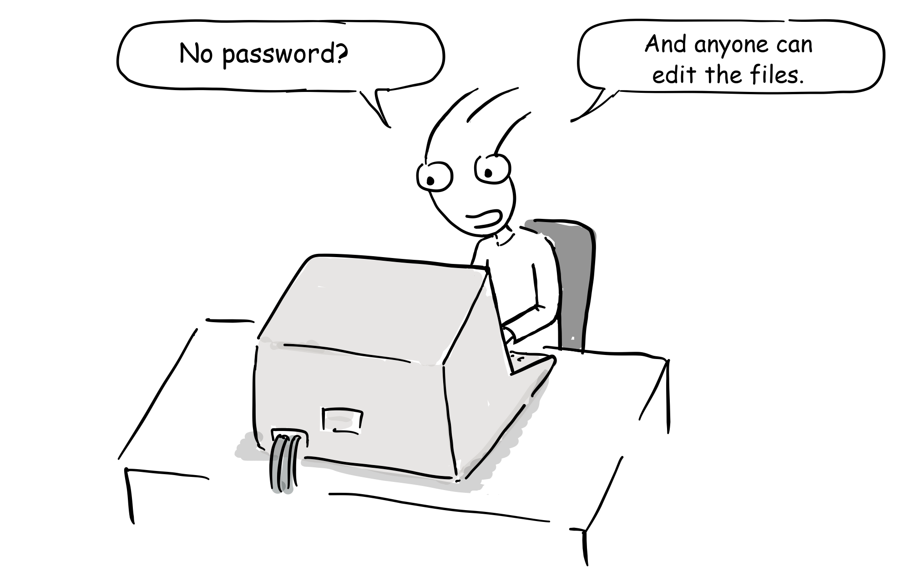
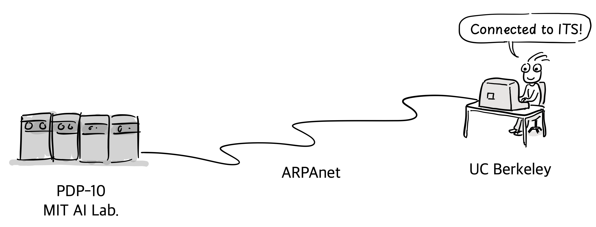
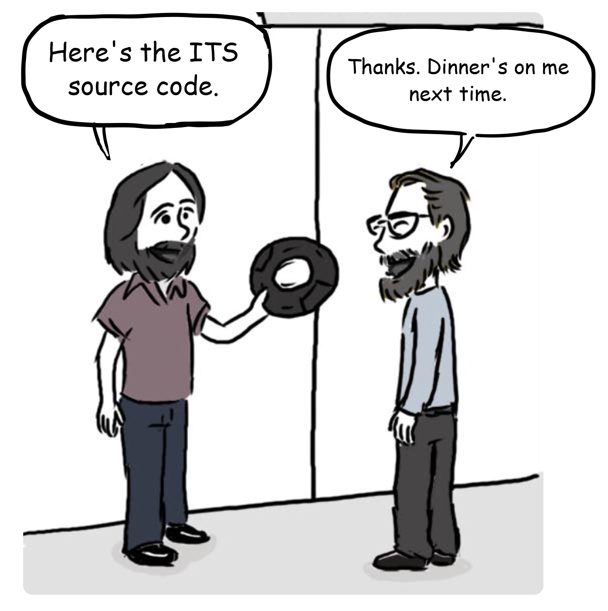

Hacker culture began with MIT's [Tech Model Railroad Club](https://en.wikipedia.org/wiki/Tech_Model_Railroad_Club). Its members built working model trains and studied how to keep them from colliding[&lbrack;1&rbrack;][1].

> "How do we keep the trains from crashing?"\
> "Hmm..."\
> "What if we controlled them with the new PDP-1?"

> "Control the trains with the PDP-1?" \
> "Sure. We'd just write a control program."

The video below shows why a computer was needed to control moving model trains.

<iframe width="560" height="315" src="https://www.youtube.com/embed/dqLUUXWgba4?si=f4QZp3gTxWdDRnrt" title="YouTube video player" frameborder="0" allow="accelerometer; autoplay; clipboard-write; encrypted-media; gyroscope; picture-in-picture; web-share" referrerpolicy="strict-origin-when-cross-origin" allowfullscreen></iframe>

The [PDP series](https://en.wikipedia.org/wiki/Programmed_Data_Processor), made by Digital Equipment Corporation (DEC), became closely associated with hacker culture and the early free software community. These comparatively affordable computers were especially popular at universities. DEC donated a PDP-1 to MIT in 1961[&lbrack;2&rbrack;][2].

> "What's that round thing?" \
> "That? It's the display. It shows you what the computer's doing."

TMRC members who were fascinated by the machine soon began spending more and more time with the PDP-1.

> "How did the electric bill get this high?"

> "Lock the computer room at night." \
> "They don't study... They should just build model trains."

> "Locked out after dinner." \
> "Should've ordered pizza."

> "Do I really have to do this?" \
> "Of course. This is history. The first video game is being made right now!"

For fun, the students created [Spacewar!](https://en.wikipedia.org/wiki/Spacewar!), one of the earliest and most influential video games.

> "Mission accomplished. I'm off to the AI Lab."

At the time, the AI group within MIT's [Project MAC](https://en.wikipedia.org/wiki/Project_MAC) was a center of hacker culture[&lbrack;4&rbrack;][4]. Project MAC was also developing an operating system called Multics with General Electric and Bell Labs. Many programmers in the AI group disagreed with the direction of Multics, so in the late 1960s they began developing their own operating system: ITS (Incompatible Timesharing System).

> "Is Multics ever going to be finished?"\
> "Why don't we build our own operating system?"

MIT hacker [Tom Knight](https://en.wikipedia.org/wiki/Tom_Knight_(scientist)) (right) developed the first ITS kernel.

> "MIT had the Compatible Time-Sharing System. Let's call this one ITS." \
> "Incompatible Timesharing System?"

Development began on the PDP-6, and the system was written in assembly language.

> "I'm writing ITS in assembly."

ITS had a remarkably open environment. In its early days, users could log in without a password, and the system did not enforce file permissions. Anyone with access could edit files, including documentation and source code.

> "No password?" \
> "And anyone can edit the files."

ITS was accessible not only from inside MIT but also from other institutions connected through ARPANET. Its open philosophy and collaborative online community deeply influenced hacker culture and foreshadowed the open sharing and collaborative editing later found in free and open source software projects and wikis[&lbrack;3&rbrack;][3].

Richard Stallman, who later launched the free software movement, joined the MIT AI Lab community in 1971. He worked on ITS and was deeply influenced by the Lab's hacker culture.

At research labs such as MIT, programmers commonly shared software and source code. Software often came bundled with hardware, and users adapted and passed it along without separate licensing fees.

> "Here's the ITS source code." \
> "Thanks. Dinner's on me next time."

## References

1. Hacker, [Wikipedia](https://en.wikipedia.org/wiki/Hacker)
2. PDP-1, [Wikipedia](https://en.wikipedia.org/wiki/PDP-1)
3. Incompatible Timesharing System, [wikipedia](https://en.wikipedia.org/wiki/Incompatible\_Timesharing\_System)
4. Project MAC, [Wikipedia](https://en.wikipedia.org/wiki/Project_MAC)

[1]: https://en.wikipedia.org/wiki/Hacker "Hacker, Wikipedia"
[2]: https://en.wikipedia.org/wiki/PDP-1 "PDP-1, Wikipedia"
[3]: https://en.wikipedia.org/wiki/Incompatible\_Timesharing\_System "Incompatible Timesharing System, Wikipedia"
[4]: https://en.wikipedia.org/wiki/Project_MAC "Project MAC, Wikipedia"
