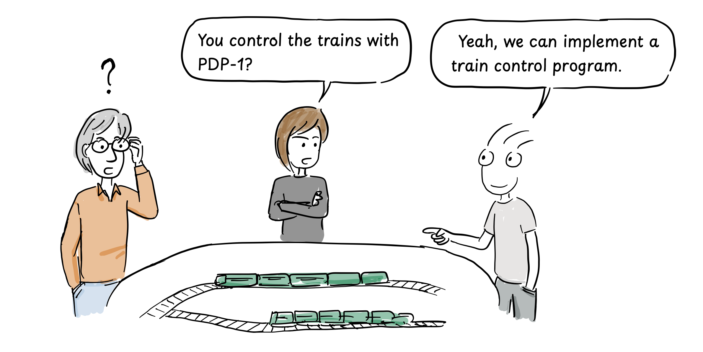
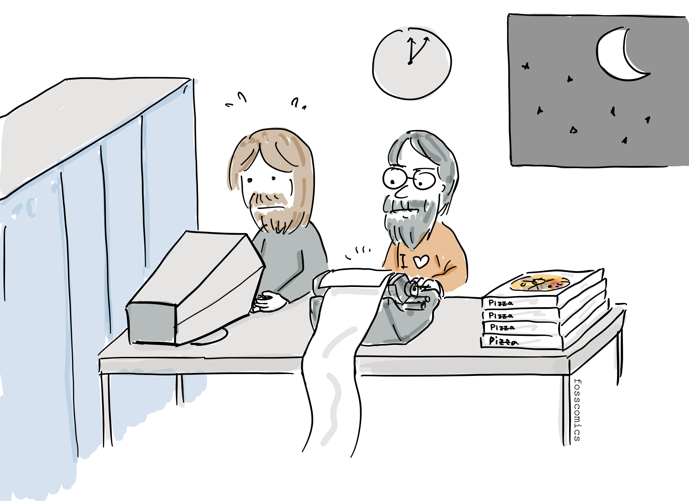
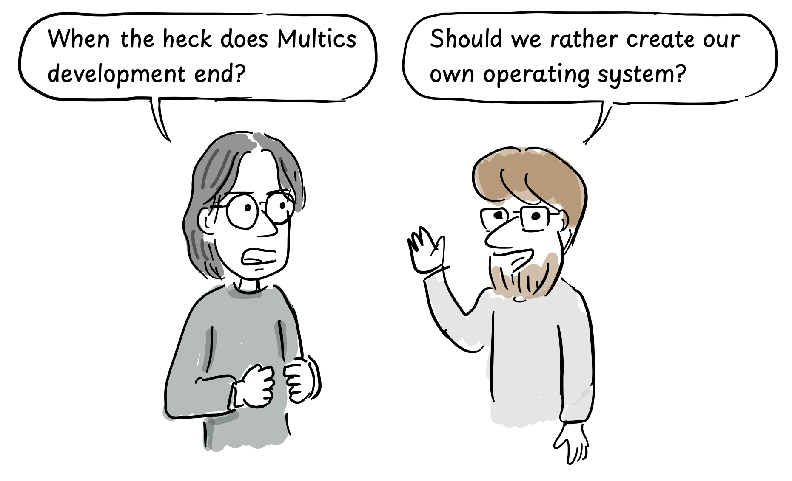
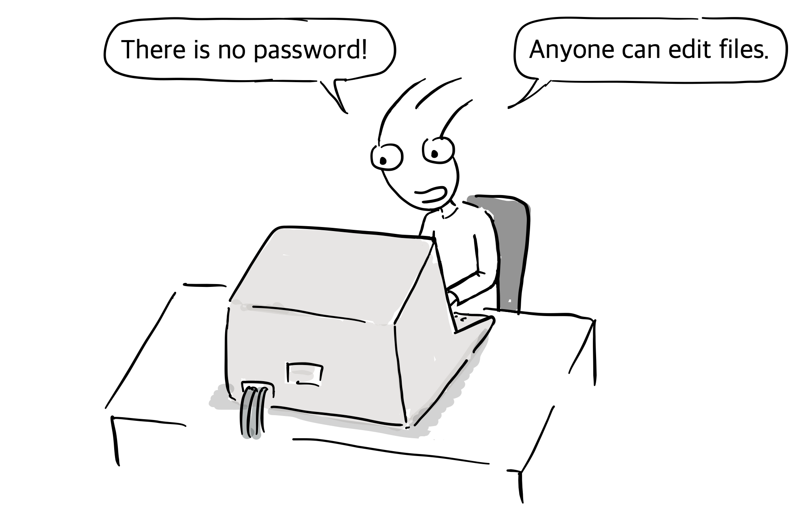
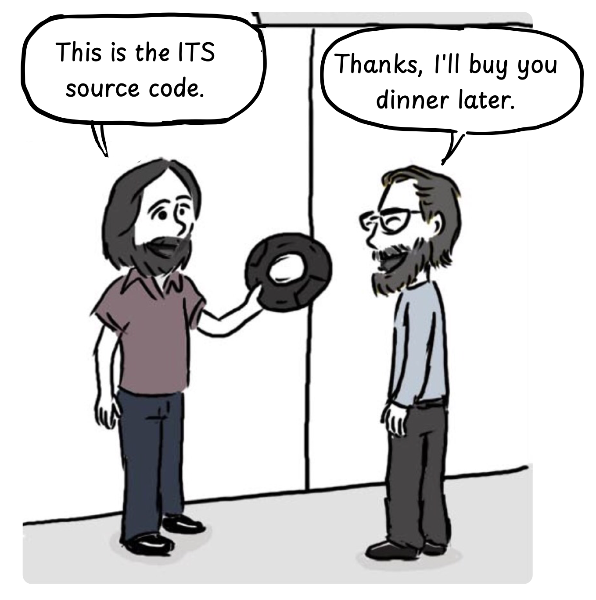

The hacker culture started with the [Tech Model Railroad Club](https://www.google.com/url?q=https://en.wikipedia.org/wiki/Tech_Model_Railroad_Club\&sa=D\&source=editors\&ust=1711344849233469\&usg=AOvVaw2jW8lhPjzCxir-TXAa-SBG) at MIT. This club made moving model trains and studied how the trains would not collide with each other[&lbrack;1&rbrack;][1].

> “How can we keep trains from colliding with each other?”\
> "Well"\
> "Wouldn't it be possible to control the trains with the newly introduced computer PDP-1?"

> “You control the trains with PDP-1?” \
> “Yeah, we can implement a train control program.”

For reference, the video below shows why a computer is needed to control a moving model train.

<iframe width="560" height="315" src="https://www.youtube.com/embed/dqLUUXWgba4?si=f4QZp3gTxWdDRnrt" title="YouTube video player" frameborder="0" allow="accelerometer; autoplay; clipboard-write; encrypted-media; gyroscope; picture-in-picture; web-share" referrerpolicy="strict-origin-when-cross-origin" allowfullscreen></iframe>

The PDP models made by [DEC](https://www.google.com/url?q=https://en.wikipedia.org/wiki/Programmed_Data_Processor\&sa=D\&source=editors\&ust=1711344849234212\&usg=AOvVaw3XYWFQH-2tnwXYFckFfCPg) contributed greatly to the hacker culture and the birth of free software. It was a kind of mini computer that was sold at a relatively low price and was particularly popular in universities. For reference, DEC donated a PDP-1 to MIT in 1961[&lbrack;2&rbrack;][2].

> “What is this round thing?” \
> "I think it's a computer display that you can use to view and interact with this computer."

After that, students interested in train control in the Tech Model Railway Club spend more time with the PDP-1.

> “What, the electricity bill is so high!”

> “Keep the computer room door closed at night.” \
> “Just make model trains if these guys aren't going to study."

> “The door is locked.” \
> “Yeah, we should just have ordered a pizza without going out for dinner.”

> “Do I really have to do this?” \
> “This is a historic moment in making the first video game.”

And, for fun, the students created the first ever video game called [Spacewar!](https://en.wikipedia.org/wiki/Spacewar!)

> “Mission complete,  I’m gonna go to the AI Lab.”

At the time, the MIT Artificial Intelligence Lab (AI Lab) was the birthplace of hacker culture, and it was developing an operating system called [Multics](https://en.wikipedia.org/wiki/Multics) with GE and Bell Labs. However, due to different opinions on operating system development, they began to develop their own operating system called ITS (Incompatible Time Sharing System) from the late 1960s.

> “When the heck does Multics development end?”\
> “Should we rather create our own operating system?”

MIT hacker [Tom Knight](https://en.wikipedia.org/wiki/Tom_Knight_(scientist))(right) developed the first kernel for ITS.

> “We had created a compatible time sharing system before, so let's name it ITS.” \
> “Incompatible time sharing system?”

Actual development started on the PDP-6 and it was all written in assembly

> “I am making ITS in assembly.”

At the time, ITS operating system had a unique user environment that could not be found today. In the early days, anyone could log in to the system without a password. All files, including documentation and source code, could be edited by anyone.

> "There is no password!" \
> “Anyone can edit files”

In addition, it was possible to access ITS not only inside MIT, but also from other institutions or schools through ARPAnet. The wide-open  ITS philosophy and  collaborative online community had a great impact on hacker culture, and also on free/open source and wiki movements[&lbrack;3&rbrack;][3].

Richard Stallman, who later started the free software movement, also participated in the development of the ITS operating system as a member of the community while working at the MIT AI Lab from 1971, where he was influenced by the hacker culture.

Until then, software was recognized as a bundle of hardware and was copied and used without paying each other. Companies also distributed their software for free, allowing the users to modify and copy it.

> "This is the ITS source code." \
> "Thanks, I'll buy you dinner later."

## References

1. Hacker, [Wikipedia](https://en.wikipedia.org/wiki/Hacker)
2. PDP-1, [Wikipedia](https://en.wikipedia.org/wiki/PDP-1)
3. Incompatible Timesharing System, [wikipedia](https://en.wikipedia.org/wiki/Incompatible\_Timesharing\_System)

[1]: https://en.wikipedia.org/wiki/Hacker "Hacker, Wikipedia"
[2]: https://en.wikipedia.org/wiki/PDP-1 "PDP-1, Wikipedia"
[3]: https://en.wikipedia.org/wiki/Incompatible\_Timesharing\_System "Incompatible Timesharing System, Wikipedia"
