## 벨 연구소와 멀틱스 프로젝트

:::panel rounded="true"
1960년대 MIT에서 [ITS(Incompatible Timesharing System)](https://ko.wikipedia.org/wiki/호환_시분할_시스템)가 한창 개발되고 있는 동안, 미 동부의 다른 곳에서도 해커의 기운이 물씬 풍기는 곳이 있었는데, 바로 벨 연구소(AT\&T Bell Laboratories)였다. 여기서 앞으로 세상을 바꿀 유닉스와 C언어가 개발되고 있었다.

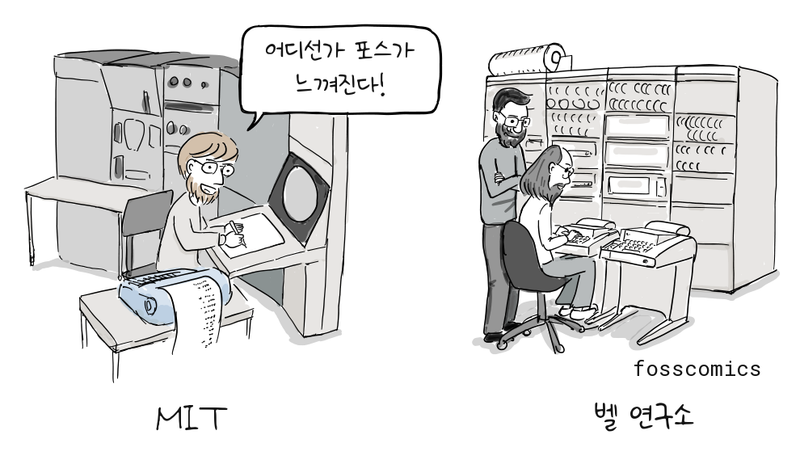
> "어디선가 포스가 느껴진다!"
:::

:::panel
MIT에서는 ITS가 만들어지고 있었고, 공교롭게도 벨 연구소에서는 [멀틱스(Multics)](https://ko.wikipedia.org/wiki/멀틱스) 개발에 참여했던 사람들이 나와 유닉스를 만들기 시작했다. 그 중심에는 [켄 톰프슨](https://ko.wikipedia.org/wiki/켄_톰프슨), [데니스 리치](https://ko.wikipedia.org/wiki/데니스_리치), 조 오산나가 있었다.

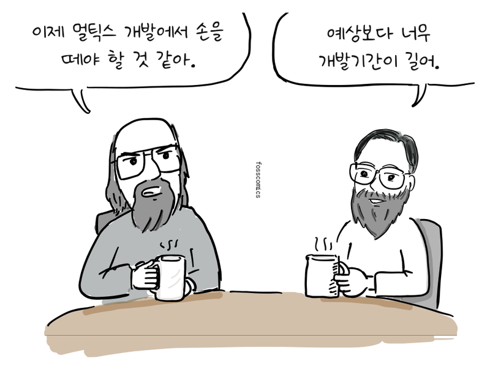
> "이제 멀틱스 개발에서 손을 떼야 할 것 같아." \
> "예상보다 너무 개발기간이 길어."
:::

:::panel

멀틱스 프로젝트는 1964년에 시작되었으나, 코드 크기가 커지고 복잡도가 높아지면서 벨 연구소에서 예상했던 것보다 일정이 많이 지연되고 있었다.

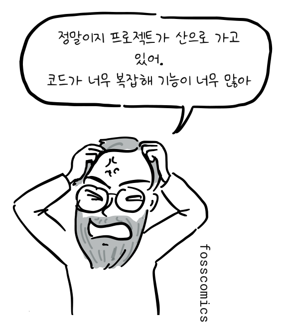
> "정말이지 프로젝트가 산으로 가고 있어." \
> "코드가 너무 복잡해 기능이 너무 많아"
:::

:::panel rounded="true"
결국 벨 연구소는 1969년 멀틱스 개발에서 손을 뗀다. 이후에도 멀틱스 개발은 계속되어 실제 서비스와 상용 시스템으로 운영되었지만, 벨 연구소가 기다리기에는 개발이 너무 늦어지고 비용도 많이 들었다.

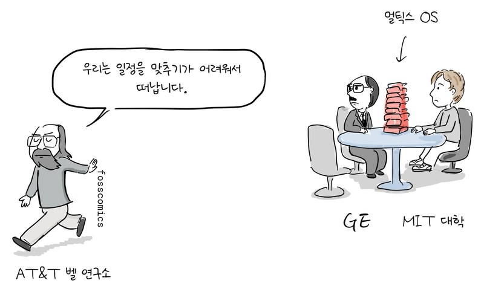
> "우리는 일정을 맞추기가 어려워서 떠납니다."
:::

## PDP-7에서 시작된 유닉스

:::panel
벨 연구소로 돌아온 켄 톰프슨은 멀틱스 개발 경험을 토대로 좀 더 작고 단순한 운영체제를 만드는 작업을 주도했다.

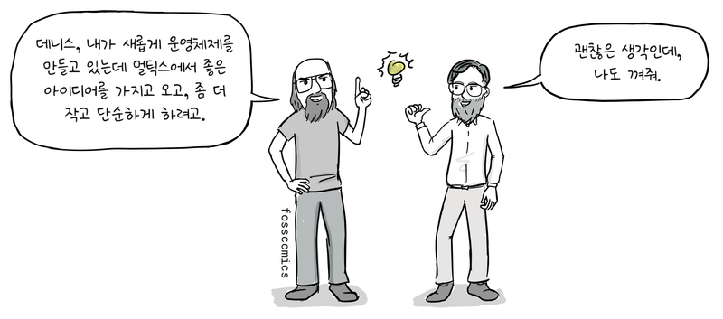
> "데니스, 내가 새롭게 운영체제를 만들고 있는데 멀틱스에서 좋은 아이디어를 가지고 오고, 좀 더 작고 단순하게 하려고." \
> "괜찮은 생각인데, 나도 껴줘."
:::

:::panel

켄 톰프슨은 멀틱스에서 구현한 주요 아이디어를 가져와 더 단순한 형태로 유닉스에 구현했다. 여기에는 디렉터리와 사용자 프로그램으로 실행되는 커맨드 라인 해석기 같은 아이디어가 포함된다.[&lbrack;2&rbrack;][2]

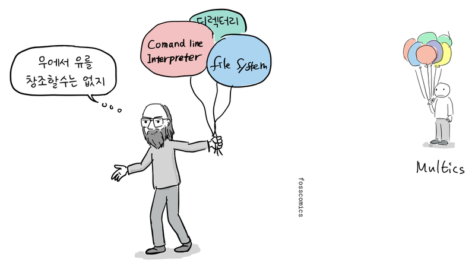
> "무에서 유를 창조할수는 없지"
:::

:::panel

우선 켄 톰프슨, 러드 캐너데이, 데니스 리치가 함께 구상한 파일 시스템을 아무도 사용하지 않고 있던 PDP-7에 구현했다. 설계의 대부분은 톰프슨이 맡았고, 리치는 디바이스 파일 아이디어를 보탰다. 이어서 프로세스, 유틸리티, 커맨드 라인 해석기를 추가했고, 조 오산나를 비롯한 동료들도 개발에 참여했다.[&lbrack;1&rbrack;][1]

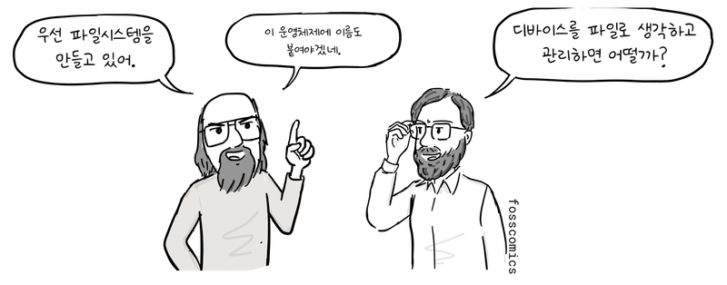
> "우선 파일시스템을 만들고 있어." \
> "이 운영체제에 이름도 붙여야겠네." \
> "디바이스를 파일로 생각하고 관리하면 어떨까?"

처음부터 이 운영체제를 유닉스라고 부른 것은 아니었다. 1970년이 상당히 지난 뒤에야 브라이언 커니핸이 멀틱스라는 이름을 비튼 "Unix"라는 이름을 제안했다.[&lbrack;1&rbrack;][1]

:::

## PDP-11과 B 언어의 한계

:::panel

그 후 [PDP-11](https://ko.wikipedia.org/wiki/PDP-11)이 도입되었는데, PDP-7과 CPU 명령어가 달랐다. 유닉스는 어셈블리어로 개발되었기 때문에 PDP-11용으로 코드를 다시 짜야 했다.

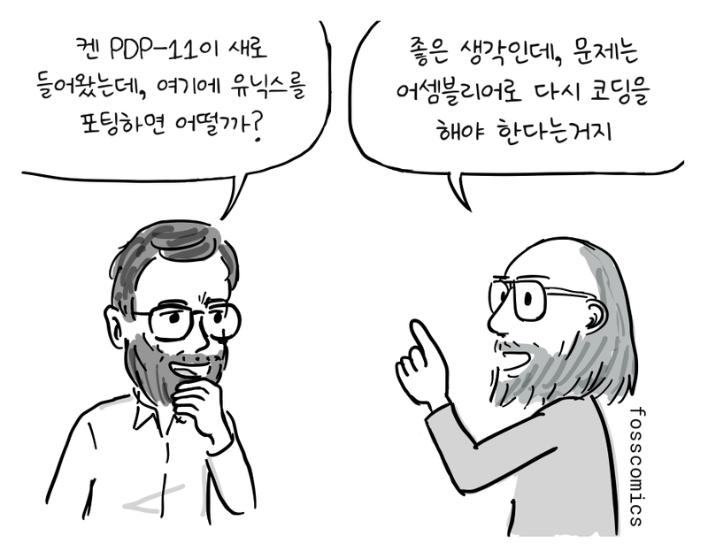
> "켄 PDP-11이 새로 들어왔는데, 여기에 유닉스를 포팅하면 어떨까?" \
> "좋은 생각인데, 문제는 어셈블리어로 다시 코딩을 해야 한다는거지"
:::

:::panel rounded="true"
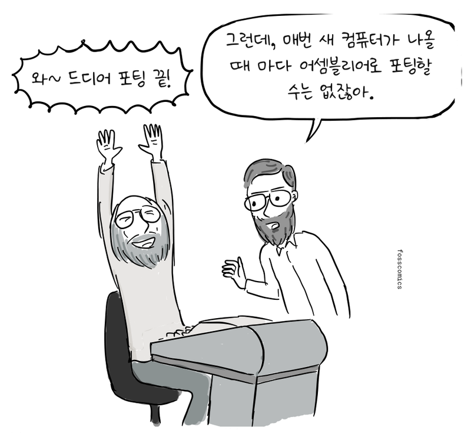
> "와~ 드디어 포팅 끝!" \
> "그런데, 매번 새 컴퓨터가 나올 때 마다 어셈블리어로 포팅할 수는 없잖아."
:::

:::panel
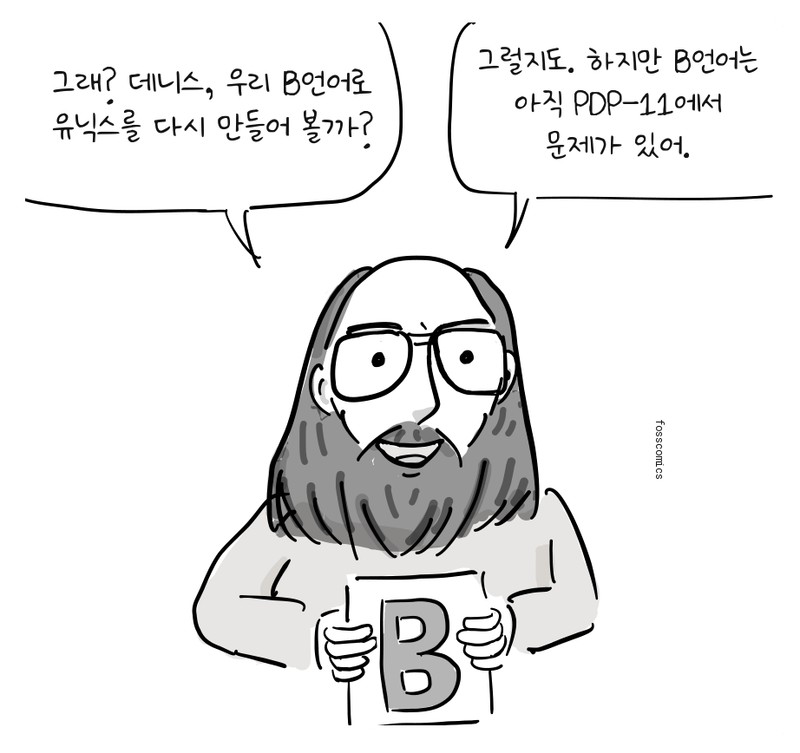
> "그래? 데니스, 우리 B언어로 유닉스를 다시 만들어 볼까?" \
> "이제 어셈블리어가 아닌 고급언어로도 OS커널을 만들 수 있을거야."


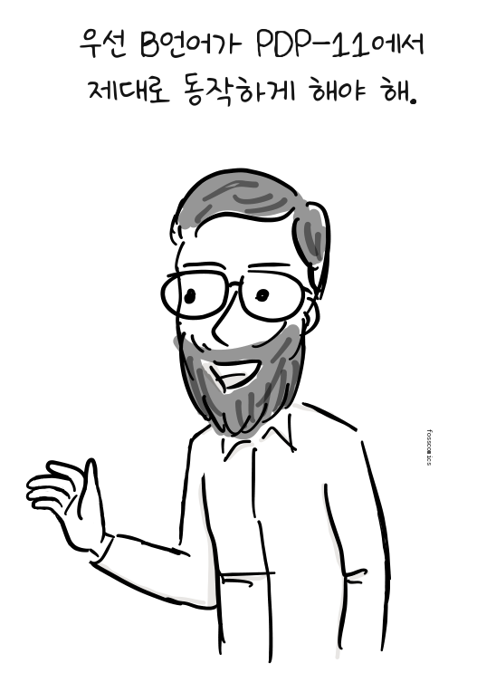
> "우선 B언어가 PDP-11에서 제대로 동작하게 해야 해."
:::

:::panel rounded="true"
B언어는 켄 톰프슨이 1969~70년 무렵 초기 유닉스 환경을 위해 만든 언어로, BCPL에서 발전한 작고 단순한 언어였다. 하지만 B 컴파일러가 만든 코드는 어셈블리 코드보다 훨씬 느렸고, 모든 데이터를 하나의 기계어 워드로 다루는 방식도 바이트 단위로 메모리에 접근하는 PDP-11과 잘 맞지 않았다. 그래서 유닉스 전체를 B언어로 다시 쓰는데 어려움이 많았다.[&lbrack;2&rbrack;][2]

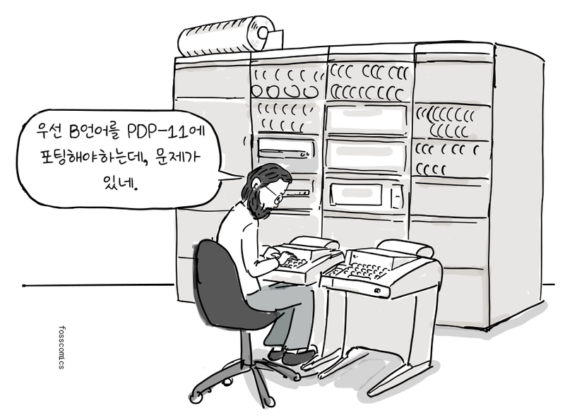
> "우선 B언어를 PDP-11에 포팅해야하는데, 문제가 있네."
:::

## B에서 NB를 거쳐 C로

:::panel
1971년 데니스 리치는 B언어에 문자 타입을 추가하고, `int`와 `char`를 명시하는 타입 체계를 만들기 시작했다. 또한 스레드 코드 대신 PDP-11 기계어를 생성하도록 컴파일러를 다시 작성했다. 그는 잠시 존재했던 이 언어를 "New B"라는 뜻의 NB라고 불렀다.[&lbrack;2&rbrack;][2]

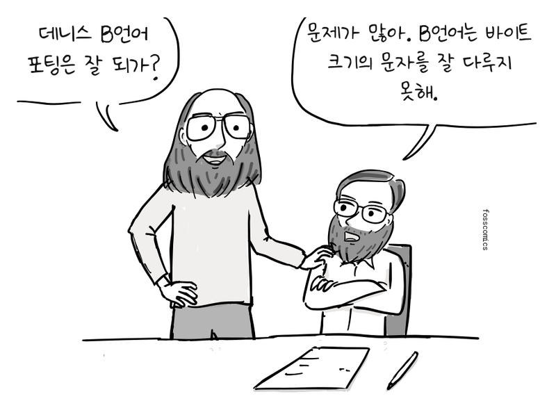
> "데니스 B언어 포팅은 잘 되가?" \
> "문제가 많아. B언어는 바이트 크기의 문자를 잘 다루지 못해."

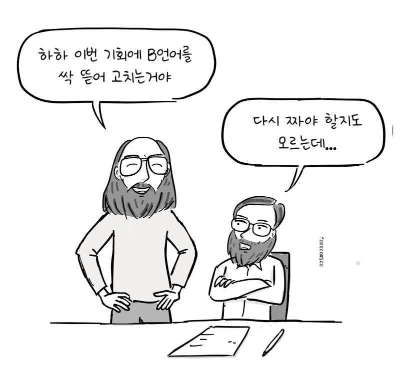
> "하하 이번 기회에 B언어를 싹 뜯어 고치는거야" \
> "다시 짜야 할지도 모르는데..."
:::

:::panel rounded="true"

리치는 B언어를 싹 뜯어고치기 시작했다. 1972년에는 타입 체계를 확장하고 배열과 포인터의 동작을 새로 정리했으며, 구조체와 새로운 컴파일러를 만들었다. 새로운 언어가 모습을 갖추자 C언어라고 이름 붙였다. B의 다음 글자를 따른 것인지, BCPL의 글자를 이어 간 것인지는 리치도 명확히 정하지 않았다. 1973년 초에는 오늘날 C언어의 핵심 기능이 거의 완성되었다.[&lbrack;2&rbrack;][2]

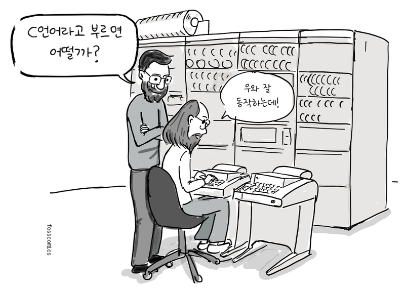
> "C언어라고 부르면 어떨까?" \
> "우와 잘 동작하는데!"
:::

## C로 다시 쓴 유닉스 커널

:::panel
1973년 여름, 톰프슨과 리치를 비롯한 동료들은 유닉스 커널 대부분을 C언어로 다시 작성했다. 하드웨어에 종속된 일부 코드는 여전히 어셈블리어가 필요했다. 특히 구조체 타입을 추가하면서 디렉터리 항목 같은 데이터를 메모리 구조에 맞게 표현할 수 있게 되었다.

```c
  struct point {
    int x;
    int y;
  };

  int main(void)
  {
    struct point p = { 1, 3 };  /* initialize variable */
    struct point q;             /* uninitialized */
    q = p;                      /* copy member values from p into q */

    return 0;
  }
```

*현대 C로 작성한 구조체 예제. `x`와 `y`를 하나의 자료형으로 묶고, `q = p`로 두 멤버의 값을 함께 복사한다.*
:::

:::panel rounded="true"
이제 C언어는 유닉스 커널을 작성할 수 있을 정도로 강력해졌다.

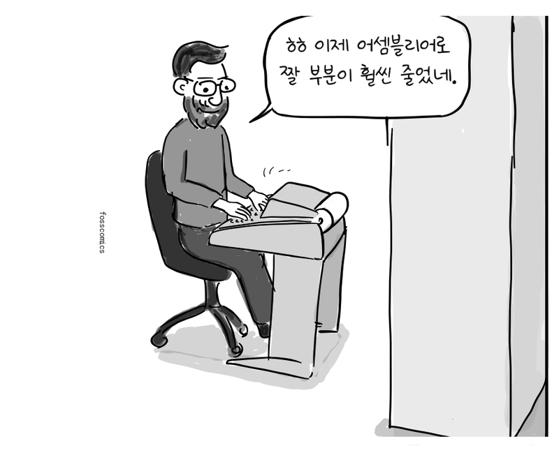
> "ㅎㅎ 이제 어셈블리어로 짤 부분이 훨씬 줄었네."
:::

:::panel


이처럼 유닉스와 C언어는 켄 톰프슨과 데니스 리치를 비롯한 벨 연구소 동료들의 손에서 짧은 기간에 탄생했다. 오늘날에도 유닉스와 유닉스 계열 운영체제는 수많은 서버와 개인용 컴퓨터, 핸드폰에서 동작하고 있다. 또한 C언어는 여전히 운영체제 커널과 시스템 소프트웨어를 개발하는 중요한 언어로 사용되고 있다.

:::

## 참고 자료

1. 데니스 M. 리치, [유닉스 시분할 시스템의 진화](https://www.nokia.com/bell-labs/about/dennis-m-ritchie/hist.html)
2. 데니스 M. 리치, [C 언어의 발전](https://www.nokia.com/bell-labs/about/dennis-m-ritchie/chist.html)
3. 데이비드 C. 브록, [최초의 유닉스 코드: 소스 코드 공개 기념](https://computerhistory.org/blog/the-earliest-unix-code-an-anniversary-source-code-release/)

[1]: https://www.nokia.com/bell-labs/about/dennis-m-ritchie/hist.html "유닉스 시분할 시스템의 진화, 데니스 M. 리치"
[2]: https://www.nokia.com/bell-labs/about/dennis-m-ritchie/chist.html "C 언어의 발전, 데니스 M. 리치"