## Bell Labs and the Multics Project

:::panel rounded="true"
In the 1960s, while MIT was busy developing [the Incompatible Timesharing System (ITS)](https://en.wikipedia.org/wiki/Incompatible_Timesharing_System), another place on the East Coast was buzzing with the same hacker energy: AT\&T Bell Laboratories. This was where Unix and C, two creations that would change computing, were taking shape.

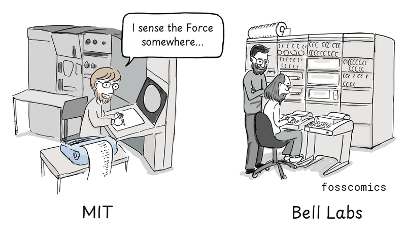
> "I sense the Force somewhere..."
:::

ITS and Unix came from different groups. At Bell Labs, people who had worked on [Multics](https://en.wikipedia.org/wiki/Multics) stepped away and began building Unix. At the center of the effort were [Ken Thompson](https://en.wikipedia.org/wiki/Ken_Thompson), [Dennis Ritchie](https://en.wikipedia.org/wiki/Dennis_Ritchie), and [Joe Ossanna](https://en.wikipedia.org/wiki/Joe_Ossanna).

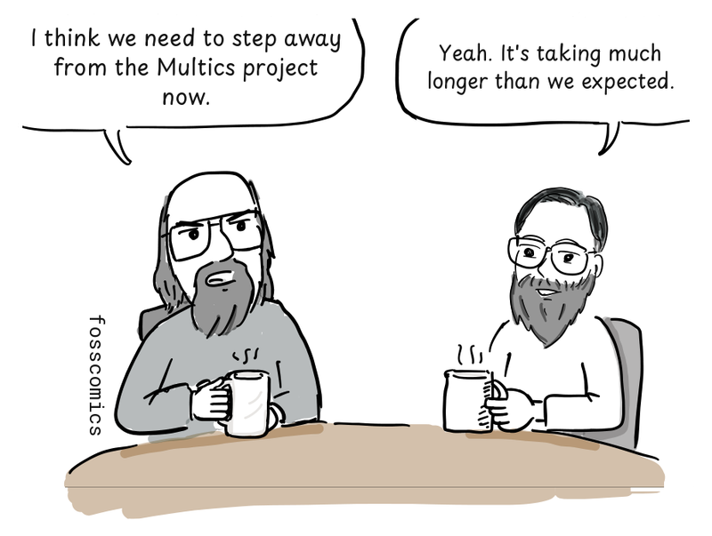
> "I think we need to step away from the Multics project now."\
> "Yeah. It's taking much longer than we expected."

The Multics project began in 1964. But as the code grew larger and more complicated, the project fell far behind Bell Labs' expectations.

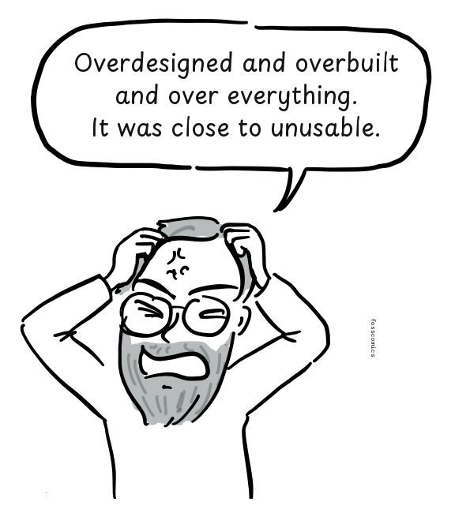
> "Overdesigned and overbuilt and over everything."\
> "It was close to unusable.[&lbrack;1&rbrack;][1]"

:::panel rounded="true"
In the end, Bell Labs pulled out of Multics in 1969. Work continued elsewhere, and Multics later became a working commercial system. For Bell Labs, though, it had simply taken too long and cost too much.

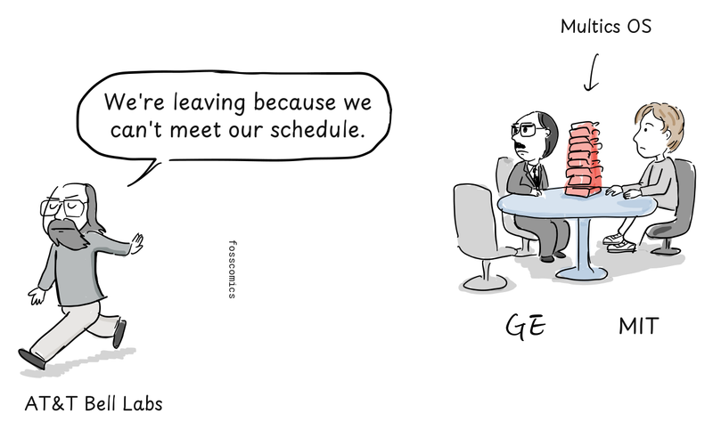
> "We're leaving because we can't meet our schedule."
:::

## Unix Begins on the PDP-7

Back at Bell Labs, Thompson drew on his Multics experience and led the effort to build a smaller, simpler operating system.

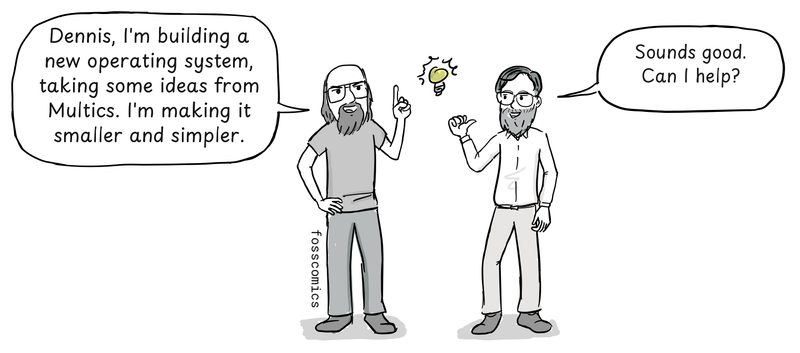
> "Dennis, I'm building a new operating system, taking some ideas from Multics. I'm making it smaller and simpler." \
> "That's a good idea. Shall I join you?"

Thompson brought several ideas from Multics into Unix, but rebuilt them in a much simpler form, including directories and a command interpreter that ran as a user program.[&lbrack;3&rbrack;][3]

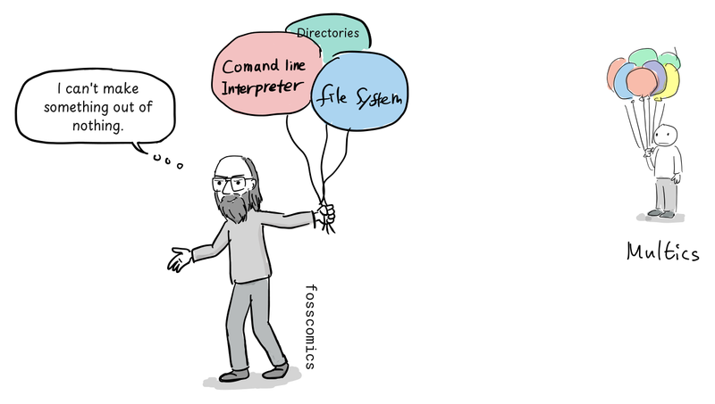
> "I can't make something out of nothing."

First came a file system, sketched out by Thompson, [Rudd Canaday](https://en.wikipedia.org/wiki/Rudd_Canaday), and Ritchie. Thompson did most of the design and put it to work on a little-used PDP-7. Ritchie added the idea of device files. Processes, utilities, and a command interpreter followed, with Ossanna and other colleagues joining in as the system grew.[&lbrack;2&rbrack;][2]

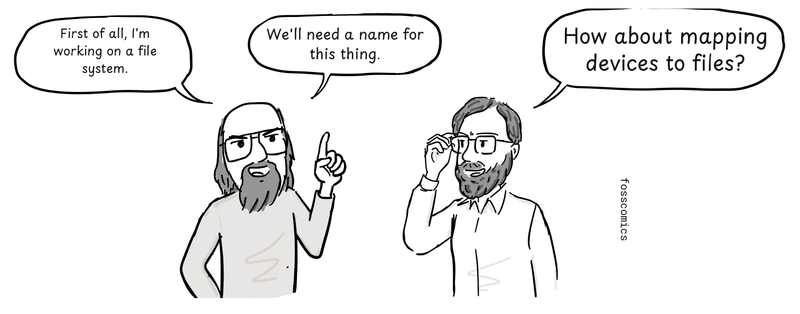
> "First of all, I'm working on a file system." \
> "We'll need a name for this thing." \
> "How about mapping devices to files?"

It was not called Unix at first. Well into 1970, Brian Kernighan suggested the name as a play on "Multics."

## The PDP-11 and the Limits of B

Then a [PDP-11](https://en.wikipedia.org/wiki/PDP-11) arrived. Its CPU instructions were different from the PDP-7's, and Unix was still written in assembly. The code had to be written all over again.

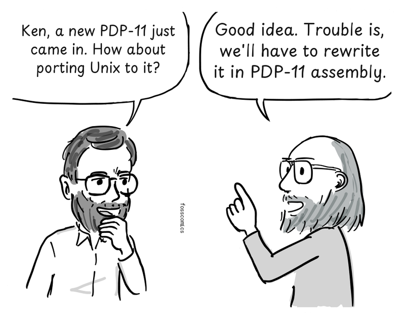
> "Ken, a new PDP-11 just came in. How about porting Unix to it?" \
> "Good idea. Trouble is, we'll have to rewrite it in PDP-11 assembly."

:::panel rounded="true"
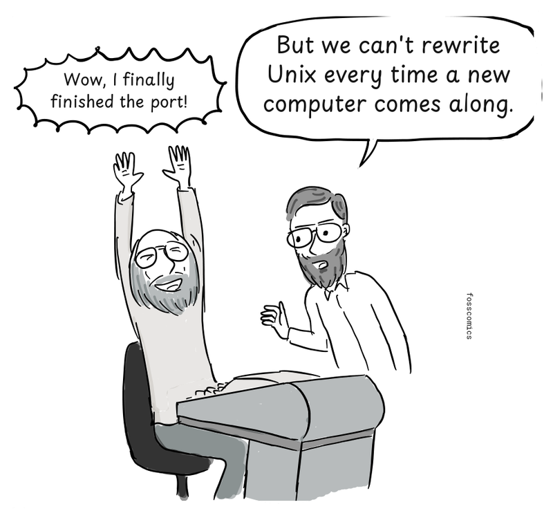
> "Wow, I finally finished the port!" \
> "But we can't rewrite Unix every time a new computer comes along."
:::

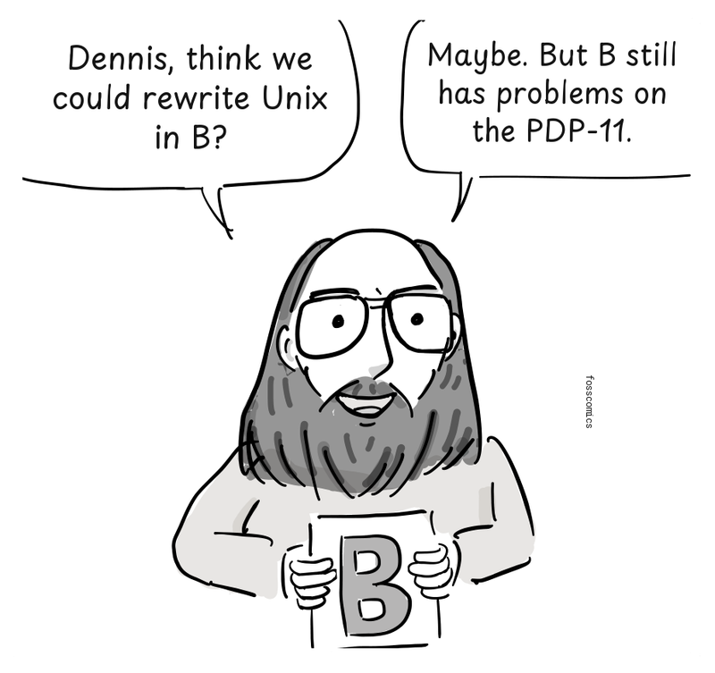
> "Dennis, think we could rewrite Unix in B?" \
> "Maybe. But B still has problems on the PDP-11."

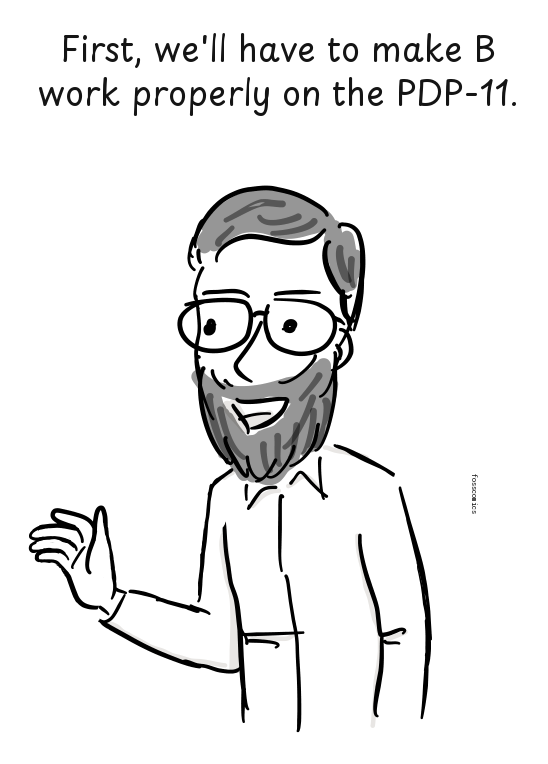
> "First, we'll have to make B work properly on the PDP-11."

:::panel rounded="true"
At the time, that was easier said than done. Thompson had created B for the early Unix environment around 1969–70, building it from BCPL. It was small enough for the PDP-7, but the code it produced was much slower than assembly. B also treated everything as a machine word, which made it awkward to use on the byte-addressed PDP-11. Rewriting all of Unix in B was considered only briefly.[&lbrack;3&rbrack;][3]

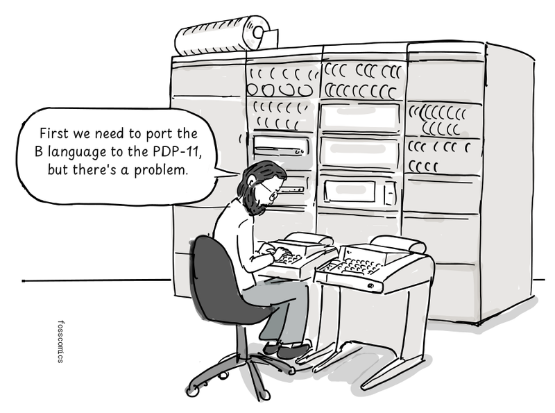
> "First we need to port the B language to the PDP-11, but there's a problem."
:::

## From B to NB to C

In 1971, Ritchie began extending B with a character type and an explicit type system that included `int` and `char`. He also rewrote the compiler to generate PDP-11 machine code directly, instead of slower threaded code that invoked a sequence of prewritten low-level routines. He called the short-lived language NB, for "New B."[&lbrack;3&rbrack;][3]

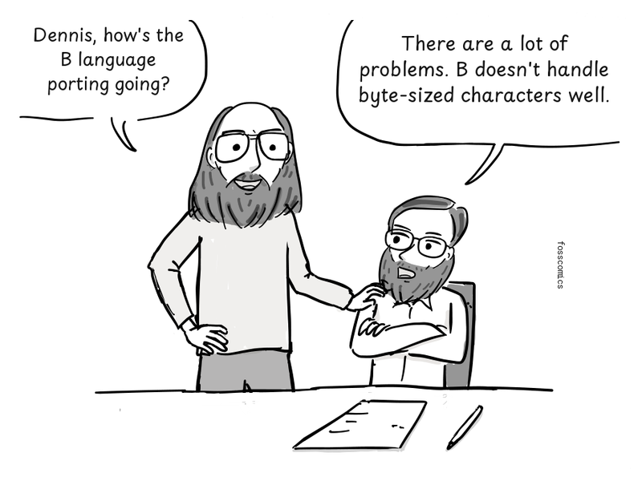
> "Dennis, how's the B language porting going?" \
> "There are a lot of problems. B doesn't handle byte-sized characters well."

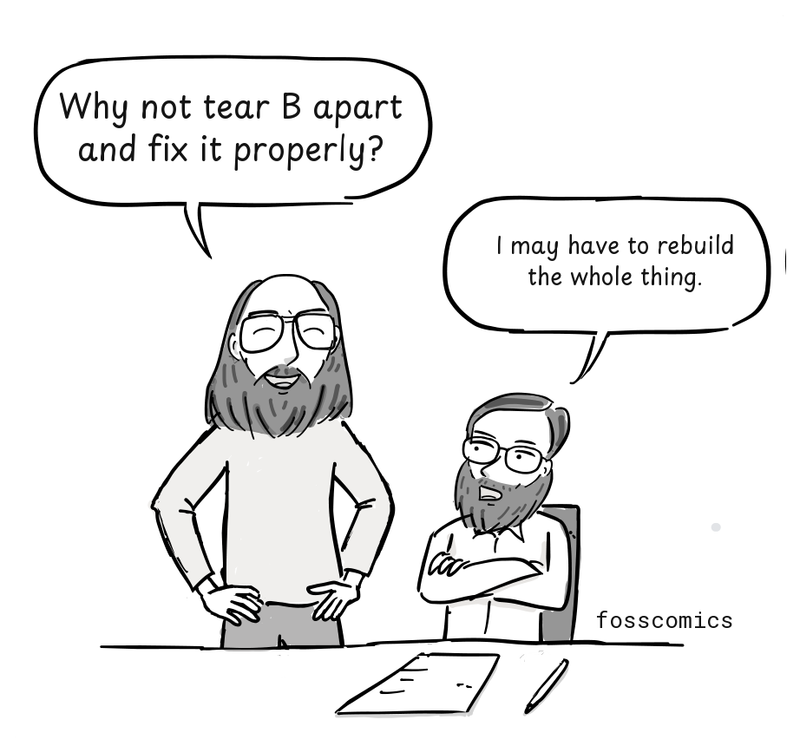
> "Why not tear B apart and fix it properly?" \
> "I may have to rebuild the whole thing."

So Ritchie began tearing B apart and rebuilding it. During 1972, he expanded its type system, reworked arrays and pointers, added structures, and wrote a new compiler. When the new language took shape, he called it C. Whether the name meant the letter after B or continued the letters in BCPL, Ritchie left open. By early 1973, the essentials of modern C were in place.

:::panel rounded="true"
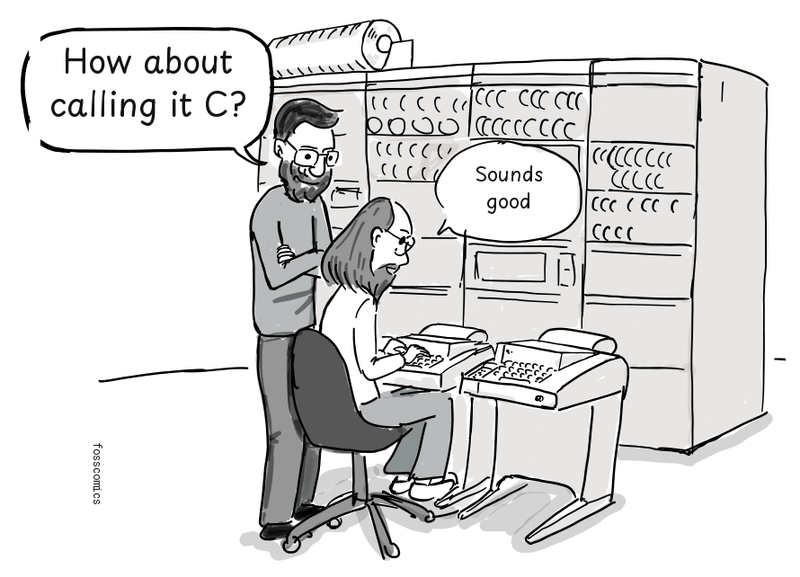
> "How about calling it C?" \
> "Sounds good"
:::

## Rewriting the Unix Kernel in C

In the summer of 1973, Thompson, Ritchie, and their colleagues rewrote the Unix kernel largely in C. A small amount of machine-dependent assembly was still needed.

Structures were especially useful. They let C describe data such as Unix directory entries in a way that matched how it was laid out in memory.

```c
  struct point {
    int x;
    int y;
  };

  int main(void)
  {
    struct point p = { 1, 3 };  /* initialize variable */
    struct point q;             /* uninitialized */
    q = p;                      /* copy member values from p into q */

    return 0;
  }
```

*A structure example in modern C. The structure groups `x` and `y` into one type; `q = p` copies both member values from `p` to `q`.*

:::panel rounded="true"
Now C was powerful enough to write a Unix kernel.

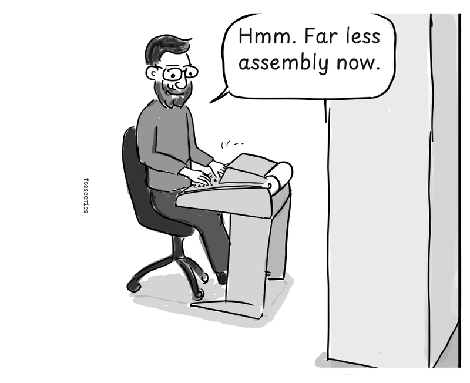
> "Hmm. Far less assembly now."
:::

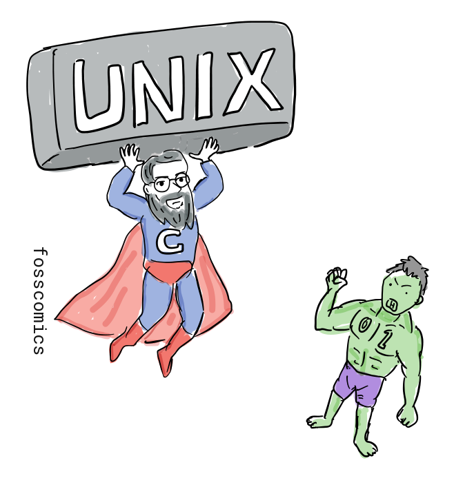

And so Unix and C came together in a remarkably short time, through the work of Thompson, Ritchie, and their Bell Labs colleagues. Unix and Unix-like systems still run on countless servers, personal computers, and phones. And C is still used to build operating-system kernels and other systems software today.

## Readings from the Computer History Museum
1. David C. Brock, the earliest unix code: an anniversary source code release, [CHM](https://computerhistory.org/blog/the-earliest-unix-code-an-anniversary-source-code-release/)

## References
1. Multics, [Wikipedia](https://en.wikipedia.org/wiki/Multics)
2. Dennis M. Ritchie, [The Evolution of the Unix Time-sharing System](https://www.nokia.com/bell-labs/about/dennis-m-ritchie/hist.html)
3. Dennis M. Ritchie, [The Development of the C Language](https://www.nokia.com/bell-labs/about/dennis-m-ritchie/chist.html)

[1]: https://en.wikipedia.org/wiki/Multics "Multics, Wikipedia"
[2]: https://www.nokia.com/bell-labs/about/dennis-m-ritchie/hist.html "The Evolution of the Unix Time-sharing System, Dennis M. Ritchie"
[3]: https://www.nokia.com/bell-labs/about/dennis-m-ritchie/chist.html "The Development of the C Language, Dennis M. Ritchie"
