In the 1960's, [the Incompatible Timesharing System (ITS)](https://www.google.com/url?q=https://medium.com/fosscomics/7-its-and-hacker-culture-8cb036b94785\&sa=D\&source=editors\&ust=1711344879882873\&usg=AOvVaw0a-im6RARwtJfYmVcuPAh2) was being heavily developed at MIT. Meanwhile, at another location on the east coast of the United States, there was another lab with the same hacker spirit: AT\&T Bell Laboratories.

The groundbreaking Unix and C language, which would go on to change the world, were being developed.

  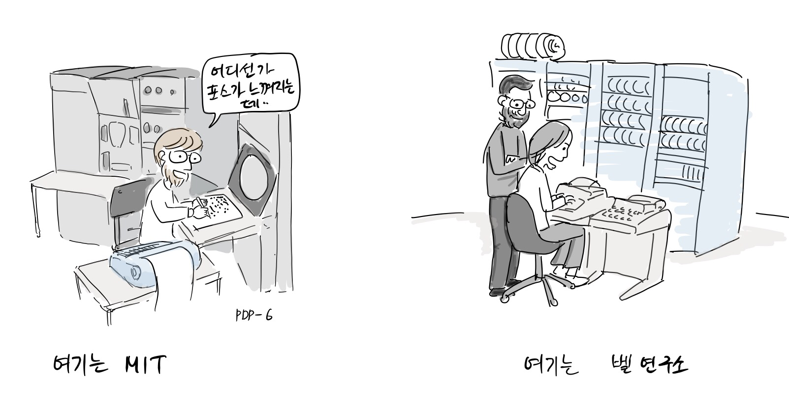

              Here is MIT                                                          Meanwhile at Bell Lab.

“I feel the force somewhere…”                                          

Coincidentally, the people who were working on [Multics](https://www.google.com/url?q=https://en.wikipedia.org/wiki/Multics\&sa=D\&source=editors\&ust=1711344879883517\&usg=AOvVaw1WsfkGn9ueJ5KMD3PM-psp) were also working on ITS and Unix, including [Ken Thompson](https://www.google.com/url?q=https://en.wikipedia.org/wiki/Ken_Thompson\&sa=D\&source=editors\&ust=1711344879883636\&usg=AOvVaw3VfiS3JXIsREHVC84_ZKmD) and [Dennis Ritchie](https://www.google.com/url?q=https://en.wikipedia.org/wiki/Dennis_Ritchie\&sa=D\&source=editors\&ust=1711344879883745\&usg=AOvVaw3mrGLO9EgJ8_2QgGx_LpUV) from Bell Labs.

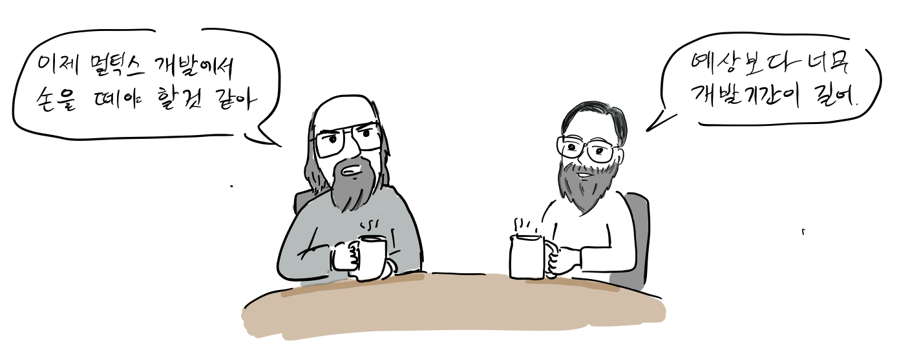

"I think we need to step away from the Multics project now."\
“Yeah, the development time has become way longer than we expected."

The Multics project began in 1964, but due to the large code size and complexity, the schedule fell far behind Bell Labs' expectations.

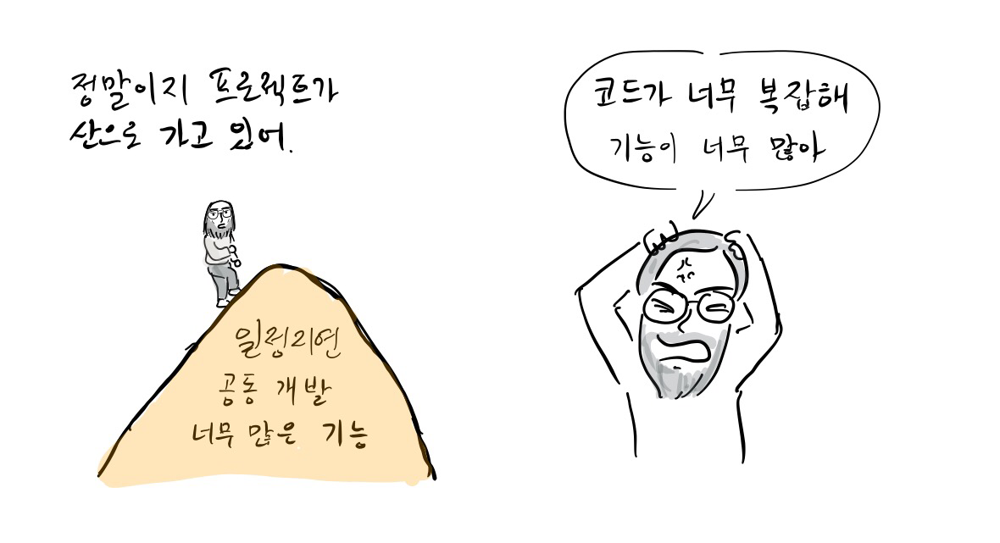“Overdesigned and overbuilt and over everything. It was close to unusable\[1].”[\[a\]](#cmnt1)

In 1969, Bell Lab. pulled out of the development of Multics.

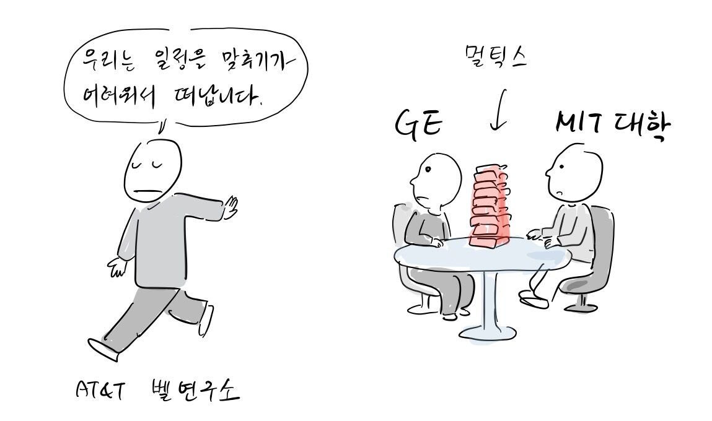

“We’re leaving because we can't meet our schedule.”

Based on his experience developing Multics, Ken Thompson creates a new operating system by himself at Bell Labs.

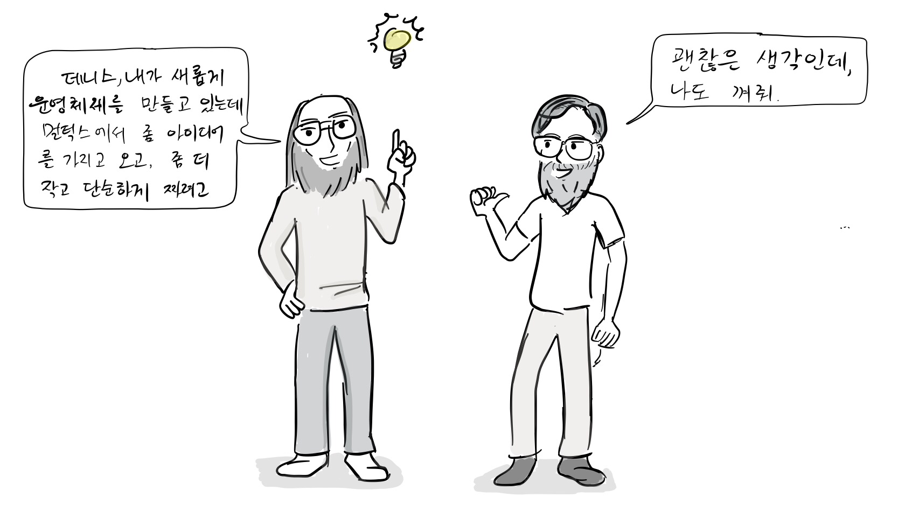

“Dennis, I'm building a new operating system, taking some ideas from Multics. I'm making it smaller and simpler.” “That’s a good idea. Shall I join you?”

Ken Thompson reimplemented many of the key features he had developed in Multics in Unix.

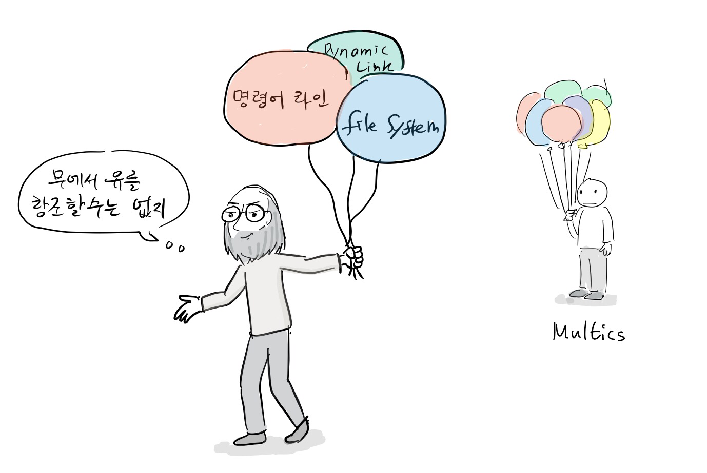

“I can't make something out of nothing”

He adapted the file system he had already implemented in Multics in Unix on PDP-7, and Dennis Richie joined him in the development. Once the development was well underway, a team was organized and they began implementing the operating system features we use today, such as the filesystem, process model, device files, and command line interpreter, for the first time on PDP-7.

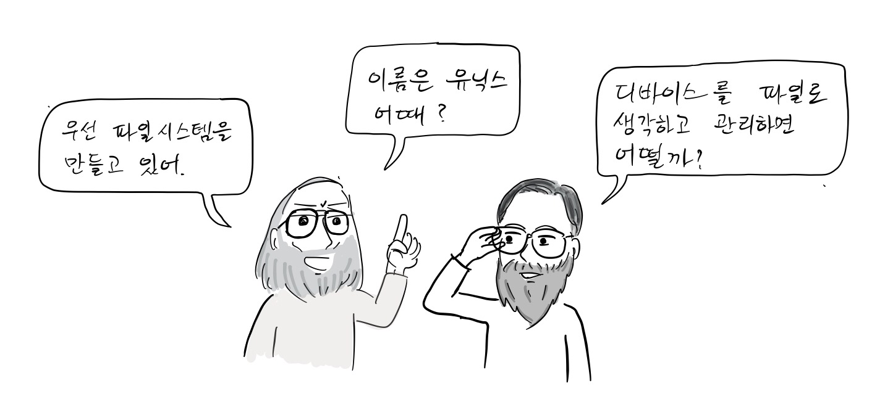

“First of all, I'm working on a file system. How about we call it Unix?” “How about mapping devices to files?”

Then, [PDP-11](https://www.google.com/url?q=https://en.wikipedia.org/wiki/PDP-11\&sa=D\&source=editors\&ust=1711344879886132\&usg=AOvVaw23fq7sK9DzSW9io1VkCf8l) was introduced, which differed in CPU instructions from the PDP-7.

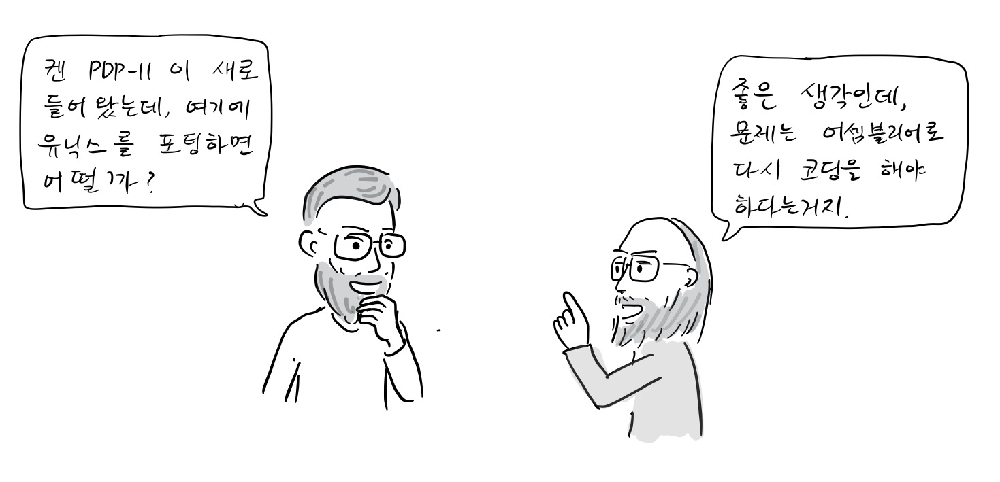

"Ken, we have a new PDP-11, why don't we port Unix to it?" "That's a great idea, but the problem is that the CPU instructions are different, so we'll have to re-write the Unix code with the PDP-11 assembly language."

“Wow, I finally finished porting!" "But we can't rewrite the Unix code in assembly every time we buy a new computer, right?

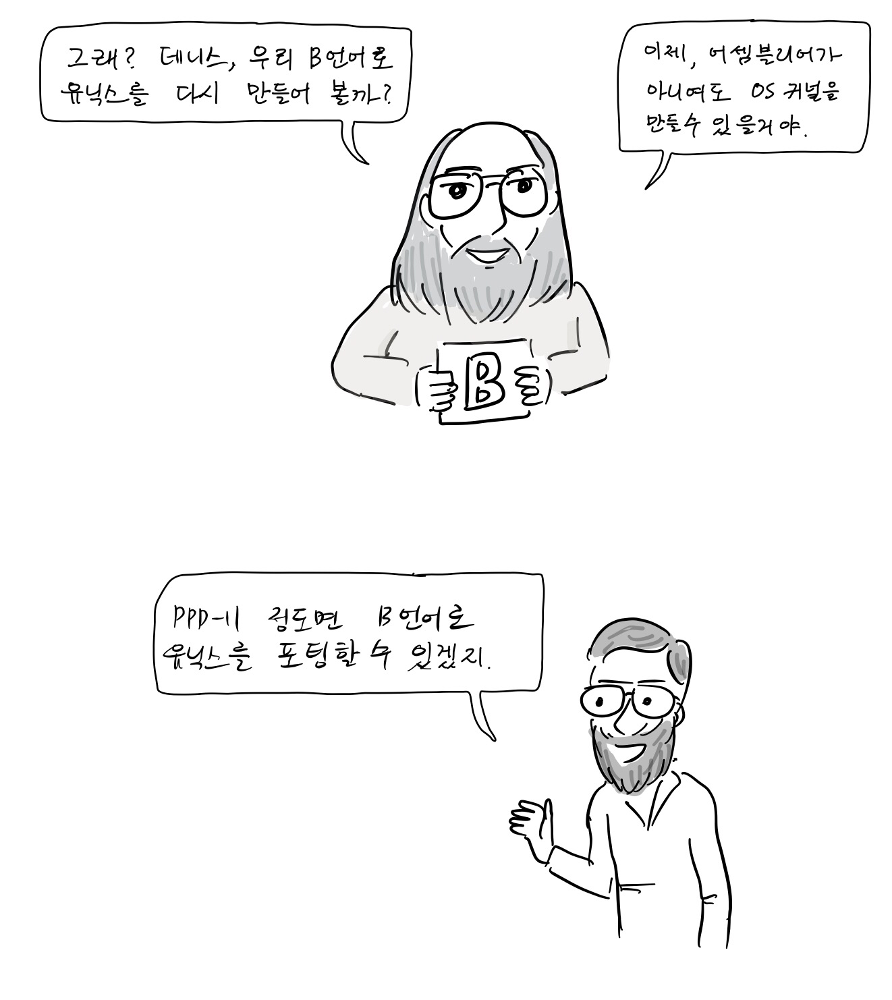

“Dennis, shall we rewrite Unix in the B language? Now we are able to build an OS kernel without assembly." "Maybe we can port Unix to PDP-11 using the B language"  

B language was also developed for use in Multics by Ken Thompson and Dennis Ritchie in 1969.

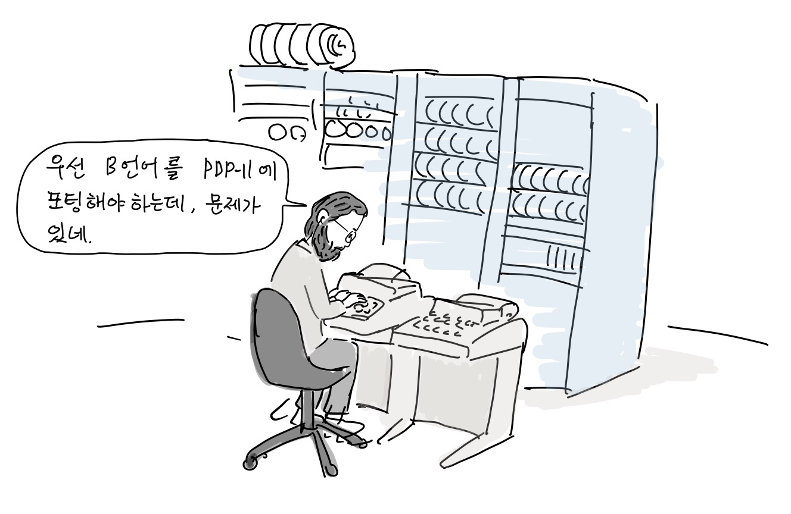

"First we need to port the B language to the PDP-11, but there's a problem."

In 1971, Dennis Ritchie added a character type to the B language and rewrote the compiler code to generate PDP-11 machine code\[3].

“Dennis, how's the B language porting going?” “There are a lot of issues, first of all, it’s hard to access the character data type on PDP-11.”

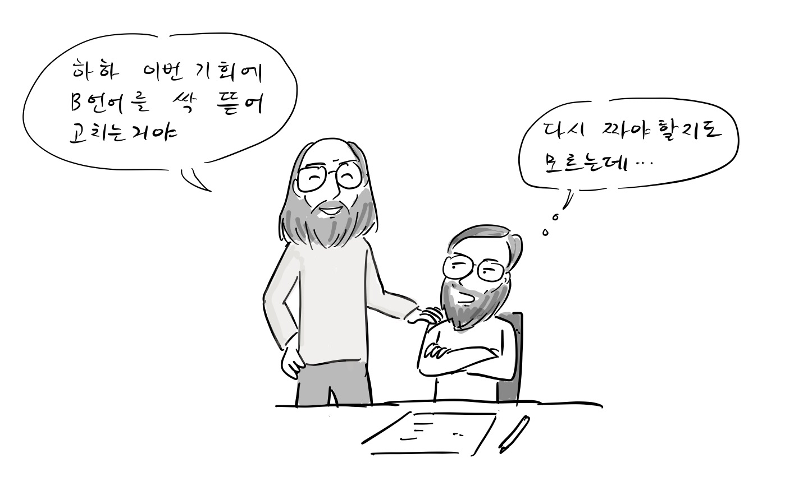

"Haha, why don't you completely update the B language this time?” "I might have to rewrite it from scratch."

In 1973, basic functionalities were complete, and it was called C, which was just the next version of B.

“How about calling it C?” "Sounds good"

Dennis Richie began rewriting Unix in C that same year.

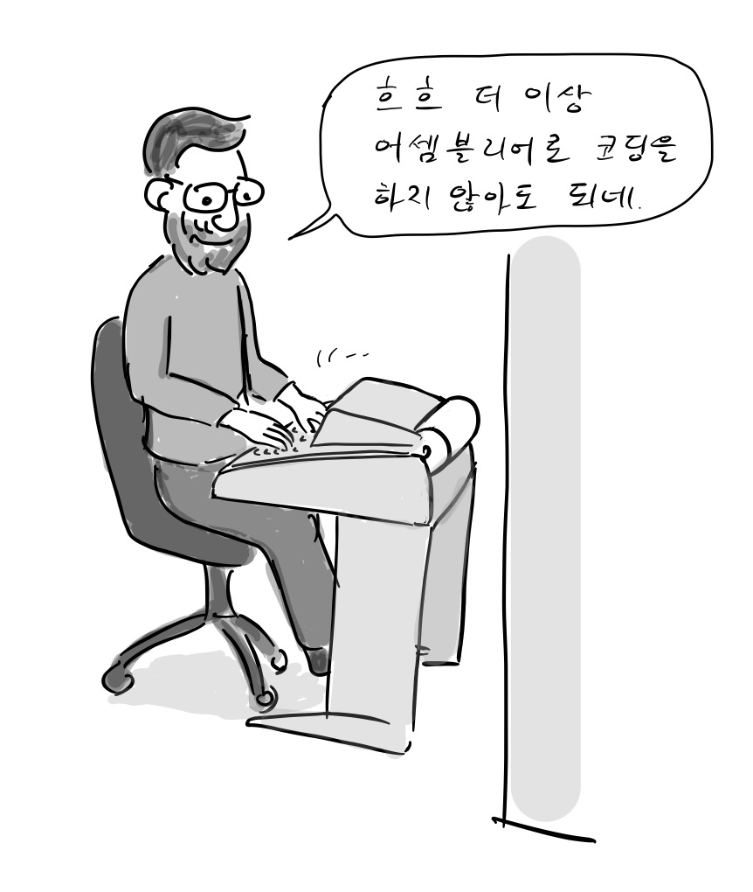

"Hmm, I don't have to code in assembly anymore"

Dennis added the structure type to the C language to define the user's custom data. Now, the C language is powerful enough to write Unix kernels.

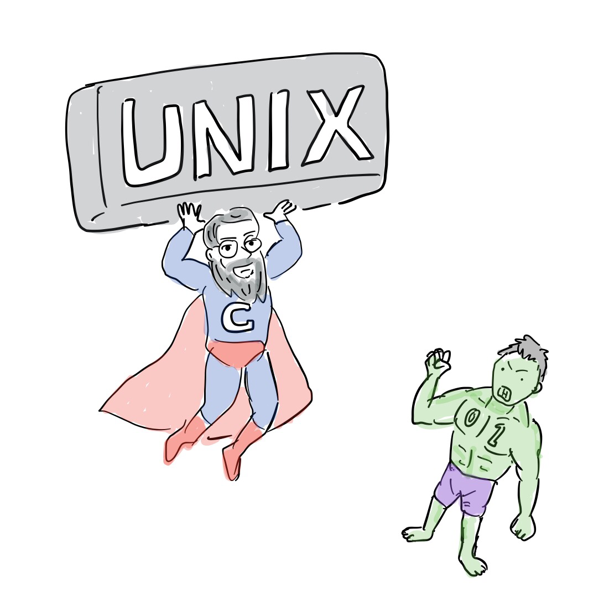

Although Unix and C were created in a short period of time by Ken Thompson and Dannis Richie, most computers, including cell phones, still run on OS based on Unix today. In addition, operating system kernels are still developed in C today.

References\[1] [https://en.wikipedia.org/wiki/Multics](https://www.google.com/url?q=https://en.wikipedia.org/wiki/Multics\&sa=D\&source=editors\&ust=1711344879888583\&usg=AOvVaw3KOzRZV4Bg5nkYSLTn8kqS)

\[2] [https://en.wikipedia.org/wiki/Unix](https://www.google.com/url?q=https://en.wikipedia.org/wiki/Unix\&sa=D\&source=editors\&ust=1711344879888771\&usg=AOvVaw1-JX-aUjOghyVGNHrRNue3)

\[3] [https://en.wikipedia.org/wiki/History\_of\_Unix](https://www.google.com/url?q=https://en.wikipedia.org/wiki/History_of_Unix\&sa=D\&source=editors\&ust=1711344879888975\&usg=AOvVaw2IJl5n0Yyu08-R1gOXeBbw)

\[4] [The Development of the C Language](https://www.google.com/url?q=https://www.bell-labs.com/usr/dmr/www/chist.html\&sa=D\&source=editors\&ust=1711344879889175\&usg=AOvVaw28B03hl4Jnb4ZydNOed8ka)

\[5][ The Evolution of the Unix Time-sharing System](https://www.google.com/url?q=http://www.read.seas.harvard.edu/~kohler/class/aosref/ritchie84evolution.pdf\&sa=D\&source=editors\&ust=1711344879889388\&usg=AOvVaw2ethH7iccsYo2HjvNCjaOv)

In the 1960s, while the Incompatible Timesharing System (ITS) was being developed at MIT, there was another place in the eastern United States with a hacker spirit: AT\&T Bell Laboratories. Here, the world-changing Unix and C languages were being developed.

Coincidentally, the same people who had worked on Multics were also working on ITS and Unix, including Ken Thompson and Dennis Ritchie, both of whom had worked on Multics.

Eventually, Bell Labs dropped out of Maltix development in 1969.

Upon returning to Bell Labs, Ken Thompson used his experience with Multics to create a new operating system on his own.

Ken Thompson reimplemented many of the key features he had developed in Multics in Unix.

He started by adapting the file system he had already implemented in Multix to the PDP-7, and Dennis Leach joined him in the development. Once development was well underway, a team was assembled and they began implementing the operating system features we use today, such as the filesystem, process model, device files, and command line interpreter, for the first time on PDP-7.

Later, the PDP-11 was introduced, which had different CPU instructions than the PDP-7.

Also in 1969, Ken Thompson and Dennis Leach developed a programming language for use in Multics.

In 1971, Dennis Leach added character types to B language and rewrote the compiler to generate PDP-11 machine language \[3].

In 1973, basic features were implemented and the language was called C. It was the next version of B, so we just called it C.

Dennis Leach began rewriting Unix in C that same year.

He added structure types to the language to define data. Now, C is powerful enough to write the Unix kernel.

Although Unix and C were created in a short period of time by Ken Thompson and Danny Rich, most computers, including cell phones, still run on Unix today. In addition, operating system kernels are still developed in C today.

[\[a\]](#cmnt_ref1)https\://en.wikipedia.org/wiki/Multics
