IT 기술은 놀라운 속도로 변화하고 발전해 왔다. 하지만 유닉스는 만들어진 지 반세기가 넘었고, 그 철학과 API 설계, 도구는 유닉스와 유닉스 계열 운영체제에 여전히 살아 있다.

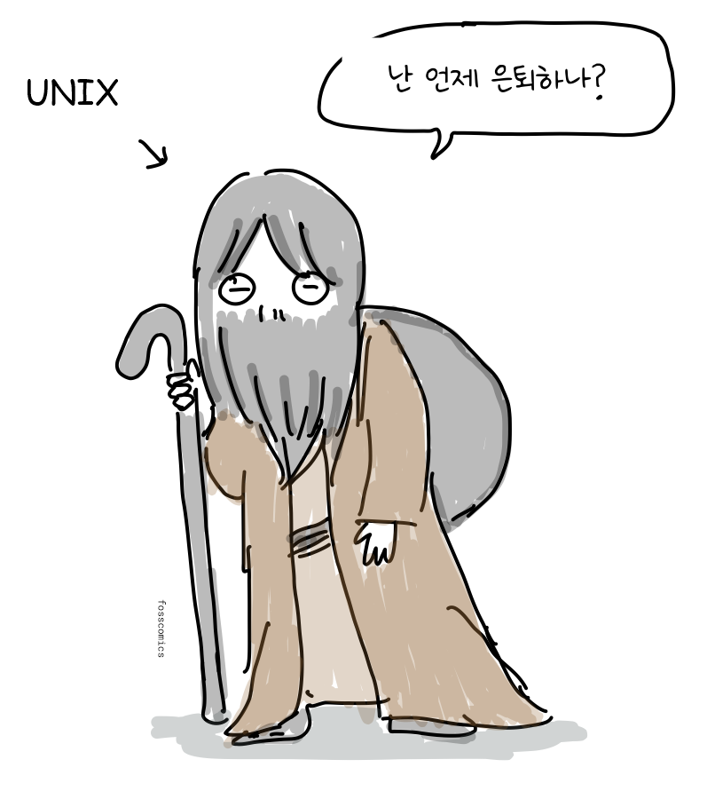
> "난 언제 은퇴하나?"

유닉스의 유산은 지금도 우리 주변 곳곳에 남아 있다. 데비안, 우분투, 아치 리눅스 같은 리눅스 배포판과 안드로이드는 리눅스 커널을 사용한다. 맥과 아이폰에서 동작하는 애플의 macOS와 iOS도 유닉스를 기반으로 한다. 윈도우에서도 WSL(Windows Subsystem for Linux)을 통해 리눅스 환경을 실행할 수 있다.

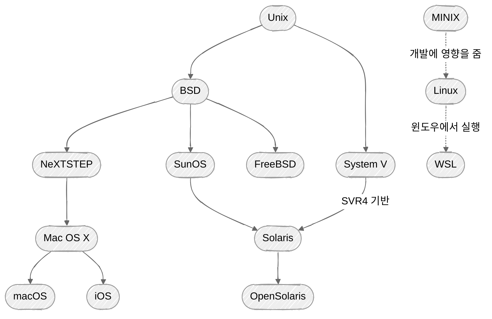
미닉스(MINIX)는 운영체제 설계를 가르치기 위해 만든 작은 유닉스 계열 운영체제다. 더 자세한 가계도는 [위키피디아](https://en.wikipedia.org/wiki/Unix_history#/media/File:Unix_history-simple.svg)를 참고하자.

유닉스 소스 코드를 수업에서 더 이상 사용할 수 없게 되자, 타넨바움 교수는 교육용 미닉스를 만들었다.

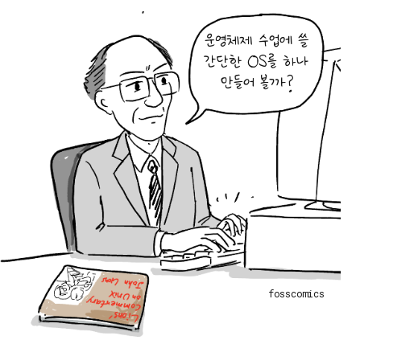
> "운영체제 수업에 쓸 간단한 OS를 하나 만들어 볼까?"

리누스 토발즈는 미닉스를 사용하고 타넨바움의 *Operating Systems: Design and Implementation*을 읽으며 리눅스 커널 개발을 시작했다.

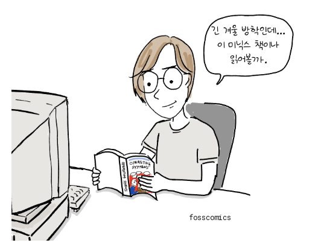
> "긴 겨울 방학인데... 이 미닉스 책이나 읽어볼까."

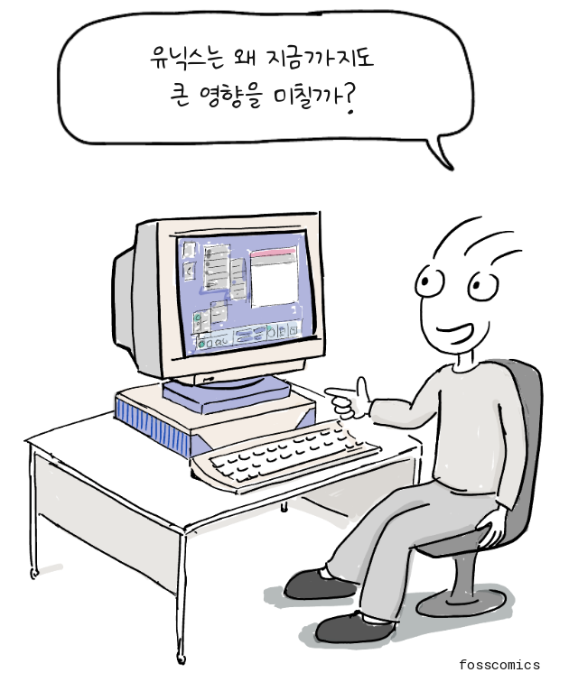
> "유닉스는 왜 지금까지도 큰 영향을 미칠까?"

그 해답을 찾으려면 유닉스 철학을 알아야 한다. 물론 유닉스가 처음부터 거창한 철학을 가지고 시작한 것은 아니다. 에릭 S. 레이먼드는 나중에 이를 익숙한 설계 원칙으로 요약했다.

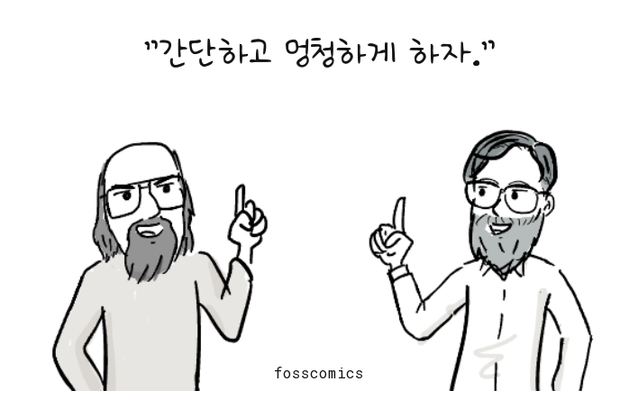
> "간단하고 멍청하게 하자."[&lbrack;1&rbrack;][1]

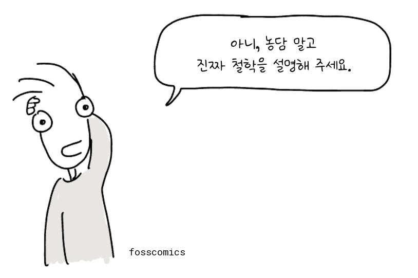
> "아니, 농담 말고 진짜 철학을 설명해 주세요."

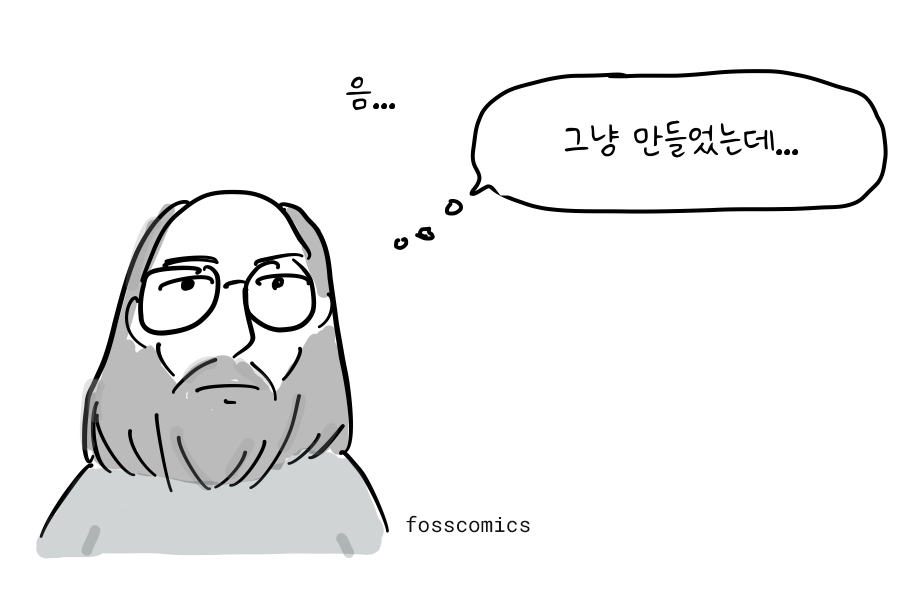
> "음... 그냥 만들었는데..."

위키피디아에서는 유닉스 철학을 다음과 같이 설명한다. "[켄 톰프슨](https://en.wikipedia.org/wiki/Ken_Thompson)에게서 비롯된 **유닉스 철학**은 [최소주의](https://en.wikipedia.org/wiki/Minimalism_%28computing%29)와 [모듈화](https://en.wikipedia.org/wiki/Modularity_%28programming%29)에 기반한 [소프트웨어 개발](https://en.wikipedia.org/wiki/Software_development)의 문화적 규범과 철학적 접근 방식이다. 이는 [유닉스](https://en.wikipedia.org/wiki/Unix) [운영체제](https://en.wikipedia.org/wiki/Operating_system)를 이끈 개발자들의 경험을 바탕으로 한다."[&lbrack;2&rbrack;][2]

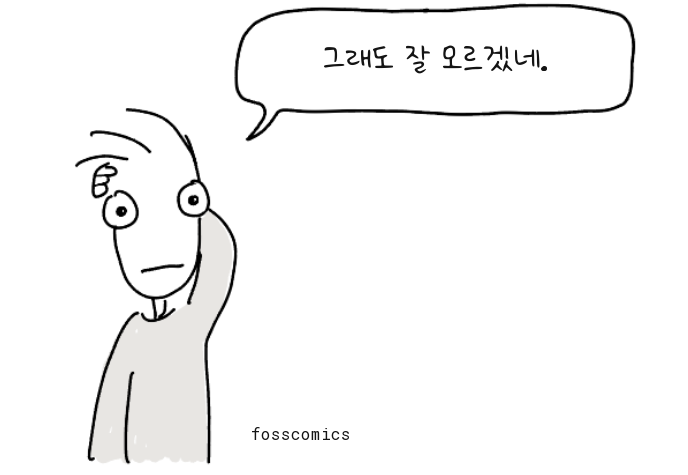
> "그래도 잘 모르겠네."

1978년 [더글러스 맥클로이](https://en.wikipedia.org/wiki/Doug_McIlroy)는 이 철학을 공식적으로 문서화했다.[&lbrack;3&rbrack;][3]

1. 각 프로그램이 하나의 일을 잘하도록 만들 것. 새로운 일을 해야 한다면, 기존 프로그램에 기능을 덧붙여 복잡하게 만들지 말고 새로 만들 것.
2. 모든 프로그램의 출력은 아직 만들어지지 않은 다른 프로그램의 입력이 될 수 있다고 생각할 것. 출력에 불필요한 정보를 섞지 말 것. 엄격한 열 형식이나 바이너리 입력 형식을 피할 것. 대화형 입력을 고집하지 말 것.
3. 운영체제를 포함한 소프트웨어를 가능한 한 일찍, 이상적으로는 수 주 안에 시험할 수 있도록 설계하고 만들 것. 서투른 부분을 버리고 다시 만드는 일을 주저하지 말 것.
4. 프로그래밍 작업을 줄이기 위해 숙련되지 않은 인력보다 도구 사용을 선호할 것. 도구를 만들기 위해 잠시 돌아가야 하거나, 작업을 마친 뒤 그 도구를 버리게 되더라도 마찬가지다.

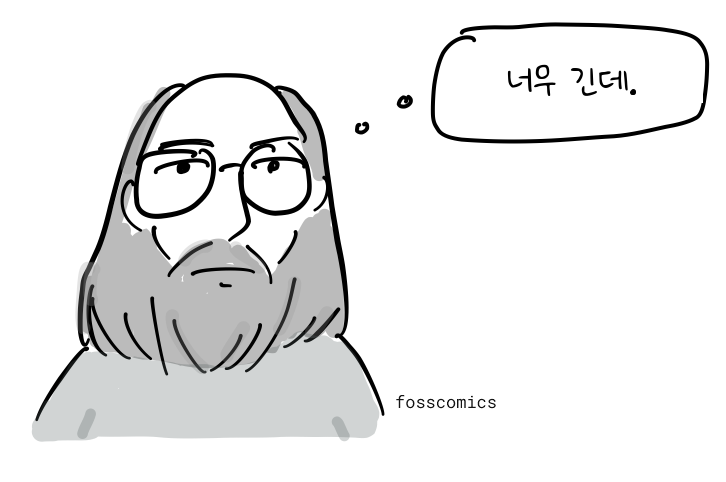
> "너무 긴데."

[피터 H. 살루스](https://en.wikipedia.org/wiki/Peter_H._Salus)는 이를 다시 한번 요약했다.[&lbrack;4&rbrack;][4]

- 한 가지 일을 잘하는 프로그램을 만들 것.
- 다른 프로그램과 함께 동작하는 프로그램을 만들 것.
- 범용 인터페이스인 텍스트 스트림을 처리하는 프로그램을 만들 것.

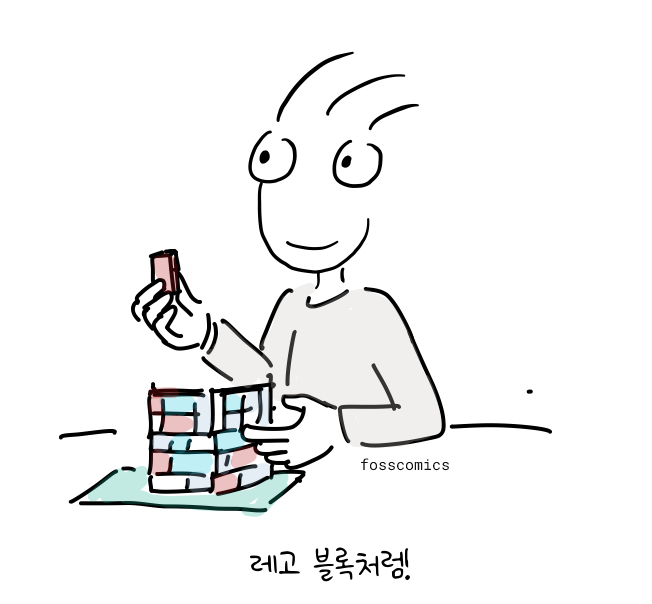
> "레고 블록처럼!"

레고 블록처럼 유닉스 프로그램은 입력과 출력을 서로 연결해 더 복잡한 도구를 만들 수 있다. 이후 유닉스의 대부분이 C언어로 다시 작성되면서 여러 컴퓨터로 훨씬 쉽게 이식할 수 있게 되었다.

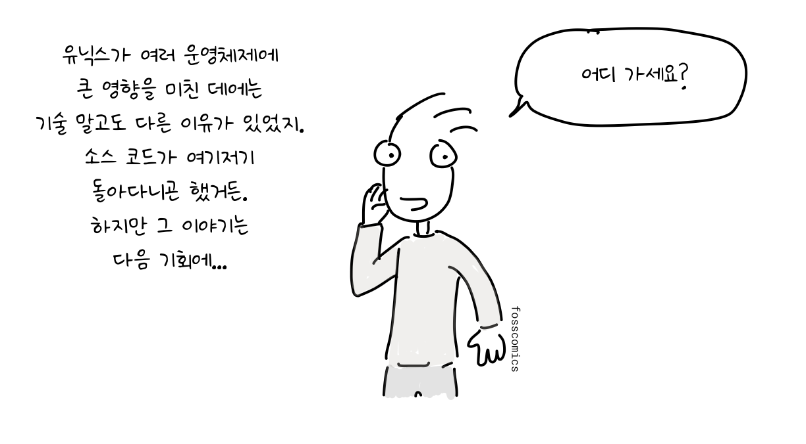
> "유닉스가 여러 운영체제에 큰 영향을 미친 데에는 기술 말고도 다른 이유가 있었지. 소스 코드가 여기저기 돌아다니곤 했거든. 하지만 그 이야기는 다음 기회에..."\
> "어디 가세요?"

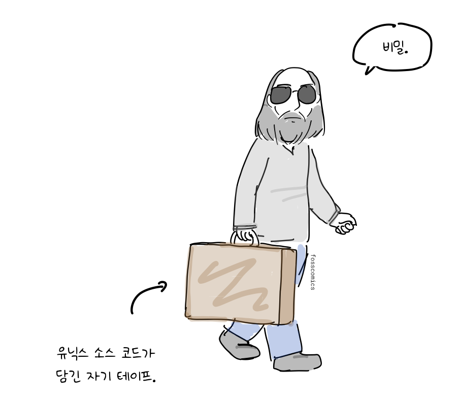
> "비밀." *(유닉스 소스 코드가 담긴 자기 테이프.)*

## 참고 자료

1. 에릭 S. 레이먼드, ["한 문장으로 배우는 유닉스 철학"](http://www.catb.org/esr/writings/taoup/html/ch01s07.html), *The Art of Unix Programming*, Addison-Wesley, 2003.
2. ["유닉스 철학"](https://en.wikipedia.org/wiki/Unix_philosophy), 위키피디아.
3. M. D. 맥클로이, E. N. 핀슨, B. A. 태그, ["Unix Time-Sharing System: Foreword"](https://archive.org/details/bstj57-6-1899/page/n3/mode/2up), *Bell System Technical Journal* 57, no. 6, 1978, pp. 1899–1904.
4. 피터 H. 살루스, [*A Quarter Century of UNIX*](https://archive.org/details/aquartercenturyofunixpeterh.salus_201910/page/n65/mode/2up), Addison-Wesley, 1994, pp. 52–53.

[1]: http://www.catb.org/esr/writings/taoup/html/ch01s07.html "에릭 S. 레이먼드의 유닉스 철학 요약"
[2]: https://en.wikipedia.org/wiki/Unix_philosophy "유닉스 철학, 위키피디아"
[3]: https://archive.org/details/bstj57-6-1899/page/n3/mode/2up "맥클로이, 핀슨, 태그의 유닉스 원칙"
[4]: https://archive.org/details/aquartercenturyofunixpeterh.salus_201910/page/n65/mode/2up "피터 H. 살루스의 유닉스 철학 요약"