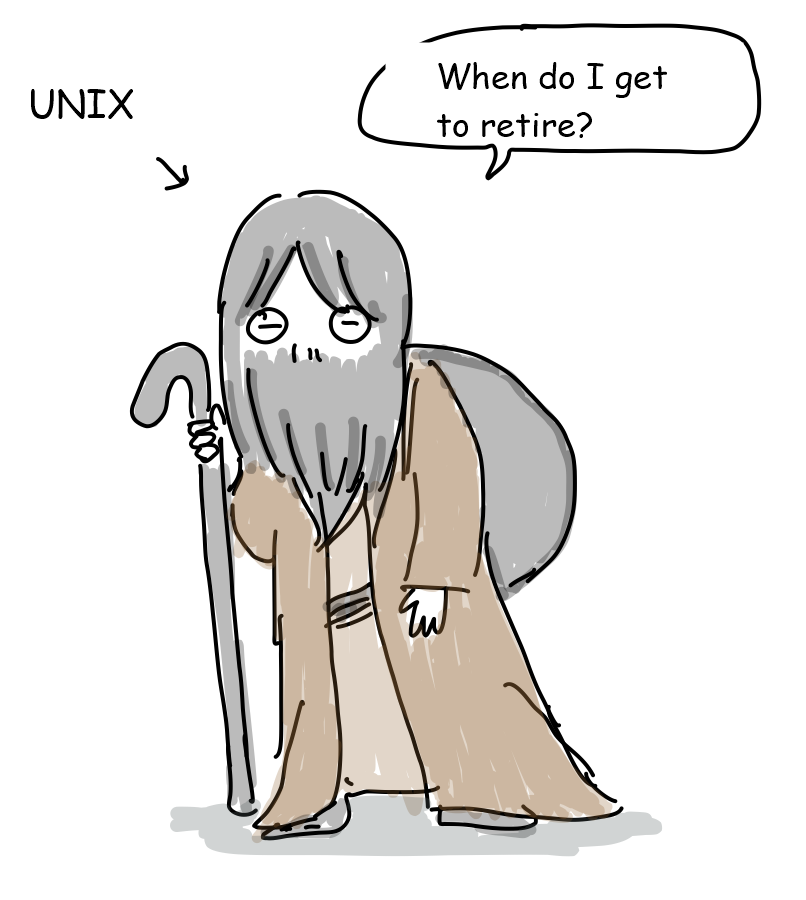
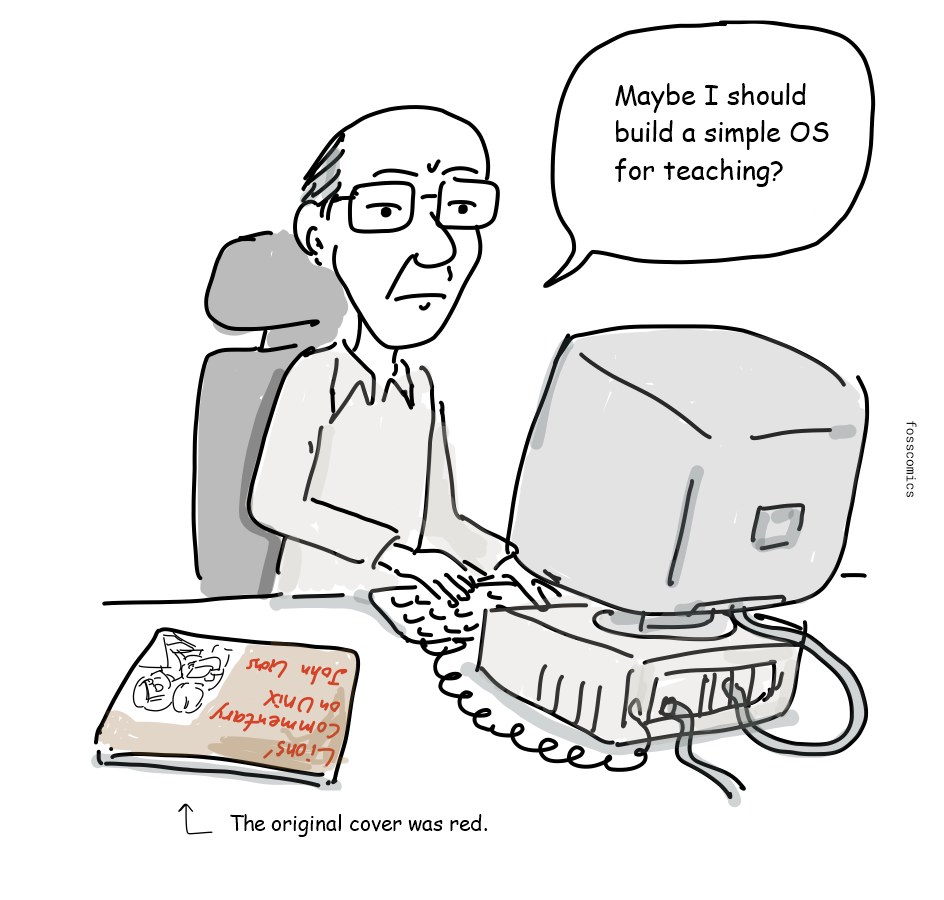
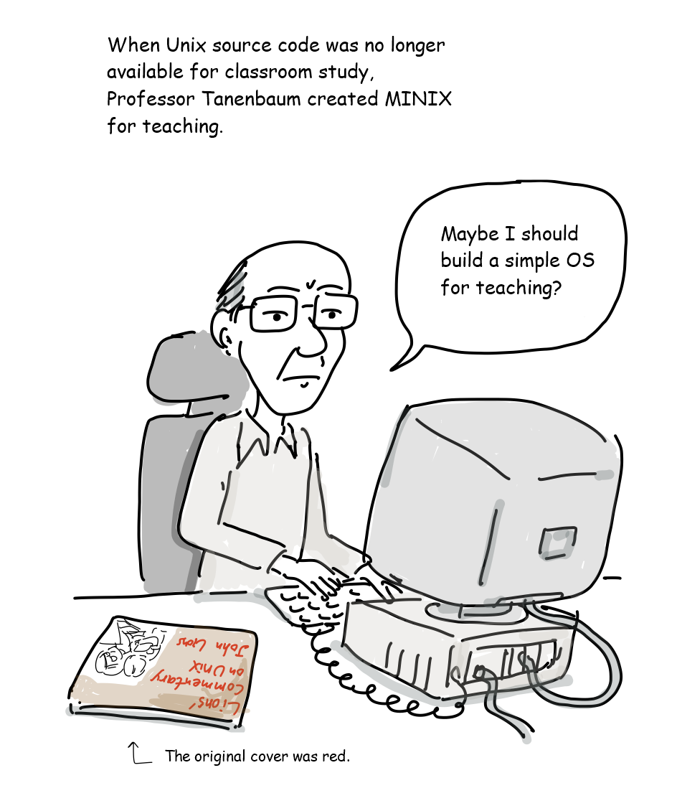
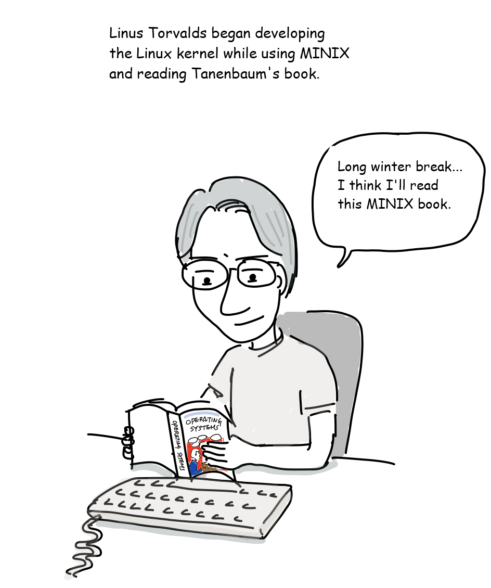
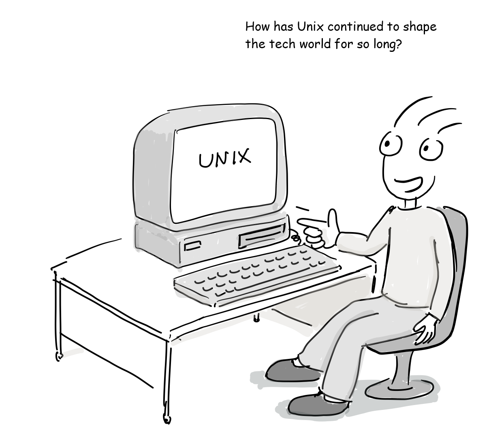
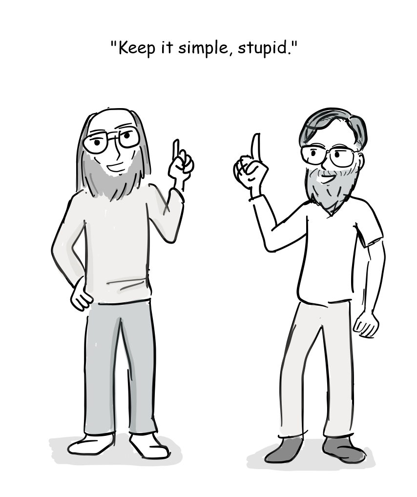
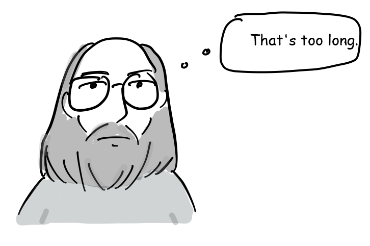
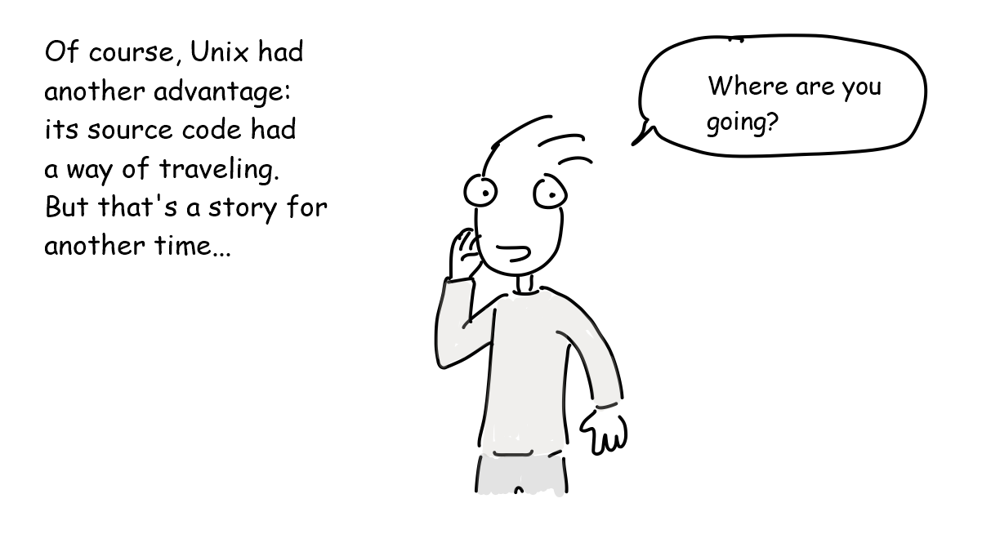
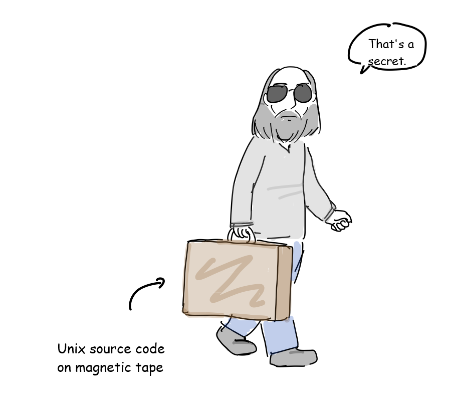

Information technology has changed and evolved at an incredible pace. But Unix has been around for more than five decades, and its philosophy, API design, and tools still live on in Unix and Unix-like operating systems.

> "When do I get to retire?"

Unix's legacy is still all around us. Android and Linux distributions such as Debian, Ubuntu, and Arch Linux use the Linux kernel. Apple's macOS and iOS, which run on Macs and iPhones, are Unix-based too.

MINIX was developed as a small Unix-like system for teaching operating system design. For a more detailed family tree, see [Wikipedia](https://en.wikipedia.org/wiki/Unix_history#/media/File:Unix_history-simple.svg).

> When Unix source code was no longer available for classroom study, Professor Tanenbaum created MINIX for teaching.\
> "Maybe I should build a simple OS for teaching operating systems."

> Linus Torvalds began developing the Linux kernel while using MINIX and reading Tanenbaum's *Operating Systems: Design and Implementation*.\
> "I'll read this Minix book while I wait out the long winter break."

> "How has Unix continued to shape the tech world for so long?"

To find the answer, we need to understand the Unix philosophy. But Unix did not start with a grand philosophy. Its developers might simply have said:

> "Keep it simple, stupid."[&lbrack;1&rbrack;][1]

> "Come on, you must be joking. Tell me the real philosophy."

> "Hmm... I just made it."

According to Wikipedia, "The **Unix philosophy**, originated by [Ken Thompson](https://en.wikipedia.org/wiki/Ken_Thompson), is a set of cultural norms and philosophical approaches to [minimalist](https://en.wikipedia.org/wiki/Minimalism_%28computing%29), [modular](https://en.wikipedia.org/wiki/Modularity_%28programming%29) [software development](https://en.wikipedia.org/wiki/Software_development). It is based on the experience of leading developers of the [Unix](https://en.wikipedia.org/wiki/Unix) [operating system](https://en.wikipedia.org/wiki/Operating_system)."[&lbrack;1&rbrack;][1]

> "I still don't really get it."

In 1978, [Doug McIlroy](https://en.wikipedia.org/wiki/Doug_McIlroy) formally documented the philosophy:[&lbrack;1&rbrack;][1]

1. Make each program do one thing well. To do a new job, build afresh rather than complicate old programs by adding new features.
2. Expect the output of every program to become the input to another, as yet unknown, program. Do not clutter output with extraneous information. Avoid stringently columnar or binary input formats. Do not insist on interactive input.
3. Design and build software, even operating systems, to be tried early, ideally within weeks. Do not hesitate to throw away the clumsy parts and rebuild them.
4. Use tools in preference to unskilled help to lighten a programming task, even if you have to detour to build the tools and expect to throw some of them out after you have finished using them.

> "That's too long."

[Peter H. Salus](https://en.wikipedia.org/wiki/Peter_H._Salus) later summarized the philosophy once more:[&lbrack;2&rbrack;][2]

- Write programs that do one thing and do it well.
- Write programs to work together.
- Write programs to handle text streams, because that is a universal interface.

> "Just like building with LEGO bricks!"

Like LEGO bricks, Unix programs can be connected through their inputs and outputs to build more complex tools. Unix was later rewritten largely in C, making it much easier to port to different computers.

> "Of course, Unix had another advantage: its source code had a way of traveling. But that's a story for another time..."\
> "Where are you going?"

> "That's a secret." *(Unix source code on magnetic tape.)*

## References

1. Unix philosophy, [Wikipedia](https://en.wikipedia.org/wiki/Unix_philosophy)
2. Peter H. Salus, *A Quarter-Century of Unix*, Addison-Wesley, 1994.

[1]: https://en.wikipedia.org/wiki/Unix_philosophy "Unix philosophy, Wikipedia"
[2]: https://en.wikipedia.org/wiki/Unix_philosophy#Peter_H._Salus "Peter H. Salus's summary of the Unix philosophy"
