## Unix's Legacy Today

:::panel
Information technology has changed and evolved at an incredible pace. But Unix has been around for more than five decades, and its philosophy, API design, and tools still live on in Unix and Unix-like operating systems.

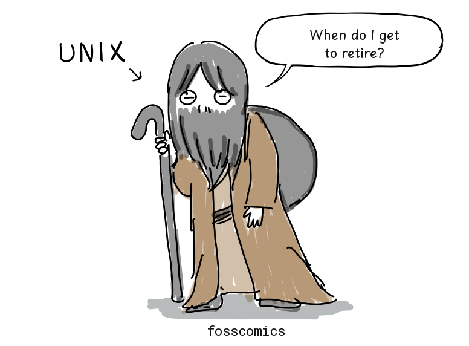
> "When do I get to retire?"
:::

:::panel rounded="true"

Unix's legacy is still all around us. Android and Linux distributions such as Debian, Ubuntu, and Arch Linux use the Linux kernel. Apple's macOS and iOS, which run on Macs and iPhones, are Unix-based too. Even Windows can run a Linux environment through the Windows Subsystem for Linux (WSL).

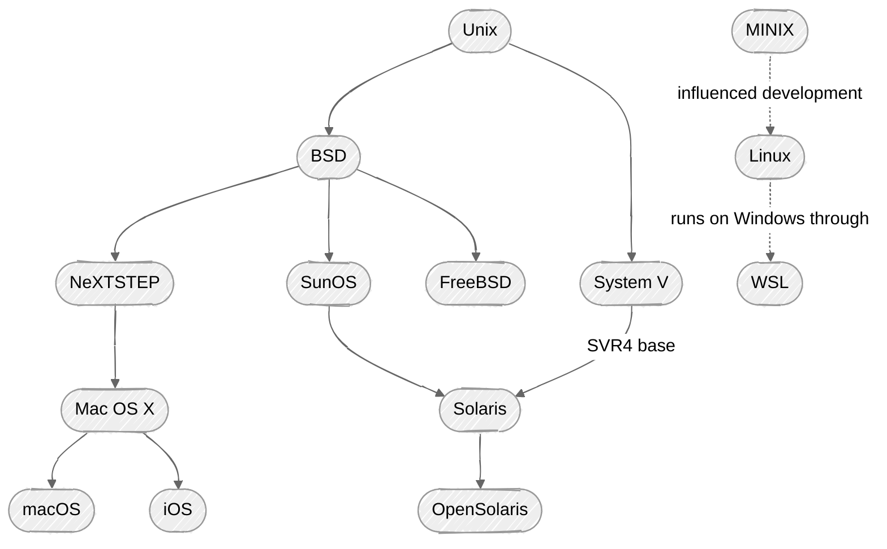
MINIX was developed as a small Unix-like system for teaching operating system design. For a more detailed family tree, see [Wikipedia](https://en.wikipedia.org/wiki/Unix_history#/media/File:Unix_history-simple.svg).

:::

## From MINIX to Linux

:::panel
In 1979, the Unix V7 license prohibited using its source code in the classroom. In response, Professor Tanenbaum developed MINIX to teach operating system design and released it in 1987.

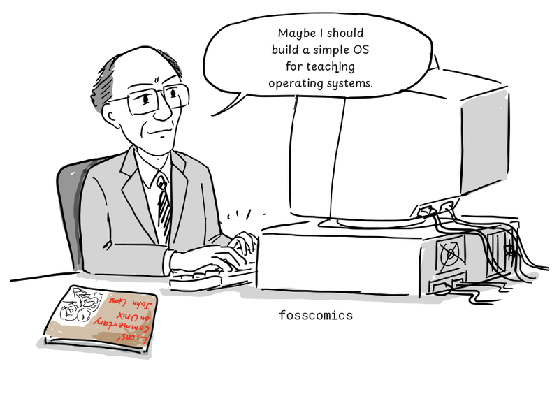
> "Maybe I should build a simple OS for my students."
:::

:::panel rounded="true"

In 1991, Linus Torvalds was using MINIX on his newly purchased Intel 386 PC. While reading Tanenbaum's *Operating Systems: Design and Implementation*, he began developing the Linux kernel.

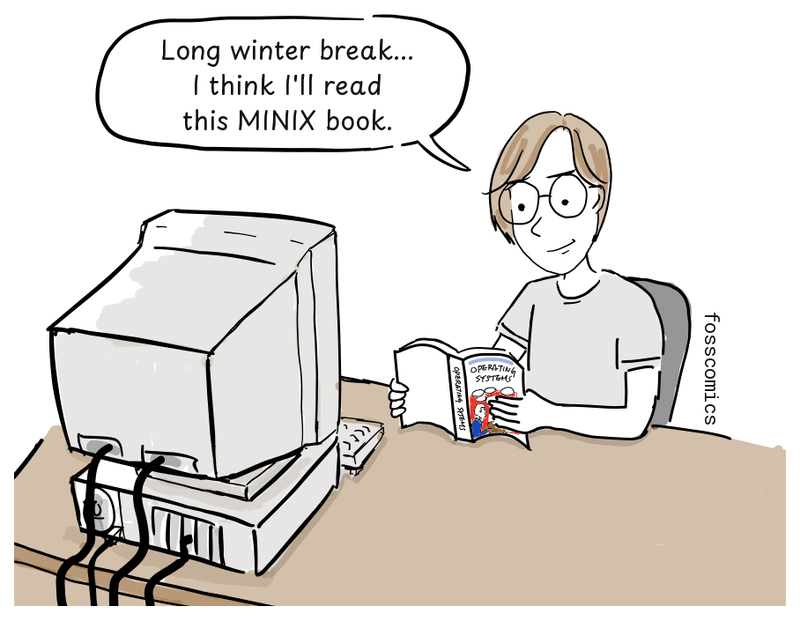
> "Long winter break... I think I'll read this MINIX book."

:::

:::panel
The Linux kernel did not use MINIX or Unix source code. It implemented POSIX-style standard interfaces so that source code for existing Unix programs could be compiled and run without modification, and the Linux 0.01 release already came with a port of the Bash shell[&lbrack;5&rbrack;][5].

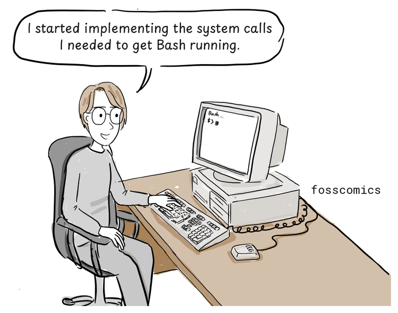
> "I started implementing the system calls I needed to get Bash running."
:::

## What Is the Unix Philosophy?

:::panel
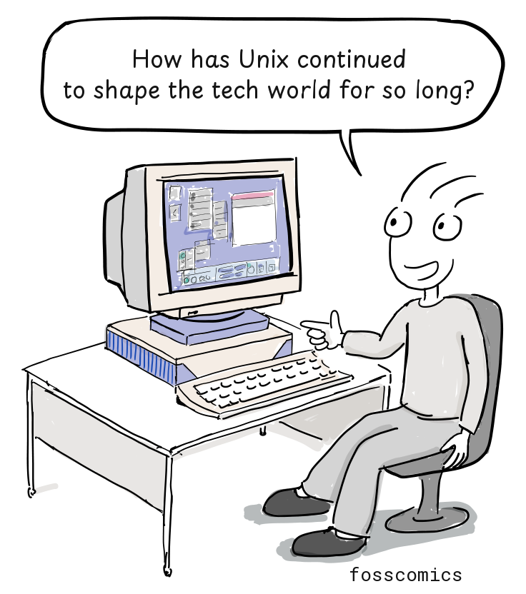
> "How has Unix continued to shape the tech world for so long?"
:::

:::panel rounded="true"
To find the answer, we need to understand the Unix philosophy. But Unix did not start with a grand philosophy. Eric S. Raymond later summed it up with a familiar design principle:

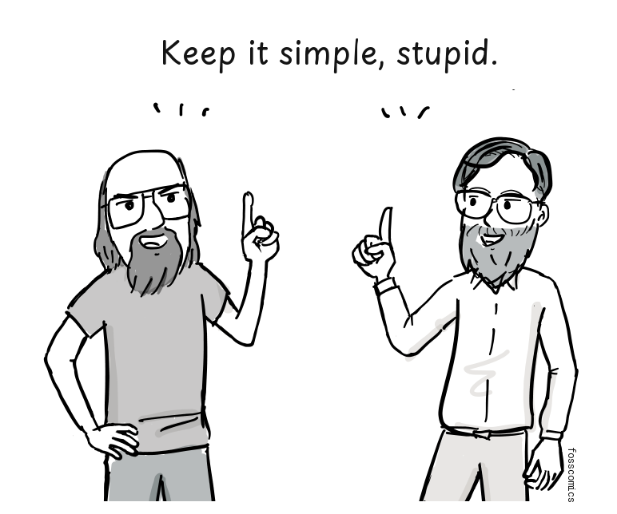
> "Keep it simple, stupid."[&lbrack;1&rbrack;][1]

:::

:::panel
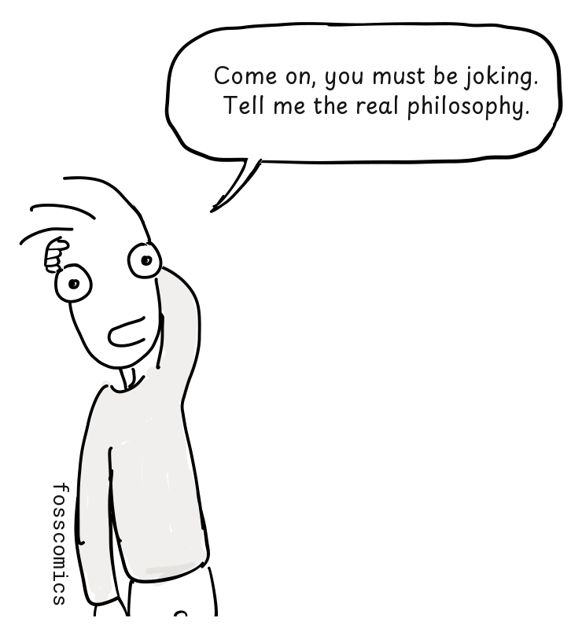
> "Come on, you must be joking. Tell me the real philosophy."

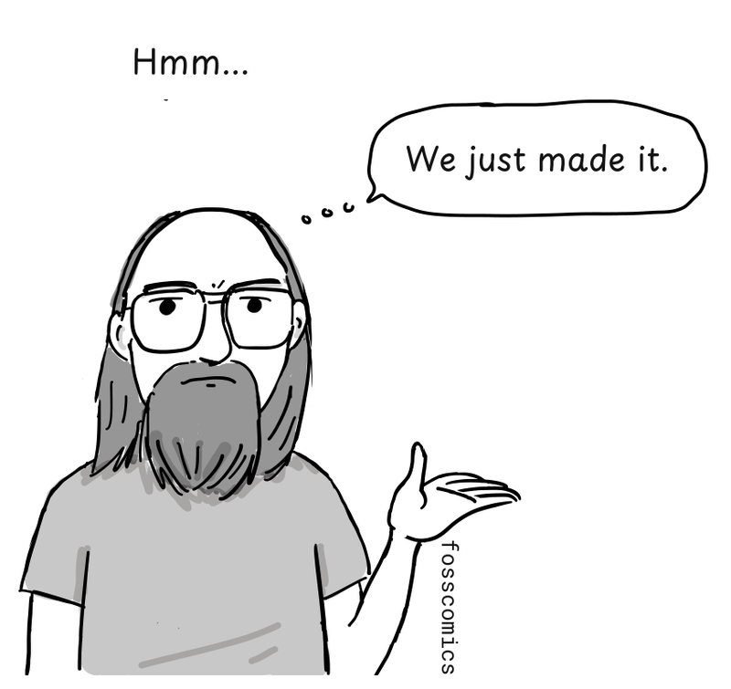
> "Hmm... We just made it."
:::

:::panel rounded="true"

According to Wikipedia, "The **Unix philosophy**, originated by [Ken Thompson](https://en.wikipedia.org/wiki/Ken_Thompson), is a set of cultural norms and philosophical approaches to [minimalist](https://en.wikipedia.org/wiki/Minimalism_%28computing%29), [modular](https://en.wikipedia.org/wiki/Modularity_%28programming%29) [software development](https://en.wikipedia.org/wiki/Software_development). It is based on the experience of leading developers of the [Unix](https://en.wikipedia.org/wiki/Unix) [operating system](https://en.wikipedia.org/wiki/Operating_system)."[&lbrack;2&rbrack;][2]

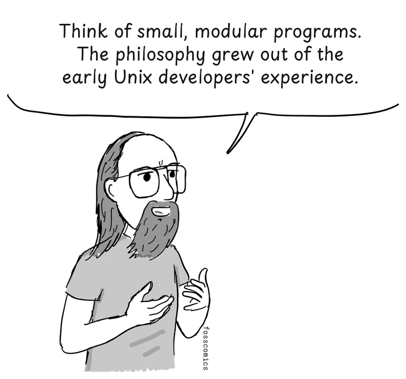
> "Think of small, modular programs. The philosophy grew out of the early Unix developers' experience."

:::

:::panel

> "I still don't really get it."
:::

## Programs That Do One Thing Well

:::panel
In 1978, [Doug McIlroy](https://en.wikipedia.org/wiki/Doug_McIlroy) formally documented the philosophy:[&lbrack;3&rbrack;][3]

1. Make each program do one thing well. To do a new job, build afresh rather than complicate old programs by adding new features.
2. Expect the output of every program to become the input to another, as yet unknown, program. Do not clutter output with extraneous information. Avoid stringently columnar or binary input formats. Do not insist on interactive input.
3. Design and build software, even operating systems, to be tried early, ideally within weeks. Do not hesitate to throw away the clumsy parts and rebuild them.
4. Use tools in preference to unskilled help to lighten a programming task, even if you have to detour to build the tools and expect to throw some of them out after you have finished using them.

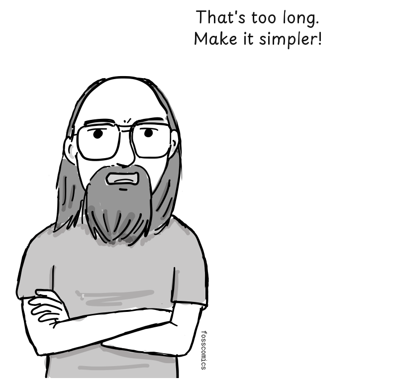
> "That's too long. Make it simpler!"
:::

:::panel

[Peter H. Salus](https://en.wikipedia.org/wiki/Peter_H._Salus) later summarized the philosophy once more:[&lbrack;4&rbrack;][4]

- Write programs that do one thing and do it well.
- Write programs to work together.
- Write programs to handle text streams, because that is a universal interface.

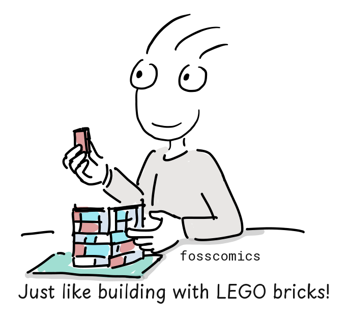
> "Just like building with LEGO bricks!"
:::

## C and Unix Portability

:::panel rounded="true"
Like LEGO bricks, Unix programs can be connected through their inputs and outputs to build more complex tools. Unix was later rewritten largely in C, making it much easier to port to different computers.

A compiler translates C source code into machine code for its target processor. Of course, hardware-specific code and low-level assembly routines still need to be adapted for each platform.

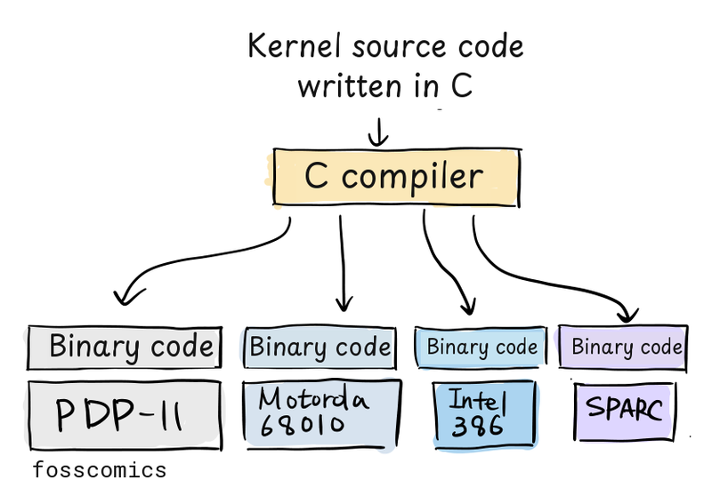

:::

:::panel
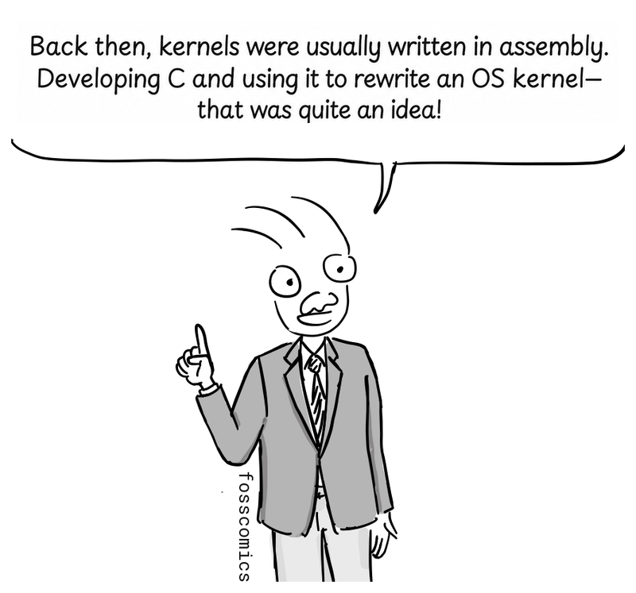
> "Back then, kernels were usually written in assembly. Developing C and using it to rewrite an OS kernel—that was quite an idea!"
:::

:::panel rounded="true"

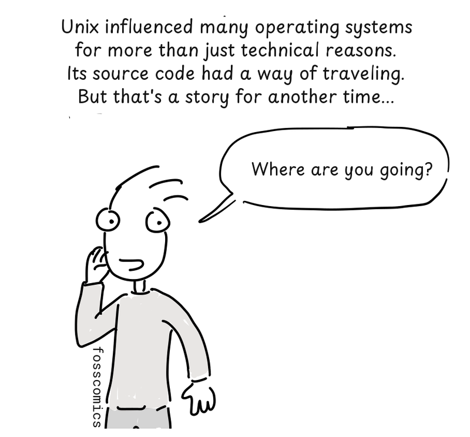
> "Unix influenced many operating systems for more than just technical reasons. Its source code had a way of traveling. But that's a story for another time..."\
> "Where are you going?"

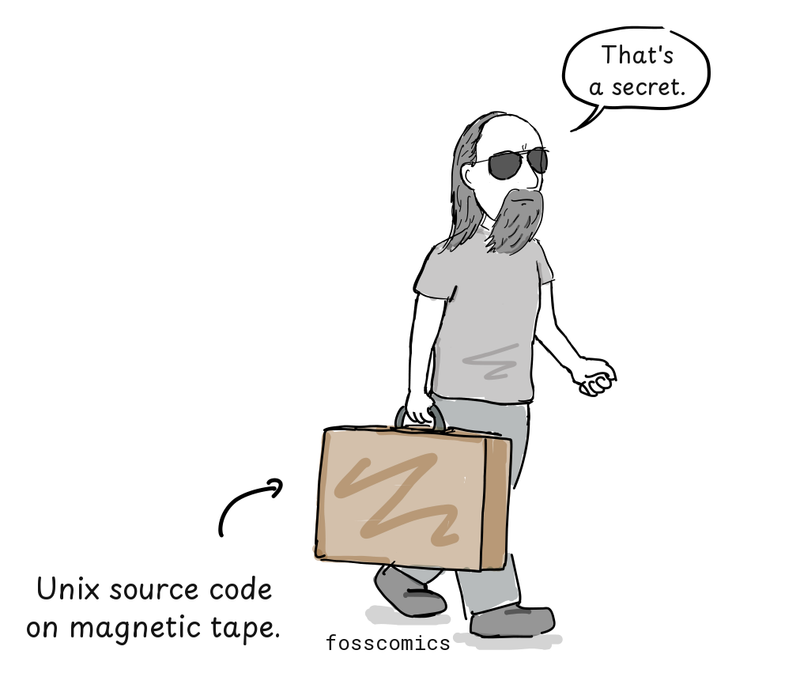
> "That's a secret." *(Unix source code on magnetic tape.)*
:::

## References

1. Eric S. Raymond, ["The Unix Philosophy in One Lesson"](http://www.catb.org/esr/writings/taoup/html/ch01s07.html), *The Art of Unix Programming*, Addison-Wesley, 2003.
2. ["Unix philosophy"](https://en.wikipedia.org/wiki/Unix_philosophy), Wikipedia.
3. M. D. McIlroy, E. N. Pinson, and B. A. Tague, ["Unix Time-Sharing System: Foreword"](https://archive.org/details/bstj57-6-1899/page/n3/mode/2up), *Bell System Technical Journal* 57, no. 6, 1978, pp. 1899–1904.
4. Peter H. Salus, [*A Quarter Century of UNIX*](https://archive.org/details/aquartercenturyofunixpeterh.salus_201910/page/n65/mode/2up), Addison-Wesley, 1994, pp. 52–53.
5. Linus Torvalds, [Notes for Linux release 0.01](https://www.kernel.org/pub/linux/kernel/Historic/old-versions/RELNOTES-0.01), 1991.

[1]: http://www.catb.org/esr/writings/taoup/html/ch01s07.html "Eric S. Raymond's summary of the Unix philosophy"
[2]: https://en.wikipedia.org/wiki/Unix_philosophy "Unix philosophy, Wikipedia"
[3]: https://archive.org/details/bstj57-6-1899/page/n3/mode/2up "McIlroy, Pinson, and Tague's Unix principles"
[4]: https://archive.org/details/aquartercenturyofunixpeterh.salus_201910/page/n65/mode/2up "Peter H. Salus's summary of the Unix philosophy"
[5]: https://www.kernel.org/pub/linux/kernel/Historic/old-versions/RELNOTES-0.01 "Notes for Linux release 0.01"
