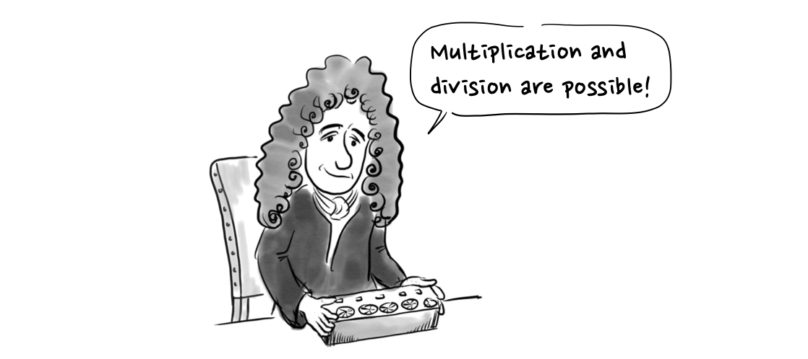
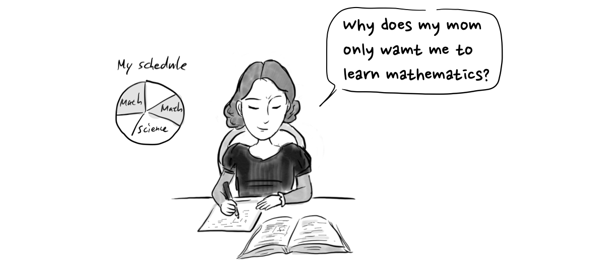
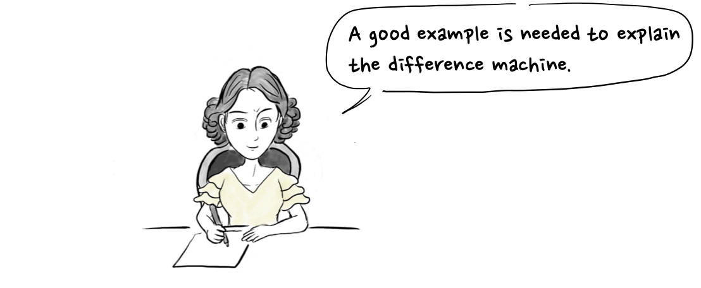
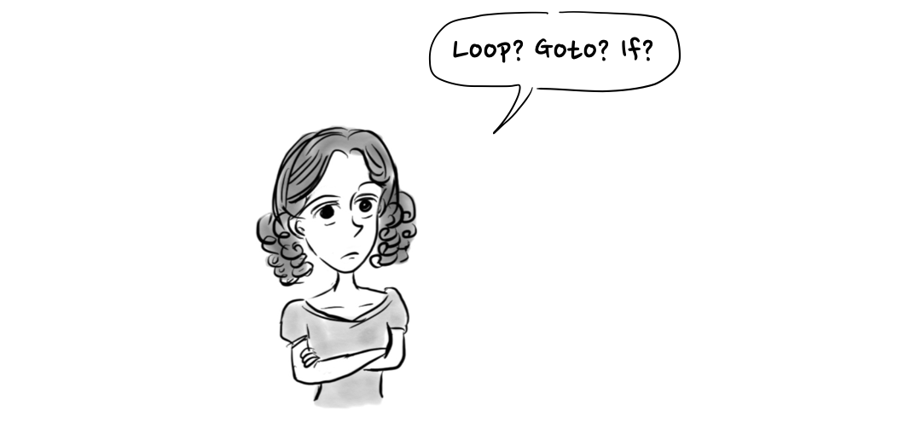
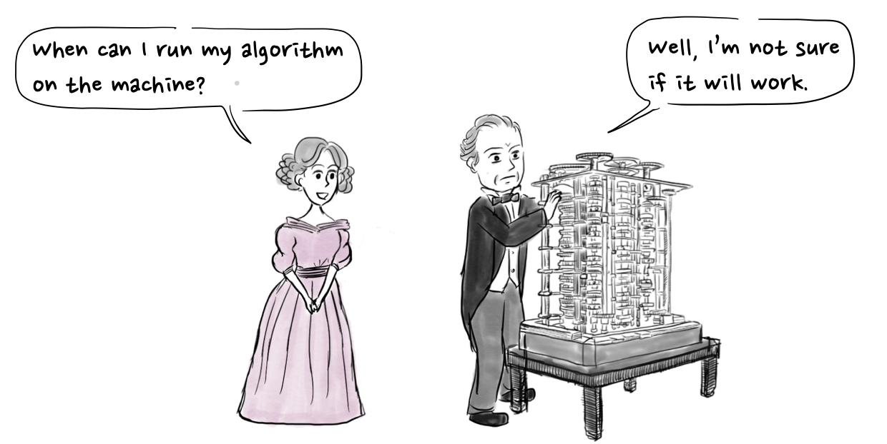

Human beings have made a number of tools to make math calculations more convenient and accurate. One of these tools, the abacus, was used by several ancient civilizations.

In Korea, the abacus was introduced from China around the 1400s, and it was used by individuals as well as banks until the 1980s. After that, computers replaced it in banks and it is hardly used for personal use anymore.

In the West, in the 17th century, Pascal and Leibniz made mechanical calculators using gears.

In 1822, the British mathematician Charles Babbage designed a difference engine consisting of memories, an arithmetic unit and input/output devices like the computers we use now, but in a mechanical way.

## Charles Babbage and his difference engine
Ada Lovelace, born in 1815, the daughter of George Gordon Byron, a representative Romantic poet in England, grew up with a single mother because her father had earlier abandoned her family. Since her mother was afraid that her daughter would take after her father, she only allowed Ada to learn mathematics and science instead of literature.

 
Ada: Why does my mom only want me to learn mathematics?

Famous scientists taught Ada at the time, including De Morgan who is famous for De Morgan’s law. As a result, she showed a great talent for mathematics which he recognized.

De Morgan: This allows the logical sum to be a logical product.
Ada: This is De Morgan's law!

Ada saw the difference engine created by Charles Babbage by chance when she was seventeen years old.

Charles: This is the difference engine!
Ada: Wow, I would like to participate in your research.s

She created an algorithm to obtain the Bernoulli number for the purpose of describing the analytical engine, which is considered to be the first computer program.

Ada: A good example is needed to explain the difference machine.

At the time, Ada first introduced the concepts of loops, goto, and control statements, which are important concepts used in programming languages, in her algorithms. This is why she is called the world’s first programmer. There is also a programming language called Ada which is named after her.

Ada: Loop? Goto? If?

However, Charles Babbage was not able to complete the difference engine and analytic engine due to technical limitations, so Ada never got to implement her algorithm.

Ada: When can I run my algorithm on the machine?
Charles: Well, I’m not sure if it will work.

From 1989 to 1991, the Science Museum in London completed the actual differential engine No. 2 using the design left by Charles Babbage, which was surprisingly able to calculate 31 digits. Although not all of her theories have been tested or fully developed, Ada Lovelace’s theory of computer programming became the basis for today’s computer programming.

## References
1. https://en.wikipedia.org/wiki/Charles_Babbage
2. https://en.wikipedia.org/wiki/Ada_Lovelace
